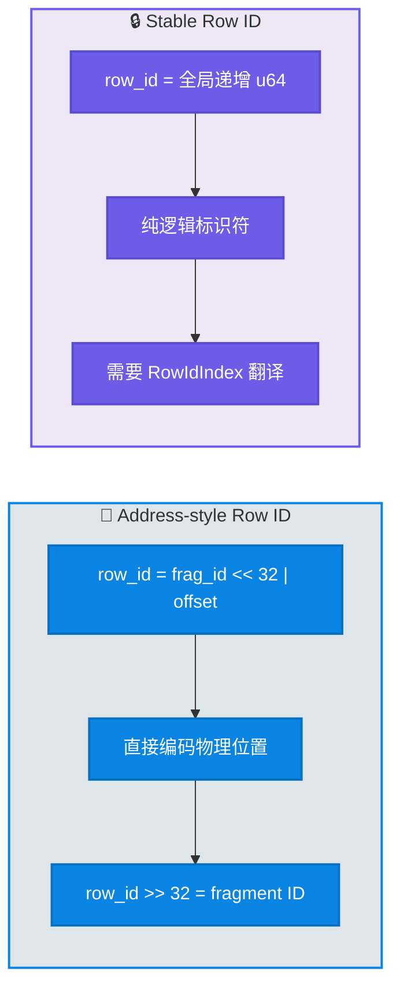
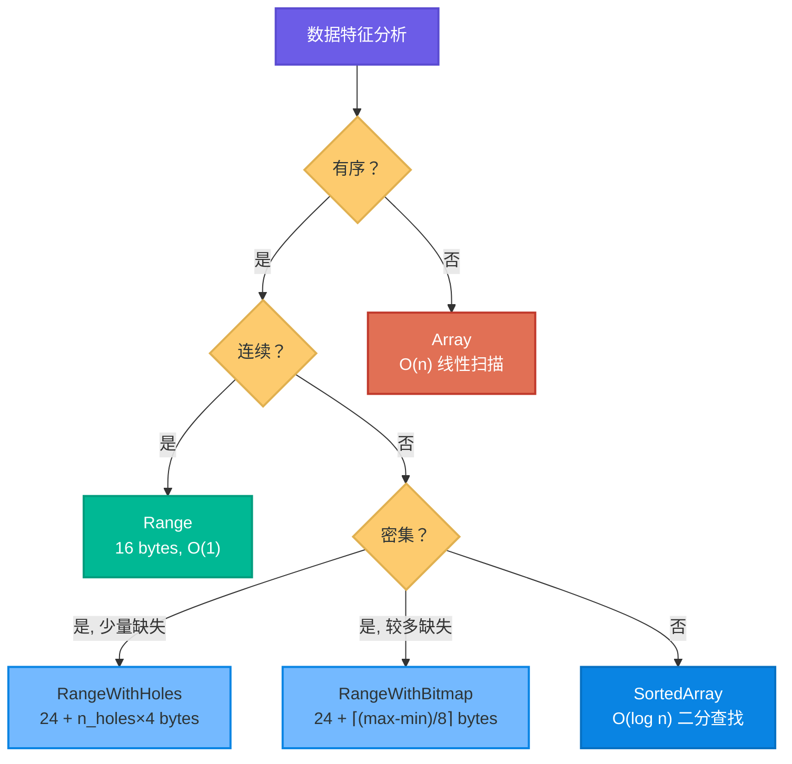
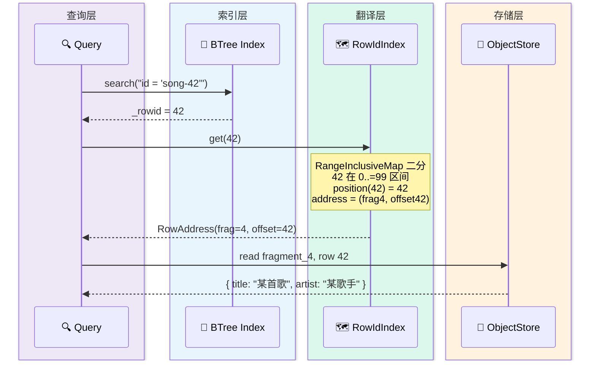
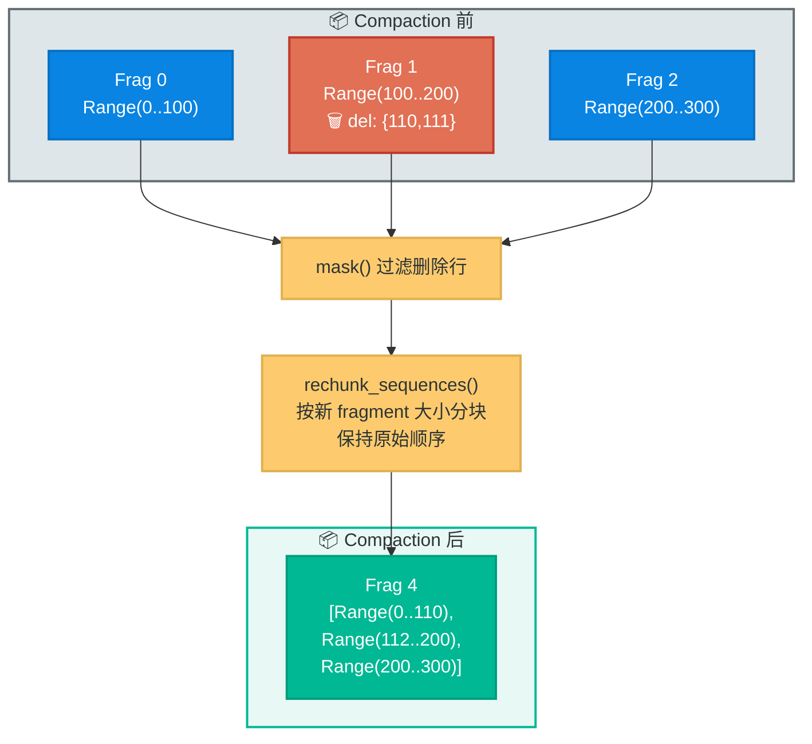
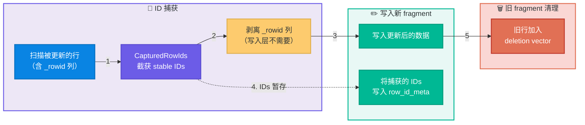
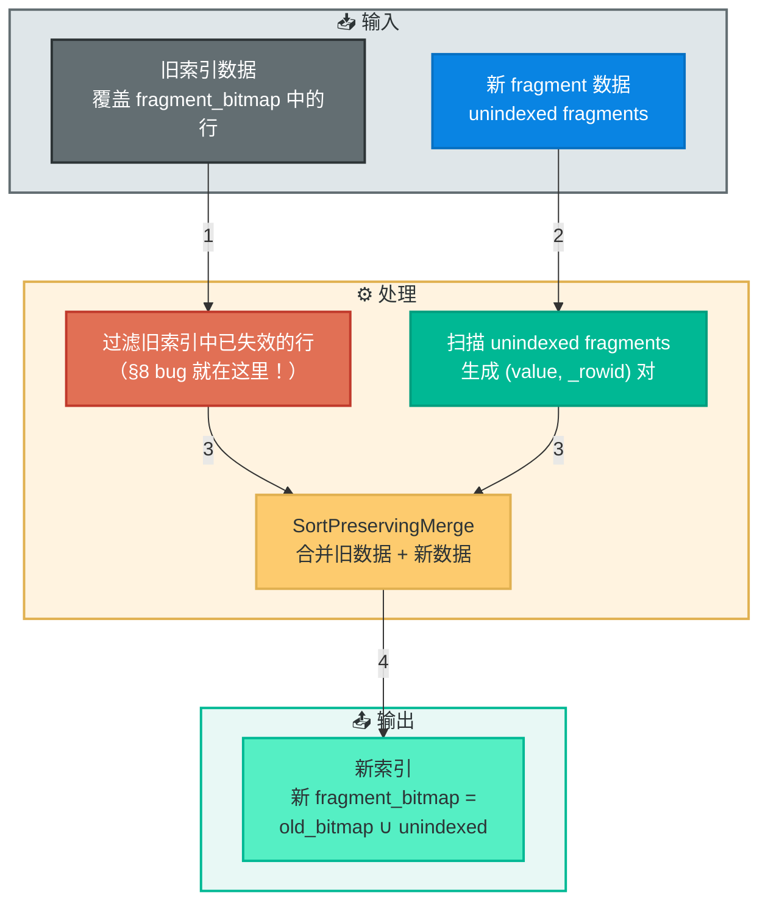
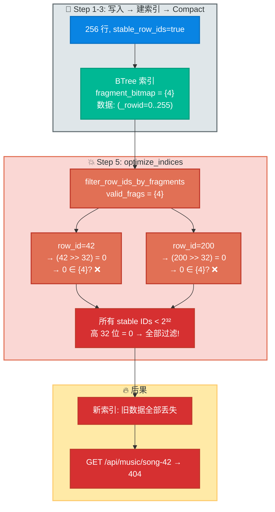

# Lance Stable Row ID 深度解析：从一次 BTree 索引 404 说起

> **代码版本**：基于 lance `feat/static-flow` 分支（commit `27cfea6`）。
> 本文所有代码路径以 `deps/lance/` 为根，即 StaticFlow 项目中 lance 的本地 fork。

---

## 目录导航

| 节 | 主题 | 关键词 |
|----|------|--------|
| §1 | 一次神秘的 404 | 问题现象、触发条件 |
| §2 | 两种 Row ID 范式 | Address-style vs Stable |
| §3 | Stable Row ID 核心数据结构 | RowIdSequence、U64Segment、RowIdIndex |
| §4 | 数据流：写入与查询 | assign_row_ids、Take、Scan |
| §5 | Compaction 与 Stable Row ID | rechunk、不排序设计、fragment_bitmap |
| §6 | UPDATE / merge_insert | CapturedRowIds、编码退化 |
| §7 | 索引更新机制 — optimize_indices | 旧数据过滤、unindexed fragments |
| §8 | Bug 详解 | `row_id >> 32` 的致命假设 |
| §9 | 修复方案 | OldIndexDataFilter、精确过滤 |
| §10 | 设计哲学与未解决问题 | Trade-off、系统性隐患 |

> ⏭️ 熟悉 Lance 架构的读者可直接跳到 **§8 Bug 详解**。

---

## §1 一次神秘的 404

StaticFlow 是一个 full-stack Rust 的本地写作、知识管理与媒体平台（Axum + Yew + LanceDB）。其**音乐库模块**使用 LanceDB 的 `songs` 表存储歌曲元数据，并在 `id` 列上建了 BTree 标量索引以加速等值查询。

某天，执行完 `compact_files()` + `optimize_indices()` 例行维护后，发现了一个诡异的现象：

```
GET /api/music          → 200 OK, 返回 256 首歌曲          ✅
GET /api/music/song-42  → 404 Not Found                    ❌
GET /api/music/song-42/play → 404 Not Found                ❌
```

列表接口（全表扫描）完全正常，但详情接口（走 BTree 索引等值查询 `id = 'song-42'`）对每首歌都返回 404。

**初步排查**：

1. 全表扫描能找到数据 — 数据本身完好
2. BTree 索引等值查询返回空 — 索引出了问题
3. 问题在 compaction + optimize_indices 之后才出现
4. songs 表开启了 `enable_stable_row_ids = true`

为什么开启 stable row ID？这需要理解 Lance 中行标识符的工作方式。默认模式下，`_rowid` 编码了行的物理位置（fragment ID + offset），每次 compaction 或 merge_insert 都会导致行搬迁到新 fragment，`_rowid` 随之改变。而 BTree 索引存储的是 `(value, _rowid)` 对——一旦 `_rowid` 变了，索引中的旧条目就指向了错误的位置，**必须重建或 remap 整个索引**。

Stable row ID 模式则为每行分配一个**跨版本不变的逻辑 ID**。无论行的物理位置怎么搬迁，ID 值始终不变，索引数据天然有效——无需 remap。songs 表频繁使用 `merge_insert` 更新歌曲元数据（如播放次数、标签），开启 stable row ID 正是为了避免每次更新后的索引重建开销。

然而，这个 flag 最终成了问题的关键线索。要理解它为何导致索引失效，我们需要先深入理解 Lance 格式中 Row ID 的完整设计。

---

## §2 Lance 中的两种 Row ID 范式

Lance 格式中 `_rowid` 列的值有两种完全不同的语义，这是理解后续所有内容的基础。

### Address-style Row ID（默认模式）

编码规则：`row_id = (fragment_id << 32) | row_offset`

```rust
// rust/lance-core/src/utils/address.rs:37-39
pub fn new_from_parts(fragment_id: u32, row_offset: u32) -> Self {
    Self((fragment_id as u64) << 32 | row_offset as u64)
}
```

例：fragment 3, offset 100 → `0x0000_0003_0000_0064`。Row ID **直接编码了物理位置**，`row_id >> 32` 即可提取 fragment ID。无需额外翻译层就能定位到行的物理存储位置——但反面是，行的物理位置一变，ID 就变。

### Stable Row ID 模式

全局单调递增的 u64，**纯逻辑标识符**：0, 1, 2, 3, ...

```rust
// rust/lance-table/src/format/manifest.rs:94
pub next_row_id: u64,   // 全局计数器，每次分配后递增
```

ID 不编码任何物理位置信息，因此行搬到哪个 fragment 都不影响 ID 值。代价是需要一个**运行时翻译层（RowIdIndex）** 才能从逻辑 ID 查到物理行位置——这个翻译层我们在 §3 详述。

### Feature Flag 控制

```rust
// rust/lance-table/src/feature_flags.rs:16
pub const FLAG_STABLE_ROW_IDS: u64 = 2;
```

通过 `Manifest::uses_stable_row_ids()` 检测（`manifest.rs:492-494`），开启方式为 `WriteParams { enable_stable_row_ids: true }`，**必须在 dataset 创建时设置，后续无法变更**。

### 对比总览



| 特性 | Address-style | Stable Row ID |
|------|:------------:|:-------------:|
| 编码 | `frag_id << 32 \| offset` | 全局单调递增 u64 |
| 物理含义 | 编码了位置 | 不透明标识符 |
| Compact / UPDATE 后 | ID 变化，需 remap 索引 | **ID 不变，索引天然有效** |
| 存储开销 | 无（可由位置直接计算） | 每 fragment 额外存 RowIdSequence |
| 随机访问 | 直接按 ID 读物理行 | 需 RowIdIndex 翻译后再读 |

💡 **Key Point** — 这两种模式在 Lance 代码库中共用了很多变量名（如 `row_id`、`_rowid`、`RowAddrTreeMap`），但语义截然不同。正是这种命名混淆，为后面的 bug 埋下了伏笔。

---

## §3 Stable Row ID 核心数据结构

上一节我们知道 stable row ID 需要一个翻译层，才能从逻辑 ID 定位到物理行。这一节拆解构成这个翻译层的三级数据结构：**RowIdSequence**（持久化存储）→ **RowIdMeta**（存储位置）→ **RowIdIndex**（运行时查找）。

### 3.1 RowIdSequence — 每个 fragment 的 ID 清单

每个 fragment 持有一个 `RowIdSequence`，按**物理行顺序**记录该 fragment 内所有行的 stable row ID：

```rust
// rust/lance-table/src/rowids.rs:56
pub struct RowIdSequence(pub Vec<U64Segment>);
```

如果一个 fragment 包含 1000 行且 ID 连续，RowIdSequence 可能只有 1 个 segment（Range 编码，16 bytes）。如果 ID 不连续（比如 UPDATE 后的散乱 ID），则可能有多个 segment。这种分段存储的灵活性来自 `U64Segment` 的自适应编码。

### 3.2 U64Segment — 自适应压缩编码

这是存储效率的核心。根据数据特征自动选择最优编码：

```rust
// rust/lance-table/src/rowids/segment.rs:35-64
pub enum U64Segment {
    Range(Range<u64>),                          // 16 bytes，连续范围
    RangeWithHoles { range, holes },            // 少量缺失
    RangeWithBitmap { range, bitmap },          // 稠密但有缺口
    SortedArray(EncodedU64Array),               // 稀疏有序
    Array(EncodedU64Array),                     // 任意无序
}
```

五种编码从最紧凑到最宽松，分别对应不同的数据分布。选择逻辑可以理解为这样的决策树：



纯 append 场景下，新 fragment 的 ID 是连续分配的（如 0..100），必然命中最优的 **Range 编码**——仅 16 bytes 就能表示任意长度的连续序列。后文会看到，Lance 的 compaction 和写入路径都在刻意**维护 ID 的连续性**，以确保 Range 编码不退化。

`EncodedU64Array` 内部还支持 U16/U32/U64 三种偏移宽度，根据值域范围选择最窄的表示进一步压缩。

### 3.3 RowIdMeta — RowIdSequence 的存储位置

RowIdSequence 序列化后需要存到某个地方。`RowIdMeta` 记录它在哪：

```rust
// rust/lance-table/src/format/fragment.rs:247
pub enum RowIdMeta {
    Inline(Vec<u8>),           // protobuf 序列化后内联在 fragment metadata
    External(ExternalFile),    // 指向外部文件的 (path, offset, size)
}
```

常见情况下（Range 编码序列化后仅十几个 bytes），RowIdSequence 直接 `Inline` 在 fragment metadata 中，打开 dataset 时随 manifest 一起加载，**无额外 IO 开销**。只有极大的 Array 编码才会用 `External` 模式落地到独立文件。

### 3.4 RowIdIndex — 全局运行时查找结构

前面三个结构都是**持久化的**——每个 fragment 独立存储自己的 RowIdSequence。但查询时需要一个**跨 fragment 的全局查找结构**，这就是 `RowIdIndex`：

```rust
// rust/lance-table/src/rowids/index.rs:27
pub struct RowIdIndex(RangeInclusiveMap<u64, (U64Segment, U64Segment)>);
```

它的结构是一个有序区间映射（`RangeInclusiveMap`）：
- **Key**：row_id 值域范围（如 `0..=99`、`100..=109`）
- **Value**：`(row_id_segment, address_segment)` 对——两个并行数组，position 对齐

**构建过程**：打开 dataset 时，`decompose_sequence`（`index.rs:95`）遍历每个 fragment 的 RowIdSequence，过滤 deletion vector 中已删除的行，为每个存活行生成 `(row_id, row_address)` 配对，合并到全局 map 中。

**查找接口 `get(row_id)`**——这是整条翻译链路的核心：

```rust
// rust/lance-table/src/rowids/index.rs:73-78
pub fn get(&self, row_id: u64) -> Option<RowAddress> {
    let (row_id_segment, address_segment) = self.0.get(&row_id)?;
    //   ① RangeInclusiveMap 二分查找，定位到包含此 ID 的区间
    let pos = row_id_segment.position(row_id)?;
    //   ② 在 row_id_segment 内找到 ID 的偏移位置
    let address = address_segment.get(pos)?;
    //   ③ 用相同偏移从 address_segment 取出物理地址
    Some(RowAddress::from(address))
}
```

三步走：区间定位 → 段内偏移 → 取物理地址。其中 `position()` 方法（`segment.rs:294`）的复杂度取决于 segment 类型：Range 为 O(1)（简单减法），SortedArray 为 O(log n)（二分查找），Array 为 O(n)（线性扫描）。

整体查找复杂度为 **O(log F)**（F = fragment 数量），由 RangeInclusiveMap 的二分查找决定，与全表总行数无关。

**缓存策略**：`metadata_cache` 以 dataset version 为 key 缓存 `RowIdIndex`，同一版本内只构建一次。

---

## §4 数据流：写入与查询

理解了数据结构之后，我们来看 stable row ID 如何贯穿写入和查询的完整数据流。

### 4.1 写入路径 — Row ID 分配

核心函数 `Transaction::assign_row_ids()`（`transaction.rs:3883`）在 commit 时为每个 fragment 分配 stable row ID。

**全新 fragment（纯 INSERT / APPEND）** 的路径最简单：

```rust
// transaction.rs:3883-3937 (简化)
fn assign_row_ids(next_row_id: &mut u64, fragments: &mut [Fragment]) {
    for fragment in fragments {
        let physical_rows = fragment.physical_rows as u64;

        if fragment.row_id_meta.is_none() {
            // 全新 fragment：分配连续范围
            let row_ids = *next_row_id..(*next_row_id + physical_rows);
            let sequence = RowIdSequence::from(row_ids);  // → Range segment
            fragment.row_id_meta = Some(RowIdMeta::Inline(write_row_ids(&sequence)));
            *next_row_id += physical_rows;
        }
    }
}
```

连续分配天然生成 Range 编码——这就是为什么纯 append 工作负载下 RowIdSequence 的存储开销几乎为零。

**关键设计约束**：

- `next_row_id` 全局计数器**永不回绕**，旧 ID 永不复用（即使 Overwrite 后也继续累加）
- 并发写入通过 commit 冲突检测保证原子性

> ⏭️ 另一种更复杂的情况——fragment 已有部分旧 ID（merge_insert 场景）——在 §6 中详述。

### 4.2 Scan 路径 — 批量扫描

`filtered_read.rs` 中，Lance 根据模式决定如何生成 `_rowid` 列：

- **Address-style**：直接用 `fragment_id << 32 | offset` 计算，零开销
- **Stable**：从 fragment 的 `RowIdSequence` 加载真实的 stable row ID

BTree 索引的构建就走 Scan 路径——它会全表扫描生成 `(value, _rowid)` 对写入索引。在 stable 模式下，索引中存的是逻辑 ID（如 42），而非物理地址。

### 4.3 Take 路径 — 按 ID 随机访问

查询命中索引后，拿到一组 `_rowid` 值，需要读取对应的行数据。`TakeBuilder::get_row_addrs()`（`take.rs:536`）负责将 row_id 翻译为物理地址：

```rust
// take.rs:536 (简化)
if let Some(row_id_index) = get_row_id_index(&self.dataset).await? {
    // stable 模式：row_id → RowIdIndex.get() → RowAddress
    row_ids.iter()
        .filter_map(|id| row_id_index.get(*id).map(|addr| addr.into()))
        .collect()
} else {
    // address-style：row_id 本身就是地址，直接使用
    row_ids.clone()
}
```

### 4.4 完整查询流程

把 Scan（建索引）和 Take（查询）串起来，一次完整的 BTree 等值查询经历以下步骤：



注意关键的一环：查询层拿到 stable row ID（42）后，**必须经过 RowIdIndex 翻译**才能知道行在哪个 fragment 的哪个 offset。如果 compaction 把行从 fragment 0 搬到了 fragment 4，RowIdIndex 会在下次打开 dataset 时重建，指向新位置——但 ID 值 42 始终不变，索引中的条目也始终有效。

这正是 stable row ID 的核心价值：**索引和翻译层解耦**。索引只关心逻辑 ID，翻译层负责追踪物理位置的变化。

---

## §5 Compaction 与 Stable Row ID

上一节的查询流程中，我们提到 RowIdIndex 会在 compaction 后自动指向新位置。那 compaction 内部具体是怎么处理 RowIdSequence 的？

### 关键设计决策：不重排行序

Lance compaction 将多个 fragment 合并为更少的 fragment，但**严格保持原始行序**。这不是偶然的——它保证了 RowIdSequence 中的 ID 始终保持连续，Range 编码不会退化。

> 🤔 **Think About** — 如果 compaction 对行按某列排序（像 Parquet + Iceberg 那样），物理顺序打乱后，原来连续的 `Range(0..100)` 会变成无序的 `Array([42, 7, 91, ...])`。存储从 16 bytes 暴涨到 N×2~8 bytes，查找从 O(1) 退化到 O(n)。Lance 用"不排序"换取"序列编码效率"——对 ML 工作负载（大量 append + 向量搜索）来说，这是合理的取舍。

### rechunk_stable_row_ids — 重组 RowIdSequence

`rechunk_stable_row_ids()`（`optimize.rs:1263-1323`）是 compaction 处理 stable row ID 的核心函数：

```rust
// optimize.rs:1263-1320 (简化)
async fn rechunk_stable_row_ids(
    dataset: &Dataset,
    new_fragments: &mut [Fragment],
    old_fragments: &[Fragment],
) {
    // 1. 加载所有旧 fragment 的 RowIdSequence
    let mut old_sequences = load_row_id_sequences(dataset, old_fragments).await;

    // 2. 过滤已删除的行
    for ((_, seq), frag) in old_sequences.iter_mut().zip(old_fragments) {
        if let Some(deletion_file) = &frag.deletion_file {
            let deletions = read_dataset_deletion_file(...).await;
            seq.mask(deletions.to_sorted_iter());
        }
    }

    // 3. 按新 fragment 的大小重新分块（保持原始顺序）
    let new_sequences = rechunk_sequences(
        old_sequences.into_iter().map(|(_, seq)| seq),
        new_fragments.iter().map(|f| f.physical_rows as u64),
        false,  // do NOT sort
    );

    // 4. 写回新 fragment 的 row_id_meta
    for (fragment, sequence) in new_fragments.iter_mut().zip(new_sequences) {
        fragment.row_id_meta = Some(RowIdMeta::Inline(write_row_ids(&sequence)));
    }
}
```

用具体数字走一遍：

```
Compaction 前（3 个 fragment）：
  Fragment 0: RowIdSequence = Range(0..100)
  Fragment 1: RowIdSequence = Range(100..200), deletion_vector = {110, 111}
  Fragment 2: RowIdSequence = Range(200..300)

Step 2 — mask 过滤删除行：
  Fragment 1 变为: [Range(100..110), Range(112..200)]
                   ← 两个 Range 段，仅跳过了 110 和 111

Step 3 — rechunk 合并为 1 个新 fragment：
  New Fragment 4: [Range(0..110), Range(112..200), Range(200..300)]
                  ← 仍然全是 Range 段拼接，非常紧凑
```



### fragment_bitmap — 索引对 compaction 的感知

Compaction 改变了 fragment 的 ID（旧的 {0,1,2} 消失，新的 {4} 出现），但索引中存储的 stable row ID 值没变。索引需要知道的只是：**"我覆盖了哪些 fragment"**——这就是 `fragment_bitmap` 的职责。

Compaction commit 时，`recalculate_fragment_bitmap()`（`transaction.rs:3710-3744`）更新 bitmap：

```rust
// transaction.rs:3710-3744 (简化)
fn recalculate_fragment_bitmap(old: &RoaringBitmap, groups: &[RewriteGroup]) -> RoaringBitmap {
    let mut new_bitmap = old.clone();
    for group in groups {
        if all_old_frags_in_bitmap {
            for frag_id in group.old_fragments.iter() {
                new_bitmap.remove(frag_id);   // 移除 {0, 1, 2}
            }
            new_bitmap.extend(group.new_fragments.iter());  // 插入 {4}
        }
    }
    new_bitmap  // {0,1,2} → {4}
}
```

⚠️ **Gotcha** — 这里**只更新了 bitmap**，不修改索引中的任何数据行。对于 address-style 模式，compaction 后还需要额外的 O(N) remap 操作来修正索引中每个 row_id 的值；但 stable 模式下，这一步完全不需要——bitmap 更新就是全部了。这正是 stable row ID 在索引维护上的核心优势。

---

## §6 UPDATE / merge_insert 与 Row ID 转移

Compaction 只涉及行的物理搬迁，ID 值不变，处理相对直接。UPDATE 则更复杂——它涉及**旧行的 ID 如何转移到新行**。

### 6.1 UPDATE 的本质：delete-then-insert

Lance 没有原地更新。UPDATE 操作实际上是：

1. 在旧 fragment 上标记被更新行为已删除（写入 deletion vector）
2. 将更新后的行写入新 fragment

在 address-style 模式下，新行自然获得新 fragment 的地址编码 ID——旧 ID 作废。但 stable 模式下，我们需要**把旧行的 stable row ID 转移到新行上**，否则 ID 就变了。

### 6.2 CapturedRowIds — ID 捕获机制

这个转移通过 `make_rowid_capture_stream()`（`utils.rs:46`）实现。它包装了写入流，在数据流过时"截获" `_rowid` 列的值：



`CapturedRowIds`（`utils.rs:83`）根据 Row ID 模式使用不同的存储方式：

```rust
// utils.rs:83-95
pub(crate) enum CapturedRowIds {
    AddressStyle(RoaringTreemap),       // 位图存储，用于后续 remap
    SequenceStyle(RowIdSequence),       // 直接存为 RowIdSequence，commit 时写入 row_id_meta
}
```

关键区别：`AddressStyle` 只是记录哪些行被影响（用于索引 remap），而 `SequenceStyle` 要**精确保留每个行的 ID 值和顺序**——因为新 fragment 需要靠它来告诉系统"我的第 N 行对应哪个 stable ID"。

### 6.3 具体示例

```
初始状态：
  Fragment 0: 行 [song-0, song-1, song-2, song-3, song-4]
              RowIdSequence = Range(0..5)

执行 UPDATE SET play_count=100 WHERE id='song-2'：

  CapturedRowIds 截获: SequenceStyle([2])   ← song-2 的 stable ID

  Fragment 0: deletion_vector = {offset=2}  ← song-2 在旧 fragment 被软删除
              RowIdSequence = Range(0..5)   ← 不变（deletion vector 在读取时过滤）
  Fragment 1 (新): 行 [song-2-updated]
              RowIdSequence = [2]           ← 从 CapturedRowIds 获得的旧 ID
                  ↑ 这是 Array 编码——单个离散 ID 无法形成 Range
```

song-2 的 stable row ID 始终是 `2`。外部系统拿着 `_rowid=2` 在更新后仍能通过 RowIdIndex 找到它——只是物理位置从 `(frag=0, offset=2)` 变成了 `(frag=1, offset=0)`。

### 6.4 merge_insert 的混合场景

`merge_insert` 比纯 UPDATE 更复杂：一个新 fragment 可能同时包含被更新的旧行和全新插入的行。

- **matched 行**（更新）：通过 `CapturedRowIds` 保留旧 stable ID
- **not-matched 行**（新插入）：需要从 `next_row_id` 分配新 ID

这就是 §4.1 中提到的 `assign_row_ids` 的**部分已有 ID 路径**——当 `existing_row_count < physical_rows` 时，表示 fragment 有一部分行已经有了旧 ID（来自 capture），剩下的需要分配新 ID：

```rust
// transaction.rs:3912-3937 (简化)
Ordering::Less => {
    let remaining_rows = physical_rows - existing_row_count;
    let new_row_ids = *next_row_id..(*next_row_id + remaining_rows);

    // 将旧 ID 和新 ID 拼接
    let mut row_ids: Vec<u64> = existing_sequence.iter().collect();  // 旧 IDs
    for row_id in new_row_ids {
        row_ids.push(row_id);                                        // 新 IDs
    }
    let combined = RowIdSequence::from(row_ids.as_slice());
    // 拼接后通常退化为 Array 编码——因为旧 ID 和新 ID 不连续
    fragment.row_id_meta = Some(RowIdMeta::Inline(write_row_ids(&combined)));
    *next_row_id += remaining_rows;
}
```

### 6.5 编码退化路径

不同操作对 RowIdSequence 编码的影响：

| 操作 | RowIdSequence 形态 | 存储开销 |
|------|:------------------:|:-------:|
| 纯 append | Range(start..end) | **16 bytes/segment** |
| compaction（保序） | Range 段拼接 | 仍然紧凑 |
| delete + compaction | RangeWithHoles / Bitmap | 略大 |
| UPDATE 后的新 fragment | Array(\[离散 IDs\]) | N×2~8 bytes |
| merge_insert 混合 | Array(\[旧IDs, 新IDs\]) | 最差情况 |

可以看到，**写入和 compaction 在维护 Range 编码的努力**，会被 UPDATE/merge_insert 打破。好在 UPDATE 产生的 fragment 通常较小（只包含被更新的行），后续 compaction 将它们合并时，通过 rechunk 重新分段，编码质量会有所恢复。

---

## §7 索引更新机制 — optimize_indices

到目前为止，我们理解了 stable row ID 在写入、查询、compaction、UPDATE 各环节的行为。接下来进入 bug 所在的核心区域：**索引更新**。

### 7.1 什么时候需要更新索引？

索引覆盖的 fragment 集合记录在 `fragment_bitmap` 中。当有新数据 append（产生新 fragment），这些 fragment 不在 bitmap 中——它们是 **unindexed fragments**。`optimize_indices` 的职责就是把这些新数据合并进索引。

```
写入后：
  Fragments: {0, 1, 2, 3}       ← 原始数据
  BTree fragment_bitmap: {0, 1, 2, 3}  ← 索引覆盖了全部

Compact 后：
  Fragments: {4}                 ← 物理合并
  BTree fragment_bitmap: {4}     ← recalculate_fragment_bitmap 已更新
  → unindexed_fragments = {} → 无需 optimize

Append 新数据后：
  Fragments: {4, 5}             ← fragment 5 是新追加的
  BTree fragment_bitmap: {4}    ← 还没覆盖 fragment 5
  → unindexed_fragments = {5} → 需要 optimize！
```

### 7.2 optimize_indices 内部流程

`merge_indices_with_unindexed_frags`（`append.rs:96`）执行以下步骤：



**为什么需要"过滤旧索引中已失效的行"？** 因为旧索引可能包含已被 delete/UPDATE 标记删除的行。如果在 compaction 之后 optimize，这些行已经从物理数据中消失，但旧索引里可能还存着它们的 `(value, _rowid)` 条目。不过滤的话，新索引就会包含指向不存在数据的幽灵条目。

过滤的逻辑是：旧索引覆盖了 `fragment_bitmap` 中的 fragment，但有些 fragment 可能已经在 compaction 中被替换。过滤器需要判断旧索引中的每个 `_rowid` 是否仍然属于**当前存活的 fragment**。

而 **bug 就出在这个过滤器对 `_rowid` 的解读方式上**。

---

## §8 Bug 详解 — `row_id >> 32` 的致命假设

### 有 bug 的过滤逻辑

`filter_row_ids_by_fragments`（`btree.rs:1368`）是 address-style 模式下完全正确的过滤器：

```rust
// btree.rs:1368-1386
fn filter_row_ids_by_fragments(
    stream: SendableRecordBatchStream,
    valid_fragments: RoaringBitmap,      // 当前存活的 fragment IDs
) -> SendableRecordBatchStream {
    // ...
    let mask = row_ids.iter().map(|id| {
        id.map(|id| valid_fragments.contains((id >> 32) as u32))
        //                                   ^^^^^^^^^^^^^^^^
        //  从 row_id 的高 32 位提取 fragment ID
        //  然后检查该 fragment 是否在存活集合中
    }).collect();
    filter_record_batch(&batch, &mask)
}
```

对 address-style row_id（如 `0x0000_0003_0000_0064`），`id >> 32 = 3`，确实就是 fragment ID。但对 stable row_id（如 `42`），`42 >> 32 = 0`——**一个毫无意义的数字**。

### Bug 触发全过程

用我们的 songs 表实际场景走一遍：

```
Step 1 — 写入 256 首歌：
  enable_stable_row_ids=true，max_rows_per_file=64
  → Frag 0 (IDs 0-63), Frag 1 (64-127), Frag 2 (128-191), Frag 3 (192-255)

Step 2 — 建 BTree 索引：
  索引数据：("song-0", _rowid=0), ("song-42", _rowid=42), ..., ("song-255", _rowid=255)
  fragment_bitmap = {0, 1, 2, 3}

Step 3 — compact_files()：
  4 个 frag 合并为 1 个新 frag (id=4)
  recalculate_fragment_bitmap：{0,1,2,3} → {4}
  索引数据完好，stable IDs 不变

Step 4 — append 新数据（或其他触发 optimize 的操作）：
  产生 frag 5（unindexed）

Step 5 — optimize_indices()：
  effective_old_frags = {4}（索引声称覆盖的 fragment）

  过滤旧索引数据时调用 filter_row_ids_by_fragments：
    row_id = 42  → (42 >> 32) as u32 = 0  → 0 ∈ {4}? → false → ❌ 过滤掉!
    row_id = 200 → (200 >> 32) as u32 = 0 → 0 ∈ {4}? → false → ❌ 过滤掉!
    ...
    所有 stable row ID < 2³² 的高 32 位都是 0
    → 0 不在 {4} 中
    → 全部被过滤!

结果：新索引丢失了所有 256 首歌的索引条目，只包含 frag 5 的数据
  → GET /api/music/song-42 走 BTree 索引 → 查无此行 → 404
  → GET /api/music 走全表扫描 → 不走索引 → 正常返回 256 首歌
```



⚠️ **Gotcha** — 更隐蔽的变体：如果 stable row ID 已经超过了 2³²（经过足够多次写入），`id >> 32` 偶尔可能碰巧匹配某个有效的 fragment ID，导致**部分数据随机可见**——这会是一个更难调试的 bug。

### 根因分析

Bug 的直接原因很清楚：`filter_row_ids_by_fragments` 假设 `_rowid` 是 address-style 编码的。但**设计层面的根因**更深——如 [lance-format/lance#5326](https://github.com/lance-format/lance/issues/5326) 所指出的，lance 代码库中多处将 row_id 和 row_address 混为一谈：变量名复用、类型别名不区分（`RowAddrTreeMap` 在 stable 模式下实际存的是 row_id，不是 row_address）。[#5872](https://github.com/lance-format/lance/issues/5872) 证实了同类问题在 FTS/Inverted 索引中也存在。

### 社区相关 GitHub Issues

搜遍 `lance-format/lance` 仓库的 issues，没有找到直接报告此 BTree 索引 bug 的 issue，但有以下高度相关的讨论：

| Issue | 关联性 | 说明 |
|-------|:------:|------|
| [#5326](https://github.com/lance-format/lance/issues/5326) | 直接根因 | `RowIdTreeMap`/`RowIdMask` 混淆 row address 和 stable row ID 语义 |
| [#5872](https://github.com/lance-format/lance/issues/5872) | 同类 bug | FTS/Inverted 索引在 stable row ID + delete 后报错 |
| [#4767](https://github.com/lance-format/lance/issues/4767) | 已知雷区 | compaction 不应同时允许 `defer_index_remap` 和 `stable_row_id`（11 条评论） |
| [#5322](https://github.com/lance-format/lance/issues/5322) | 设计缺陷 | `IndexMetadata` 的 `fragment_bitmap` 语义不清 |
| [#2307](https://github.com/lance-format/lance/issues/2307) | 背景 | Epic: Move-Stable Row Ids（stable row ID 的史诗级设计 issue） |

---

## §9 修复方案

问题清楚了：在 stable row ID 模式下，不能用 `row_id >> 32` 提取 fragment ID 来做过滤。我们需要一种**不依赖 row_id 编码方式**的过滤手段。

### 9.1 核心设计：OldIndexDataFilter 枚举

引入类型级别的区分，让调用方在编译期就明确使用哪种过滤策略：

```rust
// rust/lance-index/src/scalar.rs:872-883
#[derive(Debug, Clone)]
pub enum OldIndexDataFilter {
    /// Address-style：按 fragment ID 位运算过滤
    Fragments(RoaringBitmap),
    /// Stable：按精确 row ID 集合过滤
    RowIds(RowAddrTreeMap),
}
```

### 9.2 构建精确 allow-list

Stable 模式下，我们不能从 row_id 中提取 fragment 信息，但可以**直接加载保留 fragment 的 RowIdSequence**，得到所有有效 row ID 的精确集合：

```rust
// append.rs:38-65
async fn build_stable_row_id_filter(
    dataset: &Dataset,
    effective_old_frags: &RoaringBitmap,
) -> Result<RowAddrTreeMap> {
    // 1. 找到 bitmap 中的 fragment
    let retained_frags = dataset.manifest.fragments.iter()
        .filter(|frag| effective_old_frags.contains(frag.id as u32))
        .cloned().collect::<Vec<_>>();

    // 2. 并行加载它们的 RowIdSequence（通常是 Inline，几乎无 IO）
    let row_id_sequences = load_row_id_sequences(dataset, &retained_frags)
        .try_collect::<Vec<_>>().await?;

    // 3. 合并为精确 allow-list
    let row_id_maps = row_id_sequences.iter()
        .map(|(_, seq)| RowAddrTreeMap::from(seq.as_ref()))
        .collect::<Vec<_>>();
    Ok(RowAddrTreeMap::union_all(&row_id_maps))
}
```

### 9.3 调度分支

在 `merge_indices_with_unindexed_frags`（`append.rs:207-216`）中，根据 Row ID 模式选择过滤策略：

```rust
// append.rs:207-216
let old_data_filter = if dataset.manifest.uses_stable_row_ids() {
    let valid_old_row_ids =
        build_stable_row_id_filter(dataset.as_ref(), &effective_old_frags).await?;
    Some(OldIndexDataFilter::RowIds(valid_old_row_ids))
} else {
    Some(OldIndexDataFilter::Fragments(effective_old_frags.clone()))
};
```

### 9.4 精确过滤函数

对应 `filter_row_ids_by_fragments` 的 stable 版本：

```rust
// btree.rs:1390-1408
fn filter_row_ids_by_exact_set(
    stream: SendableRecordBatchStream,
    valid_row_ids: RowAddrTreeMap,
) -> SendableRecordBatchStream {
    // ...
    let mask = row_ids.iter()
        .map(|id| id.map(|id| valid_row_ids.contains(id)))
        //                     ^^^^^^^^^^^^^^^^^^^^^^^^^^
        //  精确集合查找，不做任何位运算假设
        .collect();
    filter_record_batch(&batch, &mask)
}
```

### 9.5 在 combine_old_new 中的集成

`combine_old_new`（`btree.rs:1320`）是旧索引数据和新数据的汇合点：

```rust
// btree.rs:1320-1338 (关键部分)
let old_stream = match old_data_filter {
    Some(OldIndexDataFilter::Fragments(valid_frags)) => {
        filter_row_ids_by_fragments(old_stream, valid_frags)    // 原路径，address-style
    },
    Some(OldIndexDataFilter::RowIds(valid_row_ids)) => {
        filter_row_ids_by_exact_set(old_stream, valid_row_ids)  // 新路径，stable
    },
    None => old_stream,
};
// 之后进入 SortPreservingMergeExec，按 value 列合并排序
```

### 9.6 效率分析

| 方法 | 前置开销 | 单行过滤 | 正确性 |
|------|:-------:|:-------:|:------:|
| `filter_row_ids_by_fragments` | O(1) | O(1) 位运算 | 仅 address-style |
| `filter_row_ids_by_exact_set` | O(N) 构建 allow-list | O(1) contains | **所有模式** |

前置开销的 O(N) 来自加载 RowIdSequence 并构建 `RowAddrTreeMap`。但实际代价很低：RowIdSequence 通常以 Range 编码 Inline 在 manifest 中（无额外 IO），构建 TreeMap 是纯内存操作，且只执行一次。在 optimize_indices 的整体耗时中（需要全量扫描新 fragment 数据 + 排序合并），这个开销可以忽略。

---

## §10 设计哲学与未解决问题

### Stable Row ID 的 Trade-off 全景

**收益**：
- Compaction / UPDATE 后**索引无需 remap**——commit 时只做 O(F) 的 bitmap 更新
- 行标识符跨版本稳定——外部系统可以安全缓存 `_rowid`
- 可作为用户可见的稳定引用（类似数据库的自增主键）

**代价**：
- 每个 fragment 额外存储 RowIdSequence（最优 Range 编码仅 16 bytes/segment，最差 Array 编码 N×8 bytes）
- 打开 dataset 时需构建 RowIdIndex（O(N) 行扫描，但有 `metadata_cache` 跨查询复用）
- 引入了 address / ID 的双语义——如果代码不区分，就会像本文的 bug 一样出问题

### 格式设计约束的连锁反应

Lance compaction 不排序行 → RowIdSequence 保持 Range 编码 → 存储开销接近零 → stable row ID 模式在实际工作负载下可行。

这条因果链中的每一环都是刻意设计的。如果打破"不排序"这个约束（比如引入 Z-order 排序 compaction），Range 编码会退化到 Array，stable row ID 的存储代价将显著上升。这也意味着 Lance 无法像 Parquet + Iceberg 那样通过排序实现列存的最优压缩率——但对于 ML 工作负载（大量 append + 偶尔 compaction + 大量向量搜索），这是一个合理的取舍。

### 未解决的系统性问题

本次修复解决了 BTree 索引中的具体过滤 bug，但 [#5326](https://github.com/lance-format/lance/issues/5326) 指出的系统性问题仍然存在：lance 代码库中多处将 row_id 和 row_address 混为一谈。类型别名（`RowAddrTreeMap` 存 row_id？）、函数命名（`filter_row_ids_by_fragments` 操作的其实是 row_address？）、以及其他 scalar index 类型（Bitmap、Inverted）可能存在类似隐患。

`OldIndexDataFilter` 枚举为统一修复提供了接口抽象——其他 scalar index 实现只需在 `update()` 方法中 match 新的 variant。但更根本的解决方案是 [#5326](https://github.com/lance-format/lance/issues/5326) 中提议的：在类型系统层面将 `RowId` 和 `RowAddress` 拆分为不同的 newtype，让编译器而非人来保证语义正确。

---

## Code Index

| 文件 | 行号 | 职责 |
|------|------|------|
| `lance-core/src/utils/address.rs` | 37-39 | RowAddress 编码：`(frag_id << 32) \| offset` |
| `lance-table/src/feature_flags.rs` | 16 | `FLAG_STABLE_ROW_IDS = 2` |
| `lance-table/src/format/manifest.rs` | 94, 492-494 | `next_row_id` 计数器, `uses_stable_row_ids()` |
| `lance-table/src/rowids.rs` | 56 | `RowIdSequence(Vec<U64Segment>)` |
| `lance-table/src/rowids/segment.rs` | 35-64, 294 | `U64Segment` 五种编码, `position()` |
| `lance-table/src/format/fragment.rs` | 247 | `RowIdMeta`：Inline / External |
| `lance-table/src/rowids/index.rs` | 27, 73-78, 95 | `RowIdIndex`, `get()`, `decompose_sequence` |
| `lance/src/dataset/transaction.rs` | 3710-3744, 3883 | `recalculate_fragment_bitmap`, `assign_row_ids` |
| `lance/src/dataset/optimize.rs` | 1263-1323 | `rechunk_stable_row_ids` |
| `lance/src/dataset/take.rs` | 536 | `get_row_addrs`（stable 分支） |
| `lance/src/dataset/utils.rs` | 46, 83 | `make_rowid_capture_stream`, `CapturedRowIds` |
| `lance-index/src/scalar.rs` | 872-883 | `OldIndexDataFilter` 枚举 **(修复)** |
| `lance-index/src/scalar/btree.rs` | 1320, 1368, 1390 | `combine_old_new`, `filter_by_fragments`, `filter_by_exact_set` **(修复)** |
| `lance/src/index/append.rs` | 38-65, 207-216 | `build_stable_row_id_filter`, 模式分支 **(修复)** |

## References

- [lance-format/lance#2307](https://github.com/lance-format/lance/issues/2307) — Epic: Move-Stable Row Ids
- [lance-format/lance#5326](https://github.com/lance-format/lance/issues/5326) — Refactor: row ID / row address 语义混淆
- [lance-format/lance#5872](https://github.com/lance-format/lance/issues/5872) — FTS 索引在 stable row ID + delete 后报错
- [lance-format/lance#4767](https://github.com/lance-format/lance/issues/4767) — Compaction + stable row ID 交互问题
- [lance-format/lance#5322](https://github.com/lance-format/lance/issues/5322) — fragment_bitmap 语义设计缺陷
