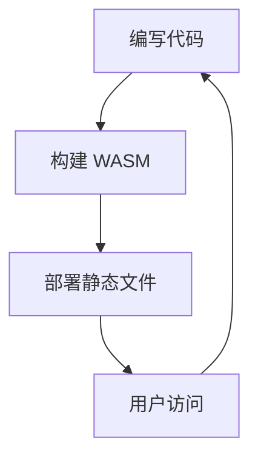
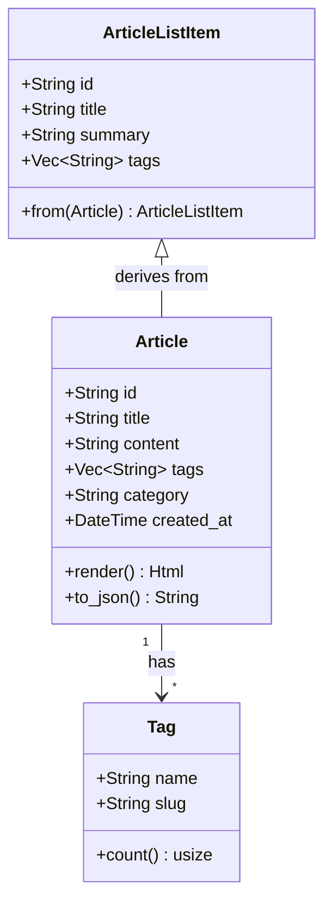

# 用 Rust + Yew 构建本地优先博客

StaticFlow 是一个本地优先（Local-first）、自动化驱动的博客样板项目。


## 亮点

- 无后端依赖，纯静态部署
- 使用 `Yew` 构建前端组件
- 基于 `Trunk` 与 `wasm-pack` 的开发体验

```rust
fn main() {
    println!("Hello StaticFlow!");
}
sdfasf
dsafsda
dfsafasd
fdasfas
dfasf
asdfff
asdfsaf
dsafdasf
asdfasdsd
asdffsdaf
dasfsdaf
asdffsdaf
asdffsdaf
asdffsdf
```



你好，世界！

$$E = mc^2$$





> 小贴士：保持组件小而清晰。
