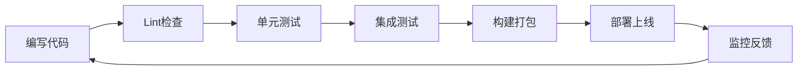

# Web 前端工程化的三个关键维度

在现代前端中，我们通常从以下维度进行工程化：

1. 构建与打包
2. 质量保障（Lint/Format/Test)
3. 交付与运维

## 开发流程

## 技术栈对比

| 特性 | Webpack | Vite | Trunk |
|------|---------|------|-------|
| 语言 | JavaScript | JavaScript | Rust |
| 启动速度 | 慢 | 快 | 快 |
| HMR | 支持 | 支持 | 支持 |
| 生态 | 成熟 | 快速增长 | 新兴 |

> 实战中，请优先考虑开发者体验（DX）。
