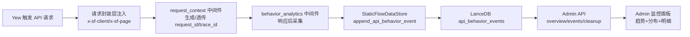
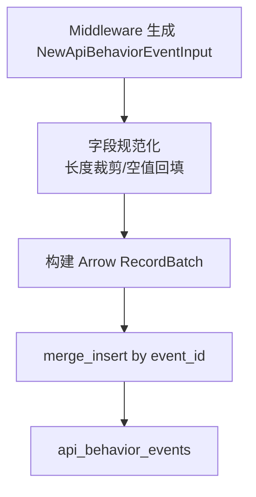

# API 行为监控系统设计与实现详解

> **代码版本**：基于 StaticFlow 当前 `master` 分支。

📌 **本文范围**：重点分析 API 行为监控的系统设计与实现机制，包括事件模型、采集链路、存储与聚合、可视化与运维流程。不展开搜索与内容管理模块。

## 1. 需求背景与建设目标

很多系统会记录 `view_count`，但当线上出现问题时，这个指标几乎帮不上忙。

举几个真实场景：

- 你知道今天请求多了，但不知道是哪个页面触发的。
- 你知道有 500 错误，但不知道主要发生在移动端还是桌面端。
- 你知道“慢”，但不知道慢在某个接口、某类设备，还是某个地区网络。

所以这次改造的目标不是“多打一条日志”，而是建立一条**请求级行为观测链路**：

1. 每个前端 API 请求都自动带上最小行为上下文。
2. 后端统一在中间件层采集结果数据（状态码、耗时、设备、IP 等）。
3. 管理端将原始事件变成可筛选、可聚合、可下钻的诊断视图。

> 🤔 **Think About**：如果监控只能回答“发生了多少次”，不能回答“在哪发生、由谁触发、结果如何”，它本质上还是计数器，不是可观测性系统。

**本文结构**：
- §2 观测事件模型 → §3 采集链路架构 → §4 客户端维度标准化 → §5 存储与写入 → §6 查询与聚合 → §7 Admin 可视化与诊断 → §8 架构权衡与边界 → §9 运维操作手册 → §10 源码索引

---

## 2. 观测事件模型设计

监控系统最容易失败的地方是“字段先长出来，语义后补解释”。这会导致同名字段口径不一致，后续无法稳定聚合。

这套实现先定义了一条 API 行为事件的标准结构：

- **触发上下文**：`client_source`、`page_path`、`referrer`
- **请求动作**：`method`、`path`、`query`
- **执行质量**：`status_code`、`latency_ms`
- **客户端画像**：`client_ip`、`ip_region`、`ua_raw`、`device_type`、`browser_family`、`os_family`
- **链路关联**：`request_id`、`trace_id`
- **审计字段**：`event_id`、`occurred_at`、`created_at`、`updated_at`

> 📝 **Terminology**：
> - **行为事件（Behavior Event）**：一次 API 请求在“结果已确定”时形成的结构化记录。
> - **请求级埋点**：以 HTTP 请求为粒度采集，不覆盖纯前端无请求交互。
> - **可联结性（Joinability）**：事件可与页面入口、设备维度、后端日志做交叉关联。

这个模型的价值不是字段多，而是它把“入口、动作、结果、画像、链路”五个维度统一到一行数据里。

---

## 3. 采集链路架构设计

### 3.1 总体数据流

### 3.2 前端请求层注入策略

如果让每个业务调用自己加埋点字段，会出现三类问题：

- 新接口容易漏
- 字段格式容易漂移
- 维护成本随着接口数量线性增长

统一在请求封装层注入后，覆盖率几乎由框架保证：只要走统一 API 客户端，就有行为上下文。

### 3.3 响应后采集策略

采集如果发生在请求进入时，至少丢两类关键信息：

- 最终状态码（中间可能被改写）
- 真实端到端耗时

响应后采集则天然拿到最终结果。

> 💡 **Key Point**：这套系统把“日志时间点”从 request-start 移到 response-end，本质是把观测对象从“请求意图”变成“执行结果”。

### 3.4 中间件编排顺序

当前链路中有两个关键中间件：

1. `request_context`：补齐 request_id / trace_id
2. `behavior_analytics`：记录行为事件

顺序设计的目的，是确保行为事件里有可用于日志回溯的链路 ID。否则 Admin 看到异常后无法快速定位服务端日志。

---

## 4. 客户端维度标准化处理

### 4.1 IP 提取与归一化

线上环境常见情况：

- `x-forwarded-for` 里是 `client, proxy1, proxy2`
- token 带端口：`198.51.100.1:4567`
- RFC7239 语法：`for="[2001:db8::7]:1234"`
- 无效值：`unknown`、`bad-token`

因此实现里做了两件事：

1. **头部回退链**：多个来源按优先级兜底
2. **格式归一化**：IPv4/IPv6/端口/RFC7239 统一抽取为标准 IP

这不是“细枝末节”，而是保证 unique IP、地区分布口径稳定的基础。

### 4.2 UA 分类策略

UA 解析采用轻量规则分类，输出三个维度：

- 设备类型（bot/tablet/mobile/desktop）
- 浏览器家族（Chrome/Safari/Edge/Firefox/...）
- 操作系统家族（Windows/Android/iOS/macOS/Linux/...）

这种方案的优缺点非常明确：

| 方案 | 优点 | 代价 |
|------|------|------|
| 轻量规则分类 | 依赖少、开销低、可解释 | 精度不如商业级 UA 引擎 |
| 重型 UA 库 | 识别更细 | 依赖重、维护复杂、性能成本更高 |

当前目标是 Admin 运营分析，不是广告归因，轻量策略是合理折中。

### 4.3 链路关联字段设计

行为事件里存 request_id/trace_id 的意义是“可追根溯源”：

- 在 Admin 明细发现异常事件
- 复制 request_id 到日志系统搜索
- 定位同一请求的后端执行轨迹

这一步把“监控看板”变成了排障入口。

---

## 5. 存储层与写入流程

### 5.1 表职责分离设计

`article_views` 关注的是去重计数结果。
`api_behavior_events` 关注的是每次请求行为过程。

两者混表会导致：

- 语义冲突（计数结果 vs 原始事件）
- 查询复杂度陡增
- 索引策略难统一

所以采用职责分离：行为事件独立表。

### 5.2 写入流程

### 5.3 入库前规范化策略

写入前做规范化是为了系统可运营，而不是“格式整洁”：

- 避免超长 query / ua 导致行异常膨胀
- 避免空值影响聚合维度
- 保证同类字段有稳定默认值

> ⚠️ **Gotcha**：如果原始输入不受控，行为表很快会变成“难以聚合的半结构化垃圾堆”。

### 5.4 留存清理机制

行为日志天然无限增长。系统内置按 `retention_days` 清理旧数据：

- 先计算阈值时间
- 再删除阈值之前的事件
- 返回删除数量供运维确认

这保证了“可观测性能力”不会反过来拖垮存储。

---

## 6. 查询与聚合机制

### 6.1 概览聚合实现

当前规模下，overview 聚合采用窗口内事件线性扫描 + HashMap/HashSet 统计：

1. 统计总事件、平均耗时
2. 统计 unique IP / unique page
3. 统计 endpoint/page/device/browser/os/region 分布
4. 生成连续天序列（缺失天补零）

这种方案简单、可维护、对中小规模数据足够高效。

### 6.2 查询窗口控制策略

这两个配置不是“前端默认值”，而是查询成本控制阀：

- `default_days`：约束常态查询负载
- `max_days`：约束最坏查询负载

配合参数校验，防止一次错误请求把管理接口放大到不可控成本。

### 6.3 明细筛选与分页策略

实际排障从来不是看“全量列表”，而是边筛边定位：

- path/page：定位入口与接口簇
- device/method/status：定位错误模式
- ip：定位异常源

因此明细接口提供组合过滤 + 分页，支持快速下钻而不是“翻日志”。

---

## 7. Admin 可视化与诊断流程

### 7.1 信息架构分三层

行为页签的结构不是平铺，而是诊断导向：

1. **KPI 层**：总量、唯一 IP、唯一页面、平均耗时
2. **结构层**：趋势与分布（endpoint/page/device/browser/os/region）
3. **样本层**：最近事件明细表

这对应一个高效认知路径：先看是否异常，再看异常在哪一层，最后落到具体样本。

### 7.2 趋势组件复用策略

复用 `ViewTrendChart` 的收益：

- 减少 UI 技术栈分裂
- 降低维护面
- 用户认知一致（统计页和行为页同一交互范式）

### 7.3 诊断下钻路径

以“500 错误突增”为例：

1. 概览看 top endpoint 是否异常抬升
2. 明细加 `status=500 + path_contains`
3. 查看 `page_path` 是否集中在某入口
4. 拿 request_id / trace_id 回查后端日志

这就是从监控到定位的闭环。

---

## 8. 架构权衡与边界

### 8.1 采集层方案权衡

| 方案 | 优势 | 风险 |
|------|------|------|
| 中间件统一采集 | 覆盖稳定、侵入低、口径统一 | 只覆盖请求级行为 |
| 业务内埋点 | 可记录更细业务语义 | 漏埋点概率高、维护成本高 |

当前目标是请求级可观测性，中间件方案更稳。

### 8.2 聚合模式权衡

| 方案 | 优势 | 风险 |
|------|------|------|
| 实时聚合（当前） | 实现简单、数据实时 | 大窗口时 CPU/内存上升 |
| 预聚合 | 查询快、成本可控 | 写入链路复杂，延迟更高 |

当前数据量下，实时聚合更符合收益/复杂度比。

### 8.3 隐私与可观测性权衡

保留原始 IP 有排障价值，但也提高敏感度。

可选演进：

- IP 掩码（/24）
- IP 哈希化
- 降低保留周期

是否执行取决于运维需求与隐私策略优先级。

---

## 9. 运维操作手册

### 9.1 错误率异常排查

操作步骤：

1. overview 看 `top_endpoints`
2. events 过滤 `status_code=500`
3. 叠加 `path_contains`
4. 用 request_id 回查日志

### 9.2 慢请求排查

操作步骤：

1. 看 `avg_latency_ms` 与 trend
2. 过滤 `device_type=mobile`（或 desktop）
3. 对比 browser/os 分布
4. 结合 region 判断网络因素

### 9.3 异常流量排查

操作步骤：

1. 看 `device_distribution` 是否 `bot` 抬升
2. 看 `top_pages` 是否出现非常规入口
3. 通过 cleanup 清理旧噪声并持续观察趋势

---

## 10. 源码索引（用于对应实现）

### 10.1 采集与路由
- `backend/src/behavior_analytics.rs`
- `backend/src/routes.rs`
- `backend/src/request_context.rs`

### 10.2 配置与聚合
- `backend/src/state.rs`
- `backend/src/handlers.rs`

### 10.3 存储与查询
- `shared/src/lancedb_api.rs`

### 10.4 前端请求与可视化
- `frontend/src/api.rs`
- `frontend/src/pages/admin.rs`

## 11. 总结

这套 API 行为监控的价值在于：它把“请求日志”升级成了“可运营的数据产品”。

- 有统一模型：保证口径一致
- 有稳定采集：保证覆盖率
- 有聚合与下钻：保证可分析
- 有清理与边界：保证可长期运行

当系统出现慢、错、异常流量时，它不只告诉你“出问题了”，还能告诉你“问题从哪里来、怎么快速定位”。
