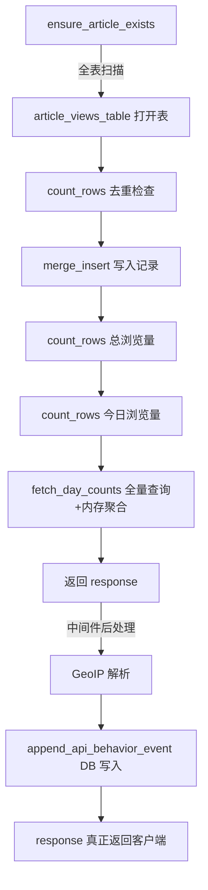
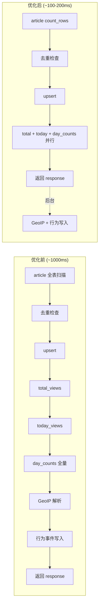

# Axum 后端 View Tracking API 性能优化：从 1000ms 到 100ms

> **代码版本**: 基于 [StaticFlow](https://github.com/acking-you/static-flow) 项目 2026-02 主分支。

## 1. 问题：一个 API 拖慢了整个体验

StaticFlow 是一个基于 Rust (Axum) + LanceDB 的博客系统。在日常使用中，我们发现一个严重的性能问题：

```bash
# 普通文章查询 ~100ms
time curl "http://localhost:3000/api/articles/post-001"

# View tracking 接口 ~1000ms — 慢了 10 倍
time curl -X POST "http://localhost:3000/api/articles/post-001/view"
```

每次用户打开文章页面都会触发这个 view tracking 请求。1 秒的延迟意味着页面的浏览统计数据要等很久才能返回，直接影响用户体验。

本文将逐步拆解这个接口的完整请求管线，定位每一层的性能瓶颈，并给出四项针对性优化。

> 📌 **本文范围**: 聚焦于单个 API 端点的请求管线优化，不涉及数据库索引、缓存层或架构级重构。

## 2. 请求管线全景：9 个串行 I/O 操作

要理解为什么这个接口慢，首先需要看清请求从进入到返回经过了哪些步骤。

### 2.1 中间件链

Axum 路由在 `backend/src/routes.rs:115-121` 中注册了三层中间件：

```
请求 → CORS → behavior_analytics → request_context → Handler → 响应
```

关键在于 `behavior_analytics` 中间件的执行模型——它在 handler 执行完毕后，**阻塞 response 返回**，同步执行 GeoIP 解析和数据库写入。

### 2.2 Handler 内部操作链

Handler `track_article_view`（`backend/src/handlers.rs:578-600`）内部的操作序列：



总计 **9 个串行 I/O 操作**。每个 LanceDB 操作涉及磁盘读写，GeoIP 解析可能触发外部 HTTP 调用。这就是 1000ms 的来源。

### 2.3 各操作耗时估算

| 操作 | 位置 | 估算耗时 | 说明 |
|------|------|----------|------|
| ensure_article_exists | `handlers.rs:583` | ~100ms | 全表扫描 + 读取大字段 |
| article_views_table() | `lancedb_api.rs:413` | ~20ms | 打开/创建表 |
| count_rows (去重) | `lancedb_api.rs:425` | ~50ms | 按 id 过滤 |
| merge_insert (upsert) | `lancedb_api.rs:441` | ~100ms | 写入操作 |
| count_rows (总量) | `lancedb_api.rs:443` | ~50ms | 按 article_id 过滤 |
| count_rows (今日) | `lancedb_api.rs:447` | ~50ms | 复合过滤 |
| fetch_day_counts | `lancedb_api.rs:453` | ~80ms | 全量查询 + 内存聚合 |
| GeoIP resolve_region | `behavior_analytics.rs:50` | ~200-500ms+ | 可能触发 HTTP 回退 |
| append_api_behavior | `behavior_analytics.rs:87` | ~50ms | 写入行为事件 |

> ⚠️ **Gotcha**: 以上耗时为基于代码结构的定性估算，非精确 benchmark 数据。实际耗时取决于磁盘 I/O、数据量和网络状况。

## 3. 优化一：中间件异步化（最大收益）

### 3.1 问题分析

`behavior_analytics_middleware`（`backend/src/behavior_analytics.rs:24-93`）的原始逻辑：

```rust
// 优化前 — behavior_analytics.rs
pub async fn behavior_analytics_middleware(
    State(state): State<AppState>,
    request: Request,
    next: Next,
) -> Response {
    let headers = request.headers().clone();
    let started_at = Instant::now();

    let response = next.run(request).await;  // handler 执行完毕

    // ❌ 以下所有操作在返回 response 之前同步执行
    let client_ip = extract_client_ip(&headers);
    let ip_region = state.geoip.resolve_region(&client_ip).await;  // 可能 HTTP 调用
    // ... UA 解析、事件构建 ...
    state.store.append_api_behavior_event(input).await;  // DB 写入

    response  // 客户端要等上面全部完成才能收到响应
}
```

> 💡 **Key Point**: `resolve_region` 的实现（`backend/src/geoip.rs:141-179`）会先尝试本地 MaxMind 数据库查询，如果本地数据不够详细（`require_region_detail=true` 时缺少省/市信息），会回退到 `ipwho.is` HTTP API，默认超时 **120 秒**。这意味着在最坏情况下，每个 API 请求都可能被 GeoIP 回退拖住数秒。

### 3.2 优化方案：tokio::spawn fire-and-forget

核心思路：response 的状态码和 headers 在 handler 返回时就已确定，分析工作不影响响应内容。用 `tokio::spawn` 将分析逻辑放到后台任务，立即返回 response。

```rust
// 优化后 — behavior_analytics.rs:42-92
let status_code = response.status().as_u16() as i32;
let latency_ms = started_at.elapsed().as_millis().min(i32::MAX as u128) as i32;
let response_headers = response.headers().clone();

// Fire-and-forget: GeoIP + DB write run in background
tokio::spawn(async move {
    let occurred_at = chrono::Utc::now().timestamp_millis();
    let client_ip = extract_client_ip(&headers);
    let ip_region = state.geoip.resolve_region(&client_ip).await;
    // ... 构建事件并写入 DB ...
    if let Err(err) = state.store.append_api_behavior_event(input).await {
        tracing::warn!("failed to append api behavior event: {err}");
    }
});

response  // 立即返回，不等后台任务
```

### 3.3 为什么这样做是安全的

1. **`AppState` 是 `Arc` 包裹的**：`tokio::spawn` 需要 `'static` 生命周期，`state` 通过 `Arc` 共享，clone 开销极小。
2. **`generate_event_id()` 使用 `AtomicU64`**：在 spawn 中调用线程安全。
3. **`latency_ms` 测量点微调**：从"response 返回前"变为"spawn 前"，差异在微秒级，可忽略。
4. **失败不影响业务**：行为分析是旁路数据，写入失败只记录 warn 日志。

> 🤔 **Think About**: 如果 `tokio::spawn` 的后台任务积压怎么办？在当前场景下，每个请求只 spawn 一个轻量任务，Tokio runtime 的任务调度器能高效处理。如果未来请求量暴增，可以考虑用 bounded channel + 专用 worker 来限流。

## 4. 优化二：轻量化文章存在性检查

### 4.1 问题分析

原始的 `ensure_article_exists`（`backend/src/handlers.rs:2230-2250`）调用 `get_article`，后者通过 `fetch_article_detail` 执行全表扫描并读取 `content`、`content_en`、`detailed_summary` 等大文本字段：

```rust
// 优化前 — handlers.rs:2230
async fn ensure_article_exists(state: &AppState, id: &str) -> Result<...> {
    let article = state.store.get_article(id).await?;  // 全表扫描 + 读取所有字段
    if article.is_some() { Ok(()) } else { Err(404) }
}
```

对于 view tracking 来说，我们只需要知道文章是否存在，不需要读取任何内容。

### 4.2 优化方案：count_rows 替代全表扫描

新增 `article_exists` 方法（`shared/src/lancedb_api.rs:590-598`），只用 `count_rows` 返回一个整数：

```rust
// 优化后 — lancedb_api.rs:590-598
pub async fn article_exists(&self, id: &str) -> Result<bool> {
    let table = self.articles_table().await?;
    let filter = format!("id = '{}'", escape_literal(id));
    let count = table
        .count_rows(Some(filter))
        .await
        .context("failed to check article existence")?;
    Ok(count > 0)
}
```

`ensure_article_exists` 改为调用新方法（`handlers.rs:2230-2250`）：

```rust
// 优化后 — handlers.rs:2230-2250
async fn ensure_article_exists(state: &AppState, id: &str) -> Result<...> {
    let exists = state.store.article_exists(id).await?;
    if exists { Ok(()) } else { Err(404) }
}
```

> 💡 **Key Point**: `count_rows` 只返回一个整数，不读取任何列数据。相比 `fetch_article_detail` 需要反序列化 `content`（可能数十 KB 的 Markdown）、`content_en`、`detailed_summary` 等字段，开销差距巨大。

## 5. 优化三：查询并行化

### 5.1 问题分析

在 `track_article_view`（`shared/src/lancedb_api.rs:405-483`）中，upsert 之后有三个独立查询串行执行：

```
upsert → total_views → today_views → day_counts → 返回
         (串行)        (串行)         (串行)
```

这三个查询之间没有数据依赖——它们都只是读取 `article_views` 表的不同统计维度。

### 5.2 优化方案：futures::join! 并行执行

```rust
// 优化后 — lancedb_api.rs:447-467
let (total_views_result, today_views_result, day_counts_result) = futures::join!(
    async {
        table
            .count_rows(Some(format!("article_id = '{escaped_article_id}'")))
            .await
            .context("failed to count total article views")
    },
    async {
        table
            .count_rows(Some(format!(
                "article_id = '{escaped_article_id}' AND day_bucket = '{escaped_day}'"
            )))
            .await
            .context("failed to count today's views")
    },
    fetch_article_view_day_counts(&table, article_id, Some(&since_day)),
);

let total_views = total_views_result? as usize;
let today_views = today_views_result? as u32;
let day_counts = day_counts_result?;
```

```
upsert → ┌ total_views  ┐
         │ today_views  │ → 返回
         └ day_counts   ┘
         (并行)
```

> 📝 **Terminology**: `futures::join!` 是 `futures` crate 提供的宏，在同一个 async task 内并发驱动多个 future。与 `tokio::join!` 功能等价，但不依赖 tokio runtime，适合在不直接依赖 tokio 的 library crate 中使用。

### 5.3 为什么用 futures::join! 而不是 tokio::join!

`shared` crate 的 `Cargo.toml` 没有 `tokio` 依赖（它是一个纯 library crate，只依赖 `futures`、`lancedb`、`arrow` 等）。为了避免引入不必要的依赖，使用已有的 `futures::join!`。两者在语义上完全等价。

## 6. 优化四：时间窗口过滤

### 6.1 问题分析

`fetch_article_view_day_counts`（`shared/src/lancedb_api.rs:2439-2465`）原始实现查询该文章的**所有** view 记录，然后在内存中按 `day_bucket` 聚合：

```rust
// 优化前
let filter = format!("article_id = '{}'", escape_literal(article_id));
// 查询所有历史记录，随数据增长越来越慢
```

但调用方 `build_recent_day_points` 只需要最近 N 天的数据（默认 30 天，最大 180 天）。查询 6 个月前的数据完全是浪费。

### 6.2 优化方案：添加 since_day 过滤

```rust
// 优化后 — lancedb_api.rs:2439-2450
async fn fetch_article_view_day_counts(
    table: &Table,
    article_id: &str,
    since_day: Option<&str>,  // 新增参数
) -> Result<HashMap<String, u32>> {
    let escaped_id = escape_literal(article_id);
    let filter = if let Some(day) = since_day {
        let escaped_day = escape_literal(day);
        format!("article_id = '{escaped_id}' AND day_bucket >= '{escaped_day}'")
    } else {
        format!("article_id = '{escaped_id}'")
    };
    // ...
}
```

调用方计算 `since_day`（`lancedb_api.rs:443-445`）：

```rust
let window = normalize_daily_window(daily_window_days, max_daily_window_days);
let since_date = now_local.date_naive() - ChronoDuration::days(window as i64);
let since_day = since_date.format("%Y-%m-%d").to_string();
```

> 💡 **Key Point**: 这项优化的收益随数据量增长而增大。当文章积累了数千条 view 记录时，从全量扫描缩减到最近 30 天，数据量可能减少一个数量级。

## 7. 优化效果对比

### 7.1 请求管线对比



### 7.2 各优化项收益

| 优化项 | 改动文件 | 原理 | 预期收益 |
|--------|----------|------|----------|
| 中间件异步化 | `behavior_analytics.rs` | GeoIP + DB 写入不阻塞响应 | -300ms+ |
| 轻量存在性检查 | `lancedb_api.rs`, `handlers.rs` | count_rows 替代全字段扫描 | -80ms |
| 查询并行化 | `lancedb_api.rs` | 3 个独立查询并发执行 | -100ms |
| 时间窗口过滤 | `lancedb_api.rs` | 只查最近 N 天数据 | -50ms+ |

## 8. 代码索引

| 组件 | 文件 | 关键行号 |
|------|------|----------|
| 中间件（优化后） | `backend/src/behavior_analytics.rs` | 24-93 |
| 路由注册 | `backend/src/routes.rs` | 115-121 |
| Handler | `backend/src/handlers.rs` | 578-600 |
| ensure_article_exists（优化后） | `backend/src/handlers.rs` | 2230-2250 |
| article_exists（新增） | `shared/src/lancedb_api.rs` | 590-598 |
| track_article_view（优化后） | `shared/src/lancedb_api.rs` | 405-483 |
| fetch_article_view_day_counts（优化后） | `shared/src/lancedb_api.rs` | 2439-2465 |
| GeoIP 解析器 | `backend/src/geoip.rs` | 141-179 |

## 9. 总结与思考

这次优化的核心教训：**不要让旁路逻辑阻塞主路径**。

behavior_analytics 中间件的 GeoIP 解析是最大的性能杀手——一个用于统计监控的旁路操作，却同步阻塞了每个 API 请求的响应。改为 `tokio::spawn` fire-and-forget 后，这部分延迟从请求关键路径上完全消失。

其余三项优化（轻量存在性检查、查询并行化、时间窗口过滤）都是常规的数据库访问优化，但组合起来效果显著。特别是查询并行化，在 Rust async 生态中用 `futures::join!` 实现非常自然，几乎没有额外复杂度。

> 🤔 **Think About**: 如果未来 view tracking 的写入量继续增长，下一步可以考虑：
> - 为 `article_views` 表的 `article_id` 和 `day_bucket` 列创建标量索引
> - 用 `tokio::sync::OnceCell` 缓存 table 句柄，避免重复 open
> - 在前端做乐观更新，view tracking 请求改为完全 fire-and-forget
