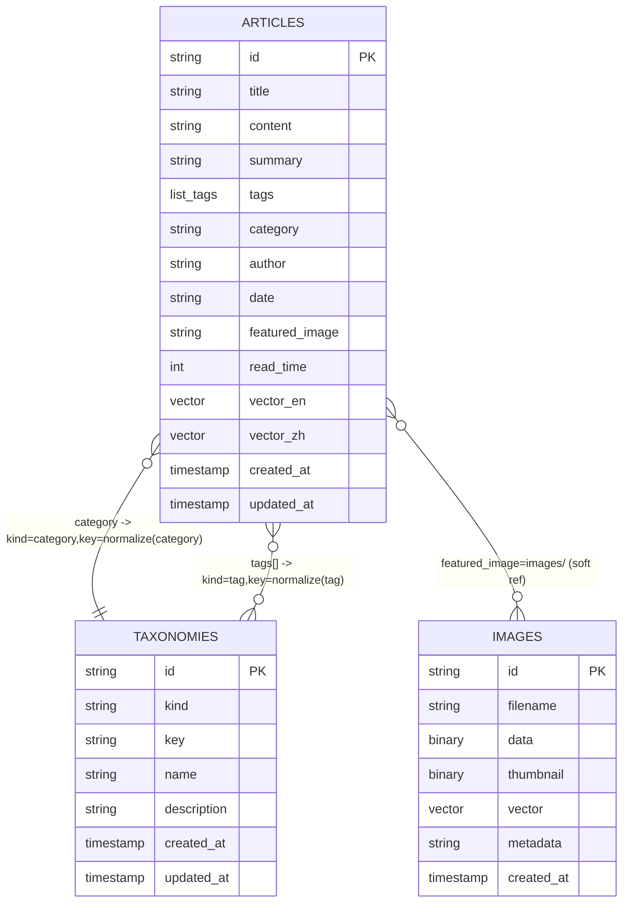
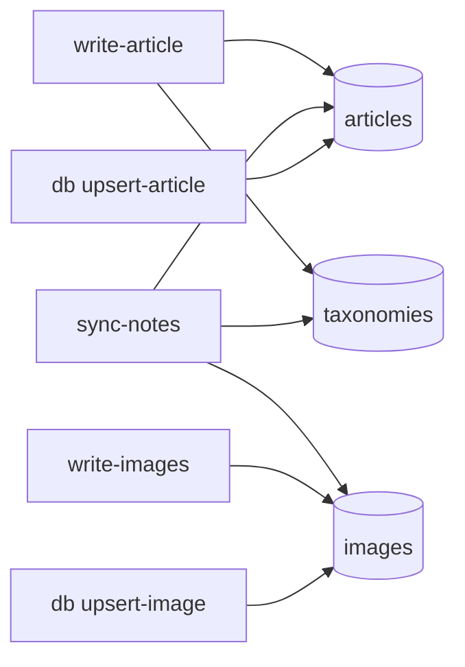

# StaticFlow CLI 使用手册（LanceDB）

> 本文档面向 `sf-cli` 二进制使用方式，覆盖：
> - 三张核心表（`articles` / `images` / `taxonomies`）
> - 全量 CRUD（增删改查）命令
> - 每个字段的语义与来源
> - 索引、检索、调试方式

---

## 1. 快速开始

### 1.1 编译二进制

```bash
# 在仓库根目录
make bin-cli

# 产物
./bin/sf-cli --help
```

> 若你偏好 release 目录，也可用：`./target/release/sf-cli`。

### 1.2 初始化数据库

```bash
./bin/sf-cli init --db-path ./data/lancedb
```

会自动创建并初始化：
- `articles`
- `images`
- `taxonomies`

### 1.3 一键全量测试（推荐）

```bash
# 默认编译 debug 二进制并全量验证
./scripts/test_cli_e2e.sh

# 需要 release 验证时
BUILD_PROFILE=release ./scripts/test_cli_e2e.sh

# 指定已有 binary 与工作目录
CLI_BIN=./bin/sf-cli WORKDIR=./tmp/cli-e2e ./scripts/test_cli_e2e.sh
```

脚本会自动：
- 读取 `docs/*.md` 内容生成分类、标签、摘要
- 写入 `articles` / `taxonomies`
- 导入 `content/images/*` 到 `images`
- 生成临时 notes 再执行 `sync-notes`（验证图片重写）
- 覆盖 `query`、`db`、`api` 全量能力并做断言校验

---

## 2. 数据模型总览（无硬编码词典）

当前推荐模型是三表：
- `articles`：文章主体、元数据、文本向量
- `images`：图片二进制、缩略图、图像向量
- `taxonomies`：分类/标签元数据（含 `description`）

### 2.1 表关系图（ER）



### 2.2 写入链路图



---

## 3. 字段字典（逐字段说明）

## 3.1 `articles` 字段

| 字段 | 类型 | 必填 | 说明 | 写入来源 |
|---|---|---:|---|---|
| `id` | `Utf8` | 是 | 文章主键 | `write-article --id` 或文件名/相对路径推导 |
| `title` | `Utf8` | 是 | 标题 | frontmatter `title` / 首个 heading / 文件名 |
| `content` | `Utf8` | 是 | Markdown 正文 | Markdown body |
| `summary` | `Utf8` | 是 | 摘要 | CLI 参数/frontmatter/自动摘要（sync） |
| `tags` | `List<Utf8>` | 是 | 标签数组 | CLI 参数或 frontmatter |
| `category` | `Utf8` | 是 | 分类名 | CLI 参数或 frontmatter |
| `author` | `Utf8` | 是 | 作者 | frontmatter 或默认值 |
| `date` | `Utf8` | 是 | 日期字符串（YYYY-MM-DD） | frontmatter 或当前日期 |
| `featured_image` | `Utf8?` | 否 | 封面图引用 | 常见形态：`images/<image_id>` |
| `read_time` | `Int32` | 是 | 预计阅读分钟 | frontmatter 或自动估算 |
| `vector_en` | `FixedSizeList<Float32>?` | 否 | 英文语义向量 | 自动 embedding 或显式传入 |
| `vector_zh` | `FixedSizeList<Float32>?` | 否 | 中文语义向量 | 自动 embedding 或显式传入 |
| `created_at` | `Timestamp(ms)` | 是 | 创建时间戳 | 写入时生成 |
| `updated_at` | `Timestamp(ms)` | 是 | 更新时间戳 | 写入时生成 |

## 3.2 `images` 字段

| 字段 | 类型 | 必填 | 说明 |
|---|---|---:|---|
| `id` | `Utf8` | 是 | 图片主键（通常为内容 hash） |
| `filename` | `Utf8` | 是 | 原始文件名 |
| `data` | `Binary` | 是 | 原图二进制 |
| `thumbnail` | `Binary?` | 否 | 缩略图二进制 |
| `vector` | `FixedSizeList<Float32>` | 是 | 图像向量 |
| `metadata` | `Utf8` | 是 | JSON 字符串（宽高、来源、字节数等） |
| `created_at` | `Timestamp(ms)` | 是 | 创建时间戳 |

### 3.2.1 `thumbnail` 生成与读取细节

- 仅在 `write-images --generate-thumbnail` 或 `sync-notes --generate-thumbnail` 时生成缩略图；默认不生成。
- 尺寸由 `--thumbnail-size` 控制（默认 `256`），使用等比缩放到 `size x size` 边界框内。
- 缩略图统一编码为 **PNG 二进制**，存储在 `images.thumbnail`；原图二进制存储在 `images.data`。
- 读取时（backend 与 `sf-cli api get-image` 一致）：`?thumb=true` 会优先返回 `thumbnail`，若 `thumbnail` 为空自动回退 `data` 原图。
- 当前实现中，HTTP `Content-Type` 按 `filename` 后缀推断；因此当原图是 `jpg` 且 `thumb=true` 时，响应头可能是 `image/jpeg`，但响应字节实际是 PNG（实现细节，调试时请留意）。

## 3.3 `taxonomies` 字段

| 字段 | 类型 | 必填 | 说明 |
|---|---|---:|---|
| `id` | `Utf8` | 是 | 复合主键：`kind:key` |
| `kind` | `Utf8` | 是 | 枚举语义：`category` / `tag` |
| `key` | `Utf8` | 是 | 规范化 key（slug 化） |
| `name` | `Utf8` | 是 | 展示名 |
| `description` | `Utf8?` | 否 | 说明文案；未提供时会兜底为 `name` |
| `created_at` | `Timestamp(ms)` | 是 | 创建时间戳 |
| `updated_at` | `Timestamp(ms)` | 是 | 更新时间戳 |

---

## 4. CRUD 命令总览（按能力分层）

CLI 有 3 组命令：
- **内容导入层**：`write-article` / `write-images` / `sync-notes`
- **表管理层**：`db ...`（接近数据库操作）
- **接口调试层**：`api ...`（与 backend API 一致）

---

## 5. C（Create / Upsert）

### 5.1 初始化和建表

```bash
./bin/sf-cli init --db-path ./data/lancedb
./bin/sf-cli db --db-path ./data/lancedb create-table taxonomies
```

### 5.2 写入单篇文章（推荐）

```bash
./bin/sf-cli write-article \
  --db-path ./data/lancedb \
  --file ./content/post-001.md \
  --summary "文章摘要" \
  --tags "rust,wasm" \
  --category "Tech" \
  --category-description "Rust 与 WASM 工程实践"
```

同时会：
- upsert `articles`
- upsert `taxonomies`（`kind=category` 和 `kind=tag`）
- 默认自动执行 index-only optimize，保障新写入文章可立即被 FTS 检索覆盖
- 批量流水线可通过 `--no-auto-optimize` 关闭

### 5.3 批量写入图片

```bash
./bin/sf-cli write-images \
  --db-path ./data/lancedb \
  --dir ./content/images \
  --recursive \
  --generate-thumbnail
```

默认自动执行 index-only optimize；批量流水线可加 `--no-auto-optimize`。

### 5.4 同步本地笔记目录

```bash
./bin/sf-cli sync-notes \
  --db-path ./data/lancedb \
  --dir ./content \
  --recursive \
  --generate-thumbnail
```

`sync-notes` 会自动：
- 处理 markdown 中本地图片并写入 `images`
- 重写图片链接为 `images/<sha256_id>`
- 写入 `articles`
- 写入 `taxonomies`
- 默认自动执行 index-only optimize（`articles` / `images`）
- 批量流水线可通过 `--no-auto-optimize` 关闭

### 5.5 直接 JSON upsert（底层调试）

```bash
./bin/sf-cli db --db-path ./data/lancedb upsert-article --json '{"id":"post-raw-1","title":"Raw","content":"# Raw","summary":"raw","tags":["raw"],"category":"Tech","author":"ops","date":"2026-02-10","featured_image":null,"read_time":1,"vector_en":null,"vector_zh":null,"created_at":1739160000000,"updated_at":1739160000000}'

./bin/sf-cli db --db-path ./data/lancedb upsert-image --json '{"id":"img-raw-1","filename":"raw.png","data":[],"thumbnail":null,"vector":[],"metadata":"{}","created_at":1739160000000}'
```

---

## 6. R（Read）

### 6.1 通用查询（表格/竖排）

```bash
./bin/sf-cli query --db-path ./data/lancedb --table articles --limit 10
./bin/sf-cli query --db-path ./data/lancedb --table articles --limit 1 --format vertical
```

### 6.2 数据库风格查询

```bash
./bin/sf-cli db --db-path ./data/lancedb list-tables
./bin/sf-cli db --db-path ./data/lancedb describe-table articles
./bin/sf-cli db --db-path ./data/lancedb count-rows articles --where "category='Tech'"
./bin/sf-cli db --db-path ./data/lancedb query-rows taxonomies --where "kind='category'" --columns key,name,description --format vertical
```

### 6.3 与 backend 同款 API 调试

```bash
./bin/sf-cli api --db-path ./data/lancedb list-articles --category Tech
./bin/sf-cli api --db-path ./data/lancedb get-article post-001
./bin/sf-cli api --db-path ./data/lancedb search --q "rust"
./bin/sf-cli api --db-path ./data/lancedb semantic-search --q "向量 检索"
./bin/sf-cli api --db-path ./data/lancedb related-articles post-001
./bin/sf-cli api --db-path ./data/lancedb list-tags
./bin/sf-cli api --db-path ./data/lancedb list-categories
./bin/sf-cli api --db-path ./data/lancedb list-images
./bin/sf-cli api --db-path ./data/lancedb search-images --id <image_id>
./bin/sf-cli api --db-path ./data/lancedb get-image <image_id_or_filename> --thumb --out ./tmp-thumb.bin
```

---

## 7. U（Update）

### 7.1 按条件更新

```bash
./bin/sf-cli db --db-path ./data/lancedb update-rows articles \
  --set "category='Architecture'" \
  --where "id='post-001'"

./bin/sf-cli db --db-path ./data/lancedb update-rows taxonomies \
  --set "description='架构与工程实践'" \
  --where "kind='category' AND key='tech'"
```

> 默认禁止无条件全表更新；若必须全表，显式加 `--all`。

### 7.2 通过 upsert 实现“有则更、无则插”

- `write-article`：按 `articles.id` merge upsert
- `sync-notes`：批量 upsert
- `db upsert-article` / `db upsert-image`：手动 JSON upsert

---

## 8. D（Delete）

### 8.1 删行

```bash
./bin/sf-cli db --db-path ./data/lancedb delete-rows articles --where "id='draft-001'"
./bin/sf-cli db --db-path ./data/lancedb delete-rows taxonomies --where "kind='tag' AND key='draft'"
```

> 默认禁止无条件全表删除；若必须全表，显式加 `--all`。

### 8.2 删索引 / 删表

```bash
./bin/sf-cli db --db-path ./data/lancedb list-indexes articles --with-stats
./bin/sf-cli db --db-path ./data/lancedb drop-index articles content_idx

./bin/sf-cli db --db-path ./data/lancedb drop-table taxonomies --yes
```

---

## 9. 索引与检索

### 9.1 索引策略

```bash
./bin/sf-cli ensure-indexes --db-path ./data/lancedb
# 或
./bin/sf-cli db --db-path ./data/lancedb ensure-indexes
```

当前策略：
- `articles.content`：FTS
- `articles.vector_en`、`articles.vector_zh`：向量索引（满足训练行数门槛后创建）
- `images.vector`：向量索引
- `taxonomies`：当前不建向量索引

关键说明：
- `ensure-indexes` 负责“建索引定义”。
- `optimize` 负责“把新写入行纳入索引覆盖”。
- `write-article` / `write-images` / `sync-notes` 默认会自动执行 index-only optimize。
- 若你显式使用了 `--no-auto-optimize`，请手动执行：

```bash
./bin/sf-cli db --db-path ./data/lancedb optimize articles
./bin/sf-cli db --db-path ./data/lancedb optimize images
```

### 9.2 搜索路径

- 关键词检索：`api search`（优先 FTS，失败回退扫描）
- 语义检索：`api semantic-search`（主语言向量列无结果时自动回退另一列，如英文 query 回退到 `vector_zh`；highlight 通过语义分块打分选择最相关片段）
- 相关文章：`api related-articles`
- 以图搜图：`api search-images`

---

## 10. frontmatter 建议（配合 write/sync）

推荐在 Markdown 中携带：

```yaml
---
title: "StaticFlow CLI 指南"
summary: "..."
tags: ["rust", "lancedb"]
category: "Tech"
category_description: "Rust + LanceDB 工程实践"
author: "boliu"
date: "2026-02-10"
featured_image: "./images/demo.png"
read_time: 6
---
```

---

## 11. 常见排障

### 11.1 列名写错

使用 `db query-rows` / `db update-rows` 时，如果字段不存在，CLI 会返回：
- 当前表 schema 字段列表
- 可能的字段名建议（Did you mean）

### 11.2 表名写错

CLI 会返回：
- 可用表列表
- 可能的表名建议

### 11.3 为什么 `taxonomies.description` 为空？

该字段来自 `taxonomies(kind='category')`。
请确认：
- 文章写入时有 `--category-description` 或 frontmatter `category_description`
- 或者通过 `db update-rows taxonomies ...` 手工补齐

---

## 12. 一条建议（实践）

在生产流程中建议固定这条链路：
1. `sync-notes` 持续导入（默认自动 optimize）
2. 批量场景如关闭了 auto optimize，则在批次末尾执行 `ensure-indexes` + `db optimize ...`
3. 用 `api` 子命令做线上问题复现（无需起 backend）
4. 用 `db query-rows ... --format vertical` 精确排查单行数据

这样可以把“数据落库、检索效果、API 输出”统一在一条 CLI 调试链路里。
