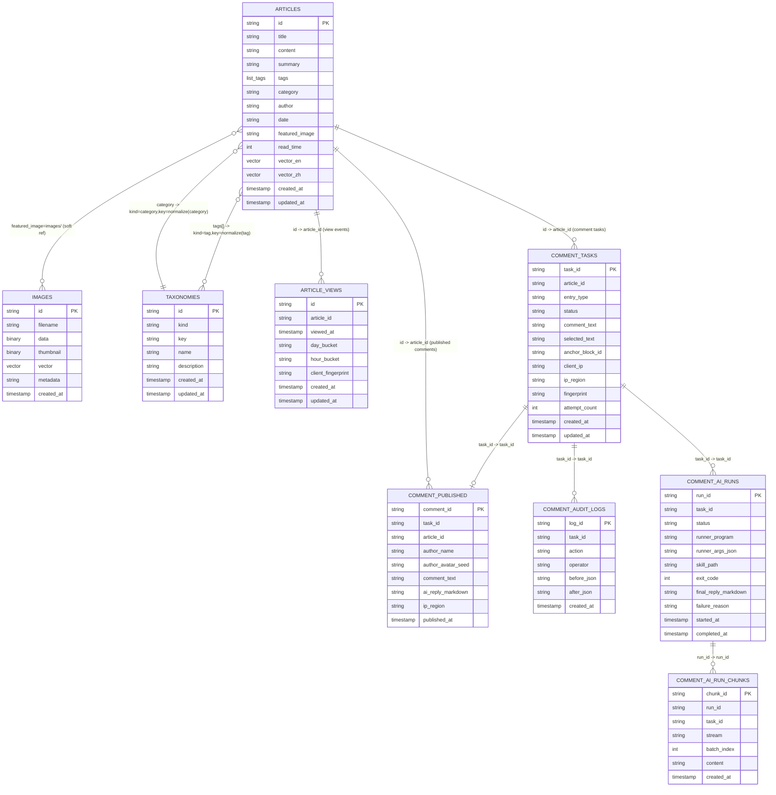
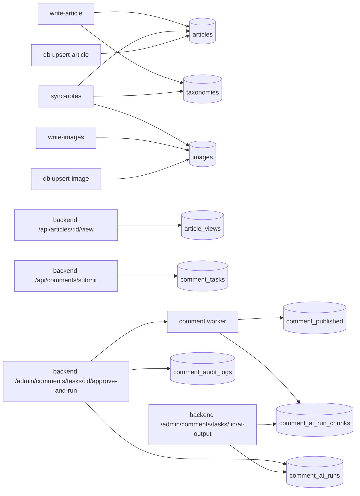

# StaticFlow CLI 使用手册（LanceDB）

> 本文档面向 `sf-cli` 二进制使用方式，覆盖：
> - `sf-cli` 管理的三张核心表（`articles` / `images` / `taxonomies`）
> - backend 运行时统计表（`article_views`）
> - backend 评论体系表（`comment_tasks` / `comment_published` / `comment_audit_logs`，位于评论专用 DB）
> - 全量 CRUD（增删改查）命令
> - 每个字段的语义与来源
> - 索引、检索、调试方式

---

## 1. 快速开始

### 1.1 编译二进制

```bash
# 在仓库根目录
make bin-cli

# 产物
./bin/sf-cli --help
```

> 若你偏好 release 目录，也可用：`./target/release/sf-cli`。

### 1.2 初始化数据库

```bash
./bin/sf-cli init --db-path ./data/lancedb
```

会自动创建并初始化：
- `articles`
- `images`
- `taxonomies`

说明：
- `article_views` 不由 `sf-cli init` 创建；会在 backend 首次处理 `/api/articles/:id/view` 时自动创建。

### 1.3 一键全量测试（推荐）

```bash
# 默认编译 debug 二进制并全量验证
./scripts/test_cli_e2e.sh

# 需要 release 验证时
BUILD_PROFILE=release ./scripts/test_cli_e2e.sh

# 指定已有 binary 与工作目录
CLI_BIN=./bin/sf-cli WORKDIR=./tmp/cli-e2e ./scripts/test_cli_e2e.sh
```

脚本会自动：
- 读取 `docs/*.md` 内容生成分类、标签、摘要
- 写入 `articles` / `taxonomies`
- 导入 `content/images/*` 到 `images`
- 生成临时 notes 再执行 `sync-notes`（验证图片重写）
- 覆盖 `query`、`db`、`api` 全量能力并做断言校验

---

## 2. 数据模型总览（无硬编码词典）

当前数据模型分两组：

主内容库（`LANCEDB_URI`）：
- `articles`：文章主体、元数据、文本向量
- `images`：图片二进制、缩略图、图像向量
- `taxonomies`：分类/标签元数据（含 `description`）
- `article_views`：浏览事件与趋势分桶（按天/小时，`Asia/Shanghai`）

评论库（`COMMENTS_LANCEDB_URI`）：
- `comment_tasks`：评论任务队列（待审核、处理中、失败等状态）
- `comment_published`：审核通过且 AI 回复完成的公开评论
- `comment_audit_logs`：评论审核动作审计日志
- `comment_ai_runs`：每次 AI 执行批次元数据（状态、退出码、最终回复）
- `comment_ai_run_chunks`：AI 输出分片（stdout/stderr），支持后台拼接完整输出

说明：
- 评论库由 backend 自动创建和维护；`sf-cli init` 只初始化主内容库表。

### 2.1 数据库表关系图（ER）



ER 备注：
- `article_views` 是持久化统计表；`id` 的去重分桶粒度来自运行时配置 `dedupe_window_seconds`（默认 60 秒），该配置由本地 admin 接口 `/admin/view-analytics-config` 维护，不是单独的数据表。
- 评论相关五张表默认位于 `COMMENTS_LANCEDB_URI`（与主内容库分离）。
- `comment_tasks.status` 典型流转：`pending -> approved -> running -> done`；也支持 `pending/failed -> running` 直接派发；失败可到 `failed`；拒绝会标记 `rejected` 且保留 task。

### 2.2 写入链路图



---

## 3. 字段字典（逐字段说明）

## 3.1 `articles` 字段

| 字段 | 类型 | 必填 | 说明 | 写入来源 |
|---|---|---:|---|---|
| `id` | `Utf8` | 是 | 文章主键 | `write-article --id` 或文件名/相对路径推导 |
| `title` | `Utf8` | 是 | 标题 | frontmatter `title` / 首个 heading / 文件名 |
| `content` | `Utf8` | 是 | Markdown 正文 | Markdown body |
| `summary` | `Utf8` | 是 | 摘要 | CLI 参数/frontmatter/自动摘要（sync） |
| `tags` | `List<Utf8>` | 是 | 标签数组 | CLI 参数或 frontmatter |
| `category` | `Utf8` | 是 | 分类名 | CLI 参数或 frontmatter |
| `author` | `Utf8` | 是 | 作者 | frontmatter 或默认值 |
| `date` | `Utf8` | 是 | 日期字符串（YYYY-MM-DD） | `--date` > frontmatter > 当前日期 |
| `featured_image` | `Utf8?` | 否 | 封面图引用 | 常见形态：`images/<image_id>` |
| `read_time` | `Int32` | 是 | 预计阅读分钟 | frontmatter 或自动估算 |
| `vector_en` | `FixedSizeList<Float32>?` | 否 | 英文语义向量 | 自动 embedding 或显式传入 |
| `vector_zh` | `FixedSizeList<Float32>?` | 否 | 中文语义向量 | 自动 embedding 或显式传入 |
| `created_at` | `Timestamp(ms)` | 是 | 创建时间戳 | 写入时生成 |
| `updated_at` | `Timestamp(ms)` | 是 | 更新时间戳 | 写入时生成 |

## 3.2 `images` 字段

| 字段 | 类型 | 必填 | 说明 |
|---|---|---:|---|
| `id` | `Utf8` | 是 | 图片主键（通常为内容 hash） |
| `filename` | `Utf8` | 是 | 原始文件名 |
| `data` | `Binary` | 是 | 原图二进制 |
| `thumbnail` | `Binary?` | 否 | 缩略图二进制 |
| `vector` | `FixedSizeList<Float32>` | 是 | 图像向量 |
| `metadata` | `Utf8` | 是 | JSON 字符串（宽高、来源、字节数等） |
| `created_at` | `Timestamp(ms)` | 是 | 创建时间戳 |

### 3.2.1 `thumbnail` 生成与读取细节

- 仅在 `write-images --generate-thumbnail` 或 `sync-notes --generate-thumbnail` 时生成缩略图；默认不生成。
- 尺寸由 `--thumbnail-size` 控制（默认 `256`），使用等比缩放到 `size x size` 边界框内。
- 缩略图统一编码为 **PNG 二进制**，存储在 `images.thumbnail`；原图二进制存储在 `images.data`。
- 读取时（backend 与 `sf-cli api get-image` 一致）：`?thumb=true` 会优先返回 `thumbnail`，若 `thumbnail` 为空自动回退 `data` 原图。
- 当前实现中，HTTP `Content-Type` 按 `filename` 后缀推断；因此当原图是 `jpg` 且 `thumb=true` 时，响应头可能是 `image/jpeg`，但响应字节实际是 PNG（实现细节，调试时请留意）。

## 3.3 `taxonomies` 字段

| 字段 | 类型 | 必填 | 说明 |
|---|---|---:|---|
| `id` | `Utf8` | 是 | 复合主键：`kind:key` |
| `kind` | `Utf8` | 是 | 枚举语义：`category` / `tag` |
| `key` | `Utf8` | 是 | 规范化 key（slug 化） |
| `name` | `Utf8` | 是 | 展示名 |
| `description` | `Utf8?` | 否 | 说明文案；未提供时会兜底为 `name` |
| `created_at` | `Timestamp(ms)` | 是 | 创建时间戳 |
| `updated_at` | `Timestamp(ms)` | 是 | 更新时间戳 |

## 3.4 `article_views` 字段（backend 运行时）

| 字段 | 类型 | 必填 | 说明 |
|---|---|---:|---|
| `id` | `Utf8` | 是 | 去重键：`article_id:client_fingerprint:dedupe_bucket(dedupe_window_seconds)` |
| `article_id` | `Utf8` | 是 | 对应 `articles.id` |
| `viewed_at` | `Timestamp(ms)` | 是 | 浏览时间戳 |
| `day_bucket` | `Utf8` | 是 | 日期分桶（`YYYY-MM-DD`，`Asia/Shanghai`） |
| `hour_bucket` | `Utf8` | 是 | 小时分桶（`YYYY-MM-DD HH`，`Asia/Shanghai`） |
| `client_fingerprint` | `Utf8` | 是 | 客户端指纹（IP + UA 哈希） |
| `created_at` | `Timestamp(ms)` | 是 | 创建时间戳 |
| `updated_at` | `Timestamp(ms)` | 是 | 更新时间戳 |

说明：
- 该表由 backend 自动写入与维护，`sf-cli` 当前不提供专门的写入命令。
- 去重窗口命中时会更新同一行并返回 `counted=false`，不会增加累计浏览数（默认窗口 60 秒，可通过本地 admin 接口调整）。

## 3.5 `comment_tasks` 字段（评论库，backend 运行时）

| 字段 | 类型 | 必填 | 说明 |
|---|---|---:|---|
| `task_id` | `Utf8` | 是 | 评论任务主键 |
| `article_id` | `Utf8` | 是 | 对应 `articles.id` |
| `entry_type` | `Utf8` | 是 | `selection` 或 `footer` |
| `status` | `Utf8` | 是 | `pending/approved/running/done/failed/rejected` |
| `comment_text` | `Utf8` | 是 | 用户评论正文 |
| `selected_text` | `Utf8?` | 否 | 用户选中的正文片段 |
| `anchor_block_id` | `Utf8?` | 否 | 前端正文块锚点 ID（`data-sf-block-id`） |
| `anchor_context_before` | `Utf8?` | 否 | 选区前文摘要 |
| `anchor_context_after` | `Utf8?` | 否 | 选区后文摘要 |
| `client_ip` | `Utf8` | 是 | 客户端 IP（优先取 `x-forwarded-for`） |
| `ip_region` | `Utf8` | 是 | GeoIP 归属地 |
| `fingerprint` | `Utf8` | 是 | 去重指纹（IP + UA 等哈希） |
| `ua` / `language` / `platform` / `timezone` / `viewport` / `referrer` | `Utf8?` | 否 | 浏览器侧元信息 |
| `admin_note` | `Utf8?` | 否 | 审核备注 |
| `failure_reason` | `Utf8?` | 否 | worker 失败原因 |
| `attempt_count` | `Int32` | 是 | worker 尝试次数 |
| `created_at` / `updated_at` | `Timestamp(ms)` | 是 | 时间戳 |
| `approved_at` / `completed_at` | `Timestamp(ms)?` | 否 | 审核通过/完成时间 |

## 3.6 `comment_published` 字段（评论库，公开展示）

| 字段 | 类型 | 必填 | 说明 |
|---|---|---:|---|
| `comment_id` | `Utf8` | 是 | 已发布评论主键 |
| `task_id` | `Utf8` | 是 | 来源任务 ID |
| `article_id` | `Utf8` | 是 | 对应文章 ID |
| `author_name` | `Utf8` | 是 | 匿名作者名（如 `Reader-a1b2c3`） |
| `author_avatar_seed` | `Utf8` | 是 | 前端头像种子 |
| `author_hash` | `Utf8` | 是 | 匿名化作者哈希 |
| `comment_text` | `Utf8` | 是 | 用户评论正文 |
| `selected_text` / `anchor_block_id` / `anchor_context_before` / `anchor_context_after` | `Utf8?` | 否 | 选区评论定位上下文 |
| `ai_reply_markdown` | `Utf8` | 是 | AI 回复（Markdown） |
| `ip_region` | `Utf8` | 是 | IP 归属地 |
| `published_at` | `Timestamp(ms)` | 是 | 发布时间 |

## 3.7 `comment_audit_logs` 字段（评论库，审核审计）

| 字段 | 类型 | 必填 | 说明 |
|---|---|---:|---|
| `log_id` | `Utf8` | 是 | 审计日志主键 |
| `task_id` | `Utf8` | 是 | 对应任务 ID |
| `action` | `Utf8` | 是 | 动作（`created/patched/approved/approved_and_run/retried/rejected/task_deleted/published_patched/published_deleted` 等） |
| `operator` | `Utf8` | 是 | 操作人（如 `admin-ui` / `system`） |
| `before_json` | `Utf8?` | 否 | 变更前快照 |
| `after_json` | `Utf8?` | 否 | 变更后快照 |
| `created_at` | `Timestamp(ms)` | 是 | 记录时间 |

## 3.8 `comment_ai_runs` 字段（评论库，AI 执行批次）

| 字段 | 类型 | 必填 | 说明 |
|---|---|---:|---|
| `run_id` | `Utf8` | 是 | AI 执行批次主键 |
| `task_id` | `Utf8` | 是 | 对应评论任务 ID |
| `status` | `Utf8` | 是 | `running/success/failed` |
| `runner_program` | `Utf8` | 是 | 执行程序（如 `bash`） |
| `runner_args_json` | `Utf8` | 是 | runner 参数 JSON |
| `skill_path` | `Utf8` | 是 | 实际使用的 Skill 路径 |
| `exit_code` | `Int32?` | 否 | runner 退出码 |
| `final_reply_markdown` | `Utf8?` | 否 | 成功解析出的最终回复 |
| `failure_reason` | `Utf8?` | 否 | 执行/解析失败原因 |
| `started_at` / `updated_at` | `Timestamp(ms)` | 是 | 时间戳 |
| `completed_at` | `Timestamp(ms)?` | 否 | 批次结束时间 |

## 3.9 `comment_ai_run_chunks` 字段（评论库，AI 输出分片）

| 字段 | 类型 | 必填 | 说明 |
|---|---|---:|---|
| `chunk_id` | `Utf8` | 是 | 输出分片主键 |
| `run_id` | `Utf8` | 是 | 所属 AI 执行批次 |
| `task_id` | `Utf8` | 是 | 关联评论任务 ID |
| `stream` | `Utf8` | 是 | `stdout` / `stderr` |
| `batch_index` | `Int32` | 是 | 分片序号 |
| `content` | `Utf8` | 是 | 该分片的原始文本 |
| `created_at` | `Timestamp(ms)` | 是 | 入库时间 |

---

## 4. CRUD 命令总览（按能力分层）

CLI 有 3 组命令：
- **内容导入层**：`write-article` / `write-images` / `sync-notes`
- **表管理层**：`db ...`（接近数据库操作）
- **接口调试层**：`api ...`（与 backend API 一致）

---

## 5. C（Create / Upsert）

### 5.1 初始化和建表

```bash
./bin/sf-cli init --db-path ./data/lancedb
./bin/sf-cli db --db-path ./data/lancedb create-table taxonomies
```

### 5.2 写入单篇文章（推荐）

```bash
./bin/sf-cli write-article \
  --db-path ./data/lancedb \
  --file ./content/post-001.md \
  --date "2026-02-10" \
  --summary "文章摘要" \
  --tags "rust,wasm" \
  --category "Tech" \
  --category-description "Rust 与 WASM 工程实践" \
  --content-en-file ./tmp/content_en.md \
  --summary-zh-file ./tmp/detailed_summary_zh.md \
  --summary-en-file ./tmp/detailed_summary_en.md
```

同时会：
- upsert `articles`
- upsert `taxonomies`（`kind=category` 和 `kind=tag`）
- 默认自动执行 index-only optimize，保障新写入文章可立即被 FTS 检索覆盖
- 批量流水线可通过 `--no-auto-optimize` 关闭

日期优先级说明：
- 显式传入 `--date` 时，覆盖 frontmatter `date`
- 未传 `--date` 时使用 frontmatter `date`
- 两者都缺失时回退为当天日期

双语字段写入说明：
- `--content-en-file` 可显式写入 `articles.content_en`（覆盖 frontmatter `content_en`）
- `--summary-zh-file` + `--summary-en-file` 成对提供时写入 `articles.detailed_summary`（覆盖 frontmatter `detailed_summary`）

### 5.3 批量写入图片

```bash
./bin/sf-cli write-images \
  --db-path ./data/lancedb \
  --dir ./content/images \
  --recursive \
  --generate-thumbnail
```

默认自动执行 index-only optimize；批量流水线可加 `--no-auto-optimize`。

### 5.4 同步本地笔记目录

```bash
./bin/sf-cli sync-notes \
  --db-path ./data/lancedb \
  --dir ./content \
  --recursive \
  --generate-thumbnail
```

`sync-notes` 会自动：
- 处理 markdown 中本地图片并写入 `images`
- 重写图片链接为 `images/<sha256_id>`
- 写入 `articles`
- 写入 `taxonomies`
- 默认自动执行 index-only optimize（`articles` / `images`）
- 批量流水线可通过 `--no-auto-optimize` 关闭

### 5.5 直接 JSON upsert（底层调试）

```bash
./bin/sf-cli db --db-path ./data/lancedb upsert-article --json '{"id":"post-raw-1","title":"Raw","content":"# Raw","summary":"raw","tags":["raw"],"category":"Tech","author":"ops","date":"2026-02-10","featured_image":null,"read_time":1,"vector_en":null,"vector_zh":null,"created_at":1739160000000,"updated_at":1739160000000}'

./bin/sf-cli db --db-path ./data/lancedb upsert-image --json '{"id":"img-raw-1","filename":"raw.png","data":[],"thumbnail":null,"vector":[],"metadata":"{}","created_at":1739160000000}'
```

---

## 6. R（Read）

### 6.1 通用查询（表格/竖排）

```bash
./bin/sf-cli query --db-path ./data/lancedb --table articles --limit 10
./bin/sf-cli query --db-path ./data/lancedb --table articles --limit 1 --format vertical
```

### 6.2 数据库风格查询

```bash
./bin/sf-cli db --db-path ./data/lancedb list-tables
./bin/sf-cli db --db-path ./data/lancedb describe-table articles
./bin/sf-cli db --db-path ./data/lancedb count-rows articles --where "category='Tech'"
./bin/sf-cli db --db-path ./data/lancedb query-rows taxonomies --where "kind='category'" --columns key,name,description --format vertical
```

### 6.3 与 backend 同款 API 调试

```bash
./bin/sf-cli api --db-path ./data/lancedb list-articles --category Tech
./bin/sf-cli api --db-path ./data/lancedb get-article post-001
./bin/sf-cli api --db-path ./data/lancedb search --q "rust"
./bin/sf-cli api --db-path ./data/lancedb semantic-search --q "向量 检索"
./bin/sf-cli api --db-path ./data/lancedb related-articles post-001
./bin/sf-cli api --db-path ./data/lancedb list-tags
./bin/sf-cli api --db-path ./data/lancedb list-categories
./bin/sf-cli api --db-path ./data/lancedb list-images
./bin/sf-cli api --db-path ./data/lancedb search-images --id <image_id>
./bin/sf-cli api --db-path ./data/lancedb get-image <image_id_or_filename> --thumb --out ./tmp-thumb.bin
```

---

## 7. U（Update）

### 7.1 按条件更新

```bash
./bin/sf-cli db --db-path ./data/lancedb update-rows articles \
  --set "category='Architecture'" \
  --where "id='post-001'"

./bin/sf-cli db --db-path ./data/lancedb update-rows taxonomies \
  --set "description='架构与工程实践'" \
  --where "kind='category' AND key='tech'"
```

> 默认禁止无条件全表更新；若必须全表，显式加 `--all`。

### 7.2 通过 upsert 实现“有则更、无则插”

- `write-article`：按 `articles.id` merge upsert
- `sync-notes`：批量 upsert
- `db upsert-article` / `db upsert-image`：手动 JSON upsert

### 7.3 回填历史缺失向量（新增）

当历史数据存在以下情况时可使用：
- `content` 有值但 `vector_zh` 为空
- `content_en` 有值但 `vector_en` 为空

回填命令（先 dry-run）：

```bash
./bin/sf-cli db --db-path ./data/lancedb backfill-article-vectors --dry-run
```

正式执行（可选限流）：

```bash
./bin/sf-cli db --db-path ./data/lancedb backfill-article-vectors
./bin/sf-cli db --db-path ./data/lancedb backfill-article-vectors --limit 200
```

补充说明：
- 该命令只补空字段，不覆盖已有向量。
- 映射规则：`content -> vector_zh`，`content_en -> vector_en`。
- 执行后会自动尝试确保 `vector_en` / `vector_zh` 索引。

---

## 8. D（Delete）

### 8.1 删行

```bash
./bin/sf-cli db --db-path ./data/lancedb delete-rows articles --where "id='draft-001'"
./bin/sf-cli db --db-path ./data/lancedb delete-rows taxonomies --where "kind='tag' AND key='draft'"
```

> 默认禁止无条件全表删除；若必须全表，显式加 `--all`。

### 8.2 删索引 / 删表

```bash
./bin/sf-cli db --db-path ./data/lancedb list-indexes articles --with-stats
./bin/sf-cli db --db-path ./data/lancedb drop-index articles content_idx

./bin/sf-cli db --db-path ./data/lancedb drop-table taxonomies --yes
```

---

## 9. 索引与检索

### 9.1 索引策略

```bash
./bin/sf-cli ensure-indexes --db-path ./data/lancedb
# 或
./bin/sf-cli db --db-path ./data/lancedb ensure-indexes
```

当前策略：
- `articles.content`：FTS
- `articles.vector_en`、`articles.vector_zh`：向量索引（满足训练行数门槛后创建）
- `images.vector`：向量索引
- `taxonomies`：当前不建向量索引

关键说明：
- `ensure-indexes` 负责“建索引定义”。
- `optimize` 负责“把新写入行纳入索引覆盖”。
- `write-article` / `write-images` / `sync-notes` 默认会自动执行 index-only optimize。
- 若你显式使用了 `--no-auto-optimize`，请手动执行：

```bash
./bin/sf-cli db --db-path ./data/lancedb optimize articles
./bin/sf-cli db --db-path ./data/lancedb optimize images
```

若你希望立即回收未引用/孤儿文件（不等保留窗口），可以直接一键：

```bash
./bin/sf-cli db --db-path ./data/lancedb cleanup-orphans --table images
```

或对全部清理目标表统一执行（含 `article_views`，若该表不存在会自动跳过）：

```bash
./bin/sf-cli db --db-path ./data/lancedb cleanup-orphans
```

### 9.2 搜索路径

- 关键词检索：`api search`（优先 FTS，失败回退扫描）
- 语义检索：`api semantic-search`
  - 纯英文 query：优先 `vector_en`，若 0 召回自动回退 `vector_zh`
  - 非纯英文 query：按语言检测选择主向量列（中文通常走 `vector_zh`），0 召回时回退另一列
  - `hybrid=true` 时，向量检索复用同一套“主列 + 0 召回回退”逻辑，再与词法检索做融合
  - `highlight` 通过语义分块打分选择最相关片段
- 相关文章：`api related-articles`
- 以图搜图：`api search-images`

---

## 10. frontmatter 建议（配合 write/sync）

推荐在 Markdown 中携带：

```yaml
---
title: "StaticFlow CLI 指南"
summary: "..."
tags: ["rust", "lancedb"]
category: "Tech"
category_description: "Rust + LanceDB 工程实践"
author: "boliu"
date: "2026-02-10"
featured_image: "./images/demo.png"
read_time: 6
---
```

---

## 11. 常见排障

### 11.1 列名写错

使用 `db query-rows` / `db update-rows` 时，如果字段不存在，CLI 会返回：
- 当前表 schema 字段列表
- 可能的字段名建议（Did you mean）

### 11.2 表名写错

CLI 会返回：
- 可用表列表
- 可能的表名建议

### 11.3 为什么 `taxonomies.description` 为空？

该字段来自 `taxonomies(kind='category')`。
请确认：
- 文章写入时有 `--category-description` 或 frontmatter `category_description`
- 或者通过 `db update-rows taxonomies ...` 手工补齐

---

## 12. 一条建议（实践）

在生产流程中建议固定这条链路：
1. `sync-notes` 持续导入（默认自动 optimize）
2. 批量场景如关闭了 auto optimize，则在批次末尾执行 `ensure-indexes` + `db optimize ...`
3. 需要立刻回收空间时，执行 `db cleanup-orphans [--table <table>]`
4. 用 `api` 子命令做线上问题复现（无需起 backend）
5. 用 `db query-rows ... --format vertical` 精确排查单行数据

这样可以把”数据落库、检索效果、API 输出”统一在一条 CLI 调试链路里。

---

## 13. 表重建（Rebuild）参考流程

### 13.1 什么时候需要重建

- **Schema 变更**：列类型从 `Binary` 迁移到 `LargeBinary`、向量维度变更等无法通过 `NewColumnTransform` 原地完成的改动
- **Fragment 膨胀**：大量增量写入导致 `.lance` 目录内碎片过多，`optimize` 已无法有效收敛
- **编码修正**：历史数据使用了不合适的 Arrow 类型（如小二进制列存储大文件），需要统一编码

> 常规的”增列 + 补空”需求不需要重建——使用 `NewColumnTransform::AllNulls` 即可。

### 13.2 已有命令：`rebuild-songs-table`

该命令用于重建 Music DB 的 `songs` 表，将 `audio_data` 列从 `Binary` 迁移为 `LargeBinary`，同时消除碎片。

```bash
# 默认 batch_size=10，适合内存有限的机器
sf-cli rebuild-songs-table --db-path /mnt/e/static-flow-data/lancedb-music

# 调大 batch_size 加速（需更多内存）
sf-cli rebuild-songs-table --db-path /mnt/e/static-flow-data/lancedb-music --batch-size 50
```

参数说明：

| 参数 | 默认值 | 说明 |
|---|---|---|
| `--db-path` | `./data/lancedb-music` | Music LanceDB 目录 |
| `--batch-size` | `10` | 每批读写的行数，控制内存峰值 |

### 13.3 内部执行流程

```
┌─────────────────────────────────────────────────────────────┐
│ 1. 连接源 DB，统计 songs 总行数                              │
│ 2. 创建临时 DB：{db_path}-rebuild                            │
│ 3. 分批读取（offset + limit）                                │
│    ├── 逐行反序列化为 RebuildRow（兼容 Binary/LargeBinary）   │
│    └── 用目标 schema 构建 RecordBatch → 写入临时表            │
│ 4. 在临时表上重建 FTS 索引（searchable_text）                 │
│ 5. 原子文件系统交换：                                         │
│    ├── songs.lance → songs.lance.bak（备份）                  │
│    └── {tmp}/songs.lance → songs.lance（替换）                │
│ 6. 清理临时 DB 目录                                          │
│ 7. 输出：Rebuild complete: N songs                           │
└─────────────────────────────────────────────────────────────┘
```

关键安全措施：
- **原子交换**：先备份再替换，任何步骤失败不会丢失原始数据
- **旧表保留**：`songs.lance.bak` 需手动确认后删除
- **幂等启动**：若临时目录已存在（上次中断），会先清理再重建

### 13.4 为其他表实现重建的参考模板

当需要对 `articles`、`images` 等表执行类似重建时，可参照以下步骤在 `shared/` 和 `cli/` 中实现：

**1) `shared/src/*_store.rs` — 核心逻辑**

```rust
pub async fn rebuild_xxx_table(&self, batch_size: usize, db_uri: &str) -> Result<usize> {
    // (a) 统计总行数
    // (b) 创建 “{db_uri}-rebuild” 临时 DB
    // (c) 分批读取：
    //     - query().limit(batch_size).offset(offset)
    //     - 反序列化为中间结构体 RebuildRow::from_batch()
    //     - 用目标 schema 重新构建 RecordBatch
    //     - 首批 create_table()，后续 add()
    // (d) 在临时表上重建必要索引（FTS / 向量索引）
    // (e) 原子交换：old → .bak，tmp → final
    // (f) 清理临时目录
}
```

**2) `cli/src/cli.rs` — 注册子命令**

```rust
/// Rebuild xxx table with new schema.
RebuildXxxTable {
    #[arg(long, default_value = “...”)]
    db_path: PathBuf,
    #[arg(long, default_value = “10”)]
    batch_size: usize,
},
```

**3) `cli/src/commands/rebuild_xxx.rs` — 入口**

```rust
pub async fn run(db_path: &Path, batch_size: usize) -> Result<()> {
    let store = XxxDataStore::connect(&db_path.to_string_lossy()).await?;
    let count = store.rebuild_xxx_table(batch_size, &db_path.to_string_lossy()).await?;
    tracing::info!(“Rebuild complete: {count} rows.”);
    Ok(())
}
```

**4) `cli/src/commands/mod.rs` — 注册 dispatch**

```rust
pub mod rebuild_xxx;

// match 分支
Commands::RebuildXxxTable { db_path, batch_size } =>
    rebuild_xxx::run(&db_path, batch_size).await,
```

### 13.5 重建后验证清单

```bash
# 1. 确认行数一致
sf-cli db --db-path <db_path> count-rows <table>

# 2. 检查 schema（确认目标列类型已变更）
sf-cli db --db-path <db_path> describe-table <table>

# 3. 抽查数据完整性
sf-cli db --db-path <db_path> query-rows <table> --limit 3 --format vertical

# 4. 验证 FTS / 向量检索仍可用
sf-cli api --db-path <db_path> search --q “关键词”

# 5. 确认无误后手动删除备份
rm -rf <db_path>/<table>.lance.bak
```

### 13.6 注意事项

- **batch_size 选择**：含二进制大字段（如 `audio_data`、`images.data`）时建议 5–20；纯文本表可设到 100–500
- **磁盘空间**：重建期间需要约 2× 表空间（原表 + 临时表 + 备份）
- **并发安全**：重建期间应停止对目标表的写入（停 backend 或暂停 worker）
- **向量列处理**：`RebuildRow` 需兼容 nullable 向量；维度不匹配时 `append(false)` 标记为 null
- **LargeBinary vs Binary**：>2GB 的单行二进制值必须用 `LargeBinary`（offset 为 i64）；一般场景 `Binary`（i32 offset）足够
