# Codex Compact 机制全解析：上下文压缩的两条路径与架构权衡

> **Code Version**: 基于 `openai/codex` commit [`19702e1`](https://github.com/openai/codex/commit/19702e190ebf16f789617ca5f16bfc373c238fe7)。
> **讨论范围**: 只覆盖 Codex 的 compact 逻辑——manual `/compact`、auto compact、local compact、remote compact、compact 后的上下文恢复与会话持久化。

| 章节 | 主题 | 关键词 |
|------|------|--------|
| §1 | 背景与动机 | API 中转站 warning、登录态无 warning、两条路径 |
| §2 | 术语与核心模型 | CompactedItem、replacement_history、rollout |
| §3 | 端到端架构总览 | 触发 → 路由 → 实现 → 落地 |
| §4 | 触发条件与入口 | manual、pre-turn、mid-turn、模型切换 |
| §5 | 路由决策机制 | provider.is_openai()、auth mode |
| §6 | Local Compact 实现详解 | 流式请求、摘要提取、历史重建 |
| §7 | Remote Compact 实现详解 | /responses/compact、后过滤、opaque state |
| §8 | Local 与 Remote 的架构对比 | 压缩能力、裁剪策略、产物形态、演进能力 |
| §9 | Compact 后的上下文恢复与会话持久化 | AGENTS.md、baseline 重建、rollout 检查点 |
| §10 | 常见误区与 Troubleshooting | 分流误解、摘要误解、约束丢失排查 |

> ⏭️ 如果你只关心 local 和 remote 的核心差异，可以直接跳到 §8。

---

## 1. 背景与动机

### 1.1 问题现象：API 中转站 compact 的 warning

我日常使用 API 中转站（非 OpenAI 原生 provider）接入 Codex。compact 后其实效果还行，会话也能正常继续，但每次 compact 完成后 Codex 都会弹出一条 warning：

> Heads up: Long threads and multiple compactions can cause the model to be less accurate. Start a new thread when possible to keep threads small and targeted.

而切到 ChatGPT 账号登录态时，compact 完全无感——没有任何 warning，会话自然延续。同一个 Codex，为什么一个有 warning 一个没有？

### 1.2 发现路径：从外部文章到源码验证

带着这个疑问，我刷到了 [Investigating How Codex Context Compaction Works](https://ackingliu.top/posts/investigating-how-codex-context-compaction-works) 这篇文章，并把它入库做了学习。文章揭示了一个关键事实：Codex 的 compact 并非只有一条路径——登录态和 API 中转站走的是两条完全不同的实现。这一下就解释了体验差异的根源。

但文章只点到了"两条路径"这个结论，具体实现细节并没有展开。为了彻底弄清楚，我 clone 了 Codex 源码，基于 commit [`19702e1`](https://github.com/openai/codex/commit/19702e190ebf16f789617ca5f16bfc373c238fe7) 开始了完整的代码级拆解。以下就是我一路追下去的过程。

### 1.3 技术背景：上下文窗口膨胀

在一头扎进源码之前，我需要先搞清楚 compact 到底要解决什么问题。Codex 的线程历史会随着多轮对话不断膨胀，最终逼近模型的上下文窗口上限。一旦历史过长：

- 新一轮请求可能在发送前就已经接近或超过上下文上限
- 多工具、多轮推理线程里，大量旧消息会持续挤占最新问题的可见预算

所以 compact 的目标不是简单"删旧消息"，而是把线程状态压缩成一个更短、但仍然可继续执行的历史表示。

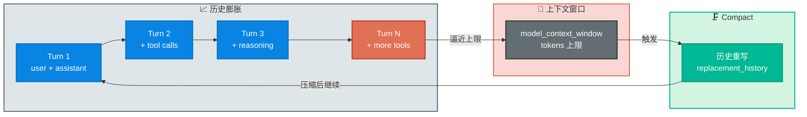

> 💡 **Key Point**
> Codex 里的 compact 本质上是"历史重写"——真正替换会话历史，并把替换后的历史持久化到 rollout 中，使后续 turn 和重启恢复都从压缩后的历史继续。而我遇到的 API 中转站有 warning、登录态没有 warning 的差异，正是因为这个"重写"过程走了两条完全不同的实现路径：local compact 和 remote compact。local compact 在完成后会无条件发射这条 warning（见 [compact.rs:227](https://github.com/openai/codex/blob/19702e190ebf16f789617ca5f16bfc373c238fe7/codex-rs/core/src/compact.rs#L227)），而 remote compact 没有。

---

## 2. 术语与核心模型

在深入实现之前，我先梳理一下源码中反复出现的核心概念。后面的分析会频繁用到这些术语，这里统一定义一次。

| 术语 | 定义 | 源码位置 |
|------|------|----------|
| `CompactedItem` | compact 结果的持久化载体，包含 `message`（可读摘要文本）和 `replacement_history`（替换后的历史序列） | [codex.rs:3358](https://github.com/openai/codex/blob/19702e190ebf16f789617ca5f16bfc373c238fe7/codex-rs/core/src/codex.rs#L3358) |
| `replacement_history` | compact 后替换原历史的新 `Vec<ResponseItem>` 序列，是后续所有 turn 的起点 | [compact.rs:197](https://github.com/openai/codex/blob/19702e190ebf16f789617ca5f16bfc373c238fe7/codex-rs/core/src/compact.rs#L197) |
| `rollout` | 会话事件的持久化日志，compact 检查点以 `RolloutItem::Compacted` 形式写入其中 | [codex.rs:3367](https://github.com/openai/codex/blob/19702e190ebf16f789617ca5f16bfc373c238fe7/codex-rs/core/src/codex.rs#L3367) |
| `InitialContextInjection` | 枚举，控制 compact 后是否/如何注入初始上下文。`DoNotInject` = 下轮重建；`BeforeLastUserMessage` = 当场插回 | [compact.rs:44](https://github.com/openai/codex/blob/19702e190ebf16f789617ca5f16bfc373c238fe7/codex-rs/core/src/compact.rs#L44) |
| contextual user fragment | 系统注入的伪 user message（AGENTS.md、skill 注入、环境上下文等），不是真实用户消息，compact 时会被过滤 | [contextual_user_message.rs:68](https://github.com/openai/codex/blob/19702e190ebf16f789617ca5f16bfc373c238fe7/codex-rs/core/src/contextual_user_message.rs#L68) |
| provider routing | 基于 `provider.is_openai()` 的 local/remote 分流决策，OpenAI provider 走 remote，其余走 local | [compact.rs:50](https://github.com/openai/codex/blob/19702e190ebf16f789617ca5f16bfc373c238fe7/codex-rs/core/src/compact.rs#L50) |

---

## 3. 端到端架构总览

术语定义好了，我先画一张全局图，把 compact 的完整链路看清楚：三条触发路径 → provider routing → 两条实现路径 → 统一落地。

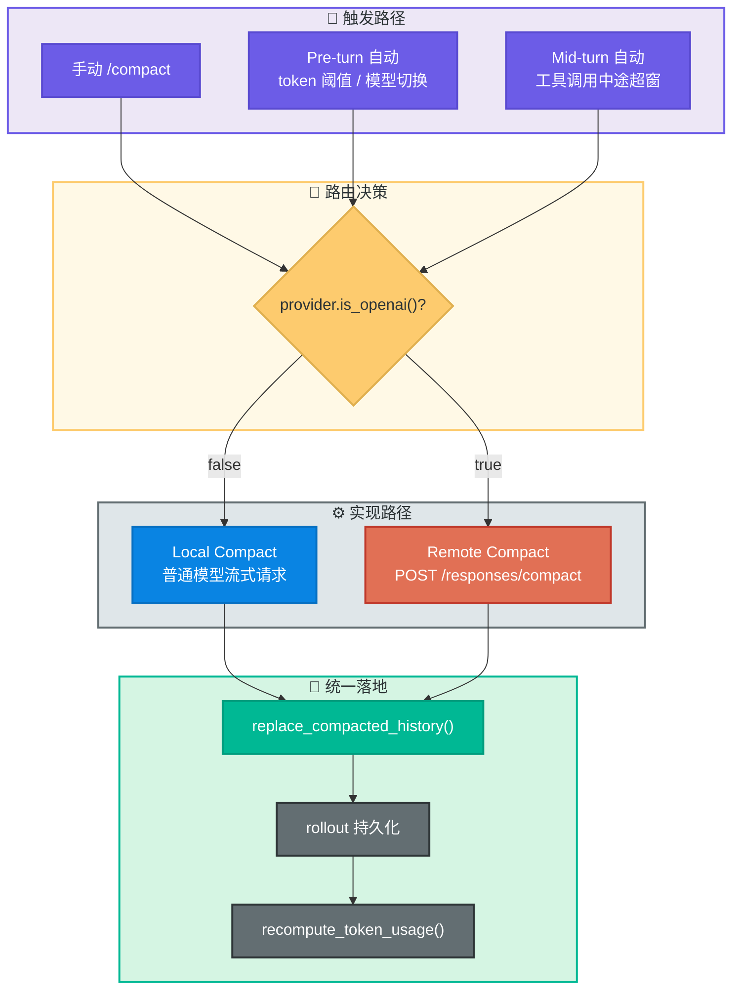

无论走哪条路径，最终都会调用 `replace_compacted_history()` 替换内存历史、写入 rollout、重算 token 估算。这是 compact 的不变量。全局图看完了，接下来我从触发条件开始，逐一拆解这条链路的每个环节。

---

## 4. 触发条件与入口

我在源码里找到了三条触发路径：手动触发、pre-turn 自动触发、mid-turn 自动触发。

### 4.1 手动 `/compact`

最直接的一条：用户手动执行 `/compact`。`handlers::compact(...)` 会创建一个新的 turn，把 compact prompt 作为合成的 `UserInput`，然后派发 `CompactTask`：

```rust
// codex.rs:4832
pub async fn compact(sess: &Arc<Session>, sub_id: String) {
    let turn_context = sess.new_default_turn_with_sub_id(sub_id).await;
    sess.spawn_task(
        Arc::clone(&turn_context),
        vec![UserInput::Text {
            text: turn_context.compact_prompt().to_string(),
            text_elements: Vec::new(),
        }],
        CompactTask,
    )
    .await;
}
```

见 [codex.rs:4832](https://github.com/openai/codex/blob/19702e190ebf16f789617ca5f16bfc373c238fe7/codex-rs/core/src/codex.rs#L4832)。

### 4.2 Pre-turn 自动触发

正常对话时，`run_turn(...)` 会在每轮真正采样之前调用 `run_pre_sampling_compact(...)`，见 [codex.rs:5862](https://github.com/openai/codex/blob/19702e190ebf16f789617ca5f16bfc373c238fe7/codex-rs/core/src/codex.rs#L5862)。

我发现它在两种情况下触发：

1. 当前累计 token 已经达到 `auto_compact_token_limit`
2. 线程准备从一个更大上下文窗口的模型切换到一个更小窗口的模型，而且当前历史对新模型来说已经太大

后一种专门走 `maybe_run_previous_model_inline_compact(...)`，见 [codex.rs:5891](https://github.com/openai/codex/blob/19702e190ebf16f789617ca5f16bfc373c238fe7/codex-rs/core/src/codex.rs#L5891)。它会用旧模型的 turn context 来执行 compact，确保压缩时使用的是旧模型的上下文窗口参数。

### 4.3 Mid-turn 自动触发

如果本轮采样后还需要 follow-up（比如工具调用后继续推理），而且累计 token 已经触发阈值，Codex 会在当前 turn 中途执行 compact，再继续后续推理：

```rust
// codex.rs:5693
if token_limit_reached && needs_follow_up {
    if run_auto_compact(
        &sess,
        &turn_context,
        InitialContextInjection::BeforeLastUserMessage,
    )
    .await
    .is_err()
    {
        return None;
    }
    continue;
}
```

见 [codex.rs:5693](https://github.com/openai/codex/blob/19702e190ebf16f789617ca5f16bfc373c238fe7/codex-rs/core/src/codex.rs#L5693)。注意这里使用的是 `InitialContextInjection::BeforeLastUserMessage`，而不是 `DoNotInject`——这是 mid-turn compact 的关键区别，§9 会详细解释。

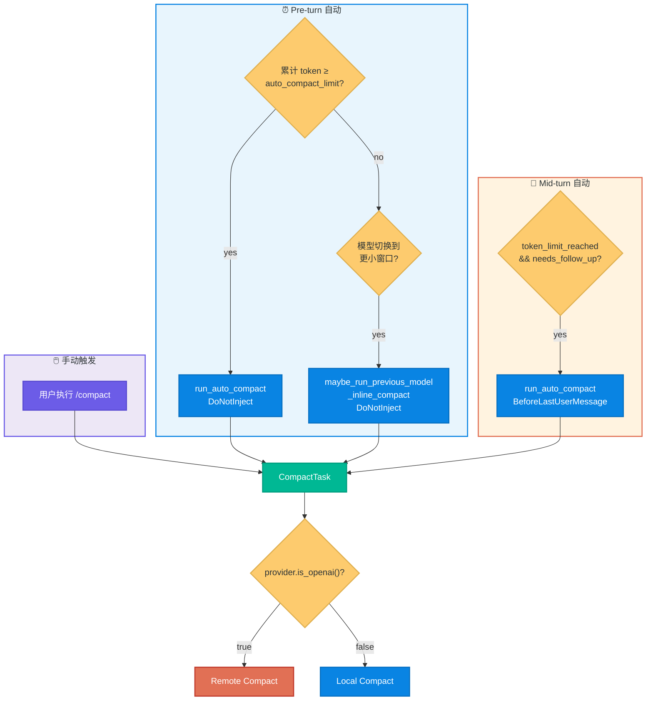

---

## 5. 路由决策机制

### 5.1 分流标准：看 provider，不看"登录态"

这一点是我最初最容易搞混的。Codex 是否走 remote compact，不是看"现在是不是 ChatGPT 登录态"，而是看 provider 是否被识别为 OpenAI provider。判断逻辑只有一行：

```rust
// compact.rs:50
pub(crate) fn should_use_remote_compact_task(provider: &ModelProviderInfo) -> bool {
    provider.is_openai()
}
```

见 [compact.rs:50](https://github.com/openai/codex/blob/19702e190ebf16f789617ca5f16bfc373c238fe7/codex-rs/core/src/compact.rs#L50)。

`is_openai()` 的实现也很直接——就是 provider 名字是否为 `"openai"`：

```rust
// model_provider_info.rs:277
pub fn is_openai(&self) -> bool {
    self.name == OPENAI_PROVIDER_NAME
}
```

见 [model_provider_info.rs:277](https://github.com/openai/codex/blob/19702e190ebf16f789617ca5f16bfc373c238fe7/codex-rs/core/src/model_provider_info.rs#L277)。

`CompactTask` 在 [tasks/compact.rs:24](https://github.com/openai/codex/blob/19702e190ebf16f789617ca5f16bfc373c238fe7/codex-rs/core/src/tasks/compact.rs#L24) 里根据这个判断做分流，同时发射 telemetry counter 标记 `type=local` 或 `type=remote`。

### 5.2 上游 URL 和鉴权来源

真正和 auth mode 相关的是 remote compact 请求发到哪里：

- `AuthMode::Chatgpt` 时，默认 base URL 是 `https://chatgpt.com/backend-api/codex`
- 否则默认是 `https://api.openai.com/v1`

见 [model_provider_info.rs:164](https://github.com/openai/codex/blob/19702e190ebf16f789617ca5f16bfc373c238fe7/codex-rs/core/src/model_provider_info.rs#L164)。

Bearer token 的来源也不是固定登录态。`auth_provider_from_auth(...)` 会优先取 provider 绑定的 API key；只有没有 API key 时，才回退到登录态 token，见 [api_bridge.rs:167](https://github.com/openai/codex/blob/19702e190ebf16f789617ca5f16bfc373c238fe7/codex-rs/core/src/api_bridge.rs#L167)。

> 💡 **Key Point**
> "走 remote compact" 和 "用登录态还是 API key" 是两件不同的事。remote/local 的分流看 provider；上游 URL 和鉴权方式才看 auth mode 与 provider 配置。

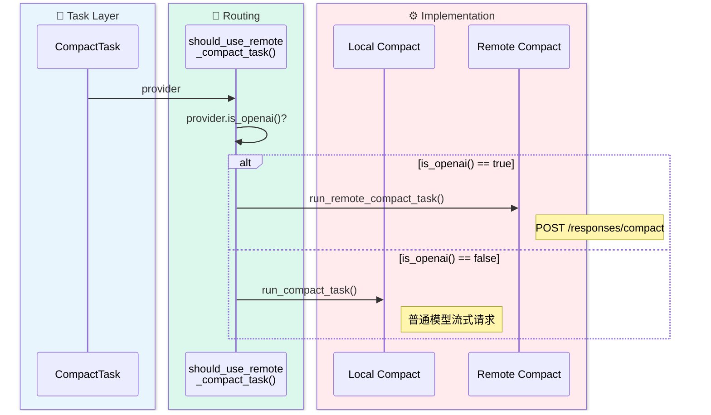

路由决策确定了走哪条路径。到这里我已经理解了"为什么 API 中转站走 local"——因为中转站的 provider 名字不是 `"openai"`。接下来分别深入两条实现路径的内部机制，先从 local compact 开始。

---

## 6. Local Compact 实现详解

### 6.1 入口与 prompt 模板

我先找到了 local compact 的入口，有两个：

- 手动 compact：`run_compact_task(...)`
- 自动 compact：`run_inline_auto_compact_task(...)`

两者最后都会进入 `run_compact_task_inner(...)`，见 [compact.rs:90](https://github.com/openai/codex/blob/19702e190ebf16f789617ca5f16bfc373c238fe7/codex-rs/core/src/compact.rs#L90)。

compact prompt 默认来自模板 [prompt.md](https://github.com/openai/codex/blob/19702e190ebf16f789617ca5f16bfc373c238fe7/codex-rs/core/templates/compact/prompt.md)，内容要求模型生成一个 handoff summary：

```markdown
You are performing a CONTEXT CHECKPOINT COMPACTION. Create a handoff summary
for another LLM that will resume the task.

Include:
- Current progress and key decisions made
- Important context, constraints, or user preferences
- What remains to be done (clear next steps)
- Any critical data, examples, or references needed to continue
```

如果配置里自定义了 compact prompt，则会覆盖默认模板，见 [codex.rs:950](https://github.com/openai/codex/blob/19702e190ebf16f789617ca5f16bfc373c238fe7/codex-rs/core/src/codex.rs#L950)。

### 6.2 普通模型流式请求——不走专用 endpoint

这是我追到的 local 和 remote 的根本差异。Local compact 不走专门的 compact endpoint，而是像普通对话一样，通过 `ModelClientSession::stream(...)` 发起一次常规模型请求。

`drain_to_completed(...)` 会持续消费流，见 [compact.rs:392](https://github.com/openai/codex/blob/19702e190ebf16f789617ca5f16bfc373c238fe7/codex-rs/core/src/compact.rs#L392)：

```rust
// compact.rs:418
match event {
    Ok(ResponseEvent::OutputItemDone(item)) => {
        sess.record_into_history(std::slice::from_ref(&item), turn_context).await;
    }
    Ok(ResponseEvent::Completed { token_usage, .. }) => {
        sess.update_token_usage_info(turn_context, token_usage.as_ref()).await;
        return Ok(());
    }
    // ...
}
```

换句话说，local compact 本质上就是"让模型用普通对话接口写一段总结"。

### 6.3 超窗裁剪循环

如果 compact prompt 加上完整历史本身就超过了上下文窗口，local compact 不会直接失败，而是进入一个裁剪-重试循环：

```rust
// compact.rs:154
Err(e @ CodexErr::ContextWindowExceeded) => {
    if turn_input_len > 1 {
        error!("Context window exceeded while compacting; removing oldest history item.");
        history.remove_first_item();
        truncated_count += 1;
        retries = 0;
        continue;
    }
    // ...
}
```

见 [compact.rs:154](https://github.com/openai/codex/blob/19702e190ebf16f789617ca5f16bfc373c238fe7/codex-rs/core/src/compact.rs#L154)。`remove_first_item()` 还会顺带清理和该 item 成对出现的对应项（如 call/output 配对），避免拆坏结构，见 [history.rs:151](https://github.com/openai/codex/blob/19702e190ebf16f789617ca5f16bfc373c238fe7/codex-rs/core/src/context_manager/history.rs#L151)。

> ⚠️ **Gotcha**
> Local compact 不是"拿完整历史总结"。如果 compact 请求本身都超窗，它会先从最旧处裁剪历史，直到 compact prompt 能发出去为止。这意味着模型可能只看到了历史的后半段。

### 6.4 摘要提取：最后一条 assistant 消息

Compact 请求结束后，Codex 从当前 turn 里提取最后一条 assistant 消息作为摘要正文，然后加上固定前缀 `SUMMARY_PREFIX`：

```rust
// compact.rs:191
let summary_suffix = get_last_assistant_message_from_turn(history_items).unwrap_or_default();
let summary_text = format!("{SUMMARY_PREFIX}\n{summary_suffix}");
```

见 [compact.rs:191](https://github.com/openai/codex/blob/19702e190ebf16f789617ca5f16bfc373c238fe7/codex-rs/core/src/compact.rs#L191)。

`SUMMARY_PREFIX` 来自 [summary_prefix.md](https://github.com/openai/codex/blob/19702e190ebf16f789617ca5f16bfc373c238fe7/codex-rs/core/templates/compact/summary_prefix.md)，语义很强：

> Another language model started to solve this problem and produced a summary of its thinking process. You also have access to the state of the tools that were used by that language model. Use this to build on the work that has already been done and avoid duplicating work.

这说明 local compact 生成的不是"给人看"的文章摘要，而是"给下一位模型接手"的 handoff prompt。

### 6.5 replacement history 重建

这是我认为 local compact 最核心的实现。它不会直接保留原历史，而是自己重建一份 replacement history。

`build_compacted_history_with_limit(...)` 的规则在 [compact.rs:337](https://github.com/openai/codex/blob/19702e190ebf16f789617ca5f16bfc373c238fe7/codex-rs/core/src/compact.rs#L337)：

1. 先从旧历史里收集真实 user messages，过滤掉旧 summary messages，见 [compact.rs:253](https://github.com/openai/codex/blob/19702e190ebf16f789617ca5f16bfc373c238fe7/codex-rs/core/src/compact.rs#L253)
2. 最多保留约 `20,000` token 的最近 user messages（`COMPACT_USER_MESSAGE_MAX_TOKENS`）
3. 从最新的 user message 开始倒着挑
4. 不够放时，会截断最后一条能塞进去的消息
5. 再把这些消息按原时间顺序放回
6. 最后追加一条新的 `role = "user"` 消息，其内容就是 `summary_text`

生成结果的形状像这样：

```text
旧历史: U1 A1 U2 A2 U3 A3 U4 A4 ... UN AN

新历史:
  U(N-2)          ← 最近的 user messages（20k token 限制内）
  U(N-1)
  UN
  U_summary       ← compact 生成的 handoff summary
```

### 6.6 summary 编码为 `role="user"` 的设计

这里是我读源码时最意外的一点：summary 被编码成一条 `role = "user"` 的消息：

```rust
// compact.rs:381
history.push(ResponseItem::Message {
    id: None,
    role: "user".to_string(),
    content: vec![ContentItem::InputText { text: summary_text }],
    end_turn: None,
    phase: None,
});
```

见 [compact.rs:381](https://github.com/openai/codex/blob/19702e190ebf16f789617ca5f16bfc373c238fe7/codex-rs/core/src/compact.rs#L381)。

这也是为什么后面 `insert_initial_context_before_last_real_user_or_summary(...)` 要特别区分"最后的真实 user message"和"伪装成 user message 的 summary"，见 [compact.rs:283](https://github.com/openai/codex/blob/19702e190ebf16f789617ca5f16bfc373c238fe7/codex-rs/core/src/compact.rs#L283)。

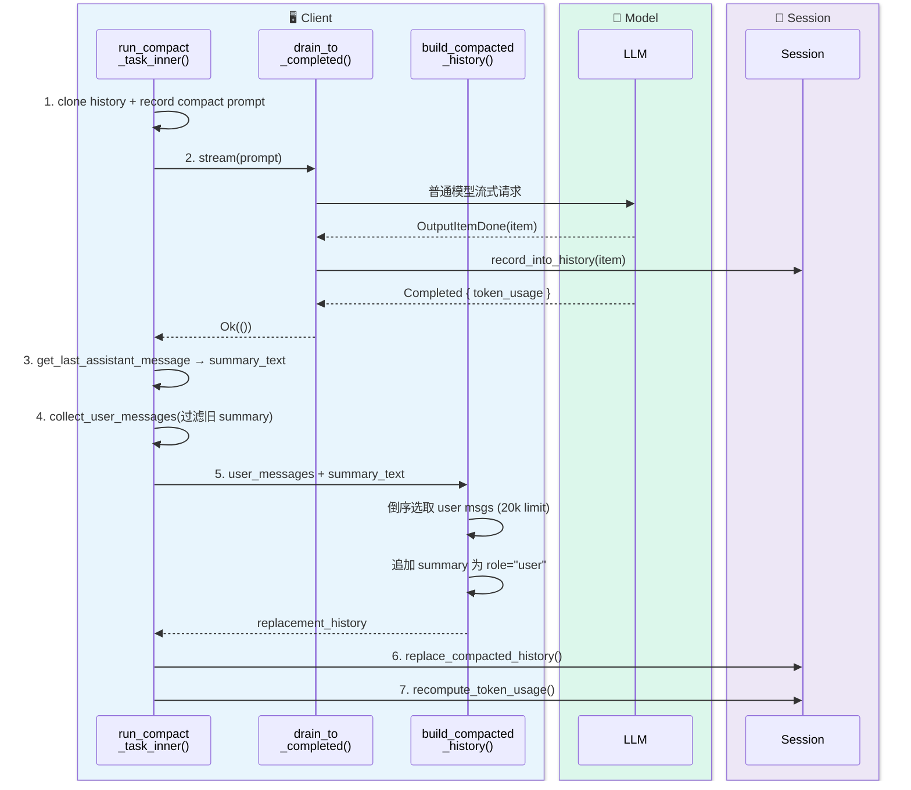

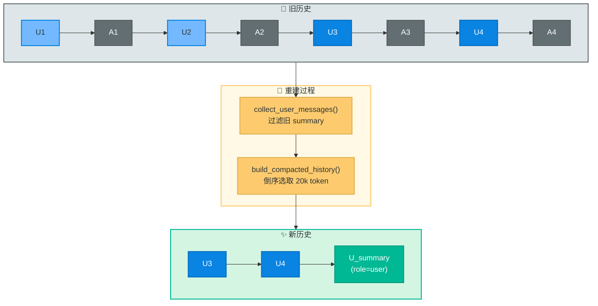

> 🤔 **Think About**
> 注意新历史中所有 assistant 消息（A1-A4）都被丢弃了。后续模型只能通过 `U_summary` 这段文本间接了解之前的推理过程和工具调用结果。这是 local compact 信息损失的根源，§8 会详细分析。读到这里我已经开始理解为什么 API 中转站的 compact 体验那么差了。

---

## 7. Remote Compact 实现详解

看完 local compact，我转向 remote compact。直觉告诉我，登录态体验好的原因一定藏在这条路径里。

### 7.1 入口与 Prompt 构造

Remote compact 的入口结构和 local 对称：

- 手动 compact：`run_remote_compact_task(...)`
- 自动 compact：`run_inline_remote_auto_compact_task(...)`

二者最后都会进入 `run_remote_compact_task_inner_impl(...)`，见 [compact_remote.rs:68](https://github.com/openai/codex/blob/19702e190ebf16f789617ca5f16bfc373c238fe7/codex-rs/core/src/compact_remote.rs#L68)。

Remote compact 发送前会构造一个完整 `Prompt`，其中不只是历史，还包括工具可见面、基础指令和推理配置：

```rust
// compact_remote.rs:108
let prompt = Prompt {
    input: prompt_input,
    tools: tool_router.model_visible_specs(),
    parallel_tool_calls: turn_context.model_info.supports_parallel_tool_calls,
    base_instructions,
    personality: turn_context.personality,
    output_schema: None,
};
```

见 [compact_remote.rs:98](https://github.com/openai/codex/blob/19702e190ebf16f789617ca5f16bfc373c238fe7/codex-rs/core/src/compact_remote.rs#L98)。这让我意识到 remote compact 不是"把整个历史原样丢给服务端随便压"，而是仍然在带着当前工具可见面、基础指令和推理配置一起请求上游。

### 7.2 POST `/responses/compact` 协议

`CompactClient` POST 到 `"responses/compact"`，见 [endpoint/compact.rs:32](https://github.com/openai/codex/blob/19702e190ebf16f789617ca5f16bfc373c238fe7/codex-rs/codex-api/src/endpoint/compact.rs#L32)。

返回值是 `CompactHistoryResponse { output: Vec<ResponseItem> }`，见 [endpoint/compact.rs:62](https://github.com/openai/codex/blob/19702e190ebf16f789617ca5f16bfc373c238fe7/codex-rs/codex-api/src/endpoint/compact.rs#L62)。

### 7.3 `CompactionInput` 请求体

请求体结构定义在 [common.rs:22](https://github.com/openai/codex/blob/19702e190ebf16f789617ca5f16bfc373c238fe7/codex-rs/codex-api/src/common.rs#L22)：

```rust
pub struct CompactionInput<'a> {
    pub model: &'a str,
    pub input: &'a [ResponseItem],
    pub instructions: &'a str,
    pub tools: Vec<Value>,
    pub parallel_tool_calls: bool,
    pub reasoning: Option<Reasoning>,    // 推理深度配置
    pub text: Option<TextControls>,      // 输出详细程度配置
}
```

注意 `reasoning` 和 `text` 两个可选参数——它们允许控制压缩时的推理深度和输出详细程度。我在 local compact 那边没有看到类似的细粒度控制。

### 7.4 预发送裁剪：从尾部删 Codex-generated 项

这里我发现了一段 local 没有的预处理：`trim_function_call_history_to_fit_context_window(...)`，见 [compact_remote.rs:273](https://github.com/openai/codex/blob/19702e190ebf16f789617ca5f16bfc373c238fe7/codex-rs/core/src/compact_remote.rs#L273)。

```rust
// compact_remote.rs:283
while history
    .estimate_token_count_with_base_instructions(base_instructions)
    .is_some_and(|estimated_tokens| estimated_tokens > context_window)
{
    let Some(last_item) = history.raw_items().last() else { break; };
    if !is_codex_generated_item(last_item) { break; }
    if !history.remove_last_item() { break; }
    deleted_items += 1;
}
```

这个策略和 local 的"从最老的地方删"截然不同——我在这里第一次感受到两条路径的设计哲学差异：

| 维度 | Local compact | Remote compact |
|------|---------------|----------------|
| 裁剪方向 | 从最旧项开始删 | 从最新的 Codex-generated 尾部项开始删 |
| 裁剪对象 | 任何 history item | 只删 `is_codex_generated_item()` 为 true 的项 |
| 保护目标 | 保留最新上下文 | 保留用户上下文和早期对话 |

### 7.5 返回值处理：`Vec<ResponseItem>` 与 `compaction_summary`

Remote compact 的返回值不是单个字符串，而是 `Vec<ResponseItem>`。其中一种常见输出是：

```json
{
  "type": "compaction_summary",
  "encrypted_content": "..."
}
```

在协议层，`compaction_summary` 是 `ResponseItem::Compaction` 的别名，见 [models.rs:443](https://github.com/openai/codex/blob/19702e190ebf16f789617ca5f16bfc373c238fe7/codex-rs/protocol/src/models.rs#L443)：

```rust
#[serde(alias = "compaction_summary")]
Compaction {
    encrypted_content: String,
},
```

所以更准确的说法是：remote compact 常常会返回一个 opaque 的 compaction item，但接口层返回的本质是"压缩后的 transcript item 列表"。

### 7.6 客户端后过滤：`should_keep_compacted_history_item`

服务端返回的 compacted history 还要经过 `process_compacted_history(...)` 过滤，见 [compact_remote.rs:168](https://github.com/openai/codex/blob/19702e190ebf16f789617ca5f16bfc373c238fe7/codex-rs/core/src/compact_remote.rs#L168)。

我仔细看了过滤策略 `should_keep_compacted_history_item(...)`，见 [compact_remote.rs:205](https://github.com/openai/codex/blob/19702e190ebf16f789617ca5f16bfc373c238fe7/codex-rs/core/src/compact_remote.rs#L205)：

```rust
fn should_keep_compacted_history_item(item: &ResponseItem) -> bool {
    match item {
        ResponseItem::Message { role, .. } if role == "developer" => false,  // 丢弃
        ResponseItem::Message { role, .. } if role == "user" => {
            matches!(
                crate::event_mapping::parse_turn_item(item),
                Some(TurnItem::UserMessage(_) | TurnItem::HookPrompt(_))
            )  // 只保留真实 user message 和 hook prompt
        }
        ResponseItem::Message { role, .. } if role == "assistant" => true,   // 保留
        ResponseItem::Compaction { .. } => true,                              // 保留
        _ => false,  // reasoning, tool output, web search 等全部丢弃
    }
}
```

因此 remote compact 的结果不是"服务端给什么就原样落什么"。我梳理了一下，实际流程是：

1. 让服务端先给一份 compacted transcript
2. 客户端再按 Codex 自己的 transcript 语义过滤一遍
3. 必要时再 reinject canonical initial context

### 7.7 写回形态：空 message + replacement_history

Remote compact 最终也会调用 `replace_compacted_history(...)`，但写入的 `CompactedItem` 和 local 不同：

```rust
// compact_remote.rs:155
let compacted_item = CompactedItem {
    message: String::new(),                        // 空字符串！
    replacement_history: Some(new_history.clone()),
};
```

见 [compact_remote.rs:155](https://github.com/openai/codex/blob/19702e190ebf16f789617ca5f16bfc373c238fe7/codex-rs/core/src/compact_remote.rs#L155)。

`message` 为空意味着 remote compact 更依赖"完整 replacement history 持久化"，而不是依赖一段可读 summary 文本。

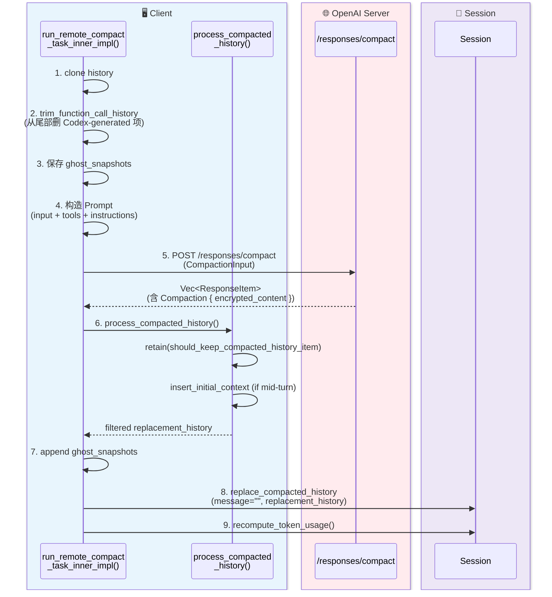

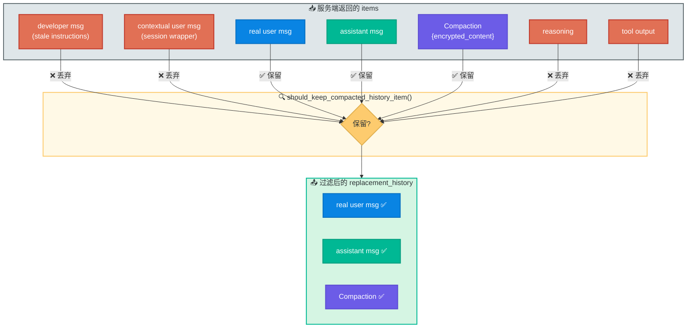

两条实现路径的内部机制已经拆解完毕。到这里我对两条路径各自怎么工作已经很清楚了，接下来把它们放在一起做架构层面的对比。

---

## 8. Local 与 Remote 的架构对比

§6 和 §7 分别拆解了两条实现路径的内部机制。现在我把它们放在一起，从架构层面对比根本性差异——这些差异直接解释了 §1 中我遇到的 API 中转站有 warning 而登录态没有的现象。

### 8.1 压缩能力：通用 API vs 专用 endpoint

Local compact 通过 `ModelClientSession::stream(...)` 发起普通对话请求（见 §6.2），模型不知道自己在做"压缩"，只是在回答一个要求写 handoff summary 的 prompt。摘要质量完全取决于当前 session 配置的模型能力——如果用的是较弱的模型或第三方 provider，摘要可能遗漏关键工具调用结果、错误总结决策、丢失约束条件。

Remote compact 走专用 `/responses/compact` endpoint（见 §7.2），服务端明确知道这是压缩任务，可以应用专门的压缩策略。`CompactionInput` 还支持 `reasoning` 和 `text` 参数控制推理深度和输出详细程度，见 [client.rs:372](https://github.com/openai/codex/blob/19702e190ebf16f789617ca5f16bfc373c238fe7/codex-rs/core/src/client.rs#L372)。Local compact 没有这种细粒度控制。

### 8.2 超窗裁剪策略：头部删除 vs 尾部删除

当历史超过上下文窗口时，两条路径的裁剪方向截然相反：

- Local compact 从最旧项开始删（`remove_first_item()`，见 §6.3），优先丢弃最早的对话上下文——往往包含任务定义、初始约束、用户偏好
- Remote compact 从尾部删 Codex-generated 项（`remove_last_item()` + `is_codex_generated_item()`，见 §7.4），只丢弃系统生成的中间结果，保留用户上下文和早期对话

```text
Local:  [U1 A1 U2 A2 ... UN AN] + compact_prompt
         ↑ 从这里开始删 → 丢失任务定义和初始约束

Remote: [U1 A1 U2 A2 ... UN AN]
                              ↑ 从这里开始删（只删 Codex-generated）→ 保留用户上下文
```

Remote 的设计哲学是：用户说的话比系统生成的中间结果更重要。

### 8.3 压缩产物：文本摘要 vs 结构化 transcript

Local compact 的 replacement history 只包含最近的 user messages（20k token 限制）+ 一段文本 summary。所有 assistant 消息、工具调用、推理过程全部丢弃（见 §6.5）。summary 还被编码为 `role="user"` 的消息（见 §6.6），导致语义错位——后续代码需要 `is_summary_message()` 前缀匹配和 4 级 fallback 逻辑来区分 summary 和真实 user message。

Remote compact 返回 `Vec<ResponseItem>`，可以包含 `Compaction { encrypted_content }`（opaque 压缩状态）、assistant 消息和 user 消息。`Compaction` 有专门的类型标识，不会和 user message 混淆。opaque 设计允许服务端使用任意内部表示（加密编码、结构化压缩、版本化格式、差分编码），给服务端留出最大的演进空间。

> 💡 **Key Point**
> 如果你想看"给人读的摘要"，local compact 更接近这个语义。如果你想做线程压缩和后续续接，remote compact 的 opaque `compaction_summary` 才是正常产物。

### 8.4 算法演进能力

Remote compact 的压缩逻辑在服务端，客户端只关心构造请求、发送请求、过滤返回、替换历史。OpenAI 可以随时改进压缩算法，客户端无需更新。

Local compact 的压缩逻辑硬编码在客户端（`compact.rs`）：`build_compacted_history_with_limit` 的 20k token 限制、`collect_user_messages` 的过滤规则、`drain_to_completed` 的流式收集——改动需要重新编译和分发。

### 8.5 完整对比表

| 维度 | Local compact | Remote compact |
|------|---------------|----------------|
| 分流条件 | `provider.is_openai() == false` | `provider.is_openai() == true` |
| 请求形式 | 普通模型流式请求 (`stream()`) | 专用 `POST /responses/compact` |
| 摘要来源 | 最后一条 assistant 回复 | 服务端返回的 compacted transcript |
| 历史重建者 | 客户端自己重建 (`build_compacted_history`) | 服务端先压缩，客户端再过滤 |
| 典型输出 | 文字 summary (role="user") + replacement history | `Compaction { encrypted_content }` + replacement history |
| 超窗处理 | 从最旧项开始删 (`remove_first_item`) | 从尾部删 Codex-generated 项 (`remove_last_item`) |
| `CompactedItem.message` | 有值（可读 summary） | 空字符串 |
| 信息保留度 | 低（只保留 user msgs + text summary） | 高（结构化 transcript + opaque state） |
| 算法演进 | 需要客户端更新 | 服务端独立演进 |
| 外部依赖 | 无（只需模型 API） | 依赖 OpenAI `/responses/compact` API 可用性 |

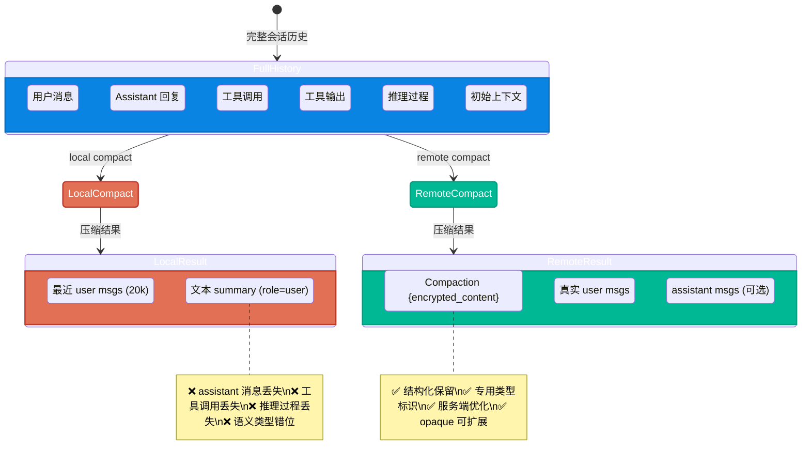

这张对比回答了 §1 中我的疑问：API 中转站走 local compact，每次完成后无条件弹出 warning，且信息保留度较低；登录态走 remote compact，专用 endpoint + 结构化返回 + 尾部裁剪，没有 warning，体验自然更好。但 compact 只是"压缩"这一步——压缩之后，系统如何恢复上下文、如何持久化会话状态，是我接下来要搞清楚的问题。

---

## 9. Compact 后的上下文恢复与会话持久化

Compact 后，`AGENTS.md`、`developer_instructions`、skill 这些约束还在吗？这是我在读完压缩逻辑后最关心的问题。答案是：分两类，机制完全不同。

### 9.1 AGENTS.md、skill 与 contextual user fragment

我首先想搞清楚的是：`AGENTS.md` 和 skill 注入的内容在 compact 后会怎样？

追了一圈源码后发现，这些内容在 Codex 内部都属于 **contextual user fragment**——系统注入的伪 user message，定义在 [contextual_user_message.rs:68](https://github.com/openai/codex/blob/19702e190ebf16f789617ca5f16bfc373c238fe7/codex-rs/core/src/contextual_user_message.rs#L68)。`parse_turn_item(...)` 会先检查 `role = "user"` 的 message 是不是 contextual fragment，如果是就不会当普通 `UserMessage` 解析（见 [event_mapping.rs:29](https://github.com/openai/codex/blob/19702e190ebf16f789617ca5f16bfc373c238fe7/codex-rs/core/src/event_mapping.rs#L29)）。

这直接影响 compact 的行为：两条路径都不会把 `AGENTS.md`/skill 片段当普通 user 历史带进 replacement history。那这些约束怎么恢复？答案在 baseline 重建机制里。

具体来说，`AGENTS.md` 在 session 启动时通过 `get_user_instructions(&config)` 拼入 `SessionConfiguration.user_instructions`，再由 `build_initial_context(...)` 包装成 `<INSTRUCTIONS>...</INSTRUCTIONS>` 格式注入（见 [project_doc.rs:77](https://github.com/openai/codex/blob/19702e190ebf16f789617ca5f16bfc373c238fe7/codex-rs/core/src/project_doc.rs#L77)、[codex.rs:3407](https://github.com/openai/codex/blob/19702e190ebf16f789617ca5f16bfc373c238fe7/codex-rs/core/src/codex.rs#L3407)）。而 skill 分两层：隐式的技能目录通过 `render_skills_section(...)` 拼进 developer message（见 [codex.rs:3506](https://github.com/openai/codex/blob/19702e190ebf16f789617ca5f16bfc373c238fe7/codex-rs/core/src/codex.rs#L3506)）；显式 mention 后注入的 `SKILL.md` 正文则是 turn-scoped 的，通过 `build_skill_injections(...)` 插进当前 turn（见 [injection.rs:24](https://github.com/openai/codex/blob/19702e190ebf16f789617ca5f16bfc373c238fe7/codex-rs/core/src/skills/injection.rs#L24)）。

### 9.2 compact 后的 baseline 重建机制

正常用户 turn 开始时，Codex 会先调用 `record_context_updates_and_set_reference_context_item(...)`，见 [codex.rs:3608](https://github.com/openai/codex/blob/19702e190ebf16f789617ca5f16bfc373c238fe7/codex-rs/core/src/codex.rs#L3608)：

```rust
let should_inject_full_context = reference_context_item.is_none();
let context_items = if should_inject_full_context {
    self.build_initial_context(turn_context).await
} else {
    self.build_settings_update_items(reference_context_item.as_ref(), turn_context).await
};
```

策略是：

- 如果 `reference_context_item.is_none()`（baseline 被清空），完整注入 `build_initial_context(...)`
- 如果 baseline 已经存在，只注入 settings diff，减少 token 开销

### 9.3 mid-turn vs pre-turn/manual 的注入策略差异

Compact 会控制这个 baseline：

**Pre-turn/manual compact**（`InitialContextInjection::DoNotInject`）：
- replacement history 里不主动 reinject 初始上下文
- `reference_context_item` 被清空（设为 `None`）
- 下一次真正的 regular turn 会重新完整注入 canonical initial context

**Mid-turn compact**（`InitialContextInjection::BeforeLastUserMessage`）：
- replacement history 必须把 canonical initial context 插回去
- 插入位置优先在最后一条真实 user message 之前
- 如果已经没有真实 user message，就插到 summary 或 compaction item 前面

规则写在 [compact.rs:283](https://github.com/openai/codex/blob/19702e190ebf16f789617ca5f16bfc373c238fe7/codex-rs/core/src/compact.rs#L283)。

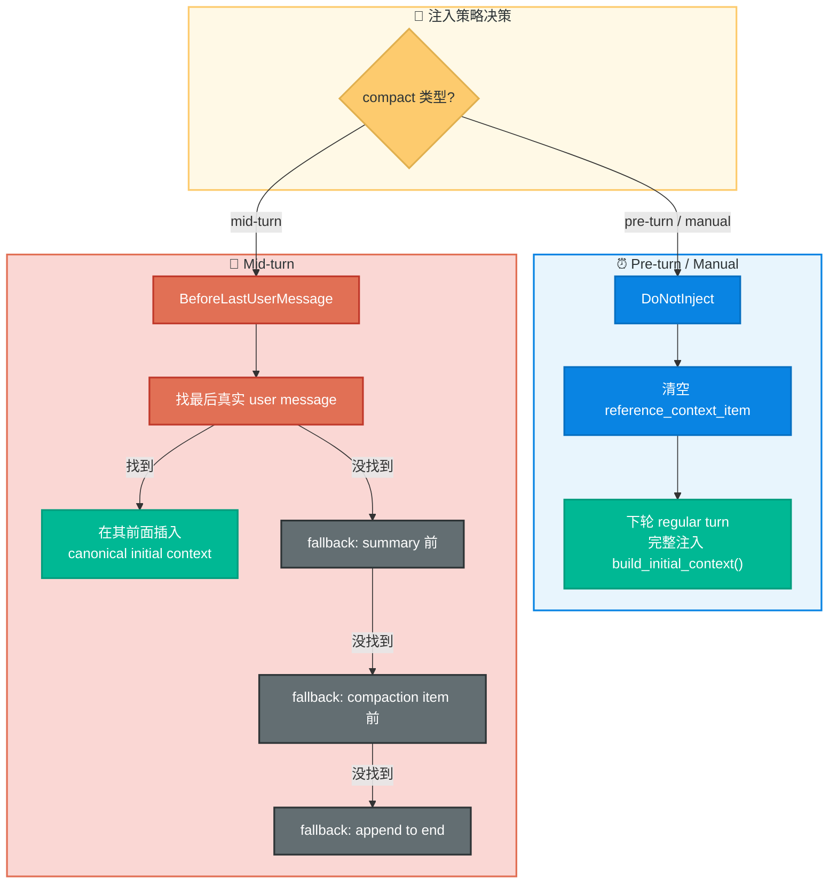

> 💡 **Key Point**
> `AGENTS.md` 和 `SKILL.md` 注入内容并不是靠"被 compact 摘要进普通聊天历史"来保留的。它们被系统明确当成 prompt scaffolding。compact 后能"记得"这些约束，是因为初始上下文重建机制会在下一轮重新注入。理解了这一点，我之前关于"compact 后约束丢失"的困惑也就解开了。

### 9.4 `replace_compacted_history` 与 Rollout 持久化

最后来看 compact 的真正落点——不是 UI，而是 rollout。无论 local 还是 remote，最终都会通过 `replace_compacted_history(...)`，见 [codex.rs:3358](https://github.com/openai/codex/blob/19702e190ebf16f789617ca5f16bfc373c238fe7/codex-rs/core/src/codex.rs#L3358)：

```rust
pub(crate) async fn replace_compacted_history(
    &self,
    items: Vec<ResponseItem>,
    reference_context_item: Option<TurnContextItem>,
    compacted_item: CompactedItem,
) {
    // 1. 替换内存中的历史
    self.replace_history(items, reference_context_item.clone()).await;
    // 2. 把 CompactedItem 记进 rollout
    self.persist_rollout_items(&[RolloutItem::Compacted(compacted_item)]).await;
    // 3. 如果有 reference_context_item，一起写入 rollout
    if let Some(turn_context_item) = reference_context_item {
        self.persist_rollout_items(&[RolloutItem::TurnContext(turn_context_item)]).await;
    }
}
```

Compact 结果被持久化为 rollout 中的 `RolloutItem::Compacted` 检查点。`CompactedItem` 包含 `message`（local compact 有值，remote 为空字符串）和 `replacement_history`（后续恢复的基线）。这个检查点是会话恢复的关键锚点。

会话恢复时，`reconstruct_history_from_rollout(...)` 会从最新到最旧扫描 rollout items，见 [rollout_reconstruction.rs:86](https://github.com/openai/codex/blob/19702e190ebf16f789617ca5f16bfc373c238fe7/codex-rs/core/src/codex/rollout_reconstruction.rs#L86)：

```rust
// rollout_reconstruction.rs:111
RolloutItem::Compacted(compacted) => {
    let active_segment = active_segment.get_or_insert_with(Default::default);
    if active_segment.base_replacement_history.is_none()
        && let Some(replacement_history) = &compacted.replacement_history
    {
        active_segment.base_replacement_history = Some(replacement_history);
        rollout_suffix = &rollout_items[index + 1..];
    }
}
```

逻辑是：

1. 从最新到最旧扫描 rollout items
2. 找到最新的 `Compacted` 检查点，取其 `replacement_history` 作为基线
3. 从检查点之后的 rollout items 继续正序回放
4. 处理 rollback（`ThreadRolledBack`）、turn context、ghost snapshots

所以 compact 后"还能接着聊"的原因不是某个内存状态没有丢，而是我追到的这个机制：

- compact 本身已经被持久化成一个历史检查点
- 后续重建线程时，系统会从这个检查点继续回放

这也是为什么 compact 在 Codex 里属于会话结构修改，而不是一次普通模型调用。到这里，我对 compact 的完整生命周期——从触发、路由、压缩、落地到恢复——已经全部追完了。

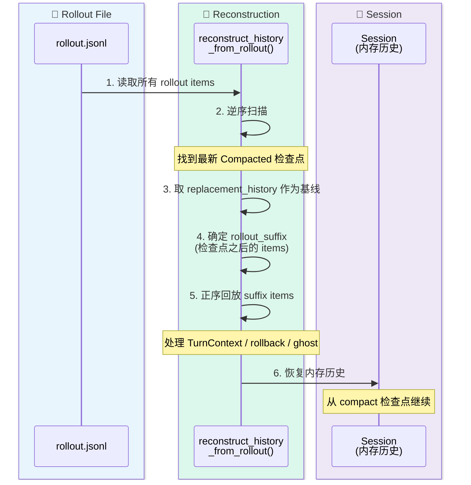

---

## 10. 常见误区与 Troubleshooting

### 10.1 常见误区

在整个探索过程中，我踩过或差点踩过几个坑，这里记录下来。

**误区 1："remote compact 看的是登录态"**

实际看的是 `provider.is_openai()`，见 [compact.rs:50](https://github.com/openai/codex/blob/19702e190ebf16f789617ca5f16bfc373c238fe7/codex-rs/core/src/compact.rs#L50)。登录态只影响 base URL 和鉴权方式，不影响 local/remote 的分流。

**误区 2："`/responses/compact` 返回的是给人读的摘要"**

实际返回的是可续接的 compacted state，允许 opaque。`compaction_summary` 里的 `encrypted_content` 不是"加密的摘要文本"，而是服务端的内部表示，客户端应该原样传回。

**误区 3："compact 后 AGENTS.md 约束会丢失"**

`AGENTS.md` 属于 session baseline，compact 后会通过初始上下文重建机制继续存在。但显式 mention 后注入的 `SKILL.md` 正文属于 turn-scoped scaffolding，compact 后通常不会作为普通历史原样保留。

### 10.2 Troubleshooting

**场景 1：compact 后模型"忘记"了之前的约束**

- 区分 compact 类型：pre-turn/manual compact 会清空 baseline，下轮自动重建（见 §9.3）；mid-turn compact 应该已经 reinject
- 如果是 mid-turn compact 后丢失，检查 `insert_initial_context_before_last_real_user_or_summary()` 的插入位置是否正确

**场景 2：compact 后 token 估算仍然很高**

- 检查 local compact 是否因为超窗裁剪导致 compact prompt 本身就在一个很小的历史子集上运行
- 查看 `remove_first_item` 被调用了多少次（日志中会有 `"Trimmed N older thread item(s)"` 提示）
- 检查 replacement history 中保留了多少 user messages（受 `COMPACT_USER_MESSAGE_MAX_TOKENS = 20_000` 限制）
- 考虑切换到支持 remote compact 的 OpenAI provider

---

## 回顾

从最初 API 中转站 compact 后总是弹出 warning 的困惑出发，我一路追进 Codex 源码，最终拼出了完整的图景：那条 warning 只在 local compact 路径无条件触发（`compact.rs:227`），remote compact 完全没有。而这只是冰山一角——两条路径在压缩能力、裁剪策略、产物形态和可演进性上都有根本性差异。compact 不是一个简单的"压缩"操作，而是一套涉及触发、路由、压缩、过滤、历史重写、上下文恢复和会话持久化的完整机制。

对于和我一样使用 API 中转站的用户，理解这个差异至少能帮助做出更明智的选择：要么接受 local compact 的局限并通过自定义 compact prompt 尽量缓解，要么在关键任务中切换到 OpenAI 原生 provider 以获得 remote compact 的体验。

---

## Code Index

所有链接基于 commit [`19702e1`](https://github.com/openai/codex/commit/19702e190ebf16f789617ca5f16bfc373c238fe7)。

### 触发与路由

| 主题 | 文件 |
|------|------|
| manual compact 入口 | [codex.rs:4832](https://github.com/openai/codex/blob/19702e190ebf16f789617ca5f16bfc373c238fe7/codex-rs/core/src/codex.rs#L4832) |
| pre-turn auto compact 入口 | [codex.rs:5862](https://github.com/openai/codex/blob/19702e190ebf16f789617ca5f16bfc373c238fe7/codex-rs/core/src/codex.rs#L5862) |
| mid-turn auto compact | [codex.rs:5693](https://github.com/openai/codex/blob/19702e190ebf16f789617ca5f16bfc373c238fe7/codex-rs/core/src/codex.rs#L5693) |
| 模型切换 compact | [codex.rs:5891](https://github.com/openai/codex/blob/19702e190ebf16f789617ca5f16bfc373c238fe7/codex-rs/core/src/codex.rs#L5891) |
| manual/auto 分流 (CompactTask) | [tasks/compact.rs:24](https://github.com/openai/codex/blob/19702e190ebf16f789617ca5f16bfc373c238fe7/codex-rs/core/src/tasks/compact.rs#L24) |
| remote/local 判断条件 | [compact.rs:50](https://github.com/openai/codex/blob/19702e190ebf16f789617ca5f16bfc373c238fe7/codex-rs/core/src/compact.rs#L50) |
| run_auto_compact 统一入口 | [codex.rs:5930](https://github.com/openai/codex/blob/19702e190ebf16f789617ca5f16bfc373c238fe7/codex-rs/core/src/codex.rs#L5930) |

### Local Compact

| 主题 | 文件 |
|------|------|
| 主实现 run_compact_task_inner | [compact.rs:90](https://github.com/openai/codex/blob/19702e190ebf16f789617ca5f16bfc373c238fe7/codex-rs/core/src/compact.rs#L90) |
| 流式收集 drain_to_completed | [compact.rs:392](https://github.com/openai/codex/blob/19702e190ebf16f789617ca5f16bfc373c238fe7/codex-rs/core/src/compact.rs#L392) |
| 历史重建 build_compacted_history | [compact.rs:324](https://github.com/openai/codex/blob/19702e190ebf16f789617ca5f16bfc373c238fe7/codex-rs/core/src/compact.rs#L324) |
| user message 收集 | [compact.rs:253](https://github.com/openai/codex/blob/19702e190ebf16f789617ca5f16bfc373c238fe7/codex-rs/core/src/compact.rs#L253) |
| summary 判断 is_summary_message | [compact.rs:269](https://github.com/openai/codex/blob/19702e190ebf16f789617ca5f16bfc373c238fe7/codex-rs/core/src/compact.rs#L269) |
| 上下文注入位置规则 | [compact.rs:283](https://github.com/openai/codex/blob/19702e190ebf16f789617ca5f16bfc373c238fe7/codex-rs/core/src/compact.rs#L283) |
| compact prompt 模板 | [prompt.md](https://github.com/openai/codex/blob/19702e190ebf16f789617ca5f16bfc373c238fe7/codex-rs/core/templates/compact/prompt.md) |
| summary prefix 模板 | [summary_prefix.md](https://github.com/openai/codex/blob/19702e190ebf16f789617ca5f16bfc373c238fe7/codex-rs/core/templates/compact/summary_prefix.md) |

### Remote Compact

| 主题 | 文件 |
|------|------|
| 主实现 run_remote_compact_task_inner_impl | [compact_remote.rs:68](https://github.com/openai/codex/blob/19702e190ebf16f789617ca5f16bfc373c238fe7/codex-rs/core/src/compact_remote.rs#L68) |
| 结果过滤 process_compacted_history | [compact_remote.rs:168](https://github.com/openai/codex/blob/19702e190ebf16f789617ca5f16bfc373c238fe7/codex-rs/core/src/compact_remote.rs#L168) |
| 保留判断 should_keep_compacted_history_item | [compact_remote.rs:205](https://github.com/openai/codex/blob/19702e190ebf16f789617ca5f16bfc373c238fe7/codex-rs/core/src/compact_remote.rs#L205) |
| 预发送裁剪 trim_function_call_history | [compact_remote.rs:273](https://github.com/openai/codex/blob/19702e190ebf16f789617ca5f16bfc373c238fe7/codex-rs/core/src/compact_remote.rs#L273) |
| 请求调用 compact_conversation_history | [client.rs:342](https://github.com/openai/codex/blob/19702e190ebf16f789617ca5f16bfc373c238fe7/codex-rs/core/src/client.rs#L342) |
| HTTP endpoint CompactClient | [endpoint/compact.rs:32](https://github.com/openai/codex/blob/19702e190ebf16f789617ca5f16bfc373c238fe7/codex-rs/codex-api/src/endpoint/compact.rs#L32) |
| 请求体结构 CompactionInput | [common.rs:22](https://github.com/openai/codex/blob/19702e190ebf16f789617ca5f16bfc373c238fe7/codex-rs/codex-api/src/common.rs#L22) |
| 失败日志 log_remote_compact_failure | [compact_remote.rs:254](https://github.com/openai/codex/blob/19702e190ebf16f789617ca5f16bfc373c238fe7/codex-rs/core/src/compact_remote.rs#L254) |

### 上下文与恢复

| 主题 | 文件 |
|------|------|
| AGENTS.md 发现与 user instructions 组装 | [project_doc.rs:77](https://github.com/openai/codex/blob/19702e190ebf16f789617ca5f16bfc373c238fe7/codex-rs/core/src/project_doc.rs#L77) |
| user instructions 包装 | [user_instructions.rs:9](https://github.com/openai/codex/blob/19702e190ebf16f789617ca5f16bfc373c238fe7/codex-rs/core/src/instructions/user_instructions.rs#L9) |
| contextual fragment 定义 | [contextual_user_message.rs:68](https://github.com/openai/codex/blob/19702e190ebf16f789617ca5f16bfc373c238fe7/codex-rs/core/src/contextual_user_message.rs#L68) |
| contextual fragment 解析边界 | [event_mapping.rs:29](https://github.com/openai/codex/blob/19702e190ebf16f789617ca5f16bfc373c238fe7/codex-rs/core/src/event_mapping.rs#L29) |
| 初始上下文构造 build_initial_context | [codex.rs:3407](https://github.com/openai/codex/blob/19702e190ebf16f789617ca5f16bfc373c238fe7/codex-rs/core/src/codex.rs#L3407) |
| baseline 注入与 diff | [codex.rs:3608](https://github.com/openai/codex/blob/19702e190ebf16f789617ca5f16bfc373c238fe7/codex-rs/core/src/codex.rs#L3608) |
| 替换历史与 rollout 持久化 | [codex.rs:3358](https://github.com/openai/codex/blob/19702e190ebf16f789617ca5f16bfc373c238fe7/codex-rs/core/src/codex.rs#L3358) |
| 会话重建 reconstruct_history_from_rollout | [rollout_reconstruction.rs:86](https://github.com/openai/codex/blob/19702e190ebf16f789617ca5f16bfc373c238fe7/codex-rs/core/src/codex/rollout_reconstruction.rs#L86) |

### 协议与配置

| 主题 | 文件 |
|------|------|
| compaction_summary 协议定义 | [models.rs:443](https://github.com/openai/codex/blob/19702e190ebf16f789617ca5f16bfc373c238fe7/codex-rs/protocol/src/models.rs#L443) |
| provider → base URL 映射 | [model_provider_info.rs:164](https://github.com/openai/codex/blob/19702e190ebf16f789617ca5f16bfc373c238fe7/codex-rs/core/src/model_provider_info.rs#L164) |
| is_openai() 判断 | [model_provider_info.rs:277](https://github.com/openai/codex/blob/19702e190ebf16f789617ca5f16bfc373c238fe7/codex-rs/core/src/model_provider_info.rs#L277) |
| API key / 登录态鉴权来源 | [api_bridge.rs:167](https://github.com/openai/codex/blob/19702e190ebf16f789617ca5f16bfc373c238fe7/codex-rs/core/src/api_bridge.rs#L167) |
| 隐式 skill 目录渲染 | [render.rs:5](https://github.com/openai/codex/blob/19702e190ebf16f789617ca5f16bfc373c238fe7/codex-rs/core/src/skills/render.rs#L5) |
| 显式 skill 注入 | [injection.rs:24](https://github.com/openai/codex/blob/19702e190ebf16f789617ca5f16bfc373c238fe7/codex-rs/core/src/skills/injection.rs#L24) |
