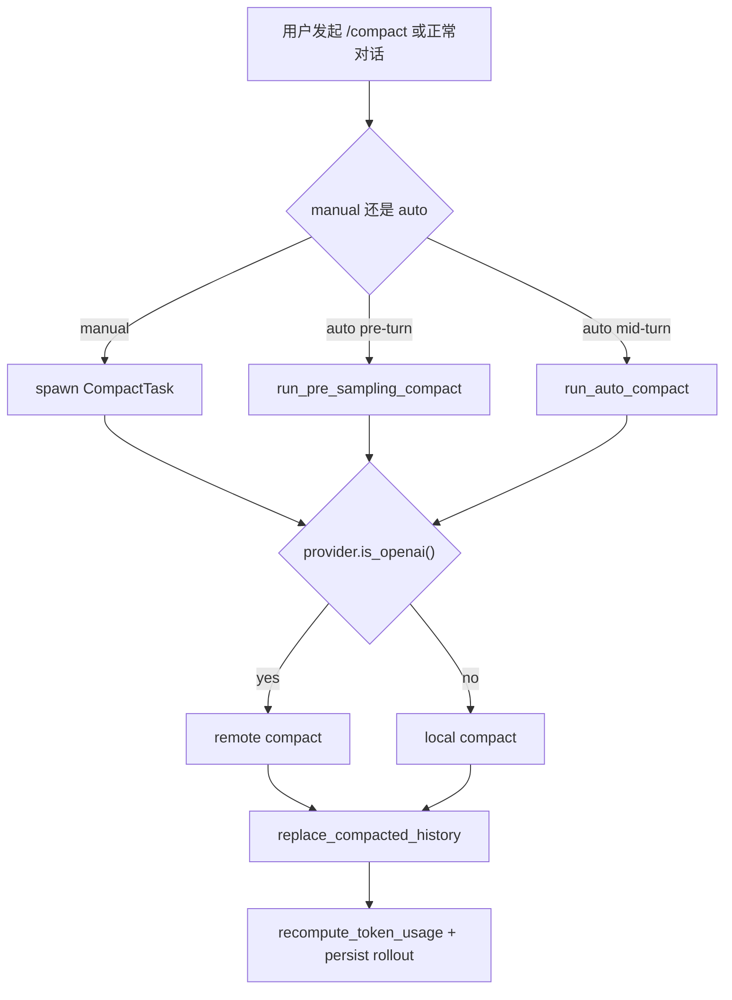

# Codex Compact 机制详解：本地压缩、远程压缩与会话续接

> **Code Version**: 基于 `openai/codex` commit `19702e190ebf16f789617ca5f16bfc373c238fe7`。  
> **讨论范围**: 只覆盖 Codex 的 compact 逻辑，包括 manual `/compact`、auto compact、local compact、remote compact，以及 compact 后的会话恢复。

## 1. 为什么 Codex 需要 compact

Codex 的问题不是“聊天记录太长不好看”，而是线程历史会不断膨胀，最终逼近模型的上下文窗口。

一旦历史过长，系统会面临两个直接问题：

- 新一轮请求可能在发送前就已经接近或超过上下文上限。
- 多工具、多轮推理线程里，大量旧消息会持续挤占最新问题的可见预算。

所以 compact 的目标不是简单“删旧消息”，而是把线程状态压缩成一个更短、但仍然可继续执行的历史表示。

> 💡 **Key Point**
> Codex 里的 compact 本质上是“历史重写”。
> 它不是给用户生成一段摘要就结束，而是会真正替换会话历史，并把替换后的历史持久化下来。

---

## 2. 入口在哪里：手动 compact 和自动 compact

Compact 有两条入口：手动触发和自动触发。

### 2.1 手动 `/compact`

当用户手动执行 compact 时，`handlers::compact(...)` 会创建一个新的 turn，把 compact prompt 作为合成的 `UserInput`，然后派发 `CompactTask`，见 [codex.rs](https://github.com/openai/codex/blob/19702e190ebf16f789617ca5f16bfc373c238fe7/codex-rs/core/src/codex.rs#L4832)。

任务真正执行时，会在 [tasks/compact.rs](https://github.com/openai/codex/blob/19702e190ebf16f789617ca5f16bfc373c238fe7/codex-rs/core/src/tasks/compact.rs#L24) 里根据 provider 做一次分流：

- `provider.is_openai()` 为真，走 remote compact
- 否则走 local compact

对应判断函数在 [compact.rs](https://github.com/openai/codex/blob/19702e190ebf16f789617ca5f16bfc373c238fe7/codex-rs/core/src/compact.rs#L50)。

### 2.2 自动 compact

正常对话时，compact 也可能自动发生，而且有两种时机。

第一种发生在本轮真正采样之前。`run_turn(...)` 会先调用 `run_pre_sampling_compact(...)`，见 [codex.rs](https://github.com/openai/codex/blob/19702e190ebf16f789617ca5f16bfc373c238fe7/codex-rs/core/src/codex.rs#L5380) 和 [codex.rs](https://github.com/openai/codex/blob/19702e190ebf16f789617ca5f16bfc373c238fe7/codex-rs/core/src/codex.rs#L5862)。

它会在两种情况下触发：

- 当前累计 token 已经达到 `auto_compact_token_limit`
- 线程准备从一个更大上下文窗口的模型切换到一个更小窗口的模型，而且当前历史对新模型来说已经太大

后一种专门走 `maybe_run_previous_model_inline_compact(...)`，见 [codex.rs](https://github.com/openai/codex/blob/19702e190ebf16f789617ca5f16bfc373c238fe7/codex-rs/core/src/codex.rs#L5891)。

第二种发生在本轮采样之后。如果这一轮还需要 follow-up，而且累计 token 已经触发阈值，Codex 会在当前 turn 中途执行 compact，再继续后续推理，见 [codex.rs](https://github.com/openai/codex/blob/19702e190ebf16f789617ca5f16bfc373c238fe7/codex-rs/core/src/codex.rs#L5693)。

这时会使用 `InitialContextInjection::BeforeLastUserMessage`，而不是普通的 `DoNotInject`。这是 local/remote 两条路径都共享的重要约束，定义在 [compact.rs](https://github.com/openai/codex/blob/19702e190ebf16f789617ca5f16bfc373c238fe7/codex-rs/core/src/compact.rs#L35)。

### 2.3 一个总流程图



---

## 3. 分流标准其实很简单：看 provider，不看“是不是登录态”

这一点最容易被误解。

Codex 是否走 remote compact，不是看“现在是不是 ChatGPT 登录态”，而是看 provider 是否被识别为 OpenAI provider。判断逻辑只有一行，见 [compact.rs](https://github.com/openai/codex/blob/19702e190ebf16f789617ca5f16bfc373c238fe7/codex-rs/core/src/compact.rs#L50)。

`ModelProviderInfo::is_openai()` 的实现也很直接，就是 provider 名字是否为 `openai`，见 [model_provider_info.rs](https://github.com/openai/codex/blob/19702e190ebf16f789617ca5f16bfc373c238fe7/codex-rs/core/src/model_provider_info.rs#L277)。

真正和 auth mode 相关的是 remote compact 请求发到哪里：

- `AuthMode::Chatgpt` 时，默认 base URL 是 `https://chatgpt.com/backend-api/codex`
- 否则默认是 `https://api.openai.com/v1`

见 [model_provider_info.rs](https://github.com/openai/codex/blob/19702e190ebf16f789617ca5f16bfc373c238fe7/codex-rs/core/src/model_provider_info.rs#L160)。

Bearer token 的来源也不是固定登录态。`auth_provider_from_auth(...)` 会优先取 provider 绑定的 API key；只有没有 API key 时，才回退到登录态 token，见 [api_bridge.rs](https://github.com/openai/codex/blob/19702e190ebf16f789617ca5f16bfc373c238fe7/codex-rs/core/src/api_bridge.rs#L167)。

> 💡 **Key Point**
> “走 remote compact” 和 “用登录态还是 API key” 是两件不同的事。
> remote/local 的分流看 provider；上游 URL 和鉴权方式才看 auth mode 与 provider 配置。

---

## 4. Local compact：本质是再开一轮普通推理，然后把最后一条 assistant 回复当摘要

### 4.1 入口与 prompt

Local compact 的入口有两个：

- 手动 compact：`run_compact_task(...)`
- 自动 compact：`run_inline_auto_compact_task(...)`

两者最后都会进入 [compact.rs](https://github.com/openai/codex/blob/19702e190ebf16f789617ca5f16bfc373c238fe7/codex-rs/core/src/compact.rs#L90) 的 `run_compact_task_inner(...)`。

compact prompt 默认来自模板 [prompt.md](https://github.com/openai/codex/blob/19702e190ebf16f789617ca5f16bfc373c238fe7/codex-rs/core/templates/compact/prompt.md#L1)，内容要求模型生成一个 handoff summary，重点包括：

- 当前进度与关键决策
- 重要上下文与约束
- 剩余待办
- 继续执行所需的关键数据和引用

如果配置里自定义了 compact prompt，则会覆盖默认模板，见 [codex.rs](https://github.com/openai/codex/blob/19702e190ebf16f789617ca5f16bfc373c238fe7/codex-rs/core/src/codex.rs#L950)。

### 4.2 Local compact 不调用 `/responses/compact`

这是 local 和 remote 的根本差异。

Local compact 不走专门的 compact endpoint，而是像普通对话一样，通过 `ModelClientSession::stream(...)` 发起一次常规模型请求，见 [compact.rs](https://github.com/openai/codex/blob/19702e190ebf16f789617ca5f16bfc373c238fe7/codex-rs/core/src/compact.rs#L392)。

`drain_to_completed(...)` 会持续消费流：

- 收到 `OutputItemDone(item)` 时，把 item 直接记入历史
- 收到 `Completed { token_usage, .. }` 时，更新 token usage 后返回

见 [compact.rs](https://github.com/openai/codex/blob/19702e190ebf16f789617ca5f16bfc373c238fe7/codex-rs/core/src/compact.rs#L418)。

换句话说，local compact 本质上就是“让模型用普通对话接口写一段总结”。

### 4.3 如果 compact prompt 自己都塞不下，会先裁历史

Local compact 在循环里每次都用当前 history 构造一个 `Prompt`，然后尝试发送，见 [compact.rs](https://github.com/openai/codex/blob/19702e190ebf16f789617ca5f16bfc373c238fe7/codex-rs/core/src/compact.rs#L116)。

如果模型返回 `ContextWindowExceeded`：

- 不是直接失败
- 而是删除最旧的一条 history item
- 然后重试

实现见 [compact.rs](https://github.com/openai/codex/blob/19702e190ebf16f789617ca5f16bfc373c238fe7/codex-rs/core/src/compact.rs#L154)。

删除动作调用的是 [history.rs](https://github.com/openai/codex/blob/19702e190ebf16f789617ca5f16bfc373c238fe7/codex-rs/core/src/context_manager/history.rs#L151) 的 `remove_first_item()`，它还会顺带清理和该 item 成对出现的对应项，避免把 call/output 这类配对结构拆坏。

> ⚠️ **Gotcha**
> Local compact 不是“拿完整历史总结”。
> 如果 compact 请求本身都超窗，它会先从最旧处裁剪历史，直到 compact prompt 能发出去为止。

### 4.4 真正的摘要来源：最后一条 assistant 消息

Compact 请求结束后，Codex 会从当前 turn 里提取最后一条 assistant 消息，作为摘要正文，见 [compact.rs](https://github.com/openai/codex/blob/19702e190ebf16f789617ca5f16bfc373c238fe7/codex-rs/core/src/compact.rs#L191)。

然后它会把这段摘要加上一个固定前缀 `SUMMARY_PREFIX`，组成 `summary_text`，见 [compact.rs](https://github.com/openai/codex/blob/19702e190ebf16f789617ca5f16bfc373c238fe7/codex-rs/core/src/compact.rs#L193)。

这个前缀模板在 [summary_prefix.md](https://github.com/openai/codex/blob/19702e190ebf16f789617ca5f16bfc373c238fe7/codex-rs/core/templates/compact/summary_prefix.md#L1)，语义很强：

- 另一位语言模型已经开始解决问题并留下摘要
- 你还能访问之前使用过的工具状态
- 请基于这段摘要继续，而不是重复劳动

这说明 local compact 生成的不是“给人看”的文章摘要，而是“给下一位模型接手”的 handoff prompt。

### 4.5 Local compact 如何重建 replacement history

这一段是 local compact 最核心的实现。

它不会直接保留原历史，而是自己重建一份 replacement history：

1. 先从旧历史里收集真实 user message，过滤掉旧 summary message，见 [compact.rs](https://github.com/openai/codex/blob/19702e190ebf16f789617ca5f16bfc373c238fe7/codex-rs/core/src/compact.rs#L253)
2. 再调用 `build_compacted_history(...)` 生成新历史，见 [compact.rs](https://github.com/openai/codex/blob/19702e190ebf16f789617ca5f16bfc373c238fe7/codex-rs/core/src/compact.rs#L197)

`build_compacted_history_with_limit(...)` 的规则在 [compact.rs](https://github.com/openai/codex/blob/19702e190ebf16f789617ca5f16bfc373c238fe7/codex-rs/core/src/compact.rs#L337)：

- 最多保留约 `20_000` token 的最近 user messages
- 从最新的 user message 开始倒着挑
- 不够放时，会截断最后一条能塞进去的消息
- 再把这些消息按原时间顺序放回
- 最后追加一条新的 `user` 消息，其内容就是 `summary_text`

生成结果的形状像这样：

```text
旧历史: U1 A1 U2 A2 U3 A3 U4 A4

新历史:
  U3
  U4
  U_summary
```

这里最不直观的一点是：**summary 被编码成一条 `role = "user"` 的消息**，见 [compact.rs](https://github.com/openai/codex/blob/19702e190ebf16f789617ca5f16bfc373c238fe7/codex-rs/core/src/compact.rs#L381)。

这也是为什么后面 `insert_initial_context_before_last_real_user_or_summary(...)` 要特别区分：

- 最后的真实 user message
- 伪装成 user message 的 summary

实现见 [compact.rs](https://github.com/openai/codex/blob/19702e190ebf16f789617ca5f16bfc373c238fe7/codex-rs/core/src/compact.rs#L283)。

### 4.6 Mid-turn compact 为什么要 reinject 初始上下文

Compact 有两种注入策略：

- `DoNotInject`
- `BeforeLastUserMessage`

定义在 [compact.rs](https://github.com/openai/codex/blob/19702e190ebf16f789617ca5f16bfc373c238fe7/codex-rs/core/src/compact.rs#L44)。

它们的区别不是“加不加系统 prompt”这么简单，而是下一轮基线如何恢复。

对于手动 compact 和 pre-turn compact：

- replacement history 里不主动 reinject 初始上下文
- `reference_context_item` 被清空
- 下一次真正的 regular turn 再完整注入 canonical initial context

对于 mid-turn compact：

- replacement history 必须把 canonical initial context 插回去
- 插入位置优先在最后一条真实 user message 之前
- 如果已经没有真实 user message，就插到 summary 或 compaction item 前面

规则写在 [compact.rs](https://github.com/openai/codex/blob/19702e190ebf16f789617ca5f16bfc373c238fe7/codex-rs/core/src/compact.rs#L273)。

这样做的原因也写在注释里：mid-turn compaction 之后，模型预期看到的是“summary 仍然处在历史尾部”的 prompt 形状。

### 4.7 最终提交：替换历史并持久化 rollout

Local compact 最后会调用 `replace_compacted_history(...)`，见 [compact.rs](https://github.com/openai/codex/blob/19702e190ebf16f789617ca5f16bfc373c238fe7/codex-rs/core/src/compact.rs#L221)。

这个函数做了三件事，见 [codex.rs](https://github.com/openai/codex/blob/19702e190ebf16f789617ca5f16bfc373c238fe7/codex-rs/core/src/codex.rs#L3358)：

- 替换内存中的历史
- 把 `CompactedItem` 记进 rollout
- 如果有 `reference_context_item`，一起写入 rollout

然后再调用 `recompute_token_usage(...)`，按新的 replacement history 重算 token 估算值，见 [compact.rs](https://github.com/openai/codex/blob/19702e190ebf16f789617ca5f16bfc373c238fe7/codex-rs/core/src/compact.rs#L223) 和 [codex.rs](https://github.com/openai/codex/blob/19702e190ebf16f789617ca5f16bfc373c238fe7/codex-rs/core/src/codex.rs#L3652)。

---

## 5. Remote compact：走专门的 `/responses/compact`，由服务端返回压缩后的 transcript

### 5.1 Remote compact 的任务入口

Remote compact 的入口和 local 对应：

- 手动 compact：`run_remote_compact_task(...)`
- 自动 compact：`run_inline_remote_auto_compact_task(...)`

二者最后都会进入 [compact_remote.rs](https://github.com/openai/codex/blob/19702e190ebf16f789617ca5f16bfc373c238fe7/codex-rs/core/src/compact_remote.rs#L51)。

### 5.2 它不是只返回一个“加密摘要”

Remote compact 调用的是 `ModelClientSession::compact_conversation_history(...)`，见 [compact_remote.rs](https://github.com/openai/codex/blob/19702e190ebf16f789617ca5f16bfc373c238fe7/codex-rs/core/src/compact_remote.rs#L117) 和 [client.rs](https://github.com/openai/codex/blob/19702e190ebf16f789617ca5f16bfc373c238fe7/codex-rs/core/src/client.rs#L342)。

在协议层，这个调用会 POST 到 `responses/compact`，见 [endpoint/compact.rs](https://github.com/openai/codex/blob/19702e190ebf16f789617ca5f16bfc373c238fe7/codex-rs/codex-api/src/endpoint/compact.rs#L32)。

请求体结构是 `CompactionInput`，包含：

- `model`
- `input`
- `instructions`
- `tools`
- `parallel_tool_calls`
- `reasoning`
- `text`

定义在 [common.rs](https://github.com/openai/codex/blob/19702e190ebf16f789617ca5f16bfc373c238fe7/codex-rs/codex-api/src/common.rs#L22)。

而返回值并不是单个字符串，而是 `Vec<ResponseItem>`，见 [endpoint/compact.rs](https://github.com/openai/codex/blob/19702e190ebf16f789617ca5f16bfc373c238fe7/codex-rs/codex-api/src/endpoint/compact.rs#L40)。

其中一种常见输出确实是：

- `ResponseItem::Compaction { encrypted_content }`

它在协议层也明确是 `compaction_summary` 的别名，见 [models.rs](https://github.com/openai/codex/blob/19702e190ebf16f789617ca5f16bfc373c238fe7/codex-rs/protocol/src/models.rs#L443)。

所以更准确的说法是：

- remote compact 常常会返回一个 opaque 的 compaction item
- 但接口层返回的本质是“压缩后的 transcript item 列表”
- 不应该把它误解成“只能返回一个加密摘要字符串”

### 5.3 Remote compact 发送前会先修剪一类历史

Remote compact 有一段 local 没有的预处理：`trim_function_call_history_to_fit_context_window(...)`，见 [compact_remote.rs](https://github.com/openai/codex/blob/19702e190ebf16f789617ca5f16bfc373c238fe7/codex-rs/core/src/compact_remote.rs#L273)。

它会在请求发出前检测当前历史是否已经超过 context window；如果超过，会优先从历史尾部删掉由 Codex 自己生成的项目，直到能塞进窗口，见 [compact_remote.rs](https://github.com/openai/codex/blob/19702e190ebf16f789617ca5f16bfc373c238fe7/codex-rs/core/src/compact_remote.rs#L283)。

这个策略和 local 的“从最老的地方删”不同：

- local compact 是为了先让 compact prompt 发得出去，所以删最旧项
- remote compact 是在已有 transcript 上做远程压缩，因此更偏向删掉最新的 Codex-generated 尾部噪音

### 5.4 Remote compact 构造的是完整 Prompt，而不是只发历史

Remote compact 发送前会构造一个完整 `Prompt`，其中包括：

- `input = history.for_prompt(...)`
- `tools = built_tools(...).model_visible_specs()`
- `parallel_tool_calls`
- `base_instructions`
- `personality`

见 [compact_remote.rs](https://github.com/openai/codex/blob/19702e190ebf16f789617ca5f16bfc373c238fe7/codex-rs/core/src/compact_remote.rs#L98)。

这意味着 remote compact 不是“把整个历史原样丢给服务端随便压”，而是仍然在带着当前工具可见面、基础指令和推理配置一起请求上游。

### 5.5 Remote compact 的上游 URL 和鉴权来源

`compact_conversation_history(...)` 内部会先通过 `current_client_setup()` 解析当前 provider 与 auth，再构造 `ApiCompactClient`，见 [client.rs](https://github.com/openai/codex/blob/19702e190ebf16f789617ca5f16bfc373c238fe7/codex-rs/core/src/client.rs#L353)。

这一步会复用常规请求的 provider/auth 决策：

- `Chatgpt` auth mode 默认走 `https://chatgpt.com/backend-api/codex`
- 其它 OpenAI 路径默认走 `https://api.openai.com/v1`

见 [model_provider_info.rs](https://github.com/openai/codex/blob/19702e190ebf16f789617ca5f16bfc373c238fe7/codex-rs/core/src/model_provider_info.rs#L164)。

Bearer token 则由 [api_bridge.rs](https://github.com/openai/codex/blob/19702e190ebf16f789617ca5f16bfc373c238fe7/codex-rs/core/src/api_bridge.rs#L167) 决定：

- 优先 provider API key
- 再退到 `experimental_bearer_token`
- 最后才是登录态 token

### 5.6 Remote compact 返回后不会原样全收

服务端返回的 compacted history 还要经过 `process_compacted_history(...)` 过滤，见 [compact_remote.rs](https://github.com/openai/codex/blob/19702e190ebf16f789617ca5f16bfc373c238fe7/codex-rs/core/src/compact_remote.rs#L168)。

过滤策略 `should_keep_compacted_history_item(...)` 非常关键，见 [compact_remote.rs](https://github.com/openai/codex/blob/19702e190ebf16f789617ca5f16bfc373c238fe7/codex-rs/core/src/compact_remote.rs#L205)：

- 丢弃 `developer` message
- `user` message 只保留真实 user message 和 hook prompt
- 保留 `assistant` message
- 保留 `ResponseItem::Compaction`
- 丢弃 reasoning、tool output、web search output 等大量非 transcript item

因此 remote compact 的结果不是“服务端给什么就原样落什么”，而是：

1. 让服务端先给一份 compacted transcript
2. 客户端再按 Codex 自己的 transcript 语义过滤一遍
3. 必要时再 reinject canonical initial context

### 5.7 Remote compact 最后的写回形态

Remote compact 最终也会调用 `replace_compacted_history(...)`，见 [compact_remote.rs](https://github.com/openai/codex/blob/19702e190ebf16f789617ca5f16bfc373c238fe7/codex-rs/core/src/compact_remote.rs#L159)。

和 local 不同的是，它写入的 `CompactedItem` 是：

- `message = ""`
- `replacement_history = Some(new_history.clone())`

见 [compact_remote.rs](https://github.com/openai/codex/blob/19702e190ebf16f789617ca5f16bfc373c238fe7/codex-rs/core/src/compact_remote.rs#L155)。

这意味着 remote compact 更依赖“完整 replacement history 持久化”，而不是依赖一段可读 summary 文本。

---

## 6. Local 和 Remote 到底有什么本质区别

下面这张表可以把核心差异压缩成一页：

| 维度 | Local compact | Remote compact |
|---|---|---|
| 分流条件 | `provider.is_openai() == false` | `provider.is_openai() == true` |
| 请求形式 | 普通模型流式请求 | 专门的 `POST /responses/compact` |
| 摘要来源 | 最后一条 assistant 回复 | 服务端返回的 compacted transcript |
| 历史重建者 | 客户端自己重建 | 服务端先压缩，客户端再过滤 |
| 典型输出 | 真实文字 summary + replacement history | 常见为 `ResponseItem::Compaction { encrypted_content }` + replacement history |
| 超窗处理 | 从最旧项开始删 | 优先删最新的 Codex-generated 尾部项 |
| `CompactedItem.message` | 有值 | 通常为空字符串 |
| 是否依赖服务端 compact 能力 | 否 | 是 |

> 💡 **Key Point**
> Local compact 是“客户端自己做压缩”；remote compact 是“服务端帮你压，再由客户端清洗并接管结果”。

---

## 7. `AGENTS.md`、developer instructions、skill 这些约束在 compact 后还在吗

短答案是：**分两类，机制完全不同。**

- `AGENTS.md`、`developer_instructions`、权限/沙箱策略、协作模式、隐式 skill 列表这类，属于 **可重建的初始上下文**
- 显式 mention 某个 skill 后注入的 `SKILL.md` 正文，属于 **turn-scoped contextual injection**

前者在 compact 后会被系统重新注入；后者通常不会被原样保留。

### 7.1 `AGENTS.md` 不是普通聊天历史，而是 `user_instructions`

Codex 启动 session 时，会先调用 `get_user_instructions(&config)`，把 `Config::user_instructions` 和发现到的 `AGENTS.md` 拼成一份统一的 user instructions，见 [project_doc.rs](https://github.com/openai/codex/blob/19702e190ebf16f789617ca5f16bfc373c238fe7/codex-rs/core/src/project_doc.rs#L77) 和 [codex.rs](https://github.com/openai/codex/blob/19702e190ebf16f789617ca5f16bfc373c238fe7/codex-rs/core/src/codex.rs#L486)。

这份内容会进入 `SessionConfiguration.user_instructions`，见 [codex.rs](https://github.com/openai/codex/blob/19702e190ebf16f789617ca5f16bfc373c238fe7/codex-rs/core/src/codex.rs#L568)。

随后，`build_initial_context(...)` 会把它包装成一个 contextual user message：

- `developer_sections` 里放 developer/policy/collaboration 等开发者约束
- `contextual_user_sections` 里放 `user_instructions` 和环境上下文

见 [codex.rs](https://github.com/openai/codex/blob/19702e190ebf16f789617ca5f16bfc373c238fe7/codex-rs/core/src/codex.rs#L3407)。

`UserInstructions` 实际上会被序列化成这样一段文本：

- 以 `# AGENTS.md instructions for ...` 开头
- 包在 `<INSTRUCTIONS>...</INSTRUCTIONS>` 里

见 [user_instructions.rs](https://github.com/openai/codex/blob/19702e190ebf16f789617ca5f16bfc373c238fe7/codex-rs/core/src/instructions/user_instructions.rs#L9)。

### 7.2 skill 也有两种，不要混在一起

Codex 里的 skill 需要分成两层理解。

第一层是 **初始上下文里的“可用技能目录和使用规则”**。  
`build_initial_context(...)` 会调用 `allowed_skills_for_implicit_invocation()` 和 `render_skills_section(...)`，把当前 session 可隐式使用的 skill 列表和规则拼进 developer message，见 [codex.rs](https://github.com/openai/codex/blob/19702e190ebf16f789617ca5f16bfc373c238fe7/codex-rs/core/src/codex.rs#L3506) 和 [render.rs](https://github.com/openai/codex/blob/19702e190ebf16f789617ca5f16bfc373c238fe7/codex-rs/core/src/skills/render.rs#L5)。

第二层是 **用户显式 mention 某个 skill 后，被注入的 `SKILL.md` 正文**。  
这部分通过 `build_skill_injections(...)` 从磁盘读出具体 skill 文件内容，再包装成 `ResponseItem` 插进当前 turn，见 [injection.rs](https://github.com/openai/codex/blob/19702e190ebf16f789617ca5f16bfc373c238fe7/codex-rs/core/src/skills/injection.rs#L24) 和 [codex.rs](https://github.com/openai/codex/blob/19702e190ebf16f789617ca5f16bfc373c238fe7/codex-rs/core/src/codex.rs#L5485)。

`SkillInstructions` 会被包装成 `<skill>...</skill>` 这种 contextual user fragment，见 [user_instructions.rs](https://github.com/openai/codex/blob/19702e190ebf16f789617ca5f16bfc373c238fe7/codex-rs/core/src/instructions/user_instructions.rs#L36)。

### 7.3 为什么说它们不是“普通历史”

关键在 `parse_turn_item(...)`。

对于 `role = "user"` 的 message，Codex 会先检查它是不是 contextual user fragment。如果是，就不会把它当普通 `UserMessage` 解析，见 [event_mapping.rs](https://github.com/openai/codex/blob/19702e190ebf16f789617ca5f16bfc373c238fe7/codex-rs/core/src/event_mapping.rs#L29)。

而 `AGENTS.md` 片段、`<skill>...</skill>`、环境上下文等都属于 contextual user fragment，定义在 [contextual_user_message.rs](https://github.com/openai/codex/blob/19702e190ebf16f789617ca5f16bfc373c238fe7/codex-rs/core/src/contextual_user_message.rs#L68)。

这会直接影响 compact：

- local compact 的 `collect_user_messages(...)` 依赖 `parse_turn_item(...)`，所以它只会收集“真实用户消息”，不会把 `AGENTS.md`/skill 片段当普通 user 历史带进 replacement history，见 [compact.rs](https://github.com/openai/codex/blob/19702e190ebf16f789617ca5f16bfc373c238fe7/codex-rs/core/src/compact.rs#L253) 和 [event_mapping.rs](https://github.com/openai/codex/blob/19702e190ebf16f789617ca5f16bfc373c238fe7/codex-rs/core/src/event_mapping.rs#L95)
- remote compact 的 `should_keep_compacted_history_item(...)` 同样只保留能被解析成真实 `UserMessage` 或 `HookPrompt` 的 user message，因此显式 skill payload 和 `AGENTS.md` 片段也不会原样保留，见 [compact_remote.rs](https://github.com/openai/codex/blob/19702e190ebf16f789617ca5f16bfc373c238fe7/codex-rs/core/src/compact_remote.rs#L205)

> 💡 **Key Point**
> `AGENTS.md` 和 `SKILL.md` 注入内容并不是靠“被 compact 摘要进普通聊天历史”来保留的。
> 它们被系统明确当成 prompt scaffolding，而不是普通对话文本。

### 7.4 那为什么 compact 后模型还“记得”这些约束

原因是 **Codex 依赖“初始上下文重建”而不是“历史原样保留”**。

正常用户 turn 开始时，Codex 会先调用 `record_context_updates_and_set_reference_context_item(...)`，见 [codex.rs](https://github.com/openai/codex/blob/19702e190ebf16f789617ca5f16bfc373c238fe7/codex-rs/core/src/codex.rs#L5407)。

它的策略是：

- 如果当前没有 baseline，也就是 `reference_context_item.is_none()`，就完整注入 `build_initial_context(...)`
- 如果 baseline 已经存在，就只注入 settings diff，减少 token 开销

见 [codex.rs](https://github.com/openai/codex/blob/19702e190ebf16f789617ca5f16bfc373c238fe7/codex-rs/core/src/codex.rs#L3608)。

而 compact 恰好会控制这个 baseline：

- **pre-turn/manual compact**
  - 把 `reference_context_item` 清空
  - 下一次 regular turn 会重新完整注入 canonical initial context
- **mid-turn compact**
  - 直接把 canonical initial context 插回 replacement history
  - 保证当前 turn 中途继续推理时，约束仍然在 prompt 里

这套逻辑分别在 [compact.rs](https://github.com/openai/codex/blob/19702e190ebf16f789617ca5f16bfc373c238fe7/codex-rs/core/src/compact.rs#L35) 和 [compact_remote.rs](https://github.com/openai/codex/blob/19702e190ebf16f789617ca5f16bfc373c238fe7/codex-rs/core/src/compact_remote.rs#L174)。

### 7.5 最准确的结论

所以这件事不能简单回答成“compact 后 skill/AGENTS 还在”或者“不在”。

更准确的说法是：

- `AGENTS.md`
- `developer_instructions`
- 权限/沙箱/协作模式
- 隐式 skill 目录与规则

这些属于 **session baseline**，compact 后会通过初始上下文重建机制继续存在。

而下面这些：

- 显式 mention 后注入的 `SKILL.md` 正文
- 一次性 plugin 能力注入
- 某些 turn-scoped contextual fragments

属于 **turn-scoped scaffolding**，compact 后通常不会作为普通历史原样保留。后续还能“记得”多少，取决于：

- local compact 的 handoff summary 有没有把关键约束写进去
- 或者下一轮是否重新显式 mention

---

## 8. 为什么 compact 后还能继续对话，甚至重启后也能恢复

Compact 的真正落点不是 UI，而是 rollout。

无论 local 还是 remote，最终都会通过 `replace_compacted_history(...)`：

- 替换当前 session 的内存历史
- 把 `RolloutItem::Compacted(compacted_item)` 记入 rollout
- 必要时再把 `RolloutItem::TurnContext(...)` 记进去

见 [codex.rs](https://github.com/openai/codex/blob/19702e190ebf16f789617ca5f16bfc373c238fe7/codex-rs/core/src/codex.rs#L3358)。

会话恢复时，`rollout_reconstruction` 会从最新的 `Compacted` 检查点向前回放，优先使用其中的 `replacement_history` 作为基线，见 [rollout_reconstruction.rs](https://github.com/openai/codex/blob/19702e190ebf16f789617ca5f16bfc373c238fe7/codex-rs/core/src/codex/rollout_reconstruction.rs#L111) 和 [rollout_reconstruction.rs](https://github.com/openai/codex/blob/19702e190ebf16f789617ca5f16bfc373c238fe7/codex-rs/core/src/codex/rollout_reconstruction.rs#L232)。

所以 compact 后“还能接着聊”的原因不是某个内存状态没有丢，而是：

- compact 本身已经被持久化成一个历史检查点
- 后续重建线程时，系统会从这个检查点继续回放

这也是为什么 compact 在 Codex 里属于会话结构修改，而不是一次普通模型调用。

---

## 9. 一个最容易踩坑的误区：`responses/compact` 不等于“给人读的摘要接口”

如果直接调用 `responses/compact`，你经常会看到类似：

- `object = "response.compaction"`
- `output = [{ "type": "compaction_summary", "encrypted_content": "..." }]`

这不是接口坏了，也不是服务端忘了给明文摘要。

它的设计语义就是：

- 返回可续接的 compacted state
- 这个 state 允许是 opaque 的
- 客户端应该把它当 transcript item 或续接状态使用

因此：

- 如果你想看“给人读的摘要”，local compact 更接近这个语义
- 如果你想做线程压缩和后续续接，remote compact 的 opaque `compaction_summary` 才是正常产物

---

## 10. 结论

Codex 的 compact 不是一个单一接口，而是一套会话重写机制。

它分成两条实现路线：

- **local compact**：把 compact 当成一次普通模型请求，客户端自己生成并重建 replacement history
- **remote compact**：把 transcript 送到专门的 `/responses/compact`，由服务端返回 compacted items，客户端再清洗并接管

两条路最后都会落到同一个目标：

- 替换当前历史
- 更新 token 估算
- 把 compact 结果写入 rollout
- 让后续 turn 和重启恢复都从 compact 后的历史继续

如果只看表面，compact 像是在“省 token”。但从实现上看，它真正做的是：

- 维持长线程可运行
- 让线程在模型切换和上下文逼近上限时仍然可续接
- 把“摘要”升级成一种正式的会话检查点

---

## 11. Code Index

| 主题 | 文件 |
|---|---|
| manual compact 入口 | [codex.rs](https://github.com/openai/codex/blob/19702e190ebf16f789617ca5f16bfc373c238fe7/codex-rs/core/src/codex.rs#L4832) |
| auto compact 入口 | [codex.rs](https://github.com/openai/codex/blob/19702e190ebf16f789617ca5f16bfc373c238fe7/codex-rs/core/src/codex.rs#L5862) |
| manual/auto remote-local 分流 | [tasks/compact.rs](https://github.com/openai/codex/blob/19702e190ebf16f789617ca5f16bfc373c238fe7/codex-rs/core/src/tasks/compact.rs#L24) |
| remote/local 判断条件 | [compact.rs](https://github.com/openai/codex/blob/19702e190ebf16f789617ca5f16bfc373c238fe7/codex-rs/core/src/compact.rs#L50) |
| local compact 主实现 | [compact.rs](https://github.com/openai/codex/blob/19702e190ebf16f789617ca5f16bfc373c238fe7/codex-rs/core/src/compact.rs#L90) |
| local compact 历史重建 | [compact.rs](https://github.com/openai/codex/blob/19702e190ebf16f789617ca5f16bfc373c238fe7/codex-rs/core/src/compact.rs#L324) |
| local compact 流式收集 | [compact.rs](https://github.com/openai/codex/blob/19702e190ebf16f789617ca5f16bfc373c238fe7/codex-rs/core/src/compact.rs#L392) |
| remote compact 主实现 | [compact_remote.rs](https://github.com/openai/codex/blob/19702e190ebf16f789617ca5f16bfc373c238fe7/codex-rs/core/src/compact_remote.rs#L68) |
| remote compact 结果过滤 | [compact_remote.rs](https://github.com/openai/codex/blob/19702e190ebf16f789617ca5f16bfc373c238fe7/codex-rs/core/src/compact_remote.rs#L168) |
| remote compact 请求调用 | [client.rs](https://github.com/openai/codex/blob/19702e190ebf16f789617ca5f16bfc373c238fe7/codex-rs/core/src/client.rs#L342) |
| compact endpoint 路径 | [endpoint/compact.rs](https://github.com/openai/codex/blob/19702e190ebf16f789617ca5f16bfc373c238fe7/codex-rs/codex-api/src/endpoint/compact.rs#L32) |
| compact 请求体结构 | [common.rs](https://github.com/openai/codex/blob/19702e190ebf16f789617ca5f16bfc373c238fe7/codex-rs/codex-api/src/common.rs#L22) |
| `compaction_summary` 协议定义 | [models.rs](https://github.com/openai/codex/blob/19702e190ebf16f789617ca5f16bfc373c238fe7/codex-rs/protocol/src/models.rs#L443) |
| provider 到 base URL 的映射 | [model_provider_info.rs](https://github.com/openai/codex/blob/19702e190ebf16f789617ca5f16bfc373c238fe7/codex-rs/core/src/model_provider_info.rs#L160) |
| API key / 登录态鉴权来源 | [api_bridge.rs](https://github.com/openai/codex/blob/19702e190ebf16f789617ca5f16bfc373c238fe7/codex-rs/core/src/api_bridge.rs#L167) |
| `AGENTS.md` 发现与 user instructions 组装 | [project_doc.rs](https://github.com/openai/codex/blob/19702e190ebf16f789617ca5f16bfc373c238fe7/codex-rs/core/src/project_doc.rs#L77) |
| `AGENTS.md` / skill 包装成 contextual fragments | [user_instructions.rs](https://github.com/openai/codex/blob/19702e190ebf16f789617ca5f16bfc373c238fe7/codex-rs/core/src/instructions/user_instructions.rs#L9) |
| contextual user fragment 定义 | [contextual_user_message.rs](https://github.com/openai/codex/blob/19702e190ebf16f789617ca5f16bfc373c238fe7/codex-rs/core/src/contextual_user_message.rs#L68) |
| 显式 skill 注入 | [injection.rs](https://github.com/openai/codex/blob/19702e190ebf16f789617ca5f16bfc373c238fe7/codex-rs/core/src/skills/injection.rs#L24) |
| 隐式 skill 目录渲染 | [render.rs](https://github.com/openai/codex/blob/19702e190ebf16f789617ca5f16bfc373c238fe7/codex-rs/core/src/skills/render.rs#L5) |
| 历史容器与裁剪 | [history.rs](https://github.com/openai/codex/blob/19702e190ebf16f789617ca5f16bfc373c238fe7/codex-rs/core/src/context_manager/history.rs#L29) |
| contextual fragment 与普通 user message 的解析边界 | [event_mapping.rs](https://github.com/openai/codex/blob/19702e190ebf16f789617ca5f16bfc373c238fe7/codex-rs/core/src/event_mapping.rs#L25) |
| 初始上下文构造与 baseline 注入 | [codex.rs](https://github.com/openai/codex/blob/19702e190ebf16f789617ca5f16bfc373c238fe7/codex-rs/core/src/codex.rs#L3407) |
| regular turn 如何建立 `reference_context_item` | [codex.rs](https://github.com/openai/codex/blob/19702e190ebf16f789617ca5f16bfc373c238fe7/codex-rs/core/src/codex.rs#L3608) |
| compact 后替换历史与 rollout 持久化 | [codex.rs](https://github.com/openai/codex/blob/19702e190ebf16f789617ca5f16bfc373c238fe7/codex-rs/core/src/codex.rs#L3358) |
| compact 后会话重建 | [rollout_reconstruction.rs](https://github.com/openai/codex/blob/19702e190ebf16f789617ca5f16bfc373c238fe7/codex-rs/core/src/codex/rollout_reconstruction.rs#L90) |

## References

- Compact prompt 模板: [prompt.md](https://github.com/openai/codex/blob/19702e190ebf16f789617ca5f16bfc373c238fe7/codex-rs/core/templates/compact/prompt.md)
- Summary prefix 模板: [summary_prefix.md](https://github.com/openai/codex/blob/19702e190ebf16f789617ca5f16bfc373c238fe7/codex-rs/core/templates/compact/summary_prefix.md)
