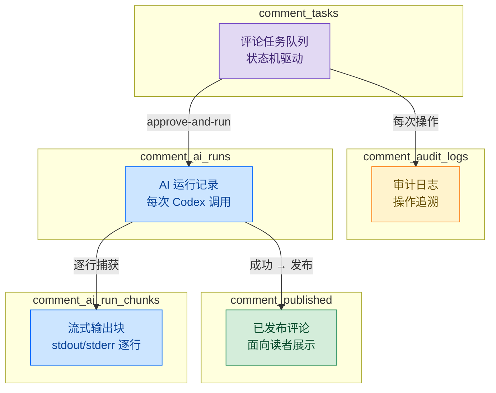
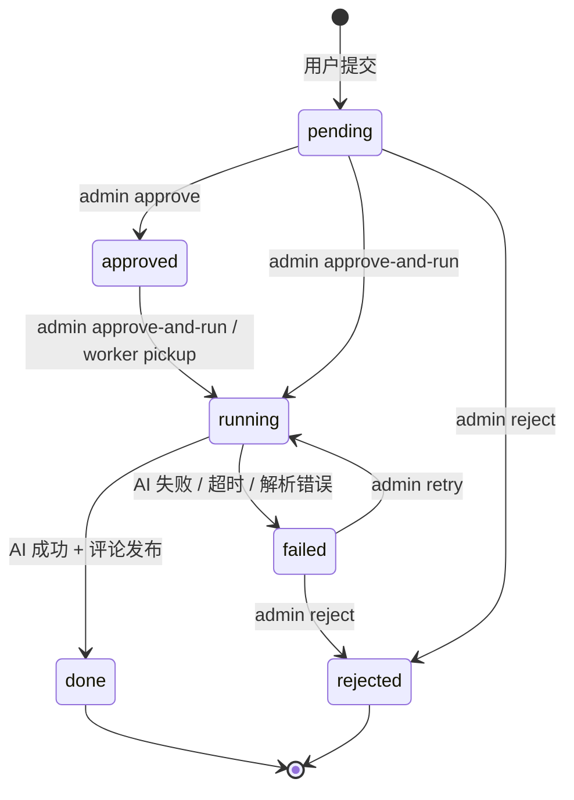
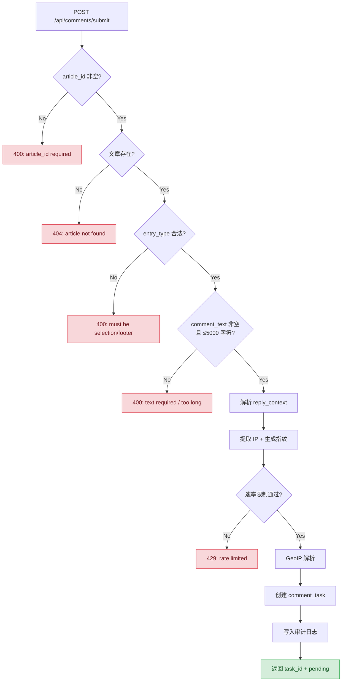
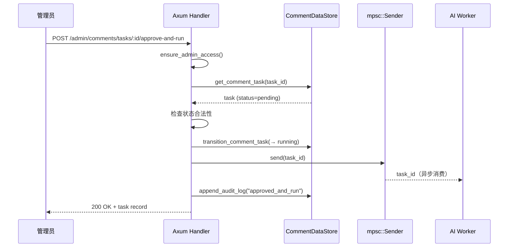
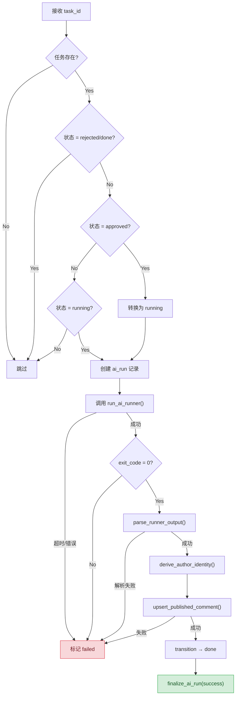
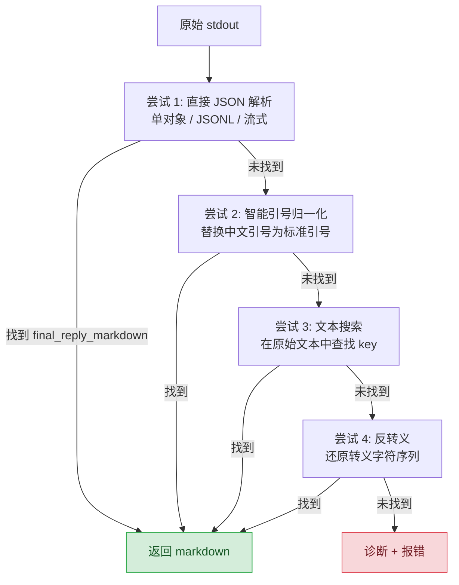

# 评论系统与 AI 回复全栈实现：从用户选中文本到 Codex 生成回复的完整链路

> **代码版本**：基于 StaticFlow 当前 `master` 分支。

## 1. 为什么要自建评论系统

个人博客接入 Disqus、Giscus 或 Gitalk，意味着把评论数据交给第三方平台，或者强制读者拥有 GitHub 账号。对于一个本地优先的知识管理系统来说，这些方案都不太合适：

- **隐私**：不想向第三方暴露读者的评论内容和浏览行为
- **门槛**：GitHub OAuth 登录对非技术读者是障碍
- **AI 增强**：希望每条评论都能获得基于文章内容的 AI 回复，第三方评论系统无法做到
- **数据所有权**：评论数据存储在本地 LanceDB，完全可控

StaticFlow 的设计目标是：**匿名评论 + 管理员审核 + AI 自动回复**。读者无需注册，提交评论后进入审核队列，管理员一键触发 AI 生成回复，审核通过后评论和 AI 回复同时发布。

### 1.1 两种评论入口

系统支持两种评论方式：

| 入口 | 触发方式 | 特点 |
|------|---------|------|
| **文本选择评论** (`selection`) | 选中文章段落后弹出评论按钮 | 精确锚定到段落，携带选中文本和上下文 |
| **页脚评论** (`footer`) | 文章底部评论区直接输入 | 通用评论，支持引用已有评论 |

> 📌 **本文范围**：覆盖从前端评论交互、后端验证与审核、AI Worker 异步处理、Codex 调用链、输出解析、SSE 流式推送到前端实时展示的完整链路。不涉及文章内容管理和搜索功能。

## 2. 数据流总览

一条评论从用户输入到最终展示，经过以下完整链路：


整个系统涉及 5 张 LanceDB 表、一个 tokio mpsc 异步队列、一个外部 Codex 进程和 SSE 流式推送。下面逐层拆解。

## 3. 数据模型设计

评论系统使用独立的 LanceDB 数据库（`lancedb-comments`），与文章内容数据库分离。共 5 张表，覆盖评论生命周期的每个阶段。

### 3.1 五张表总览



### 3.2 comment_tasks — 评论任务队列

核心表，驱动整个评论生命周期。Schema 定义 — `shared/src/comments_store.rs:855-886`：

| 字段 | 类型 | 说明 |
|------|------|------|
| `task_id` | Utf8 | 主键，格式 `cmt-{timestamp}-{random}` |
| `article_id` | Utf8 | 关联文章 ID |
| `entry_type` | Utf8 | `selection` 或 `footer` |
| `status` | Utf8 | 状态机：pending → approved → running → done/failed/rejected |
| `comment_text` | Utf8 | 用户评论内容（≤5000 字符） |
| `selected_text` | Utf8? | 选中的文章段落（仅 selection 类型） |
| `anchor_block_id` | Utf8? | 锚定的 DOM 块 ID（`data-sf-block-id`） |
| `anchor_context_before` | Utf8? | 选中文本前 120 字符上下文 |
| `anchor_context_after` | Utf8? | 选中文本后 120 字符上下文 |
| `reply_to_comment_id` | Utf8? | 引用的评论 ID（评论间回复） |
| `reply_to_comment_text` | Utf8? | 被引用评论的原文 |
| `reply_to_ai_reply_markdown` | Utf8? | 被引用评论的 AI 回复 |
| `client_ip` | Utf8 | 客户端 IP |
| `ip_region` | Utf8 | GeoIP 解析的地区 |
| `fingerprint` | Utf8 | SHA256(IP\|UA) 客户端指纹 |
| `ua` / `language` / `platform` / `timezone` / `viewport` / `referrer` | Utf8? | 客户端元数据 |
| `admin_note` | Utf8? | 管理员备注 |
| `failure_reason` | Utf8? | 失败原因 |
| `attempt_count` | Int32 | AI 运行尝试次数 |
| `created_at` / `updated_at` / `approved_at` / `completed_at` | Timestamp(ms) | 时间戳 |

**状态机**：



### 3.3 comment_published — 已发布评论

面向读者的最终展示数据。Schema — `shared/src/comments_store.rs:888-908`：

| 字段 | 类型 | 说明 |
|------|------|------|
| `comment_id` | Utf8 | 主键，格式 `cmt-{task_id}-{timestamp}` |
| `task_id` | Utf8 | 关联任务 ID |
| `article_id` | Utf8 | 关联文章 ID |
| `author_name` | Utf8 | 匿名作者名，如 `Reader-a3b2c1` |
| `author_avatar_seed` | Utf8 | 头像生成种子（指纹哈希前 10 位） |
| `author_hash` | Utf8 | SHA256(fingerprint:salt) 完整哈希 |
| `ai_reply_markdown` | Utf8 | AI 生成的 Markdown 回复 |
| `ip_region` | Utf8 | 地区标签 |
| `published_at` | Timestamp(ms) | 发布时间 |

> 💡 **Key Point**：`author_hash` 用于同一用户的评论关联（相同指纹 + salt 产生相同哈希），但无法反推出用户的 IP 或 UA。这是隐私友好的匿名身份方案。

### 3.4 comment_audit_logs — 审计日志

记录每次状态变更操作。Schema — `shared/src/comments_store.rs:910-920`：

| 字段 | 类型 | 说明 |
|------|------|------|
| `log_id` | Utf8 | 主键 |
| `task_id` | Utf8 | 关联任务 ID |
| `action` | Utf8 | 操作类型：created / approved_and_run / rejected / ... |
| `operator` | Utf8 | 操作者：system / admin |
| `before_json` / `after_json` | Utf8? | 变更前后的任务快照（JSON 序列化） |
| `created_at` | Timestamp(ms) | 操作时间 |

### 3.5 comment_ai_runs / comment_ai_run_chunks — AI 运行记录

`comment_ai_runs` 记录每次 Codex 调用的元信息 — `shared/src/comments_store.rs:922-937`：

| 字段 | 类型 | 说明 |
|------|------|------|
| `run_id` | Utf8 | 主键，格式 `airun-{task_id}-{timestamp}` |
| `task_id` | Utf8 | 关联任务 ID |
| `status` | Utf8 | running / success / failed |
| `runner_program` | Utf8 | 执行程序（默认 `bash`） |
| `runner_args_json` | Utf8 | 执行参数 JSON |
| `skill_path` | Utf8 | AI Skill 文件路径 |
| `exit_code` | Int32? | 进程退出码 |
| `final_reply_markdown` | Utf8? | 最终提取的回复 |
| `failure_reason` | Utf8? | 失败原因 |

`comment_ai_run_chunks` 逐行捕获 Codex 进程的 stdout/stderr — `shared/src/comments_store.rs:939-949`：

| 字段 | 类型 | 说明 |
|------|------|------|
| `chunk_id` | Utf8 | 主键，格式 `{run_id}-{batch_index}` |
| `run_id` | Utf8 | 关联运行 ID |
| `stream` | Utf8 | `stdout` 或 `stderr` |
| `batch_index` | Int32 | 序号（全局递增，stdout/stderr 交错） |
| `content` | Utf8 | 单行内容 |

## 4. 后端 — 评论提交与验证

用户提交评论时，前端发送 `POST /api/comments/submit`。后端需要完成一系列验证后才写入任务队列。

### 4.1 路由定义

评论相关路由 — `backend/src/routes.rs:54-106`：

```rust
// 公开 API
.route("/api/comments/submit", post(handlers::submit_comment))
.route("/api/comments/list", get(handlers::list_comments))
.route("/api/comments/stats", get(handlers::get_comment_stats))

// Admin API
.route("/admin/comments/tasks", get(handlers::admin_list_comment_tasks))
.route("/admin/comments/tasks/grouped", get(handlers::admin_list_comment_tasks_grouped))
.route("/admin/comments/tasks/:task_id",
    get(handlers::admin_get_comment_task)
        .patch(handlers::admin_patch_comment_task)
        .delete(handlers::admin_delete_comment_task))
.route("/admin/comments/tasks/:task_id/approve-and-run",
    post(handlers::admin_approve_and_run_comment_task))
.route("/admin/comments/tasks/:task_id/ai-output/stream",
    get(handlers::admin_stream_comment_task_ai_output))
// ... approve / reject / retry / cleanup 等
```

公开端点 3 个（submit / list / stats），Admin 端点 12+ 个，覆盖任务管理、AI 运行查看、评论发布管理和审计日志。

### 4.2 提交验证链

`submit_comment` handler — `backend/src/handlers.rs:628-723`，执行以下验证链：



关键代码片段 — `backend/src/handlers.rs:659-669`：

```rust
let ip = extract_client_ip(&headers);
let fingerprint = build_client_fingerprint(&headers);
let now_ms = chrono::Utc::now().timestamp_millis();
let runtime_config = state.comment_runtime_config.read().await.clone();
enforce_comment_submit_rate_limit(
    state.comment_submit_guard.as_ref(),
    &fingerprint,
    now_ms,
    runtime_config.submit_rate_limit_seconds,
).await?;
```

### 4.3 速率限制

基于指纹的内存速率限制 — `backend/src/handlers.rs:2126-2152`：

```rust
async fn enforce_comment_submit_rate_limit(
    guard: &tokio::sync::RwLock<HashMap<String, i64>>,
    fingerprint: &str,
    now_ms: i64,
    rate_limit_seconds: u64,
) -> Result<(), (StatusCode, Json<ErrorResponse>)> {
    let window_ms = (rate_limit_seconds.max(1) as i64) * 1_000;
    let mut writer = guard.write().await;
    if let Some(last) = writer.get(fingerprint) {
        if now_ms - *last < window_ms {
            return Err((StatusCode::TOO_MANY_REQUESTS, ...));
        }
    }
    writer.insert(fingerprint.to_string(), now_ms);
    // 清理过期条目：保留最近 6 个窗口的记录
    let stale_before = now_ms - window_ms * 6;
    writer.retain(|_, value| *value >= stale_before);
    Ok(())
}
```

> 💡 **Key Point**：为什么用 `HashMap` 而不是 Redis 或令牌桶？
> 这是单实例个人博客，内存中的 HashMap 足够。`retain` 清理策略保留最近 6 个窗口的记录，防止内存无限增长。默认窗口 60 秒，意味着同一用户每分钟最多提交 1 条评论。

### 4.4 审计日志写入

每次评论创建都会写入审计日志 — `backend/src/handlers.rs:707-717`：

```rust
let _ = state.comment_store.append_audit_log(NewCommentAuditInput {
    log_id: generate_task_id("audit"),
    task_id: task.task_id.clone(),
    action: "created".to_string(),
    operator: "system".to_string(),
    before_json: None,
    after_json: serde_json::to_string(&task).ok(),
}).await;
```

审计日志记录了操作前后的完整任务快照（JSON 序列化），支持事后追溯任何状态变更。`append_audit_log` 实现 — `shared/src/comments_store.rs:595-612`。

## 5. 后端 — 管理员审核工作流

评论提交后进入 `pending` 状态，需要管理员审核。系统提供多种操作路径。

### 5.1 状态转换规则

| 当前状态 | 可执行操作 | 目标状态 |
|---------|-----------|---------|
| `pending` | approve | `approved` |
| `pending` | approve-and-run | `running` |
| `pending` | reject | `rejected` |
| `approved` | approve-and-run | `running` |
| `running` | （AI 成功） | `done` |
| `running` | （AI 失败） | `failed` |
| `failed` | retry | `running` |
| `failed` | reject | `rejected` |

> ⚠️ **Gotcha**：`running` 和 `done` 状态的任务不能再次操作。`admin_approve_and_run_comment_task` 会检查 — `backend/src/handlers.rs:1072-1077`：
> ```rust
> if before_task.status == COMMENT_STATUS_RUNNING {
>     return Err(conflict_error("Comment task is already running"));
> }
> if before_task.status == COMMENT_STATUS_DONE || before_task.status == COMMENT_STATUS_REJECTED {
>     return Err(conflict_error("Comment task is finalized and cannot be processed"));
> }
> ```

### 5.2 approve-and-run 流程

这是最常用的操作：一键审核通过并触发 AI 回复。`admin_approve_and_run_comment_task` — `backend/src/handlers.rs:1046-1123`：



关键步骤：先转换状态为 `running`，再通过 mpsc channel 发送 task_id 给 Worker。如果入队失败，立即回滚状态为 `failed` — `backend/src/handlers.rs:1100-1107`：

```rust
if let Err(err) = state.comment_worker_tx.send(task_id.clone()).await {
    let reason = format!("failed to enqueue comment worker task: {err}");
    let _ = state.comment_store
        .transition_comment_task(&task_id, COMMENT_STATUS_FAILED, None, Some(reason), false)
        .await;
    return Err(internal_error("Failed to enqueue comment worker task", err));
}
```

## 6. 后端 — AI Worker 架构

AI Worker 是评论系统的核心异步组件，负责调用 Codex 生成 AI 回复。

### 6.1 Worker 配置

`CommentAiWorkerConfig` — `backend/src/comment_worker.rs:42-88`：

| 配置项 | 环境变量 | 默认值 | 说明 |
|--------|---------|--------|------|
| `runner_program` | `COMMENT_AI_RUNNER_PROGRAM` | `bash` | 执行程序 |
| `runner_args` | `COMMENT_AI_RUNNER_ARGS` | `scripts/comment_ai_worker_runner.sh` | 执行参数 |
| `timeout_seconds` | `COMMENT_AI_TIMEOUT_SECONDS` | `180`（最小 30） | 超时时间 |
| `workdir` | `COMMENT_AI_WORKDIR` | 当前目录 | 工作目录 |
| `comment_author_salt` | `COMMENT_AUTHOR_SALT` | `static-flow-comment` | 作者身份盐值 |
| `content_db_path` | （从 AppState 传入） | — | 内容数据库路径 |
| `content_api_base` | `COMMENT_AI_CONTENT_API_BASE` | `http://127.0.0.1:{PORT}/api` | 内容 API 地址 |
| `skill_path` | `COMMENT_AI_SKILL_PATH` | `skills/comment-review-ai-responder/SKILL.md` | AI Skill 文件 |

### 6.2 Worker 主循环

`spawn_comment_worker` — `backend/src/comment_worker.rs:134-147`：

```rust
pub fn spawn_comment_worker(
    store: Arc<CommentDataStore>,
    config: CommentAiWorkerConfig,
) -> mpsc::Sender<String> {
    let (sender, mut receiver) = mpsc::channel::<String>(128);
    tokio::spawn(async move {
        while let Some(task_id) = receiver.recv().await {
            if let Err(err) = process_one_task(store.clone(), config.clone(), &task_id).await {
                tracing::error!("comment worker failed for task {task_id}: {err}");
            }
        }
    });
    sender
}
```

Worker 在 `AppState` 初始化时启动 — `backend/src/state.rs:96-99`：

```rust
let comment_worker_tx = comment_worker::spawn_comment_worker(
    comment_store.clone(),
    CommentAiWorkerConfig::from_env(content_db_uri.to_string()),
);
```

> 🤔 **Think About**：为什么用 `mpsc::channel(128)` 而不是无界队列？
> 有界队列提供背压机制。如果 Worker 处理速度跟不上（比如 Codex 响应慢），队列满时 `send().await` 会阻塞，防止无限堆积任务。128 的容量对个人博客场景绰绰有余。

### 6.3 任务处理流程

`process_one_task` — `backend/src/comment_worker.rs:149-323`，是 Worker 的核心逻辑：



每个失败路径都会：(1) 标记 ai_run 为 failed，(2) 标记 task 为 failed 并记录 failure_reason。这确保了管理员可以看到失败原因并决定是否 retry。

### 6.4 Payload 构造与 Runner Script

Worker 将任务信息序列化为 JSON 文件，传递给 Runner Script。

**Payload 结构** — `backend/src/comment_worker.rs:91-108`：

```rust
struct WorkerTaskPayload<'a> {
    task_id: &'a str,
    article_id: &'a str,
    entry_type: &'a str,
    comment_text: &'a str,
    selected_text: Option<&'a str>,
    anchor_block_id: Option<&'a str>,
    anchor_context_before: Option<&'a str>,
    anchor_context_after: Option<&'a str>,
    reply_to_comment_id: Option<&'a str>,
    reply_to_comment_text: Option<&'a str>,
    reply_to_ai_reply_markdown: Option<&'a str>,
    content_db_path: &'a str,
    content_api_base: &'a str,
    skill_path: String,
    instructions: &'a str,
}
```

Payload 写入临时文件后作为参数传给 Runner — `backend/src/comment_worker.rs:349-365`：

```rust
let payload_path = std::env::temp_dir()
    .join(format!("staticflow-comment-task-{}.json", task.task_id));
tokio::fs::write(&payload_path, payload_json).await?;

let mut command = Command::new(&config.runner_program);
command.args(config.runner_args.clone());
command.arg(payload_path.as_os_str());
command.current_dir(&config.workdir);
command.env("COMMENT_AI_SKILL_PATH", &config.skill_path);
command.env("STATICFLOW_LANCEDB_URI", &config.content_db_path);
command.stdout(Stdio::piped());
command.stderr(Stdio::piped());
```

**Runner Script** — `scripts/comment_ai_worker_runner.sh`：

Runner Script 是 Codex 的启动器，核心流程：

1. 验证 payload 文件存在
2. 如果设置了 `COMMENT_AI_EXEC_COMMAND`，直接 eval 执行（自定义 runner）
3. 否则调用 `codex exec`，传入 prompt 和 output schema
4. Codex 的 stdout 重定向到 stderr（`1>&2`），最终输出从 `--output-last-message` 指定的文件读取

```bash
codex_cmd=(
  codex exec
  --skip-git-repo-check
  --cd "${workdir}"
  --ephemeral
  --output-schema "${tmp_schema}"
  --output-last-message "${tmp_output}"
)
# ... sandbox / json-stream 配置
RUST_LOG=off "${codex_cmd[@]}" < "${tmp_prompt}" 1>&2
cat "${tmp_output}"
```

> 💡 **Key Point**：为什么 Codex 的 stdout 重定向到 stderr？
> `codex exec --json` 模式下，Codex 会在 stdout 输出 JSON streaming events（`item.completed`、`turn.completed` 等）。这些中间事件不是最终结果。`--output-last-message` 将最终输出写入文件，Runner 最后 `cat` 这个文件到 stdout，确保 Worker 只看到最终 JSON。

### 6.5 流式输出捕获

Worker 同时捕获 Codex 进程的 stdout 和 stderr，逐行写入 `comment_ai_run_chunks` 表 — `backend/src/comment_worker.rs:373-418`：

```rust
let sequence = Arc::new(AtomicI32::new(0));
let stdout_handle = tokio::spawn(async move {
    pump_child_stream(store, &run_id, &task_id, "stdout", sequence, stdout).await
});
let stderr_handle = tokio::spawn(async move {
    pump_child_stream(store, &run_id, &task_id, "stderr", sequence, stderr).await
});
```

`pump_child_stream` — `backend/src/comment_worker.rs:420-464`：

```rust
async fn pump_child_stream(...) -> Result<String> {
    let mut lines = BufReader::new(reader).lines();
    let mut collected = String::new();
    let mut accepted = 0usize;

    while let Some(line) = lines.next_line().await? {
        if stream == "stderr" && should_suppress_runner_stderr_line(&line) {
            continue;  // 过滤噪音日志
        }
        collected.push_str(&line);

        if accepted >= RUN_CHUNK_MAX_SEGMENTS { continue; }  // 上限 4096 条
        let batch_index = sequence.fetch_add(1, Ordering::Relaxed);
        store.append_ai_run_chunk(NewCommentAiRunChunkInput {
            chunk_id: format!("{run_id}-{batch_index}"),
            run_id: run_id.to_string(),
            task_id: task_id.to_string(),
            stream: stream.to_string(),
            batch_index,
            content: line,
        }).await;
        accepted += 1;
    }
    Ok(collected)
}
```

> 🤔 **Think About**：为什么 stdout 和 stderr 共享一个 `AtomicI32` 序号？
> 因为 SSE 流式推送需要按时间顺序展示所有输出。共享序号确保 stdout 和 stderr 的 chunk 按实际产生顺序交错排列，前端按 `batch_index` 排序即可还原真实输出顺序。

**超时控制** — `backend/src/comment_worker.rs:393-399`：

```rust
let status = match timeout(Duration::from_secs(config.timeout_seconds), child.wait()).await {
    Ok(result) => result.context("failed to wait comment ai runner command")?,
    Err(_) => {
        let _ = child.kill().await;
        anyhow::bail!("comment ai runner timed out");
    },
};
```

默认 180 秒超时，超时后 kill 子进程并标记任务失败。

## 7. 后端 — AI 输出解析

Codex 的输出格式不固定（取决于 `--json` 模式、模型行为、网络状况），Worker 需要一个健壮的多格式解析器。

### 7.1 解析策略

`parse_runner_output` — `backend/src/comment_worker.rs:477-522`，按优先级尝试多种解析方式：



### 7.2 多格式支持

`extract_final_reply_markdown` — `backend/src/comment_worker.rs:524-553`，支持以下格式：

**格式 1：单 JSON 对象**
```json
{"final_reply_markdown": "这是 AI 回复"}
```

**格式 2：JSONL（多行 JSON）**
```
{"event": "thinking"}
{"final_reply_markdown": "line-jsonl-answer"}
```

**格式 3：Codex JSON Stream**
```json
{"type":"item.completed","item":{"id":"item_69","type":"agent_message","text":"{\"final_reply_markdown\":\"stream-final\"}"}}
{"type":"turn.completed","usage":{"input_tokens":1,"output_tokens":1}}
```

**格式 4：转义字符串**
```
stream-chunk text: {\"final_reply_markdown\":\"escaped-final\"}
```

核心提取逻辑递归遍历 JSON 值树 — `backend/src/comment_worker.rs:555-603`：

```rust
fn collect_markdown_candidates(value: &Value, output: &mut Vec<String>) {
    match value {
        Value::Object(map) => {
            // 直接查找 final_reply_markdown 字段
            if let Some(raw) = map.get("final_reply_markdown").and_then(Value::as_str) {
                output.push(raw.trim().to_string());
            }
            // 递归遍历所有嵌套值
            for nested in map.values() {
                collect_markdown_candidates(nested, output);
            }
        },
        Value::String(raw) => {
            // 尝试将字符串值解析为 JSON（Codex stream 的 item.text 场景）
            if let Ok(parsed) = serde_json::from_str::<Value>(raw) {
                collect_markdown_candidates(&parsed, output);
            }
        },
        // ...
    }
}
```

> 💡 **Key Point**：为什么取最后一个候选而不是第一个？
> Codex stream 模式下，中间的 `item.completed` 事件可能包含不完整的回复。最后一个 `final_reply_markdown` 通常是最终版本。`candidates.into_iter().rev().find(...)` 确保取到最后一个非空候选。

### 7.3 智能引号处理

某些 AI 模型会输出中文引号（`""''`），导致 JSON 解析失败 — `backend/src/comment_worker.rs:657-659`：

```rust
fn normalize_json_quotes(raw: &str) -> String {
    raw.replace(['\u{201c}', '\u{201d}'], "\"")
       .replace(['\u{2018}', '\u{2019}'], "'")
}
```

### 7.4 诊断信息

解析失败时，`inspect_runner_output` 提供详细诊断 — `backend/src/comment_worker.rs:693-738`：

```
lines=42, json_lines=38, item_completed=3, agent_message_items=2,
turn_completed=1, final_reply_candidates=0
```

这些信息帮助管理员判断失败原因：是 Codex 没有输出 `final_reply_markdown`，还是输出格式不被识别。

## 8. 后端 — 作者身份生成

评论发布时需要生成匿名但一致的作者身份。

`derive_author_identity` — `backend/src/comment_worker.rs:749-758`：

```rust
fn derive_author_identity(fingerprint: &str, salt: &str) -> (String, String, String) {
    let raw = format!("{fingerprint}:{salt}");
    let mut hasher = Sha256::new();
    hasher.update(raw.as_bytes());
    let digest = format!("{:x}", hasher.finalize());
    let short = &digest[..10];
    let author_name = format!("Reader-{}", &short[..6]);
    let avatar_seed = short.to_string();
    (digest, author_name, avatar_seed)
}
```

| 输出 | 示例 | 用途 |
|------|------|------|
| `author_hash` | `a3b2c1d4e5...`（64 字符） | 完整哈希，用于同一用户关联 |
| `author_name` | `Reader-a3b2c1` | 显示名称（哈希前 6 位） |
| `avatar_seed` | `a3b2c1d4e5` | 头像生成种子（哈希前 10 位） |

> 💡 **Key Point**：同一用户（相同 IP + UA）在不同评论中会得到相同的 `author_hash`，因此显示相同的名称和头像。但无法从哈希反推出用户的 IP 或 UA，因为 SHA256 是单向函数，且加了 salt。

## 9. 后端 — SSE 流式推送

管理员可以实时查看 AI Worker 的输出流。

### 9.1 SSE Handler

`admin_stream_comment_task_ai_output` — `backend/src/handlers.rs:1561-1700`：

```rust
let stream = stream! {
    loop {
        // 1. 读取新的 chunks
        let chunks = store.list_ai_run_chunks(&run_id, 5000).await;
        for chunk in chunks {
            if chunk.batch_index <= cursor { continue; }
            cursor = chunk.batch_index;
            yield Ok(Event::default().data(serde_json::to_string(&payload)?));
        }

        // 2. 检查 run 状态
        let run = store.get_ai_run(&run_id).await;
        if run.status != COMMENT_AI_RUN_STATUS_RUNNING {
            yield Ok(Event::default().data(/* done event */));
            break;
        }

        // 3. 等待下一次轮询
        sleep(poll_interval).await;
    }
};

Ok(Sse::new(stream).keep_alive(
    KeepAlive::new()
        .interval(Duration::from_secs(15))
        .text("keepalive"),
))
```

**SSE 事件类型**：

| event_type | 含义 | 携带数据 |
|-----------|------|---------|
| `chunk` | 新的输出行 | `{ stream, batch_index, content }` |
| `done` | 运行结束 | `{ run_status: "success"/"failed" }` |
| `error` | 读取错误 | 无 |

**轮询参数**（query string）：

| 参数 | 默认值 | 范围 | 说明 |
|------|--------|------|------|
| `run_id` | 最新一次 run | — | 指定查看哪次运行 |
| `from_batch_index` | -1 | — | 从哪个序号开始（断点续传） |
| `poll_ms` | 500 | 200-5000 | 轮询间隔 |

> 💡 **Key Point**：SSE 的 `cursor` 机制实现了断点续传。如果前端断开重连，可以传入 `from_batch_index` 跳过已接收的 chunks，避免重复数据。KeepAlive 每 15 秒发送心跳，防止代理超时断开。

## 10. 前端 — 文本选择评论系统

这是评论系统中最有意思的前端交互：用户选中文章中的一段文本，弹出评论按钮，点击后打开评论输入框，评论自动携带选中文本和锚点信息。

### 10.1 DOM Selection API

`capture_selection_draft` — `frontend/src/pages/article_detail.rs:159-216`：

```rust
fn capture_selection_draft() -> Option<(SelectionCommentDraft, (f64, f64))> {
    let win = window()?;
    let selection = win.get_selection().ok().flatten()?;
    let selected_text: String = selection.to_string().into();
    let selected_text = selected_text.trim().to_string();
    if selected_text.chars().count() < 2 { return None; }  // 至少 2 个字符

    let range = selection.get_range_at(0).ok()?;
    if range.collapsed() { return None; }  // 光标折叠 = 没有选中

    let document = win.document()?;
    let article_root = document.query_selector(".article-content").ok().flatten()?;
    let common_node = range.common_ancestor_container().ok()?;
    if !node_in_article(&common_node, &article_root) { return None; }  // 选中区域必须在文章内

    let (anchor_block_id, block_text) = find_anchor_block(&common_node, &article_root);
    let (before, after) = extract_anchor_context(block_text, &selected_text);

    // 计算弹出按钮位置
    let rect = range.get_bounding_client_rect();
    let mut left = rect.x() + (rect.width() / 2.0) - 68.0;
    let mut top = rect.y() - 48.0;
    // ... viewport 边界约束
    Some((SelectionCommentDraft { selected_text, anchor_block_id, ... }, (left, top)))
}
```

**选中验证链**：

1. `selected_text.chars().count() < 2` → 过滤误触
2. `range.collapsed()` → 过滤光标点击
3. `node_in_article()` → 确保选中区域在 `.article-content` 内，不响应侧边栏/导航栏的选中
4. `find_anchor_block()` → 向上遍历 DOM 树找到最近的 `data-sf-block-id` 元素

### 10.2 锚点定位（data-sf-block-id）

文章渲染时，每个段落/标题/代码块都带有 `data-sf-block-id` 属性。`find_anchor_block` 从选中节点向上遍历 DOM 树 — `frontend/src/pages/article_detail.rs:132-157`：

```rust
fn find_anchor_block(
    common_node: &Node,
    article_root: &Element,
) -> (Option<String>, Option<String>) {
    let mut cursor = common_node.parent_element();
    while let Some(el) = cursor {
        if let Some(block_id) = el.get_attribute("data-sf-block-id")
            .filter(|value| !value.is_empty())
        {
            return (Some(block_id), el.text_content());
        }
        if el.is_same_node(Some(article_root)) { break; }
        cursor = el.parent_element();
    }
    (None, None)
}
```

返回 `(block_id, block_text)`，其中 `block_text` 用于提取上下文。

### 10.3 上下文提取（前后 120 字符）

`extract_anchor_context` — `frontend/src/pages/article_detail.rs:86-114`：

```rust
fn extract_anchor_context(
    block_text: Option<String>,
    selected_text: &str,
) -> (Option<String>, Option<String>) {
    let block_text = block_text?;
    if let Some(found_at) = block_text.find(selected) {
        let before = block_text[..found_at]
            .chars().rev().take(120).collect::<String>();
        let before = before.chars().rev().collect::<String>();  // 反转回正序
        let after = block_text[found_at + selected.len()..]
            .chars().take(120).collect::<String>();
        return (normalize_excerpt(&before, 120), normalize_excerpt(&after, 120));
    }
    (None, None)
}
```

**具体例子**：假设段落文本是 "Rust 的所有权系统是其最独特的特性，它让 Rust 在编译时就能保证内存安全"，用户选中了 "所有权系统"：

```
anchor_context_before: "Rust 的"
selected_text: "所有权系统"
anchor_context_after: "是其最独特的特性，它让 Rust 在编译时就能保证内存安全"
```

这些上下文信息会传递给 AI，帮助它理解用户评论的具体位置和语境。

## 11. 前端 — 评论展示与交互

### 11.1 头像生成

评论列表中每条评论都有一个基于 `author_avatar_seed` 生成的头像。前端使用种子值计算颜色和首字母：

```rust
let avatar_initial = comment_avatar_initials(&comment.author_name, &comment.author_avatar_seed);
let avatar_style = comment_avatar_style(&comment.author_avatar_seed);
```

头像是纯 CSS 实现的圆形色块 + 首字母，无需外部头像服务。同一用户的所有评论显示相同的颜色和首字母。

### 11.2 评论列表渲染

`frontend/src/pages/article_detail.rs:2356-2498` 渲染评论列表，每条评论包含：

```
┌─────────────────────────────────────────────────────┐
│  [头像] Reader-a3b2c1                    [引用并回复] │
│         广东 · 2026-02-17 14:30                      │
├─────────────────────────────────────────────────────┤
│  ┌ 选中段落 ─────────────────────────────────────┐  │
│  │ "所有权系统是其最独特的特性"        [定位到正文] │  │
│  └───────────────────────────────────────────────┘  │
├─────────────────────────────────────────────────────┤
│  ┌ 引用评论 ─────────────────────────────────────┐  │
│  │ Reader-b4c5d6: "这个解释很清楚"  [定位到被引用] │  │
│  └───────────────────────────────────────────────┘  │
├─────────────────────────────────────────────────────┤
│  用户评论                                            │
│  "所有权系统和借用检查器的关系是什么？"               │
├─────────────────────────────────────────────────────┤
│  AI 回复                                             │
│  所有权系统定义了值的所有者，而借用检查器...          │
│  （Markdown 渲染）                                   │
└─────────────────────────────────────────────────────┘
```

**交互功能**：

- **定位到正文**：点击后滚动到 `data-sf-block-id` 对应的段落 — `scroll_to_anchor_block()`
- **定位到被引用评论**：点击后滚动到被引用的评论卡片 — `scroll_to_comment_card()`
- **引用并回复**：设置 `footer_reply_target`，滚动到页脚评论区，自动填充引用信息

### 11.3 AI 回复 Markdown 渲染

AI 回复以 Markdown 格式存储，前端使用 `markdown_to_html` 转换后通过 `Html::from_html_unchecked` 渲染 — `frontend/src/pages/article_detail.rs:2404-2412`：

```rust
let ai_reply_html = comment.ai_reply_markdown.clone()
    .filter(|value| !value.trim().is_empty())
    .map(|value| Html::from_html_unchecked(AttrValue::from(
        markdown_to_html(&value)
    )));
```

渲染后的 HTML 包裹在 `.article-content .comment-ai-markdown` 类中，复用文章内容的排版样式。

## 12. 前端 — Admin 审核 UI

Admin 页面提供三标签页架构，覆盖评论管理的完整工作流。

### 12.1 三标签页架构

```
┌─────────────────────────────────────────────────────┐
│  [Tasks]  [Published]  [Audit Logs]                  │
├─────────────────────────────────────────────────────┤
│                                                       │
│  Tasks 标签页内容                                     │
│                                                       │
└─────────────────────────────────────────────────────┘
```

| 标签页 | 数据源 | 功能 |
|--------|--------|------|
| **Tasks** | `comment_tasks` | 任务分组管理、状态过滤、操作按钮 |
| **Published** | `comment_published` | 已发布评论查看、编辑、删除 |
| **Audit Logs** | `comment_audit_logs` | 操作审计追溯 |

### 12.2 任务分组管理

Tasks 标签页按 `article_id` 分组展示 — `frontend/src/pages/admin.rs:860-980`：

```
Task Groups: 3 articles / 12 tasks
[pending: 4] [approved: 2] [running: 1] [done: 3] [failed: 2]

┌ article_id: rust-ownership-guide ─────── 5 tasks ──┐
│ [pending: 2] [done: 2] [failed: 1]                  │
│                                                       │
│ Task          Status    Attempts  Created    Actions  │
│ cmt-xxx-001   pending   0         02-17      [Approve] [Approve+Codex] [Reject] [Delete] │
│ cmt-xxx-002   failed    2         02-16      [Approve+Codex] [Retry] [Reject] [Delete]   │
│ cmt-xxx-003   done      1         02-15      —                                            │
└───────────────────────────────────────────────────────┘
```

**操作按钮状态逻辑** — `frontend/src/pages/admin.rs:913-917`：

```rust
let can_approve = !is_busy && (status == "pending" || status == "failed");
let can_approve_run = !is_busy && (status == "pending" || status == "approved" || status == "failed");
let can_retry = !is_busy && status == "failed";
let can_reject = !is_busy && (status == "pending" || status == "approved" || status == "failed");
let can_delete = !is_busy && status != "running";
```

`is_busy` 防止并发操作：当一个操作正在进行时，该任务的所有按钮都禁用。

### 12.3 任务详情与 AI 输出

选中任务后展开详情面板，包含：
- 评论内容编辑（`comment_text`）
- 管理员备注编辑（`admin_note`）
- AI Runs 列表（每次 Codex 调用的记录）
- Stream chunks 预览（最近 10 条输出行）
- "Open Stream Page" 链接跳转到 SSE 实时流页面

## 13. 前端 — SSE 实时流查看

Admin 可以实时查看 AI Worker 的输出流，用于调试和监控。

### 13.1 EventSource API

`frontend/src/pages/admin_ai_stream.rs:135-226`：

```rust
use_effect_with((task_id.clone(), (*selected_run_id).clone()), move |(task_id, run_id)| {
    // 关闭旧连接
    if let Some((source, _, _)) = stream_ref.borrow_mut().take() {
        source.close();
    }

    if let Some(run_id) = run_id.clone() {
        let stream_url = build_admin_comment_ai_stream_url(task_id, Some(&run_id), None);
        match EventSource::new(&stream_url) {
            Ok(source) => {
                stream_status.set("streaming".to_string());

                // onmessage: 解析 SSE 事件
                let onmessage = Closure::new(move |event: MessageEvent| {
                    let payload = serde_json::from_str::<AdminCommentAiStreamEvent>(&text);
                    match payload.event_type.as_str() {
                        "chunk" => {
                            // 去重 + 按 batch_index 排序
                            if !next.iter().any(|item| item.chunk_id == chunk.chunk_id) {
                                next.push(chunk);
                                next.sort_by(|l, r| l.batch_index.cmp(&r.batch_index));
                            }
                        },
                        "done" => stream_status_setter.set(run_status),
                        "error" => stream_error_setter.set(Some("Stream returned error")),
                        _ => {},
                    }
                });
                source.set_onmessage(Some(onmessage.as_ref().unchecked_ref()));

                // onerror: 连接断开处理
                let onerror = Closure::new(move |_| {
                    stream_status_setter.set("error".to_string());
                });
                source.set_onerror(Some(onerror.as_ref().unchecked_ref()));

                // 保存引用，用于清理
                *stream_ref.borrow_mut() = Some((source, onmessage, onerror));
            },
            Err(err) => stream_error.set(Some(format!("Failed to open stream: {:?}", err))),
        }
    }

    // cleanup: 组件卸载时关闭连接
    move || {
        if let Some((source, _, _)) = stream_ref.borrow_mut().take() {
            source.close();
        }
    }
});
```

**关键设计**：

- **去重**：`chunk_id` 唯一性检查，防止 SSE 重连时重复显示
- **排序**：按 `batch_index` 排序，确保 stdout/stderr 交错输出按正确顺序展示
- **生命周期**：`use_effect_with` 的 cleanup 函数确保组件卸载时关闭 EventSource 连接
- **Closure 保持**：`onmessage` 和 `onerror` 的 Closure 必须保存在 `stream_ref` 中，否则会被 GC 回收导致回调失效

### 13.2 stdout/stderr 区分

流式输出页面用颜色区分 stdout 和 stderr：

| stream | 样式 | 用途 |
|--------|------|------|
| `stdout` | 蓝色标签 (`bg-sky-500/15`) | Codex JSON streaming events |
| `stderr` | 红色标签 (`bg-red-500/15`) | 错误信息、警告、调试日志 |

## 14. AI Skill 规范

`comment-review-ai-responder` 是 AI Worker 调用 Codex 时使用的 Skill 文件，定义了 AI 回复的生成规范。

### 14.1 文章内容获取优先级

Skill 规定了严格的内容获取优先级 — `skills/comment-review-ai-responder/SKILL.md`：

1. **首选**：本地 HTTP API — `GET <content_api_base>/articles/<article_id>/raw/zh`
2. **降级**：`sf-cli` 命令行 — 仅查询 `content` 或 `content_en` 列
3. **禁止**：`sf-cli api get-article`（会拉取不相关的元数据字段）

> ⚠️ **Gotcha**：Skill 明确禁止在运行时安装/复制/删除 skill 文件。这防止了 Codex 在执行过程中修改自身的 skill 环境，确保可重复性。

### 14.2 回复质量要求

1. 先回答用户问题，再补充上下文
2. 明确标注不确定性
3. 必要时使用 web search 获取外部信息
4. Mermaid 图必须包裹在 fenced code block 中
5. 不暴露内部系统路径或 prompt

### 14.3 输出 JSON Schema

```json
{
  "final_reply_markdown": "...",
  "confidence": 0.82,
  "sources": ["https://..."],
  "decision_notes": "..."
}
```

只有 `final_reply_markdown` 是必需字段，其余为可选的诊断信息。

## 15. 安全与运维

### 15.1 Admin 本地访问限制

Admin 端点通过两层机制保护：

1. **网络层**：远端 Caddy/Nginx 只转发 `/api/*` 路径，`/admin/*` 返回 404
2. **应用层**：`ADMIN_LOCAL_ONLY=true`（默认）时，后端检查请求来源是否为本地 — `backend/src/state.rs:100-104`

可选的 `ADMIN_TOKEN` 环境变量提供 token 认证，用于非本地访问场景。

### 15.2 审计日志完整性

每次状态变更都记录 `before_json` 和 `after_json`，形成完整的变更链。审计日志支持按 `task_id` 和 `action` 过滤查询。

### 15.3 速率限制

- 评论提交：基于指纹的时间窗口限制（默认 60 秒/条）
- 过期条目自动清理（保留最近 6 个窗口）
- 运行时可通过 Admin API 调整 `submit_rate_limit_seconds`

### 15.4 清理策略

`POST /admin/comments/cleanup` 支持按时间清理旧任务，防止数据库无限增长。

## 16. 代码索引

| 文件 | 行号 | 内容 |
|------|------|------|
| `backend/src/routes.rs` | 54-106 | 评论相关路由定义 |
| `backend/src/handlers.rs` | 628-723 | `submit_comment` 评论提交 handler |
| `backend/src/handlers.rs` | 1046-1123 | `admin_approve_and_run_comment_task` |
| `backend/src/handlers.rs` | 1561-1700 | SSE 流式输出 handler |
| `backend/src/handlers.rs` | 2126-2152 | `enforce_comment_submit_rate_limit` |
| `backend/src/comment_worker.rs` | 29-88 | `CommentAiWorkerConfig` 配置 |
| `backend/src/comment_worker.rs` | 134-147 | `spawn_comment_worker` 主循环 |
| `backend/src/comment_worker.rs` | 149-323 | `process_one_task` 任务处理流程 |
| `backend/src/comment_worker.rs` | 325-418 | `run_ai_runner` + 流式输出捕获 |
| `backend/src/comment_worker.rs` | 477-522 | `parse_runner_output` 多格式解析 |
| `backend/src/comment_worker.rs` | 524-603 | `extract_final_reply_markdown` + 递归提取 |
| `backend/src/comment_worker.rs` | 749-758 | `derive_author_identity` 作者身份生成 |
| `backend/src/state.rs` | 96-99 | Worker 启动 |
| `shared/src/comments_store.rs` | 595-634 | 审计日志写入 + 查询 |
| `shared/src/comments_store.rs` | 855-949 | 5 张表的 Schema 定义 |
| `frontend/src/pages/article_detail.rs` | 58-216 | 文本选择评论系统 |
| `frontend/src/pages/article_detail.rs` | 2130-2310 | 页脚评论 UI |
| `frontend/src/pages/article_detail.rs` | 2356-2498 | 评论列表渲染 |
| `frontend/src/pages/admin.rs` | 860-1075 | Admin 任务管理 |
| `frontend/src/pages/admin_ai_stream.rs` | 135-226 | SSE EventSource 实现 |
| `frontend/src/api.rs` | 1181-1228 | 客户端元数据收集 |
| `frontend/src/api.rs` | 1230-1340 | 评论公共 API |
| `frontend/src/api.rs` | 1452-1878 | 评论管理 API |
| `skills/comment-review-ai-responder/SKILL.md` | 1-132 | AI 回复规范 |
| `scripts/comment_ai_worker_runner.sh` | 1-98 | Codex 执行脚本 |
