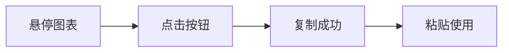

# 代码块和图表复制功能

## 功能概述

为所有代码块和 Mermaid 图表添加了复制按钮，提升用户体验。

### 特性

1. ✅ **代码块复制** - 一键复制代码内容到剪贴板
2. ✅ **Mermaid 图表复制** - 复制渲染后的图表为 PNG 图片
3. ✅ **智能显示** - 鼠标悬停时显示，移开时隐藏（移动端常驻）
4. ✅ **视觉反馈** - 复制成功显示对勾，失败显示叉号
5. ✅ **主题适配** - 按钮样式跟随深色/浅色主题

---

## 使用方法

### 复制代码块

1. 鼠标悬停在代码块上方
2. 点击右上角的**复制图标** <i class="far fa-copy"></i>
3. 代码内容已复制到剪贴板
4. 图标变为 ✓ 确认复制成功

```rust
// 示例代码块
fn main() {
    println!("鼠标悬停右上角会出现复制按钮");
}
```

### 复制 Mermaid 图表

1. 鼠标悬停在图表上方
2. 点击右上角的**图片图标** <i class="far fa-image"></i>
3. 图表以 PNG 图片格式复制到剪贴板
4. 可以直接粘贴到其他应用（如微信、Word、Notion）



---

## 实现原理

### 代码块复制

**流程**：
1. 包装每个 `<pre>` 元素到 `.code-wrapper` 容器
2. 添加 `.copy-button` 按钮（绝对定位到右上角）
3. 点击时调用 `navigator.clipboard.writeText()`
4. 复制 `<code>` 元素的 `textContent`

**代码位置**：`frontend/index.html` line 132-175

```javascript
function addCopyButtonsToCodeBlocks() {
  document.querySelectorAll('pre:not(.code-wrapper)').forEach((pre) => {
    const wrapper = document.createElement('div');
    wrapper.className = 'code-wrapper';
    // 包装并添加按钮...
  });
}
```

### Mermaid 图表复制

**流程**：
1. 包装每个 `.mermaid` 元素到 `.mermaid-wrapper` 容器
2. 添加 `.copy-button` 按钮
3. 点击时执行：
   - 将 SVG 序列化为字符串
   - 创建 Canvas 并绘制 SVG
   - 转换 Canvas 为 PNG Blob
   - 调用 `navigator.clipboard.write()` 写入图片
4. 如果浏览器不支持图片复制，降级为复制 SVG 代码

**代码位置**：`frontend/index.html` line 177-257

**降级策略**：
```
1. 尝试复制 PNG 图片（navigator.clipboard.write）
   ↓ 失败
2. 降级为复制 SVG 代码（navigator.clipboard.writeText）
   ↓ 失败
3. 显示错误图标
```

---

## 样式实现

### 按钮定位

**代码块包装器**：
```css
.code-wrapper {
  position: relative;  /* 为按钮提供定位上下文 */
  margin: 1.5rem 0;
}
```

**按钮样式**：
```css
.copy-button {
  position: absolute;
  top: 0.5rem;
  right: 0.5rem;
  opacity: 0;  /* 默认隐藏 */
  transition: all 0.2s ease;
}

.code-wrapper:hover .copy-button {
  opacity: 1;  /* 悬停时显示 */
}
```

### 视觉效果

**默认状态**：
- 半透明黑色背景 `rgba(0, 0, 0, 0.6)`
- 毛玻璃效果 `backdrop-filter: blur(4px)`
- 白色图标

**悬停状态**：
- 背景变深 `rgba(0, 0, 0, 0.8)`
- 轻微放大 `transform: scale(1.05)`

**复制成功**：
- 绿色背景 `rgba(34, 197, 94, 0.8)`
- 对勾图标 <i class="fas fa-check"></i>
- 2 秒后恢复原状

**复制失败**：
- 红色叉号图标 <i class="fas fa-times"></i>
- 2 秒后恢复原状

### 主题适配

**暗色主题**：
```css
[data-theme="dark"] .copy-button {
  background: rgba(255, 255, 255, 0.1);
  color: #e5e7eb;
}
```

**响应式设计**：
```css
@media (max-width: 768px) {
  .copy-button {
    opacity: 1;  /* 移动端常驻显示 */
    padding: 0.4rem 0.6rem;  /* 更小的尺寸 */
  }
}
```

---

## Mermaid 图表居中

### 问题

之前 Mermaid 图表可能靠左显示，不够美观。

### 解决方案

**包装器居中**：
```css
.mermaid-wrapper {
  display: flex;
  justify-content: center;  /* 水平居中 */
  align-items: center;      /* 垂直居中 */
  margin: 2rem auto;        /* 外边距居中 */
}
```

**图表内容居中**：
```css
.mermaid {
  display: flex;
  justify-content: center;
  align-items: center;
  flex-direction: column;
}

.mermaid svg {
  margin: 0 auto;  /* SVG 本身居中 */
}
```

---

## 浏览器兼容性

### Clipboard API 支持

| 浏览器 | 文本复制 | 图片复制 |
|--------|---------|---------|
| Chrome 88+ | ✅ | ✅ |
| Firefox 87+ | ✅ | ✅ |
| Safari 13.1+ | ✅ | ✅ |
| Edge 88+ | ✅ | ✅ |

**降级方案**：
- 不支持图片复制的浏览器会自动降级为复制 SVG 代码
- 用户可以手动将 SVG 代码粘贴到在线转换工具

### HTTPS 要求

⚠️ **重要**：Clipboard API 需要在安全上下文（HTTPS 或 localhost）中运行。

- `http://localhost` - ✅ 支持
- `http://127.0.0.1` - ✅ 支持
- `http://example.com` - ❌ 不支持
- `https://example.com` - ✅ 支持

---

## 常见问题

### Q1: 点击按钮没有反应？

**检查清单**：
- [ ] 浏览器是否支持 Clipboard API（检查控制台错误）
- [ ] 是否在 HTTPS 或 localhost 环境下
- [ ] 是否授予了剪贴板权限

**调试方法**：
```javascript
// 浏览器控制台测试
navigator.clipboard.writeText('test').then(
  () => console.log('✓ Clipboard API 可用'),
  (err) => console.error('✗ Clipboard API 不可用:', err)
);
```

### Q2: Mermaid 图表复制后是 SVG 代码而非图片？

**原因**：浏览器不支持 `ClipboardItem` 的图片格式，或 Canvas API 失败

**解决方案**：
1. 升级浏览器到最新版本
2. 检查浏览器控制台错误信息
3. 手动下载 SVG 文件（可扩展功能）

### Q3: 移动端按钮太小点不到？

**已优化**：移动端按钮尺寸已调整为 `0.4rem 0.6rem`，并且常驻显示

**进一步优化**：
```css
@media (max-width: 768px) {
  .copy-button {
    padding: 0.6rem 0.8rem;  /* 增大触摸区域 */
  }
}
```

### Q4: 代码块右侧被按钮遮挡？

**已解决**：为代码内容添加了右侧内边距

```css
.code-wrapper pre code {
  padding-right: 3rem;
}
```

如果仍有遮挡，可以增大 `padding-right` 的值。

---

## 未来扩展

### 可能的改进

1. **下载功能** - 添加下载按钮，将代码/图表保存为文件
   ```html
   <button class="download-button" title="下载">
     <i class="fas fa-download"></i>
   </button>
   ```

2. **分享功能** - 生成图片并分享到社交媒体
   ```javascript
   async function shareImage(canvas) {
     const blob = await canvas.toBlob();
     navigator.share({ files: [new File([blob], 'diagram.png')] });
   }
   ```

3. **语言标签** - 在代码块显示语言类型
   ```html
   <div class="code-language">Rust</div>
   ```

4. **行号显示** - 为代码块添加行号
   ```javascript
   code.innerHTML = code.innerHTML
     .split('\n')
     .map((line, i) => `<span class="line-number">${i+1}</span>${line}`)
     .join('\n');
   ```

5. **代码高亮行** - 支持特定行高亮显示
   ```markdown
   ​```rust {1,3-5}
   // 高亮第 1 行和第 3-5 行
   ​```
   ```

---

## 测试清单

### 代码块复制
- [ ] 鼠标悬停显示按钮
- [ ] 点击复制成功显示 ✓
- [ ] 粘贴到编辑器内容正确
- [ ] 多行代码保留换行
- [ ] 代码缩进保持一致

### Mermaid 图表复制
- [ ] 鼠标悬停显示按钮
- [ ] 点击复制成功显示 ✓
- [ ] 粘贴到图片编辑器正常
- [ ] 图表内容完整清晰
- [ ] 降级到 SVG 代码正常

### 样式和布局
- [ ] 按钮不遮挡内容
- [ ] 暗色/浅色主题适配正确
- [ ] 移动端按钮大小合适
- [ ] Mermaid 图表居中显示
- [ ] 响应式布局正常

---

**实现时间**: 2025-11-15
**维护者**: Claude Code
