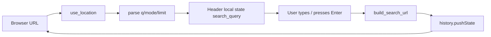
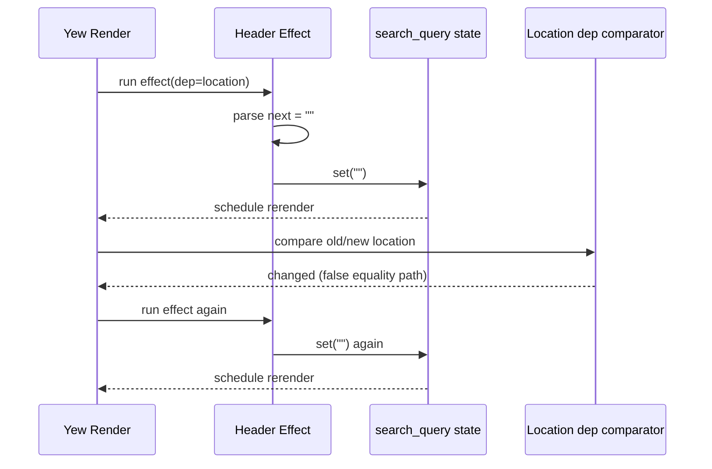
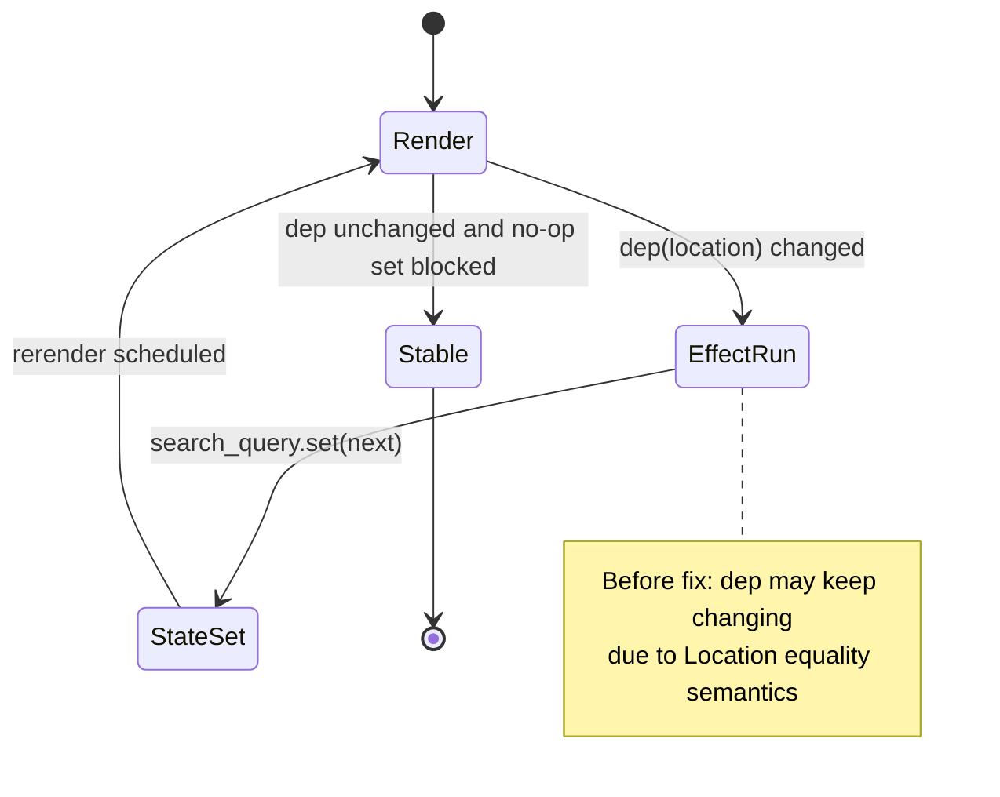
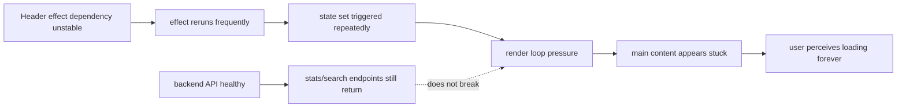
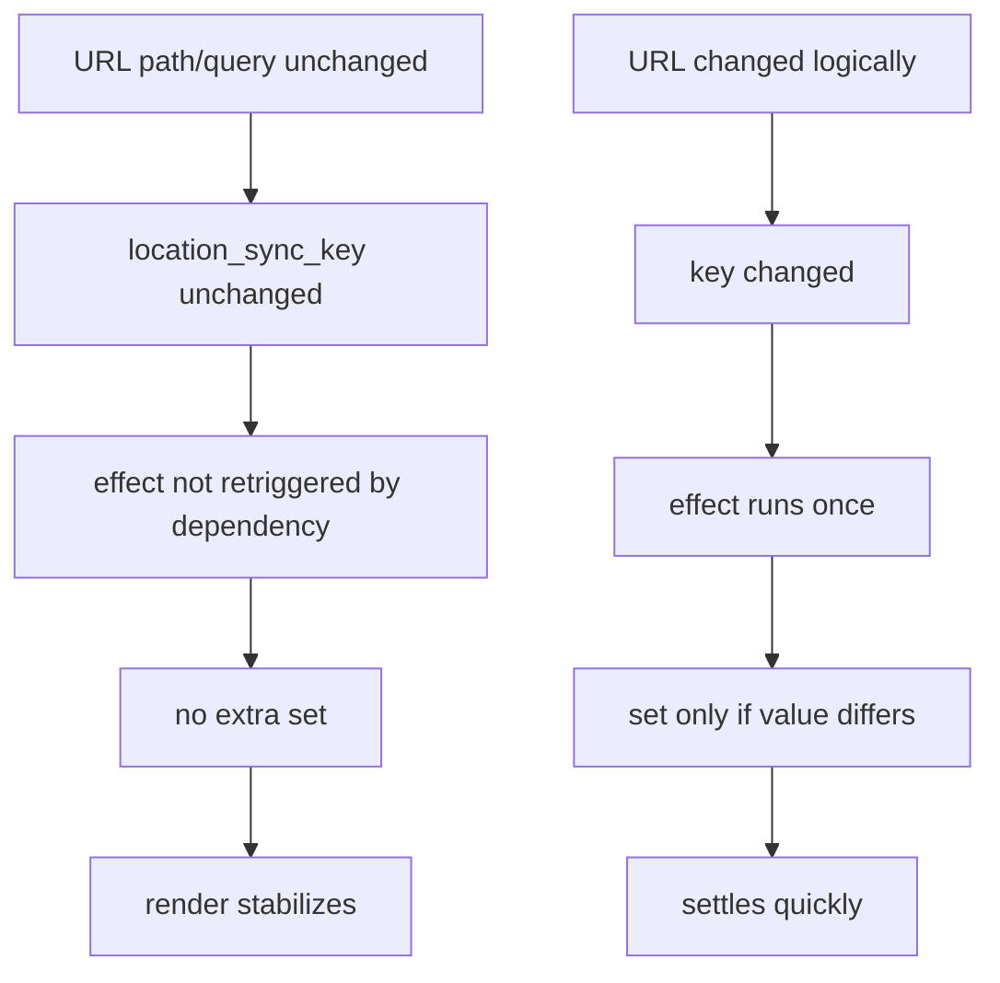

# Frontend Infinite Loading Deep Dive: Header Location Effect Loop, Root Cause, and Correct Fix

This post documents a severe UI incident: the page showed only background/skin, main content looked stuck, and browser status appeared to keep loading.

The key conclusion is important:

- This was primarily a **frontend render-loop issue**.
- Backend health was not the root cause.

> 💡 **Key Point**
> The failure came from how `use_effect_with` dependency was chosen in `Header`, not from API business logic.

Code baseline: local StaticFlow workspace state on 2026-02-12.

## 1. Incident Summary and Scope

### 1.1 User-visible symptom

Observed behavior:

- UI frame/background rendered.
- Core page content did not settle.
- Browser tab/status indicated ongoing loading.
- Restarting backend did not fundamentally fix the issue.

### 1.2 Why this bug is tricky

This type of bug is deceptive:

- It feels like network/IO waiting.
- But the real problem can be a frontend render loop that continuously consumes render cycles.

### 1.3 Scope of this analysis

This article focuses on:

1. Exact failure mechanism in `Header` synchronization.
2. Why backend can appear unrelated while UI is still frozen.
3. Why the chosen fix is correct and stable.

## 2. Background: What the Header Was Trying to Do

The `Header` component has two intended behaviors:

1. Sync top-right search input with URL query (`q`).
2. When already on search page, preserve current search mode params (`mode`, `limit`, `all`, `max_distance`, etc.).

Relevant implementation:

- URL parsing and sync in `frontend/src/components/header.rs:19-45`
- Search URL construction preserving mode in `frontend/src/components/header.rs:550-584`

### 2.1 Intended data flow



This loop is expected and healthy **only if each stage is idempotent and dependency-stable**.

## 3. Core Mechanism: Why `Location` Is a Dangerous Effect Dependency

### 3.1 Authoritative definition

From `gloo-history` source (`gloo-history-0.2.2/src/location.rs`):

- `Location` stores `id: Option<u32>` (`location.rs:12-18`).
- Its `PartialEq` compares only IDs when both are `Some` (`location.rs:68-76`).
- If either side has `None`, equality returns `false`.

```rust
impl PartialEq for Location {
    fn eq(&self, rhs: &Self) -> bool {
        if let Some(lhs) = self.id() {
            if let Some(rhs) = rhs.id() {
                return lhs == rhs;
            }
        }
        false
    }
}
```

### 3.2 Consequence for reactive hooks

`use_effect_with(dep, ...)` depends on `dep` equality.

If dep equality is unstable (or often false), effect runs repeatedly.

> ⚠️ **Gotcha**
> “URL text looks unchanged” does **not** guarantee `Location` equality is unchanged.

## 4. Failure Reconstruction (Detailed)

### 4.1 Problematic pattern (before fix)

Conceptual old pattern:

```rust
let location = use_location();
let search_query = use_state(String::new);

use_effect_with(location.clone(), move |loc| {
    let next = loc
        .as_ref()
        .and_then(|it| it.query::<Q>().ok())
        .and_then(|q| q.q)
        .unwrap_or_default();

    search_query.set(next);
    || ()
});
```

### 4.2 Concrete scenario A: home page with empty query

Inputs:

- Path: `/`
- Query: empty
- Parsed `next`: `""`

One possible timeline:



Even same-value `set` can keep the component hot when dependency itself keeps triggering.

### 4.2.1 Equality matrix with concrete values

The following table shows why the dependency can be unstable even when visible URL text does not change:

| old `Location` | new `Location` | path/query text changed? | `PartialEq` result |
|---|---|---|---|
| `id=None, path=\"/\", query=\"\"` | `id=None, path=\"/\", query=\"\"` | No | `false` |
| `id=Some(7), path=\"/search\", query=\"?q=a\"` | `id=Some(7), path=\"/search\", query=\"?q=a\"` | No | `true` |
| `id=Some(7), path=\"/search\", query=\"?q=a\"` | `id=Some(8), path=\"/search\", query=\"?q=a\"` | No | `false` |
| `id=Some(7), path=\"/search\", query=\"?q=a\"` | `id=Some(8), path=\"/search\", query=\"?q=b\"` | Yes | `false` |

This is exactly why relying on `Location` object equality can be risky for synchronization effects.

### 4.3 Concrete scenario B: search page with mode params

URL:

- `/search?q=vector&mode=image&max_distance=0.8`

Expected behavior:

- Input shows `vector`
- Effect runs once per logical URL change

Failure behavior (before fix):

- Effect re-runs repeatedly even when `q` stays `vector`
- UI appears stuck because render loop dominates

### 4.4 State-machine view



Before fix, transitions tended to remain in `Render -> EffectRun -> StateSet -> Render` loop.

## 5. Why It Looked Like “Network Loading Forever”

### 5.1 Symptom-level mismatch

From user perspective:

- “Page not coming up” often maps to “API not responding.”

But render-loop symptom can look similar:

- Spinner/visual shell appears.
- Interactive content never settles.

### 5.2 Backend may still be healthy

In this incident, backend endpoints were callable; the front-end could still appear broken.

> 💡 **Key Point**
> If you can reproduce the freeze with frontend-only startup or with backend responses healthy, prioritize render dependency analysis before API deep dive.

### 5.3 Causality graph: UI freeze vs backend health



## 6. The Final Fix

Actual fixed implementation is in `frontend/src/components/header.rs:21-45`.

### 6.1 Fix A: Depend on a stable logical key

```rust
let location_sync_key = location
    .as_ref()
    .map(|loc| format!("{}{}", loc.path(), loc.query_str()))
    .unwrap_or_default();
```

Then use:

```rust
use_effect_with(location_sync_key, move |_| { ... })
```

This ties reactivity to business-relevant values (`path + query_str`), not internal identity behavior.

### 6.2 Fix B: Block no-op state writes

```rust
if *search_query != next {
    search_query.set(next);
}
```

This makes the effect idempotent under repeated scheduling.

### 6.3 Combined execution after fix



## 7. Why This Fix Is Correct (Reasoning, Not Guessing)

We can state two invariants.

### 7.1 Invariant 1: dependency reflects logical URL identity

Dependency now equals deterministic serialization of logical URL part we care about (`path + query`).

If that logical identity does not change, effect should not keep re-firing.

### 7.2 Invariant 2: state update is idempotent

If computed `next` equals current `search_query`, no state mutation occurs.

Therefore no extra render is induced by no-op sync.

### 7.3 Together

- Invariant 1 controls trigger frequency.
- Invariant 2 controls update side effects.

Together they prevent the runaway loop class seen in this incident.

## 8. Practical Reproduction and Verification Playbook

### 8.1 Reproduce pre-fix bug pattern (general)

1. Use object-type dependency with unstable equality in `use_effect_with`.
2. Call `set` inside effect each run.
3. Navigate between routes or re-render roots.
4. Observe repeated render/effect activity and UI stall.

### 8.2 Verify fix

1. Open `/` and `/search?...` routes repeatedly.
2. Ensure input sync still works.
3. Ensure no visible freeze.
4. Confirm no continuous rerender behavior.

### 8.3 Regression checklist

- Search input still mirrors URL `q`.
- Search execution preserves mode params.
- No infinite render behavior on home or search route.
- Backend availability no longer changes this UI stability outcome.

## 9. Design Alternatives and Trade-offs

### 9.1 Alternative: keep `Location` dependency directly

Pros:

- Shorter code.

Cons:

- Coupled to internal equality semantics.
- Harder to reason about stability.
- Easier to regress.

### 9.2 Chosen design: stable scalar dependency + idempotent set

Pros:

- Explicit logic.
- Predictable rerender behavior.
- Easy to review and test.

Cost:

- Minor string creation overhead for dependency key.

Given the severity of the bug class, this is a good trade.

## 10. Code Index

- `frontend/src/components/header.rs:19` obtains router location.
- `frontend/src/components/header.rs:21-24` builds `location_sync_key`.
- `frontend/src/components/header.rs:35` registers effect with stable key.
- `frontend/src/components/header.rs:41-43` idempotent guard for state update.
- `frontend/src/components/header.rs:550-584` builds search URL preserving mode and limits.
- `/home/ts_user/.cargo/registry/src/rsproxy.cn-e3de039b2554c837/gloo-history-0.2.2/src/location.rs:12-18` `Location` struct fields.
- `/home/ts_user/.cargo/registry/src/rsproxy.cn-e3de039b2554c837/gloo-history-0.2.2/src/location.rs:68-76` `PartialEq` behavior.

## 11. References

- Header implementation: `frontend/src/components/header.rs`
- Router entry and route switching: `frontend/src/router.rs`
- `gloo-history` `Location` implementation: local cargo registry path above
