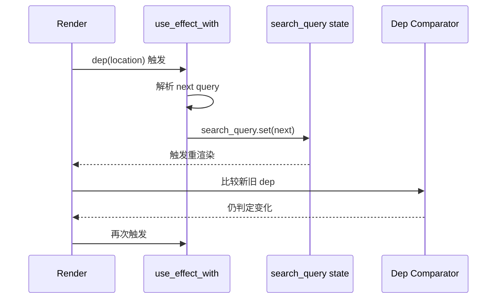
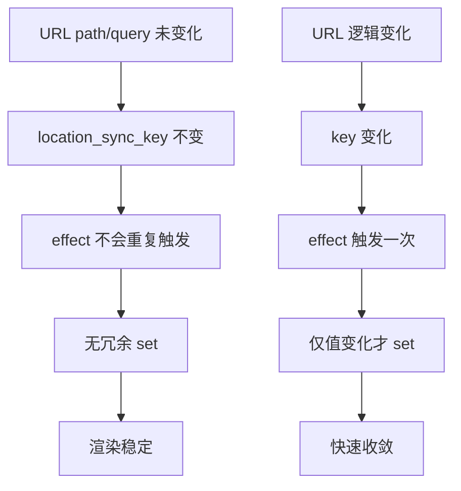

# 前端无限加载问题深度复盘：Header Location 依赖循环的根因与修复

这篇文章记录一次非常典型、也非常容易误判的前端事故：页面看起来像“网络一直在加载”，但后端并不是根因。

核心结论先给出：

- 问题根因是 **Header 的 URL 同步 effect 依赖不稳定**，导致渲染循环。
- 后端接口即使健康，也无法抵消前端循环带来的“页面假死体验”。

## 1. 现象与误判路径

用户看到的表象：

- 只有背景和外壳（skin）渲染出来。
- 主体内容迟迟不出现。
- 浏览器状态栏持续显示加载中。

这会天然诱导我们先怀疑 API、网络、CORS 或后端超时。

但这次并非如此。

## 2. Header 本来的设计目标

Header 有两个职责：

1. 输入框与 URL 查询参数 `q` 同步。
2. 在搜索页内继续搜索时，保留当前模式参数（如 `mode`、`limit`、`all`、`max_distance`）。

从产品视角这是正确需求，但实现上如果依赖选错，就会把“同步”变成“循环”。

## 3. 根因机制：对象依赖 != 逻辑稳定依赖

在 Yew 中，`use_effect_with(dep, ...)` 是否触发，取决于 `dep` 的比较结果。

若直接用路由 `Location` 对象作为依赖，即使肉眼看到 URL 文本没变，底层依赖比较也可能判断为变化，从而重复触发 effect。

### 3.1 失控路径示意

只要上面链路持续，就会出现“背景在、内容不稳”的视觉假死。

## 4. 正确修复方案

修复点有且只有两个，但必须同时具备：

1. **依赖改为稳定标量键**：`path + query_str`
2. **状态更新加幂等保护**：仅当值变化才 `set`

### 4.1 修复后流程

## 5. 为什么这个修复是“正确的”，而不是“碰巧可用”

可以用两个不变量说明：

- 不变量 1：依赖必须只反映业务层“逻辑 URL 身份”。
- 不变量 2：同步状态写入必须幂等（同值不写）。

前者控制“触发条件”，后者控制“触发后副作用”。两者叠加后，这类循环会被切断。

## 6. 与后端关系的澄清

这次问题最关键的经验是：

- “看起来一直 loading”并不等同于“后端接口挂了”。
- 前端渲染循环可以独立制造几乎同样的用户感知。

因此排障应同时覆盖：

1. API 是否可用。
2. 前端是否出现 effect/state 的自激循环。

## 7. 回归检查建议

建议每次改 Header/Router 同步逻辑后，至少回归：

- 首页与搜索页来回切换稳定性。
- 搜索页内再次搜索时参数保持。
- 同 URL 重复提交时不抖动、不假死。

## 8. 代码索引

- `frontend/src/components/header.rs`：URL 同步与搜索 URL 构建
- `frontend/src/router.rs`：路由状态切换
- `frontend/src/pages/search.rs`：模式/参数消费逻辑
