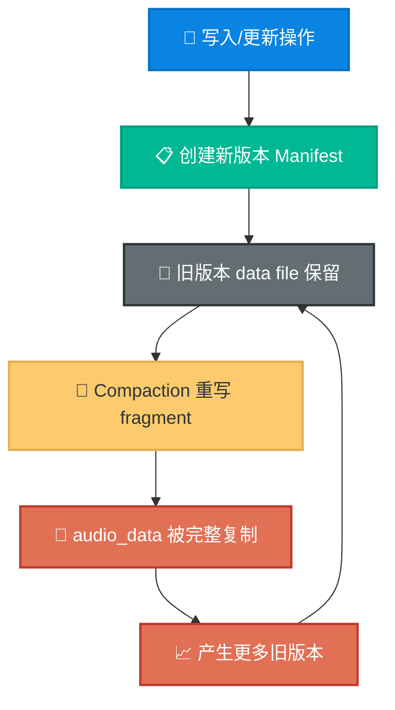
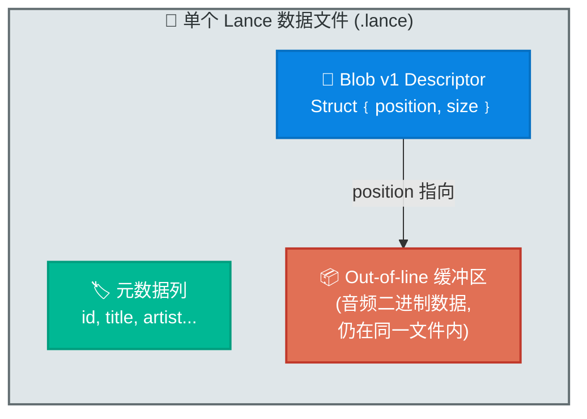
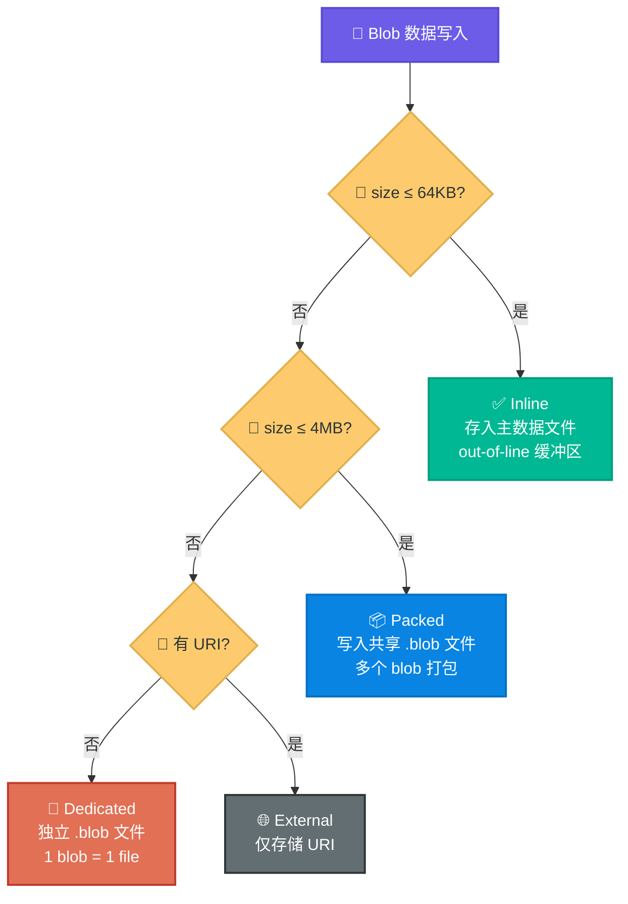
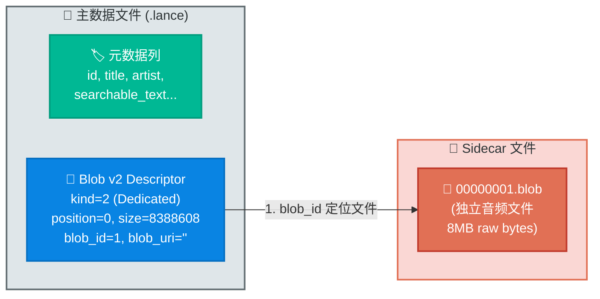
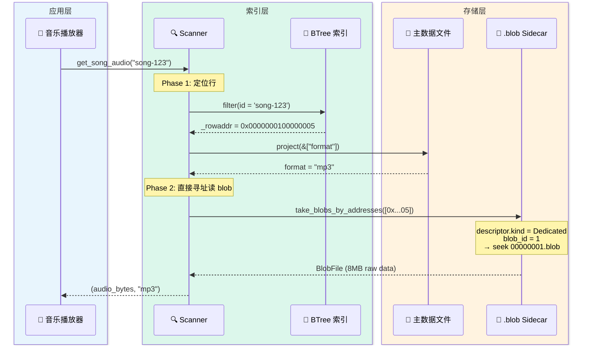
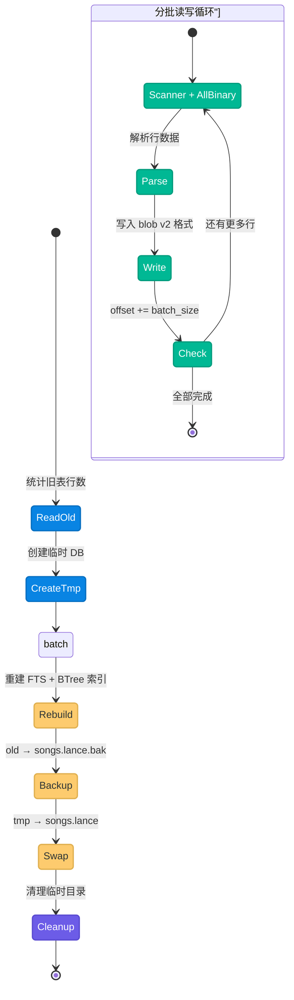
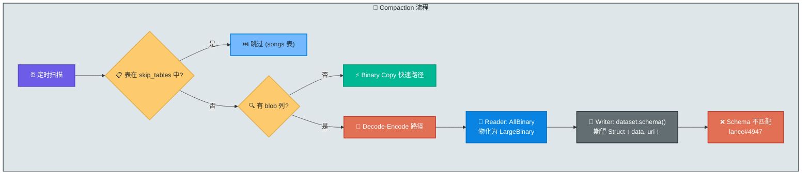
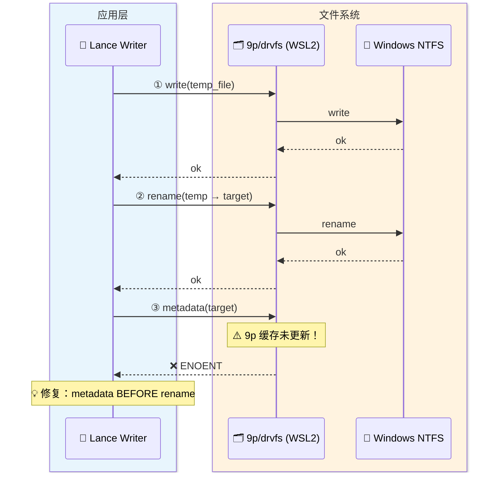

# LanceDB Blob 存储演进实战 — 从 27GB 到 4.7GB 的优化之旅

> 400 首歌的音频存进 LanceDB 后，数据库膨胀到了 27GB，查询延迟飙升到 10 秒以上。
> 从 blob v1 到 blob v2，从上游 issue 到 fork 修复，这篇文章记录了整个优化过程中
> 对 LanceDB blob 存储内部原理的理解和工程实践。

---

## 导言：StaticFlow 与这次优化的起因

StaticFlow 是我的个人项目 —— 一个本地优先（local-first）的 Rust 全栈内容平台。前端用 Yew 编译成 WASM 跑在浏览器里，后端是 Axum，所有数据存储统一使用 LanceDB（一个基于 Lance 列式格式的嵌入式向量数据库）。平台涵盖文章发布、知识管理、评论审核、音乐播放等多个模块。整套服务跑在我本机的 WSL2（Ubuntu 24.04）上，通过 [pb-mapper](https://github.com/acking-you/pb-mapper) 做公网映射对外提供访问。

音乐模块是最后一个加进来的功能。它的需求很直接：存储歌曲元数据（标题、歌手、专辑、歌词、语义向量等）和音频文件本身（mp3/flac，单文件 3-15MB），通过浏览器播放。

我选择把音频二进制直接存进 LanceDB —— 一个存储引擎解决结构化数据、向量索引和二进制文件，不需要额外的对象存储或文件路径映射。逻辑上很优雅，但存储层面很快就出了问题。

> **导航**：本文共八章，按时间线展开。如果只关心最终方案，可以 ⏭️ 跳到[第三章](#第三章blob-v2--真正的分离存储)和[第四章](#第四章stable-row-id-与-btree-索引--查询优化的基石)。

---

## 第一章：问题 — 音频数据膨胀之痛

### 最初的 Schema

最初的 `songs` 表 schema 很简单 —— 音频二进制和元数据在同一张表里：

```rust
// shared/src/music_store.rs — 初始 schema（简化）
fn songs_schema() -> Arc<Schema> {
    Arc::new(Schema::new(vec![
        Field::new("id", DataType::Utf8, false),
        Field::new("title", DataType::Utf8, false),
        Field::new("artist", DataType::Utf8, false),
        // ... 元数据字段 ...
        Field::new("audio_data", DataType::LargeBinary, false), // 音频原始二进制
        Field::new("searchable_text", DataType::Utf8, false),
        // ... 向量字段 ...
    ]))
}
```

400 首歌，原始音频总量大约 4GB。但 `songs.lance` 目录膨胀到了 **27GB** —— 足足 6.7 倍。

### 根因：Copy-on-Write 与大型 Binary 的致命组合

LanceDB 底层的 Lance 格式采用 copy-on-write（写时复制）语义：每次写入/更新都会创建一个新的版本快照。这对元数据更新来说没问题 —— 原子性、可回溯、无锁。但对大型二进制数据来说，它引发了一个恶性循环：

1. **Compaction 重写整个 fragment**：Lance 的 compaction 把多个小 fragment 合并为大 fragment。`audio_data` 和元数据在同一个 fragment 里，即使只是合并元数据，也要把几 MB 的音频数据一起搬运。

2. **版本链不断增长**：每次 compaction 都产生新版本。旧版本引用的 data file 不会自动释放 —— 这是 MVCC 的代价。

3. **Prune 也不彻底**：即使执行 `prune` 清理旧 manifest，底层 `.lance` 数据文件可能仍被多个 fragment 交叉引用，无法全部释放。

4. **元数据更新触发全行重写**：更新一首歌的标题？整行包括 10MB 的 `audio_data` 都要写一份新副本。



核心矛盾一句话总结：**列式存储的 copy-on-write 语义 + 大型二进制 blob = 版本膨胀灾难**。

要解决这个问题，需要把大型二进制从主数据流中剥离出来。LanceDB 的 blob 列机制正是为此而设计的 —— 但它经历了两代演进，每一代都有不同的取舍。

---

## 第二章：初探 Blob v1 — 分离的第一步

### Blob 列的概念

LanceDB 团队显然也意识到了这个问题，因此引入了 **blob 列**的概念：把二进制大对象从主数据文件的正常编码流程中剥离出来，存储在独立的缓冲区中。主表只保存一个轻量级的 **descriptor**（描述符），指向实际数据的位置。

Blob v1 是这个思路的第一代实现。

### Blob v1 的编码原理

要理解 v1 的局限性，需要先看它的 structural encoder 是怎么工作的。

Lance 的写入管线中，每种数据类型对应一个 `FieldEncoder`。对于 blob v1，使用的是 `BlobStructuralEncoder`：

```rust
// deps/lance/rust/lance-encoding/src/encodings/logical/blob.rs:36-41
pub struct BlobStructuralEncoder {
    descriptor_encoder: Box<dyn FieldEncoder>,  // 编码 descriptor
    def_meaning: Option<Arc<[DefinitionInterpretation]>>,
}
```

它的编码流程是这样的：

1. 接收一个 `LargeBinary` 数组（原始音频数据）
2. 遍历每一行，将二进制数据写入 **out-of-line 缓冲区**（`external_buffers`）
3. 记录每个 blob 在缓冲区中的 `(position, size)` 对
4. 用这些 `(position, size)` 对构造 descriptor struct，交给 `descriptor_encoder` 编码

关键代码：

```rust
// deps/lance/rust/lance-encoding/src/encodings/logical/blob.rs:153-196
// 收集 position 和 size
for i in 0..binary_array.len() {
    if binary_array.is_null(i) {
        positions.push(repdef);  // null 值编码到 position 中
        sizes.push(0);
    } else {
        let value = binary_array.value(i);
        // 将数据写入 external_buffers，返回偏移位置
        let position = external_buffers.add_buffer(LanceBuffer::from(Buffer::from(value)));
        positions.push(position);
        sizes.push(value.len() as u64);
    }
}

// 构造 descriptor：Struct { position: UInt64, size: UInt64 }
let descriptor_array = Arc::new(StructArray::new(
    Fields::from(vec![
        ArrowField::new("position", DataType::UInt64, false),
        ArrowField::new("size", DataType::UInt64, false),
    ]),
    vec![position_array as ArrayRef, size_array as ArrayRef],
    None,
));
```

Blob v1 的 descriptor 是一个只有两个字段的 struct：

| 字段 | 类型 | 含义 |
|------|------|------|
| `position` | UInt64 | 数据在 out-of-line 缓冲区中的偏移 |
| `size` | UInt64 | 数据长度（字节） |

### v1 的文件布局

注意上面代码中的 `external_buffers.add_buffer(...)` —— 数据被写入了 "out-of-line buffers"。但这些缓冲区**仍然在同一个 `.lance` 数据文件内部**。它只是把 blob 数据从行存区域挪到了文件尾部的缓冲区，而不是真正的独立文件。



### 暴露的问题

我在上线 blob v1 后发现了一个严重的性能问题：**查询延迟从 100ms 飙到 10 秒以上**。

根因在于 blob v1 的 "分离" 还不够彻底。descriptor 和 blob 数据仍然在同一个文件里。当 scanner 执行 filter 操作（比如 `id = 'xxx'`）时，Lance 的 pushdown 优化依赖于统计信息（min/max、zone map）来跳过不需要读取的数据页。但由于 out-of-line 缓冲区的存在，文件内的数据布局变得复杂 —— scanner 需要读取或跳过这些巨大的缓冲区来定位元数据页，导致查询退化为接近全表扫描。

>💡 **Key Point**：Blob v1 本质上是**逻辑分离**（descriptor 和 data 是不同的编码单元），但**物理不分离**（还在同一个 `.lance` 文件）。对于 MB 级的音频来说，这种程度的分离不够。

这个问题直接推动了对下一代方案的探索 —— 既然逻辑分离不够，那就做物理分离。Blob v2 正是沿着这个思路重新设计的。

---

## 第三章：Blob v2 — 真正的分离存储

### 从 v1 到 v2 的核心变化

v1 暴露了一个根本性的问题：只要 blob 数据还和元数据在同一个文件里，IO 层面就无法真正隔离。v2 的设计很直接 —— **blob 数据从 `.lance` 数据文件中完全剥离，写入独立的 `.blob` sidecar 文件**。主表只存储一个轻量级的 descriptor。

要使用 blob v2，需要 `data_storage_version=2.2`。这在 Lance 的版本矩阵中属于最新的不稳定版本：

```rust
// deps/lance/rust/lance-encoding/src/version.rs:16-38
pub enum LanceFileVersion {
    Legacy,     // 0.1 — 旧格式
    V2_0,       // 2.0 — 默认版本 (Stable 解析为此)
    Stable,
    V2_1,       // 2.1 — 中间版本 (Next 解析为此)
    Next,
    V2_2,       // 2.2 — 🆕 支持 blob v2 的最新版本
}
```

在 StaticFlow 中，创建 songs 表时显式设置三个 storage option：

```rust
// shared/src/music_store.rs:720-724
async fn songs_table(&self) -> Result<Table> {
    let table = ensure_table(&self.db, SONGS_TABLE, songs_schema(), &[
        ("new_table_data_storage_version", "2.2"),      // 启用 blob v2
        ("new_table_enable_stable_row_ids", "true"),     // 稳定行 ID
        ("new_table_enable_v2_manifest_paths", "true"),  // v2 manifest 路径
    ]).await?;
    // ...
}
```

### Blob v2 的 Descriptor：从 2 字段到 5 字段

v1 的 descriptor 只有 `{position, size}` 两个字段 —— 因为它只需要描述 "数据在文件内的哪个位置"。

v2 需要描述更丰富的信息 —— 数据可能在不同的 sidecar 文件里、可能内联、可能在外部 URI：

```rust
// deps/lance/rust/lance-core/src/datatypes.rs:50-58
pub static BLOB_V2_DESC_FIELDS: LazyLock<Fields> = LazyLock::new(|| {
    Fields::from(vec![
        ArrowField::new("kind", DataType::UInt8, false),       // 存储策略类型
        ArrowField::new("position", DataType::UInt64, false),   // 数据偏移位置
        ArrowField::new("size", DataType::UInt64, false),       // 数据大小
        ArrowField::new("blob_id", DataType::UInt32, false),    // sidecar 文件 ID
        ArrowField::new("blob_uri", DataType::Utf8, false),     // 外部 URI
    ])
});
```

v1 vs v2 descriptor 对比：

| 特性 | Blob v1 | Blob v2 |
|------|---------|---------|
| 字段数 | 2 (`position`, `size`) | 5 (`kind`, `position`, `size`, `blob_id`, `blob_uri`) |
| 数据位置 | 同文件 out-of-line 缓冲区 | 独立 `.blob` sidecar 文件 |
| 存储策略 | 唯一（out-of-line） | 四种（Inline / Packed / Dedicated / External） |
| descriptor 大小 | ~16 字节/行 | ~30 字节/行 |
| Encoder | `BlobStructuralEncoder` | `BlobV2StructuralEncoder` |

### BlobV2StructuralEncoder 编码流程

v2 的 encoder (`BlobV2StructuralEncoder`) 与 v1 的根本区别在于：它接收的不是原始 `LargeBinary` 数据，而是一个**已经过预处理的 struct**，其中包含了 `kind`、`blob_id` 等路由信息。

```rust
// deps/lance/rust/lance-encoding/src/encodings/logical/blob.rs:236-266
pub struct BlobV2StructuralEncoder {
    descriptor_encoder: Box<dyn FieldEncoder>,  // 只编码 descriptor
}

impl BlobV2StructuralEncoder {
    pub fn new(field: &Field, column_index: u32, /* ... */) -> Result<Self> {
        // descriptor 的 data type 是 5 字段 struct
        let descriptor_data_type = DataType::Struct(BLOB_V2_DESC_FIELDS.clone());
        // ...
        Ok(Self { descriptor_encoder })
    }
}
```

在 `maybe_encode` 中，encoder 从输入 struct 中提取 `kind`、`data`、`uri`、`blob_id`、`blob_size`、`position` 等字段，重新组装为 5 字段的 descriptor struct，然后交给内部的 `PrimitiveStructuralEncoder` 编码。

>💡 **Key Point**：在 v2 中，blob 数据的物理存储工作已经在 encoder 之前的**预处理阶段**完成了。预处理器根据数据大小决定存储策略（Inline / Packed / Dedicated），将数据写入对应的 `.blob` 文件，然后把描述信息传给 encoder。encoder 只负责编码这个轻量级的 descriptor —— 不再接触实际的二进制数据。

### 四种存储策略

v2 的 `kind` 字段引入了四种存储策略，由 `BlobKind` 枚举定义：

```rust
// deps/lance/rust/lance-core/src/datatypes.rs:431-446
pub enum BlobKind {
    Inline = 0,     // 小 blob → 存在主数据文件
    Packed = 1,     // 中等 blob → 共享 .blob 打包文件
    Dedicated = 2,  // 大 blob → 独立 .blob 文件
    External = 3,   // 外部引用 → URI
}
```

策略选择由预处理阶段根据数据大小自动决定，阈值定义为：

```rust
// deps/lance/rust/lance/src/dataset/blob.rs:27-29
const INLINE_MAX: usize = 64 * 1024;           // 64KB
const DEDICATED_THRESHOLD: usize = 4 * 1024 * 1024;  // 4MB
const PACK_FILE_MAX_SIZE: usize = 1024 * 1024 * 1024; // 1GiB per .pack
```

每种策略的适用场景和文件布局：

| 策略 | 大小范围 | 存储位置 | 适用场景 |
|------|---------|---------|---------|
| **Inline** | ≤ 64KB | 主数据文件的 out-of-line 缓冲区 | 缩略图、小图标 |
| **Packed** | 64KB - 4MB | 共享的 `{blob_id}.blob` 文件（上限 1GiB/文件） | 中等尺寸图片 |
| **Dedicated** | ≥ 4MB | 独立的 `{blob_id}.blob` 文件（1:1） | 音频、视频 ✅ |
| **External** | 不限 | 不存储，只记录 URI | 云端托管的资源 |



对于 StaticFlow 的音乐场景 —— 每首歌 3-15MB —— 所有音频都超过 4MB 的 `DEDICATED_THRESHOLD`，自动走 **Dedicated** 策略。每个音频文件对应一个独立的 `.blob` 文件。

### Blob v2 的文件布局

这是 v2 和 v1 最关键的区别 —— blob 数据**物理上**完全脱离了主数据文件：



主表现在只存储约 30 字节/行的 descriptor，不再包含任何音频数据。这意味着：

- **Compaction 只需重写 descriptor**，不搬运 GB 级音频
- **Filter pushdown 恢复正常**，统计信息只作用于轻量级列，不被大缓冲区干扰
- **版本膨胀被控制**，新版本只包含元数据差异

### 用户侧 API：blob_field 与 BlobArrayBuilder

v2 对用户侧的 API 做了良好封装。`blob_field()` 函数构造带有 Arrow 扩展元数据标记的 Field：

```rust
// deps/lance/rust/lance/src/blob.rs:19-39
pub fn blob_field(name: &str, nullable: bool) -> Field {
    let metadata = [(ARROW_EXT_NAME_KEY.to_string(), BLOB_V2_EXT_NAME.to_string())]
        .into_iter()
        .collect();
    Field::new(
        name,
        DataType::Struct(vec![
            Field::new("data", DataType::LargeBinary, true),  // 原始字节
            Field::new("uri", DataType::Utf8, true),           // 或者 URI
        ].into()),
        nullable,
    )
    .with_metadata(metadata)  // 标记为 "lance.blob.v2"
}
```

用户看到的列类型是 `Struct<data: LargeBinary?, uri: Utf8?>` —— 每行要么提供原始字节（`data`），要么提供外部 URI（`uri`）。写入器使用 `BlobArrayBuilder`：

```rust
// deps/lance/rust/lance/src/blob.rs:41-62
pub struct BlobArrayBuilder {
    data_builder: LargeBinaryBuilder,
    uri_builder: StringBuilder,
    validity: NullBufferBuilder,
    expected_len: usize,
    len: usize,
}

impl BlobArrayBuilder {
    pub fn new(capacity: usize) -> Self { /* ... */ }
    pub fn push_bytes(&mut self, bytes: impl AsRef<[u8]>) -> Result<()> { /* ... */ }
    pub fn push_uri(&mut self, uri: impl Into<String>) -> Result<()> { /* ... */ }
    pub fn push_null(&mut self) -> Result<()> { /* ... */ }
    pub fn finish(self) -> Result<ArrayRef> { /* ... */ }
}
```

在 StaticFlow 的 songs schema 中，只需要一行就能声明 blob v2 列：

```rust
// shared/src/music_store.rs:191-204
fn songs_schema() -> Arc<Schema> {
    Arc::new(Schema::new(vec![
        Field::new("id", DataType::Utf8, false),
        Field::new("title", DataType::Utf8, false),
        Field::new("artist", DataType::Utf8, false),
        // ... 元数据 ...
        blob_field("audio_data", false),  // 一行搞定 blob v2 列
        // ... 向量字段 ...
    ]))
}
```

Lance 在写入时自动根据数据大小选择存储策略 —— 不需要关心 `BlobKind`，只需要给数据，引擎会做正确的事。

存储问题解决了 —— blob 数据物理隔离在独立的 sidecar 文件中，主表只保存轻量级 descriptor。但随之而来一个新问题：数据分散在了两个地方，查询怎么高效地"找到行 → 定位 blob"？这需要索引和寻址机制的配合。

---

## 第四章：Stable Row ID 与 BTree 索引 — 查询优化的基石

### 概念铺垫：Row ID vs Row Address

blob 分离到 sidecar 文件后，查询变成了两步操作：先在主表定位行，再去 sidecar 文件读数据。要让这两步高效衔接，需要理解两个核心概念：

- **Row ID**：稳定标识符，一旦分配就不变，类似数据库主键。需要 `enable_stable_row_ids=true`。
- **Row Address**：物理地址，编码为 `(fragment_id << 32) | row_offset`。compaction 重组 fragment 后可能变化。

在默认模式下，Lance 只有 row address —— compaction 后地址失效。启用 stable row ID 后，Lance 内部维护一个持久的 row ID → row address 映射索引，确保即使 compaction 重组了 fragment，仍能通过稳定的 row ID 找到对应的行。

### 两阶段查询模式

有了 stable row ID 和 BTree 索引，blob 查询变成了高效的两阶段模式。以获取歌曲音频为例（`shared/src/music_store.rs:887-959`）：

**Phase 1：BTree 索引定位 → 获取 row_addr**

```rust
// Phase 1: 只读 format 列，不碰 audio_data
let mut scanner = dataset.scan();
scanner.project(&["format"])?;     // 只读 format 列
scanner.filter("id = '...'")?;     // BTree 索引 pushdown
scanner.limit(Some(1), None)?;
scanner.with_row_address();         // 请求返回 _rowaddr
```

Phase 1 利用 BTree 索引做 O(log n) 查找，只读取极小的元数据列，完全不碰 blob 数据。

**Phase 2：直接寻址读取 blob → O(1)**

```rust
// Phase 2: 用 row_addr 直接定位 .blob 文件
let blobs = dataset
    .take_blobs_by_addresses(&[row_addr], "audio_data")
    .await?;
```

Phase 2 通过 `take_blobs_by_addresses` 直接用 row address 寻址到 `.blob` 文件，跳过主表的所有数据页。



底层实现中，`take_blobs_by_addresses` 根据 descriptor 中的版本信息分发到 v1 或 v2 的读取路径：

```rust
// deps/lance/rust/lance/src/dataset/blob.rs:678-718
pub async fn take_blobs_by_addresses(
    dataset: &Arc<Dataset>,
    row_addrs: &[u64],
    column: &str,
) -> Result<Vec<BlobFile>> {
    // ...
    match blob_version_from_descriptions(descriptions)? {
        BlobVersion::V1 => collect_blob_files_v1(/* ... */),
        BlobVersion::V2 => collect_blob_files_v2(/* ... */).await,
    }
}
```

v2 的版本判断依据是 descriptor struct 的字段数量 —— 2 个字段是 v1，5 个字段是 v2。

### 优化效果

| 指标 | 迁移前（LargeBinary） | 迁移后（Blob v2） |
|------|--------------------|--------------------|
| 存储大小 | 27 GB | **4.7 GB** |
| 单曲查询延迟 | 5-10 秒 | **100-200 ms** |
| Compaction 耗时 | 分钟级（搬运音频） | 秒级（仅 descriptor） |
| 列表查询（不含音频） | 1-3 秒 | **50-100 ms** |

存储膨胀率从 6.7x 降到了约 1.18x（4.7GB / ~4GB 原始音频），几乎就是原始数据大小加上少量元数据和索引的开销。

到这里，blob v2 的方案在架构上是完整的了。但有一个现实问题：400 首歌已经用旧格式存储在 LanceDB 里了。LanceDB 不支持原地变更存储格式 —— 需要一次完整的表重建，把数据从旧格式迁移到 blob v2。

---

## 第五章：表重建工程 — 在线迁移的艺术

### 问题

既然 LanceDB 不支持原地变更列的存储编码，400 首歌的旧 `songs.lance` 必须整体重建为 blob v2 格式。这不是简单的 `ALTER TABLE` —— 需要处理分批读取、格式转换、索引重建和原子替换。

### rebuild_songs_table 完整流程

重建逻辑实现在 `shared/src/music_store.rs:1802-1985`，核心流程分为六步：

```rust
pub async fn rebuild_songs_table(&self, batch_size: usize, db_uri: &str) -> Result<usize> {
    // 1. 统计旧表行数
    let total = table.count_rows(None).await? as usize;

    // 2. 创建临时 DB
    let tmp_db = connect(&format!("{}-rebuild", db_uri)).execute().await?;

    // 3. 分批读取旧数据（AllBinary 物化 blob）→ 写入新表（blob v2）
    while offset < total {
        scanner.blob_handling(lance::datatypes::BlobHandling::AllBinary);  // 关键！
        // ...
        tmp_db.create_table("songs", ...)
            .storage_option("new_table_data_storage_version", "2.2")
            .storage_option("new_table_enable_stable_row_ids", "true")
            .execute().await?;
    }

    // 4. 重建 FTS + BTree 索引
    // 5. 文件系统交换 (copy_dir_recursive，兼容 WSL2 9p/NTFS)
    // 6. 备份旧表 → 清理临时目录
}
```



几个关键设计决策值得展开：

#### BlobHandling::AllBinary — 物化旧 blob

`BlobHandling` 枚举控制 scanner 如何处理 blob 列：

```rust
// deps/lance/rust/lance-core/src/datatypes/schema.rs
pub enum BlobHandling {
    AllBinary,          // 所有 blob 列物化为原始二进制 ← 重建时用这个
    BlobsDescriptions,  // 只返回 descriptor（默认行为）
    AllDescriptions,    // 所有列都返回 descriptor
    SomeBlobsBinary(HashSet<u32>),  // 指定列物化
    SomeBinary(HashSet<u32>),       // 指定列物化
}
```

重建时必须用 `AllBinary` 才能读出实际的音频数据。如果用默认的 `BlobsDescriptions`，读出来的只是 descriptor struct，无法写入新表。

#### 分批分页避免内存溢出

400 首歌 × 平均 10MB = 4GB 音频数据。每批处理 `batch_size` 行（默认 50），内存峰值控制在约 500MB：

```rust
scanner.limit(Some(batch_size as i64), Some(offset as i64))?;
```

#### 文件系统交换（WSL2 兼容）

重建完成后需要把新表替换旧表。`std::fs::rename` 在 WSL2 的 9p/NTFS 挂载下会因跨文件系统而失败，因此实现了 `copy_dir_recursive`：

```rust
// shared/src/music_store.rs:2059-2073
fn copy_dir_recursive(src: &std::path::Path, dst: &std::path::Path) -> Result<()> {
    std::fs::create_dir_all(dst)?;
    for entry in std::fs::read_dir(src)? {
        let entry = entry?;
        if entry.file_type()?.is_dir() {
            copy_dir_recursive(&entry.path(), &dst.join(entry.file_name()))?;
        } else {
            std::fs::copy(&entry.path(), &dst.join(entry.file_name()))?;
        }
    }
    Ok(())
}
```

交换顺序：old → `.bak`（备份），tmp → old（安装新表），清理 tmp。.bak 保留到手动确认后再删除。

### 元数据更新的 Blob 避免策略

重建完成后，日常更新歌曲信息时要避免再次触发 blob 膨胀。`upsert_song` 中的条件分支是关键：

```rust
// shared/src/music_store.rs:801-843
pub async fn upsert_song(&self, record: &SongRecord) -> Result<()> {
    if existing_count == 0 {
        // 新歌：写入完整行（含 audio_data）
        let batch = build_song_batch(record)?;
        table.add(Box::new(batches)).execute().await?;
    } else {
        // 已有歌：只更新元数据，跳过 audio_data
        let batch = build_song_metadata_batch(record)?;
        let mut merge = table.merge_insert(&["id"]);
        merge.when_matched_update_all(None);
        merge.execute(Box::new(batches)).await?;
    }
}
```

`build_song_metadata_batch` 使用一个**刻意不包含 `audio_data` 列**的 schema（`shared/src/music_store.rs:230-268`）：

```rust
/// Schema for metadata-only updates (all columns except `audio_data`).
fn songs_metadata_schema() -> Arc<Schema> {
    Arc::new(Schema::new(vec![
        Field::new("id", DataType::Utf8, false),
        // ... 所有元数据字段 ...
        // audio_data intentionally omitted
    ]))
}
```

`merge_insert` 的 partial batch 语义确保：只有 source batch 中包含的列才会被更新。`audio_data` 不在 batch 里 → 不被触碰 → 不触发 copy-on-write。

至此，blob v2 的迁移和日常写入都已就绪。存储从 27GB 降到了 4.7GB，查询恢复到 100-200ms。一切看起来都很顺利 —— 直到后台的 compaction 定时任务开始运行。

---

## 第六章：Compaction 困境 — Blob v2 的未完成篇章

### 意外错误

Blob v2 迁移完成后，我以为最困难的部分已经过去了。但后台 compaction 定时任务抛出了一个错误：

错误日志：

```
Invalid user input: there were more fields in the schema than provided column indices
```

### 根因：Blob v2 的 Schema 双重性与 Compaction 管线的断层

要理解这个错误，需要先理解 blob v2 的一个核心设计：**schema 双重性**。

这不是 lance 和 lancedb 之间元数据不统一的问题 —— 这是 lance 内部对 blob v2 列的**刻意设计**。同一个 blob 列在不同阶段呈现不同的 schema：

| 阶段 | Schema | 字段 |
|------|--------|------|
| **用户侧（逻辑 schema）** | `Struct<data: LargeBinary, uri: Utf8>` | 2 个字段 |
| **磁盘侧（物理 descriptor）** | `Struct<kind, position, size, blob_id, blob_uri>` | 5 个字段 |

为什么要这样设计？因为用户不需要关心 `kind`、`blob_id` 这些存储细节 —— 用户只需要提供数据或 URI。从逻辑 schema 到物理 descriptor 的转换，由写入管线中的**预处理器**自动完成：

```
用户数据 Struct<data, uri>（2 字段）
    → 预处理器：根据 data 大小选择策略，写入 .blob 文件
    → 生成 Struct<kind, position, size, blob_id, blob_uri>（5 字段）
    → BlobV2StructuralEncoder 编码 descriptor 到磁盘
```

正常写入时这个管线是完整的。**问题出在 compaction 的读→写管线没有正确处理这个双重性。**

具体来看 compaction 的代码路径（`deps/lance/rust/lance/src/dataset/optimize.rs`）：

**第一步**：binary copy 被禁用（blob 列存在时无法直接拷贝字节）

```rust
// deps/lance/rust/lance/src/dataset/optimize.rs:247-253
if has_blob_columns {
    log::debug!("Binary copy disabled: dataset contains blob columns");
    return Ok(false);
}
```

**第二步**：fallback 到 decode-encode 路径，reader 使用 `AllBinary` 物化 blob 数据

```rust
// deps/lance/rust/lance/src/dataset/optimize.rs:686-692
if has_blob_columns {
    scanner.blob_handling(BlobHandling::AllBinary);  // 读出原始二进制
}
```

**第三步**：writer 使用 `dataset.schema()` 重新写入

```rust
// deps/lance/rust/lance/src/dataset/optimize.rs:1050-1059
let (frags, _) = write_fragments_internal(
    Some(dataset.as_ref()),
    dataset.object_store.clone(),
    &dataset.base,
    dataset.schema().clone(),  // ← 这里用的是 dataset 的逻辑 schema
    reader,                     // ← reader 输出的数据格式与逻辑 schema 不匹配
    params,
    None,
).await?;
```

问题就在第三步：`dataset.schema()` 返回的是包含 blob v2 标记的逻辑 schema（2 字段 struct），而 reader 通过 `AllBinary` 已经把 blob 列物化成了 `LargeBinary` 格式。writer 按照逻辑 schema 设置 encoder 管线，期望收到 `Struct<data, uri>` 然后走完整的预处理流程 —— 但实际收到的数据类型是 `LargeBinary`。即使类型对上了，encoder 内部的预处理器和已有的 blob 文件之间也会产生冲突。

> 🤔 **Think About**：这本质上是一个**管线断层**问题。正常写入有完整的 "逻辑 → 预处理 → 物理" 管线。但 compaction 的 "读出 → 写回" 路径没有正确复用这条管线 —— reader 端做了物化（跳到了 LargeBinary），writer 端却还按逻辑 schema 配置 encoder，两边对不上。

这是 lance 上游已知的 issue：[lance-format/lance#4947](https://github.com/lance-format/lance/issues/4947)。blob v2 作为 unstable feature (`data_storage_version=2.2`)，compaction 路径的集成尚未完成。



### 解决方案：skip_tables

既然 blob v2 compaction 暂时不能工作，我在 compaction 配置中增加了 `skip_tables` 机制：

```rust
// shared/src/optimize.rs:13-19
pub struct CompactConfig {
    pub fragment_threshold: usize,
    pub prune_older_than_hours: i64,
    /// Tables to skip during compaction (e.g. tables with blob v2 encoding
    /// that the current lance version cannot compact).
    pub skip_tables: HashSet<String>,
}
```

后台 compaction 任务中配置跳过 `songs` 表：

```rust
// backend/src/state.rs:406-412
let config = CompactConfig {
    fragment_threshold: threshold,
    prune_older_than_hours: 2,
    // songs table uses blob v2 encoding (data_storage_version=2.2) which
    // the current lance version cannot compact yet.
    skip_tables: ["songs"].iter().map(|s| s.to_string()).collect(),
};
```

扫描时遇到 skip_tables 中的表直接跳过：

```rust
// shared/src/optimize.rs:46-48
if config.skip_tables.contains(name) {
    continue;
}
```

### 为什么暂时可接受

Songs 表的写入频率很低 —— 平均一天入库 0-3 首歌。在不 compact 的情况下，fragment 数量增长缓慢，可以定期手动执行 `rebuild_songs_table` 来整理碎片。

此外，compaction 还有一个 offset overflow 的 fallback 机制。当常规 compaction 因数据量过大触发 Arrow 的 offset overflow error 时，自动降低 batch_size 重试：

```rust
// shared/src/optimize.rs:122-161
async fn optimize_all_with_fallback(table: &Table) -> Result<(), String> {
    match table.optimize(OptimizeAction::All).await {
        Ok(_) => Ok(()),
        Err(err) => {
            if !is_offset_overflow_error(&err) {
                return Err(format!("compact failed: {err:#}"));
            }
            // 降低参数重试
            let options = CompactionOptions {
                batch_size: Some(8),
                max_rows_per_group: 8,
                max_bytes_per_file: Some(512 * 1024 * 1024),
                ..CompactionOptions::default()
            };
            table.optimize(OptimizeAction::Compact { options, remap_options: None }).await?;
            table.optimize(OptimizeAction::Index(OptimizeOptions::default())).await?;
            Ok(())
        }
    }
}
```

`skip_tables` 加上 offset overflow fallback，让 compaction 在 blob v2 不完整支持的情况下能稳定运行。但回过头来看，blob v2 compaction 的 bug、WSL2 的 9p 兼容性问题、还有砍掉不需要的 cloud SDK —— 这些都无法通过普通的依赖配置解决。它们指向一个共同的结论：我需要 fork。

---

## 第七章：Fork 之路 — 本地子模块与 WSL2 兼容性修复

### 为什么 Fork

fork 的原因有几个：

1. **依赖不稳定特性**：blob v2 需要 `data_storage_version=2.2` —— 这是 Lance 的 unstable feature。crates.io 上的发布版本不一定包含完整的 v2.2 支持，行为也可能在版本间变化。
2. **自由修改和加特性**：fork 之后可以随心所欲地改代码 —— 修 WSL2 的 bug、砍掉不需要的 cloud SDK、加项目特定的功能，不必受制于上游的发布节奏。比如 blob v2 目前不支持 compaction，这类问题我可以直接在 fork 中尝试修复，而不是等上游排期。
3. **版本锁定**：通过 git submodule 锁定到确切的 commit，不会因为上游的 breaking change 影响线上服务。

因此我 fork 了 `lance` 和 `lancedb` 两个仓库，作为 git submodule 管理：

| 子模块 | 路径 | Fork 仓库 | 分支 |
|--------|------|-----------|------|
| lance | `deps/lance` | `acking-you/lance` | `feat/static-flow` |
| lancedb | `deps/lancedb` | `acking-you/lancedb` | `feat/static-flow` |

### Cargo Workspace 管理

fork 的子模块和主项目共存需要特殊的 Cargo 配置：

```toml
# 根 Cargo.toml — 排除子模块自身的 workspace
[workspace]
exclude = ["deps/lance", "deps/lancedb"]

# 使用路径依赖指向 fork
[dependencies]
lance = { path = "deps/lance/rust/lance", default-features = false }
lancedb = { path = "deps/lancedb/rust/lancedb", default-features = false }
```

`deps/lancedb/Cargo.toml` 中的 lance-* crate 依赖也指向相对路径 `../lance/rust/…`，保持两个 fork 同步。

### 砍掉 Cloud SDK

LanceDB 默认携带 7 个 cloud SDK feature：aws、azure、gcp、oss（阿里云）、tencent（腾讯云）、huggingface、geo。StaticFlow 是纯本地存储，不需要任何 cloud backend。通过 `default-features = false` 全部砍掉。

### WSL2 fstat-after-rename Bug

这是整个优化过程中踩到的最隐蔽的坑。

**症状**：在 WSL2 环境下（数据目录挂载在 Windows NTFS 分区上，通过 9p 协议访问），所有写入操作都返回 500 错误。

**错误链**：

```
lance::Error::IO: failed to read metadata for .../xxx.lance: No such file or directory (os error 2)
```

**根因**：Lance 的 `object_writer.rs` 中，写入流程是：① 写入临时文件 → ② `persist()`（`rename()`）→ ③ `metadata()` 获取 e-tag。

在正常文件系统上步骤 ③ 总能成功。但在 WSL2 的 9p/drvfs 挂载上，`rename()` 之后立即 `fstat()` 可能返回 `ENOENT` —— 9p 协议的缓存一致性问题导致 rename 的结果对后续 stat 不可见。



**修复**：在 `persist()` 之前读取临时文件的 `metadata()`，这时文件一定存在。rename 后用之前获取的 metadata 计算 e-tag：

```rust
// deps/lance/rust/lance-io/src/object_writer.rs:579-597
let e_tag = tokio::task::spawn_blocking(move || -> Result<String> {
    // Get metadata BEFORE persist (rename) — on WSL2 9p/drvfs mounts,
    // fstat on the destination path fails with ENOENT after rename().
    let metadata = std::fs::metadata(temp_path.as_ref() as &std::path::Path)
        .map_err(|e| {
            Error::io(format!("failed to read metadata for {}: {}", path_clone, e), location!())
        })?;

    temp_path.persist(&final_path).map_err(|e| {
        Error::io(format!("failed to persist temp file to {}: {}", final_path, e.error), location!())
    })?;

    Ok(get_etag(&metadata))  // 用 rename 前的 metadata
}).await??;
```

这个修复与 `object_store` crate 的同类 patch 原理一致 —— 都是避免在 9p 上做 rename-then-stat 的操作序列。

### 错误日志改善：{err} → {err:#}

debug 过程中还发现一个长期隐藏的日志问题。很多错误使用 `{err}` 格式化，只显示顶层消息：

```
compact failed: External error
```

改为 `{err:#}` 后，完整的错误链暴露出来：

```
compact failed: External error: lance::Error::IO: failed to read metadata for
  /mnt/e/.../data.lance: No such file or directory (os error 2)
```

一目了然。这是 Rust anyhow/Display chain 的标准实践，但容易被忽略。

有了 fork 的自由度，前面遇到的所有问题都有了落脚点：WSL2 修复直接 patch 进去、cloud SDK 通过 `default-features = false` 砍掉、compaction skip 作为临时方案先用着，后续可以在 fork 中尝试实现完整的 blob v2 compaction。

---

## 第八章：总结与展望

### 优化效果对比

| 指标 | 初始方案 (LargeBinary) | Blob v1 | Blob v2 (最终方案) |
|------|----------------------|---------|-------------------|
| 存储大小 (400 首歌) | 27 GB | ~20 GB | **4.7 GB** |
| 单曲查询延迟 | 100-200 ms | 5-10 秒 ❌ | **100-200 ms** ✅ |
| 列表查询延迟 | 1-3 秒 | 1-3 秒 | **50-100 ms** |
| Compaction 可用 | ✅ 但触发膨胀 | ✅ | ❌ 需跳过 (待修复) |
| 元数据更新膨胀 | 严重（全行重写） | 中等 | **无**（partial batch） |

### 关键工程决策回顾

1. **从 v1 迭代到 v2**：v1 暴露了物理不分离的性能问题，直接推动了对 v2 架构的采用。这不是 "放弃"，而是 blob 存储方案的自然演进。

2. **拥抱不稳定版本（v2.2）**：blob v2 是 unstable feature，但个人项目的风险容忍度更高。通过 fork 锁定版本、可控升级。

3. **skip_tables 绕过 compaction bug**：blob v2 compaction 的 schema 不匹配不是短期能修复的（涉及 encoder/decoder 的深层逻辑）。`skip_tables` 是务实的 workaround，结合低频写入模式可以接受。

4. **Fork 作为 git submodule**：比 `[patch]` 更可控 —— 可以随心所欲地改代码、加特性、修 bug，不受上游发布节奏制约。砍掉不需要的 cloud SDK 依赖，锁定到确切 commit 避免上游 breaking change。

5. **WSL2 兼容性修复**：开发环境在 WSL2，数据在 NTFS 上。metadata-before-persist 是一个局部修复，不影响其他平台的行为。

### 后续计划

- **Blob v2 compaction 支持**：在 fork 中开发完整的 blob v2 compaction 实现，解决 encoder/decoder schema 不匹配的管线断层问题，让 songs 表恢复自动 compaction
- **Fragment 增长监控**：在不能 compact 的过渡期，需要告警机制提醒手动重建
- **回馈上游**：当 blob v2 compaction 在 fork 中正确实现并经过验证后，可以尝试将这部分工作回馈给 lance 上游社区

### LanceDB 用于多媒体存储的适用性

经过这轮优化，我认为 LanceDB + blob v2 **适合**作为多媒体数据的嵌入式存储，前提是：

- 使用 `data_storage_version=2.2`（blob v2）
- 启用 `stable_row_ids`
- 元数据更新使用 partial batch（跳过 blob 列）
- 大文件 (>4MB) 自动走 Dedicated 策略，IO 性能接近原始文件系统
- 需要容忍 compaction 暂时不可用（或在 fork 中修复）

LanceDB 在这个场景下最大的优势是：**单一存储引擎统一了结构化元数据、向量索引和二进制大对象**。不需要额外的对象存储服务，不需要维护文件路径映射，一个 `songs.lance` 目录包含一切。对于本地优先的个人项目来说，这种简洁性很有价值。

---

## Code Index

| 文件 | 行号 | 职责 |
|------|------|------|
| `shared/src/music_store.rs` | 191-228 | `songs_schema()` — blob v2 列定义 |
| `shared/src/music_store.rs` | 230-268 | `songs_metadata_schema()` — 省略 audio_data 的 partial schema |
| `shared/src/music_store.rs` | 801-843 | `upsert_song()` — 新歌/更新的条件分支 |
| `shared/src/music_store.rs` | 887-959 | `get_song_audio()` — 两阶段查询 |
| `shared/src/music_store.rs` | 1802-1985 | `rebuild_songs_table()` — 完整重建流程 |
| `shared/src/music_store.rs` | 2059-2073 | `copy_dir_recursive()` — WSL2 兼容的目录复制 |
| `shared/src/optimize.rs` | 13-19 | `CompactConfig` — skip_tables 配置 |
| `shared/src/optimize.rs` | 122-161 | `optimize_all_with_fallback()` — offset overflow fallback |
| `backend/src/state.rs` | 406-412 | `spawn_table_compactor()` — songs skip 配置 |
| `deps/lance/.../blob.rs` (encoding) | 36-113 | `BlobStructuralEncoder` — v1 编码器 |
| `deps/lance/.../blob.rs` (encoding) | 236-266 | `BlobV2StructuralEncoder` — v2 编码器 |
| `deps/lance/.../datatypes.rs` | 50-58 | `BLOB_V2_DESC_FIELDS` — v2 descriptor 5 字段定义 |
| `deps/lance/.../datatypes.rs` | 431-446 | `BlobKind` — 四种存储策略枚举 |
| `deps/lance/.../blob.rs` (dataset) | 27-29 | Inline/Dedicated/Pack 阈值常量 |
| `deps/lance/.../blob.rs` (dataset) | 678-718 | `take_blobs_by_addresses()` — blob 读取 |
| `deps/lance/.../optimize.rs` | 247-253 | Binary copy 对 blob 列的禁用逻辑 |
| `deps/lance/.../object_writer.rs` | 579-597 | WSL2 metadata-before-persist 修复 |
| `deps/lance/.../version.rs` | 16-38 | `LanceFileVersion` — 版本矩阵 |

---

*本文基于 StaticFlow 项目的实际工程经验撰写。所有代码引用来自项目仓库和 lance/lancedb 的 fork 分支 (`feat/static-flow`)。*
