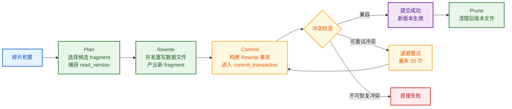
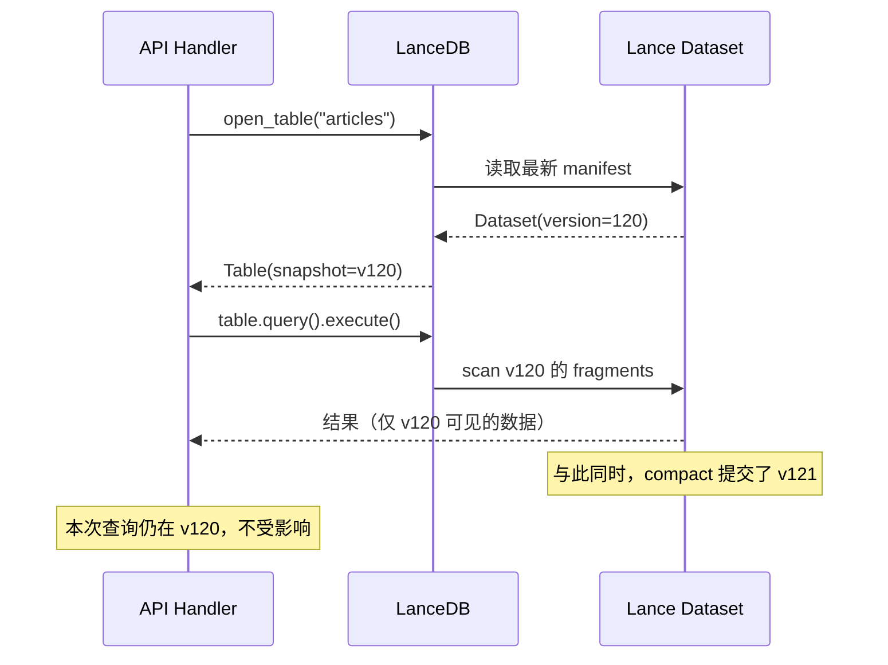

# LanceDB Compact 与事务冲突解决：源码级全链路拆解

> **代码版本**：LanceDB `0.26.2` / Lance `2.0.0`
> **项目映射**：StaticFlow（Axum + Yew + LanceDB 全栈 Rust 写作平台）

📌 **本文范围**：从一次 `compact` 调用出发，逐层拆解 Lance 的数据模型、快照读取、事务提交、冲突检测与退避重试机制，最终映射到 StaticFlow 后台 compactor 实现。
📌 **不展开**：向量索引训练、ANN 召回算法、前端查询策略。

---

## 1. 引言：一个真实问题

StaticFlow 后台运行着一个定时 compactor，每 3 分钟扫描所有 LanceDB 表，将碎片化的小 fragment 合并成大文件。同时，业务写入（文章发布、评论入库、播放记录等）随时可能发生。

这引出一个核心问题：

> **compact 与并发写入同时操作同一张表，数据会不会乱？**

直觉上，你可能会想到 LSM-tree 系统（如 RocksDB、LevelDB）中"读时遍历多版本 + tombstone 合并"的模型。但 Lance 的设计完全不同：

- **读取**：面向单一 manifest 快照，不跨版本拼接。
- **写入**：Copy-on-Write，产出新文件和新 manifest，不覆盖旧文件。
- **正确性**：在 **commit 阶段** 通过事务 rebase 和冲突检测保证，不推迟到读阶段。

> 💡 **Key Point**：Lance 的并发安全不靠"读时合并"，而靠"写时提交"。理解了 commit 链路，就理解了全部。

---

## 2. 全局概览：Compact 的完整生命周期

在深入细节之前，先看全貌。一次 compact 从触发到完成，经历以下阶段：



本文将沿这条主线，逐层展开每个阶段的内部机制：

| 章节 | 回答的问题 |
|---|---|
| §3 数据模型 | Lance 的数据组织方式是什么？version/manifest/fragment 各是什么？ |
| §4 读链路 | compact 产生新版本后，读请求看到的是哪个版本？ |
| §5 写链路 | 所有写操作（包括 compact）的提交靠什么机制保证正确？ |
| §6 Compact 全流程 | compact 内部的 Plan → Rewrite → Commit 具体做了什么？ |
| §7 冲突详解 | compact 遇到并发写入时，哪些场景兼容，哪些会冲突？ |
| §8 Prune | 旧版本文件何时安全清理？有什么陷阱？ |
| §9 StaticFlow 映射 | 项目的 compactor 实现有什么风险？ |

---

## 3. 前置概念：Lance 数据模型

### 3.1 四层存储结构

```
Dataset（一张表）
  └── Manifest vN（版本 N 的元数据快照）
        ├── Fragment A（数据分片，对应磁盘上的 .lance 文件）
        ├── Fragment B
        ├── Index metadata（该版本可见的索引）
        └── Transaction log（版本变更记录）
```

| 概念 | 职责 | 对应文件 |
|---|---|---|
| **Dataset** | 一张表的完整抽象，持有当前 manifest 引用 | `lance/src/dataset.rs` |
| **Manifest** | 某一版本的元数据快照：包含 fragment 列表、schema、索引列表 | `lance-table/src/format/manifest.rs` |
| **Fragment** | 数据分片，每个 fragment 包含一个或多个 data file + 可选 deletion file | `lance/src/dataset/fragment.rs` |
| **Transaction** | 版本变更的描述，包含 `read_version`（基于哪个版本读取）、操作类型、UUID | `lance/src/dataset/transaction.rs:86-94` |

用一个具体例子来理解这些概念如何协作：

```
v1:  manifest 引用 [F0(1000行), F1(500行), F2(200行)]   ← 初始状态，3 个 fragment
v2:  manifest 引用 [F0(1000行), F1(500行), F2(200行), F3(100行)]  ← append 新数据
v3:  manifest 引用 [F4(1800行)]                          ← compact 合并 F0-F3 为 F4

注意：v3 提交后，F0-F3 的文件仍在磁盘上（供 v1/v2 的历史读取使用）。
      只有 prune 清理旧版本后，这些文件才会被删除。
```

> 📝 **Terminology**：每次写操作（append、update、compact 等）都产生一个新版本号。旧版本的 manifest 和数据文件保留在磁盘上，直到被 prune 清理。这就是 Copy-on-Write 模型。

### 3.2 版本与快照语义

Lance 支持**时间旅行**——可以读取任意历史版本：

```rust
// 获取当前版本号
let version = table.version().await?;  // lancedb/src/table.rs:1162

// 读取历史版本（进入只读的 "detached HEAD" 状态）
table.checkout(120).await?;            // lancedb/src/table.rs:1180
```

这意味着读取的对象不是"所有历史版本的并集"，而是**单一版本的快照**。这个特性对理解后续的并发行为至关重要。

### 3.3 隔离级别

```rust
// lance/src/dataset/transaction.rs:15-16
//! Currently, conflict resolution always assumes a Serializable isolation level.
```

Lance 固定使用 **Serializable** 隔离级别——最严格的级别。任何可能导致不可序列化结果的并发操作都会被拒绝。

---

## 4. 读链路：快照读取，不跨版本

理解了数据模型后，第一个问题是：compact 产生新版本后，读请求看到的是哪个版本的数据？

### 4.1 StaticFlow 的数据访问模式

StaticFlow 采用"连接复用 + 表按需打开"的模式：

```rust
// shared/src/lancedb_api.rs:247-251 —— 连接只创建一次
pub async fn connect(db_uri: &str) -> Result<Self> {
    let db = connect(db_uri).execute().await?;
    Ok(Self { db, ... })
}

// shared/src/lancedb_api.rs:263-269 —— 每次请求重新打开表
pub async fn articles_table(&self) -> Result<Table> {
    self.db.open_table(&self.articles_table)
        .execute().await?
}
```

每次请求都 `open_table`，而不是缓存一个长生命周期的 `Table` 对象。这个选择对一致性很重要。

### 4.2 一致性守卫：三种模式

LanceDB 内部用 `DatasetConsistencyWrapper` 包装 Lance 的 `Dataset`（`lancedb/src/table/dataset.rs:19`），在每次读写前决定是否需要刷新快照。刷新策略由 `read_consistency_interval` 控制：

```rust
// lancedb/src/table/dataset.rs:238-260（简化）
async fn is_up_to_date(&self) -> Result<bool> {
    match (read_consistency_interval, last_consistency_check) {
        (None, _)              => Ok(true),   // Manual：永远认为最新，不主动刷新
        (Some(_), None)        => Ok(false),  // 首次检查：必须刷新
        (Some(rci), Some(lcc)) => Ok(&lcc.elapsed() < rci),  // Eventual：超时才刷新
    }
}
```

| `read_consistency_interval` | 模式 | 行为 | 适用场景 |
|---|---|---|---|
| `None`（**默认**） | Manual | 不自动刷新已打开的 Table | 每次都 `open_table` 的场景 |
| `Some(Duration::ZERO)` | Strong | 每次读写都刷新到最新版本 | 长生命周期 Table + 强一致要求 |
| `Some(非零)` | Eventual | 超过间隔才刷新 | 长生命周期 Table + 可容忍短暂延迟 |

默认值 `None` 来自 `ConnectBuilder`（`lancedb/src/connection.rs:935`）。`open_table` 时透传到 `NativeTable`（`lancedb/src/database/listing.rs:1023`）。

### 4.3 对 StaticFlow 的影响

StaticFlow 使用默认 `None`（Manual 模式），但因为**每次请求都 `open_table`**，每次打开都会读取最新 manifest。所以实际效果是每次请求都能看到最新数据。



> 💡 **Key Point**：快照读取保证**一次查询只看到一个版本的数据，不会出现"半新半旧"的脏读**。即使 compact 在查询过程中完成，当前查询也不受影响。

如果未来引入 `Table` 级缓存（全局单例），则必须配置 `read_consistency_interval`（推荐 Strong 或短间隔 Eventual），否则长期复用的 Table 会读到陈旧数据。

---

读链路的一致性靠快照保证，逻辑清晰。那么写链路呢？

当 compact 要把重写结果提交为新版本时，可能已经有其他写入者抢先提交了。Lance 靠什么处理这种竞争？答案在 `commit_transaction` 这个核心函数中。**理解了它，后面 compact 的冲突行为就是自然推论。**

## 5. 写链路：事务提交与冲突解决

### 5.1 统一入口

所有写操作——Append、Delete、Update、Compact（Rewrite）——最终都进入同一条提交链路：

```
业务写入 / compact_files
  → Transaction::new(read_version, Operation::Xxx)
    → dataset.apply_commit(transaction)          // lance/src/dataset.rs:1377-1406
      → commit_transaction()                      // lance/src/io/commit.rs:777-987
```

这是 Lance 中最关键的函数，所有并发正确性都在这里保证。

### 5.2 `commit_transaction` 主循环

```rust
// lance/src/io/commit.rs:777-987（简化伪代码，保留核心逻辑）
fn commit_transaction(dataset, transaction, commit_config) {
    let read_version = transaction.read_version;
    let num_attempts = max(commit_config.num_retries, 1);  // 默认 20 次
    let mut backoff = SlotBackoff::default();

    while backoff.attempt() < num_attempts {
        // ❶ 发现并发事务：加载 read_version 之后所有已提交的新事务
        let new_transactions = load_and_sort_new_transactions(&dataset);

        // ❷ 逐个检查兼容性
        let mut rebase = TransactionRebase::try_new(dataset, transaction);
        for (version, other_txn) in new_transactions {
            rebase.check_txn(other_txn, version)?;  // 不兼容则立即返回错误
        }

        // ❸ 完成 rebase（可能需要合并 deletion bitmap 等）
        let transaction = rebase.finish(&dataset)?;

        // ❹ 构建新 manifest 并尝试原子写入
        let manifest = build_manifest(dataset, transaction);
        match write_manifest_file(manifest) {
            Ok(_)  => return Ok(manifest),      // 成功
            Err(CommitConflict) => {
                sleep(backoff.next_backoff());   // ❺ 退避后重试
                continue;
            }
            Err(other) => return Err(other),    // 非冲突错误直接失败
        }
    }
    Err("Failed after N retries")
}
```

把五个步骤串起来理解：

| 步骤 | 做什么 | 为什么 |
|---|---|---|
| ❶ 加载新事务 | 扫描 `read_version` 后的所有已提交事务 | 发现"我读的版本之后发生了什么" |
| ❷ 冲突检测 | 用 `TransactionRebase` 逐个检查兼容性 | 判断"我的操作和它们是否矛盾" |
| ❸ 完成 rebase | 调整事务内容以适配最新状态 | 例如：合并 deletion bitmap |
| ❹ 写 manifest | 原子写入新版本文件 | 只有一个写入者能抢到版本号 |
| ❺ 退避重试 | 被抢先时等待一个随机时间后重试 | 避免多个写入者同时重试导致活锁 |

### 5.3 两种冲突错误

冲突检测可能产生两种错误，决定了后续行为：

```rust
// lance-core/src/error.rs:48-59
CommitConflict { version, source }            // 不可重试：语义不兼容
RetryableCommitConflict { version, source }   // 可重试：被抢先，重试有望成功
```

它们在 `conflict_resolver.rs:160-190` 中生成：

```rust
// 可重试 —— 对方抢先修改了同一个 fragment，但重新规划后可能不再冲突
fn retryable_conflict_err(&self, ...) -> Error {
    Error::RetryableCommitConflict { version, source: "...preempted...".into() }
}

// 不可重试 —— 对方做了整表替换（Overwrite），我的操作已经没有意义
fn incompatible_conflict_err(&self, ...) -> Error {
    Error::CommitConflict { version, source: "...incompatible...".into() }
}
```

> 🤔 **Think About**：为什么要区分？以 compact 为例——如果并发的是 Append（追加新数据），compact 的 rewrite 仍然有效，重试即可。但如果并发的是 Overwrite（整表替换），compact 基于的旧 fragment 已经全部消失，重试毫无意义。

### 5.4 退避策略：SlotBackoff

重试时 Lance 使用**时间槽随机选取**而非经典指数退避（`lance-core/src/utils/backoff.rs:80-146`）：

```rust
fn next_backoff(&mut self) -> Duration {
    let num_slots = 2u32.pow(self.attempt + 2);  // 4, 8, 16, 32...
    let slot_i = self.rng.random_range(0..num_slots);
    Duration::from_millis(slot_i * self.unit)     // unit 默认 50ms
}
```

| 重试次数 | 可选 slot 数 | 等待范围（unit=50ms） |
|---|---|---|
| 第 1 次 | 4 | 0-150ms |
| 第 2 次 | 8 | 0-350ms |
| 第 3 次 | 16 | 0-750ms |
| 第 4 次 | 32 | 0-1550ms |

两个精巧的设计：
- **slot 数翻倍增长 + 随机选取**：多个并发写入者自然分散到不同时间点，比固定退避更少碰撞。
- **动态校准 unit**（`commit.rs:956-961`）：首次冲突后，用实际 IO 耗时 × 1.1 替换默认 50ms。这使得本地 SSD 和远程 S3 自动适配不同的存储延迟。

---

现在我们理解了通用的提交机制。接下来看 compact 如何利用这条链路——它的 Plan、Rewrite、Commit 三个阶段各做了什么。

## 6. Compact 全流程：Plan → Rewrite → Commit

### 6.1 三个动作，一个入口

LanceDB 的 `optimize` 接口提供了四种调用方式：

```rust
// lancedb/src/table.rs:178-234
pub enum OptimizeAction {
    All,                    // 按顺序执行 Compact → Prune → Index
    Compact { options, remap_options },
    Prune { older_than, delete_unverified, error_if_tagged_old_versions },
    Index(OptimizeOptions),
}
```

`OptimizeAction::All` 内部**严格串行**执行三步（`lancedb/src/table.rs:3019-3035`）：

```rust
// 第 1 步：合并小 fragment
stats.compaction = self.optimize(OptimizeAction::Compact { ... }).await?.compaction;
// 第 2 步：清理旧版本
stats.prune = self.optimize(OptimizeAction::Prune { ... }).await?.prune;
// 第 3 步：优化索引
self.optimize(OptimizeAction::Index(...)).await?;
```

> ⚠️ **Gotcha**：三步用 `.await?` 串联。如果 Compact 失败（比如事务冲突），Prune 和 Index **不会执行**。一次冲突不仅阻止了合并，也阻止了版本清理。

### 6.2 Plan 阶段：谁会被 compact？

`DefaultCompactionPlanner::plan()` 遍历所有 fragment，按两个条件筛选候选：

```rust
// lance/src/dataset/optimize.rs:283-294
let candidacy = if options.materialize_deletions
    && metrics.deletion_percentage() > options.materialize_deletions_threshold
{
    Some(CompactItself)        // 条件 1：删除比例 > 阈值（默认 10%）
} else if metrics.physical_rows < options.target_rows_per_fragment {
    Some(CompactWithNeighbors)  // 条件 2：行数 < 目标值（默认 1M 行）
} else {
    None  // 不参与 compact
};
```

用一个具体例子理解筛选过程：

```
假设 target_rows_per_fragment = 1M, materialize_deletions_threshold = 10%

Fragment 列表：
  F0: 1,200,000 行, 0% 删除   → 不参与（行数够大，删除率正常）
  F1: 300,000 行, 0% 删除     → CompactWithNeighbors（行数不足 1M）
  F2: 500,000 行, 0% 删除     → CompactWithNeighbors（行数不足 1M）
  F3: 800,000 行, 25% 删除    → CompactItself（删除比例 > 10%）

结果：
  任务 1: 合并 F1 + F2 → 新 fragment（800K 行）
  任务 2: 重写 F3 → 新 fragment（600K 存活行）
  F0 不参与
```

**关键约束**：相邻候选 fragment 必须拥有**相同的索引集合**才能合并（`optimize.rs:313`）。

Plan 阶段最重要的一步是**捕获 `read_version`**：

```rust
// lance/src/dataset/optimize.rs:353-354
let compaction_plan = CompactionPlan::new(
    dataset.manifest.version,  // ← Plan 时刻的版本号，贯穿后续所有阶段
    self.options.clone(),
);
```

### 6.3 Rewrite 阶段：并发重写数据文件

Plan 产出的多个任务通过 `buffer_unordered` 并发执行：

```rust
// lance/src/dataset/optimize.rs:393-404
let result_stream = futures::stream::iter(compaction_plan.tasks.into_iter())
    .map(|task| rewrite_files(Cow::Borrowed(dataset_ref), task, &options))
    .buffer_unordered(num_cpus);  // 默认 = CPU 核数
let completed_tasks: Vec<RewriteResult> = result_stream.try_collect().await?;
```

每个 `rewrite_files` 的工作：

1. **扫描旧 fragment** → 读取所有存活行（跳过已标记删除的行）
2. **写入新 fragment 文件** → 产出新的 `.lance` 数据文件
3. **生成行 ID 映射** → `old_row_id → new_row_id`，供索引重映射使用
4. **返回 `RewriteResult`** → 包含 `original_fragments`、`new_fragments`、`read_version`

> 📝 **Terminology**：`rewrite_files` **只产出新文件，不修改旧文件**。这是 Copy-on-Write 的核心。旧文件直到 prune 时才被清理。

### 6.4 Commit 阶段：构建事务并提交

所有 rewrite 任务完成后，`commit_compaction` 将结果打包为一个 `Rewrite` 事务：

```rust
// lance/src/dataset/optimize.rs:1115-1127
let transaction = Transaction::new(
    dataset.manifest.version,   // read_version：Plan 阶段捕获的版本
    Operation::Rewrite {
        groups: rewrite_groups,  // Vec<{ old_fragments, new_fragments }>
        rewritten_indices,       // 重映射后的索引
        frag_reuse_index,        // 可选的 fragment 复用索引
    },
    None,
);
dataset.apply_commit(transaction, &Default::default(), &Default::default()).await?;
```

`apply_commit` 调用 §5.2 中的 `commit_transaction` 主循环，此时才进行冲突检测。

> 💡 **Key Point**：从 Plan 到 Commit 之间可能经过数秒甚至数分钟。在此期间，其他写入者可能已经提交了新版本。**这不是 bug，而是设计**——Commit 阶段会发现并处理这些并发事务。

---

Compact 的三阶段（Plan → Rewrite → Commit）清楚了。但关键问题还没回答：Commit 阶段的冲突检测具体怎么判断？compact 遇到不同类型的并发操作时，哪些兼容，哪些会冲突？

## 7. 冲突详解：Compact 遇到并发操作会怎样？

Compact 本质上是一个 `Rewrite` 操作。它与各种并发事务的兼容性由 `check_rewrite_txn`（`lance/src/io/commit/conflict_resolver.rs:706-885`）决定。

### 7.1 总览：兼容矩阵

先看全貌，再逐个拆解：

| 并发已提交操作 | 结果 | 原因 |
|---|---|---|
| **Append** | ✅ 兼容 | 新增数据在全新 fragment 中，不触碰被重写的旧 fragment |
| **Delete / Update**（不同 fragment） | ✅ 兼容 | 修改范围不相交 |
| **Delete / Update**（同一 fragment） | ⚠️ 可重试冲突 | 同一个 fragment 被两方操作，需要重新规划 |
| **Rewrite**（不同 fragment） | ✅ 兼容 | 重写范围不相交 |
| **Rewrite**（同一 fragment 或双方都有 frag_reuse_index） | ⚠️ 可重试冲突 | 不能并发重写同一批 fragment |
| **Merge** | ⚠️ 可重试冲突 | Merge 与几乎所有数据修改操作冲突 |
| **Overwrite / Restore** | ❌ 不可恢复冲突 | 整表被替换，rewrite 基础已不存在 |

核心判定逻辑只有一条：**两方操作是否涉及同一个 fragment？**

```rust
// conflict_resolver.rs:737-748（Rewrite vs Delete/Update 的判定）
if updated_fragments.iter().map(|f| f.id)
    .chain(deleted_fragment_ids.iter().copied())
    .any(|id| self.modified_fragment_ids.contains(&id))  // fragment ID 有交集？
{
    Err(self.retryable_conflict_err(...))   // 有 → 冲突
} else {
    Ok(())                                   // 无 → 兼容
}
```

> 🤔 **Think About**：为什么 `Rewrite vs Append` 永远兼容？因为 Append 产生的是**全新 fragment**（新 ID），而 Rewrite 的 `modified_fragment_ids` 只包含旧 fragment 的 ID。两者没有交集的可能。

接下来用四个场景，从最常见到最极端，逐个说明。

### 7.2 场景 A：与 Append 交错 —— 最常见，永远兼容

这是 StaticFlow 日常运行中最频繁的场景：后台 compact 和业务写入同时发生。

```
时间线         Compactor                        Writer
─────────────────────────────────────────────────────────────
T0           table version = 120
T1           plan: rewrite F1, F2
             read_version = 120
T2                                             append 新数据 → F3
                                               commit → v121
T3           rewrite 完成，commit starts
T4           load txns since v120
             发现 v121 (Append)
T5           check_rewrite_txn:
             Rewrite vs Append → 兼容 ✅
T6           rebase.finish() → OK
T7           write manifest → v122 ✅
─────────────────────────────────────────────────────────────
v122 的 manifest: [F4(合并后), F3(append 的)]
数据完整，无丢失 ✅
```

**为什么兼容**：Append 的 F3 是新 ID，与 compact 要替换的 F1、F2 完全不相交（`conflict_resolver.rs:720-727`）。rebase 后的 manifest 同时包含两方的结果。

### 7.3 场景 B：与 Update 命中同一 Fragment —— 冲突但安全

```
时间线         Compactor                        Writer
─────────────────────────────────────────────────────────────
T0           table version = 200
T1           plan: rewrite F10, F11
             read_version = 200
T2                                             update rows in F11
                                               commit → v201
T3           rewrite 完成，commit starts
T4           load txns since v200
             发现 v201 (Update on F11)
T5           check_rewrite_txn:
             F11 ∈ modified_fragment_ids
             → RetryableConflict ❌
T6           本次 compact 退出
─────────────────────────────────────────────────────────────
v201 保持不变（只有 writer 的 update）
下一个 compact 周期基于 v201 重新 plan，可正常完成
```

**为什么冲突**：compact 计划基于 v200 的 F11 进行重写，但 F11 已经被 update 修改了。如果强行提交，compact 产出的新 fragment 会包含 F11 的旧数据，丢失 update 的修改。

> 💡 **Key Point**：冲突失败不是 bug，而是**正确性保护**。"这轮没压成"只是性能延迟，数据完整性不受任何影响。

### 7.4 场景 C：两个 Compact 并发 —— frag_reuse_index 冲突

Lance 有明确的测试覆盖了这个场景（`lance/src/dataset/optimize.rs:2857-2919`）：

```
时间线         Compactor A                      Compactor B
─────────────────────────────────────────────────────────────
T0           plan: rewrite F1, F2               plan: rewrite F3, F4
             read_version = 100                read_version = 100
T1           rewrite 完成
             commit → v101 ✅
T2                                             rewrite 完成
                                               commit starts
T3                                             load txns since v100
                                               发现 v101 (Rewrite)
T4                                             双方都有 frag_reuse_index
                                               → RetryableConflict ❌
```

即使 F1/F2 和 F3/F4 **没有交集**，当双方都产生了 `frag_reuse_index` 时仍会冲突（`conflict_resolver.rs:767-776`）：

```rust
// 即使 old_fragments 无交集，如果双方都有 frag_reuse_index → 冲突
} else if committed_fri.is_some() && frag_reuse_index.is_some() {
    Err(self.retryable_conflict_err(...))
}
```

测试用 `assert!` 验证了这一行为：

```rust
// lance/src/dataset/optimize.rs:2910-2918
let result = commit_compaction(&mut dataset_clone, ...).await;
assert!(matches!(result, Err(Error::RetryableCommitConflict { .. })));
```

### 7.5 场景 D：与 Overwrite —— 不可恢复

```
时间线         Compactor                        Writer
─────────────────────────────────────────────────────────────
T0           plan: rewrite F1, F2
T1                                             OVERWRITE 整表 → v201
T2           commit starts
             check_rewrite_txn:
             Rewrite vs Overwrite
             → IncompatibleConflict 💀（不重试）
```

**为什么不重试**：Overwrite 意味着整个 fragment 结构已被替换，compact 基于的 F1、F2 在新版本中已不存在。即使重试也无法恢复。

### 7.6 最后防线：Manifest 构建时的兜底检查

即使通过了所有冲突检测，构建 manifest 时还有一道安全网——如果 `old_fragments` 在当前 manifest 中已不存在，直接拒绝：

```rust
// lance/src/dataset/transaction.rs:2556-2602
fn handle_rewrite_fragments(final_fragments, groups, ...) {
    for group in groups {
        let start = final_fragments.iter()
            .find(|(_, f)| f.id == group.old_fragments[0].id)
            .ok_or_else(|| Error::CommitConflict {
                source: format!("fragment id={} not found", group.old_fragments[0].id).into(),
            })?;
        final_fragments.splice(replace_range, new_fragments);
    }
}
```

这是**防御性编程**——即使 rebase 逻辑有遗漏，这里也能兜住。

---

## 8. Prune 与 Cleanup：版本清理的安全边界

Compact 提交成功后，旧 fragment 文件仍在磁盘上。Prune 负责清理它们，释放空间。

### 8.1 Prune 不影响正确性

Prune 只做空间回收——删除旧版本 manifest 及其不再被引用的数据文件。即使永远不 prune，数据也是正确的，只是磁盘占用会持续增长。

### 8.2 未验证文件保护

Lance 有一个关键的安全机制防止 prune 误删正在写入的临时文件：

```rust
// lance/src/dataset/cleanup.rs:114
const UNVERIFIED_THRESHOLD_DAYS: i64 = 7;

// lance/src/dataset/cleanup.rs:289-303
let maybe_in_progress = !self.policy.delete_unverified
    && obj_meta.last_modified >= verification_threshold;  // 7 天内的文件视为"可能在途"
```

文件保护决策（优先级从高到低）：

| 条件 | 操作 | 原因 |
|---|---|---|
| 被当前工作版本引用 | **不删除** | 还在用 |
| 文件超过 7 天，或 `delete_unverified=true` | 删除 | 已确认不是在途事务 |
| 被某个旧 manifest 引用（已验证） | 删除 | 旧版本不再需要 |
| 其他 | **不删除** | 可能是进行中事务产生的临时文件 |

### 8.3 StaticFlow 的两种 Prune 策略

**后台 compactor（保守）**——适合常驻运行：

```rust
// shared/src/optimize.rs:89-94
OptimizeAction::Prune {
    older_than: Some(Duration::hours(2)),  // 只清理 2 小时前的版本
    delete_unverified: Some(false),        // 不删除未验证文件
    error_if_tagged_old_versions: Some(false),
}
```

**CLI 手动模式（激进）**——适合低峰期维护：

```rust
// cli/src/commands/db_manage.rs:411-417
older_than: Duration::seconds(0),      // 立即清理所有旧版本
delete_unverified: true,               // 强制删除未验证文件
```

> ⚠️ **Gotcha**：`prune_now` 在写入高峰期执行时，`delete_unverified=true` 可能删除正在写入的临时文件，导致其他事务失败。只在确认无并发写入时使用。

---

## 9. StaticFlow 后台 Compactor 实战映射

### 9.1 调度设计

StaticFlow 的 compactor 运行在 `tokio::spawn` 中，按固定间隔扫描所有 DB（`backend/src/state.rs:396-478`）：

| 参数 | 默认值 | 环境变量 |
|---|---|---|
| 扫描间隔 | 180 秒 | `TABLE_COMPACT_SCAN_INTERVAL_SECS` |
| 小 fragment 阈值 | 10 个 | `TABLE_COMPACT_FRAGMENT_THRESHOLD` |
| 启动延迟 | 60 秒 | 硬编码 |
| Prune 保留时间 | 2 小时 | 硬编码 |

调度循环的核心逻辑：

1. 启动后延迟 60 秒，避开 schema 迁移期
2. 串行扫描 5 个 DB 组（content × 2、comments、music × 2）
3. 对每张表：查 `stats().fragment_stats.num_small_fragments`，< 阈值则跳过
4. 超过阈值则执行 `optimize_all_with_fallback` + prune
5. 等待下一周期或 shutdown 信号

### 9.2 Offset Overflow 回退

StaticFlow 遇到过 Arrow offset overflow 错误（大 Utf8 列合并时触发），实现了自动回退（`shared/src/optimize.rs:113-153`）：

```rust
async fn optimize_all_with_fallback(table: &Table) -> Result<(), String> {
    match table.optimize(OptimizeAction::All).await {
        Ok(_) => Ok(()),
        Err(err) if is_offset_overflow_error(&err) => {
            // 正常合并触发 overflow → 回退到保守参数
            let options = CompactionOptions {
                batch_size: Some(8),                          // 每批最多 8 个 fragment
                max_rows_per_group: 8,
                max_bytes_per_file: Some(512 * 1024 * 1024),  // 512MB 上限
                ..Default::default()
            };
            table.optimize(OptimizeAction::Compact { options, remap_options: None }).await?;
            table.optimize(OptimizeAction::Index(OptimizeOptions::default())).await?;
            // 注意：回退模式下 Prune 被跳过，交给下一轮正常周期处理
            Ok(())
        }
        Err(err) => Err(format!("compact failed: {err:#}")),
    }
}
```

### 9.3 风险评估

| 维度 | 风险等级 | 分析 |
|---|---|---|
| **数据正确性** | 低 | compact 走统一事务链路，冲突时 fail-fast，不会产出错误 manifest |
| **碎片收敛** | 中 | 高并发写入时 compact 可能频繁冲突导致"本轮没压成"，但下轮会重试 |
| **磁盘空间** | 低-中 | 默认 2 小时保留 + `delete_unverified=false`，空间回收保守但安全 |
| **手动 prune** | 可控 | `prune_now` 在写入高峰期有风险，需确认无并发写入 |

### 9.4 运维验证清单

当怀疑 compact 与写入冲突时，按顺序验证：

1. **看日志**：搜索 `compactor content/xxx:` 或 `compactor music/xxx:` 的 warn 级别输出
2. **看碎片趋势**：用 `table.stats().fragment_stats.num_small_fragments` 确认碎片数是否在多个周期后下降
3. **看行数**：compact 前后抽样对比总行数（应一致，除非有并发写入增加行）
4. **看 prune 窗口**：如果执行了 `prune_now`，确认执行时间是否与写入高峰重叠

> 💡 **Key Point**：冲突存在不代表出了问题。对 compact 来说，冲突失败是**正确性保护**的正常行为，关键看碎片数是否在多个周期后收敛。

---

## 10. 常见误解纠偏

### 误解 1：读取会扫描所有历史版本并合并

**事实**：读取只面向单一 manifest 快照，不做跨版本拼接。这是 Lance 与 LSM-tree 系统的根本差异。

### 误解 2：Compact 与并发写入会导致数据错乱

**事实**：兼容的事务会 rebase 后提交；不兼容的事务返回冲突错误并失败。**要么成功且正确，要么失败**——不存在"静默提交错误结果"的可能。

### 误解 3：Compact 冲突失败意味着出了问题

**事实**：`RetryableCommitConflict` 是正确性保护机制的正常输出。冲突失败只意味着"这轮让位给了其他写入者"，下轮会基于新版本重新规划。关键看碎片数是否在多个周期后收敛。

### 误解 4：Prune 是数据正确性的必要步骤

**事实**：Prune 只做空间回收，与正确性无关。即使永远不 prune，数据也是正确的。

### 误解 5：`read_consistency_interval=None` 就看不到最新数据

**事实**：`None` 意味着不自动刷新已打开的 Table 对象。但如果你每次都 `open_table`（像 StaticFlow 那样），每次打开都会读取最新 manifest，不受此设置影响。

---

## 11. 落地建议

1. **维持现有 compactor 保守策略**：`delete_unverified=false` + `older_than=2h` 是安全的生产配置。
2. **`prune_now` 仅在低写入窗口执行**：确认无并发写入再用 `delete_unverified=true`。
3. **监控 compact 冲突率**：如果日志中频繁出现冲突警告，优先拉长扫描间隔避开写入高峰，而非提高 prune 激进度。
4. **保持按需 `open_table` 模式**：当前设计天然避免了陈旧视图问题。如果未来引入 Table 缓存，必须配置 `read_consistency_interval`。

---

## 12. Code Index

### StaticFlow 项目

| 文件 | 行号 | 说明 |
|---|---|---|
| `shared/src/lancedb_api.rs` | `:247-251` | `connect()` 连接入口 |
| `shared/src/lancedb_api.rs` | `:263-269` | `articles_table()` 按需打开 |
| `shared/src/optimize.rs` | `:33-43` | `scan_and_compact_tables` 批量扫描入口 |
| `shared/src/optimize.rs` | `:45-111` | `check_and_compact` 单表 compact + prune |
| `shared/src/optimize.rs` | `:113-153` | `optimize_all_with_fallback` offset overflow 回退 |
| `backend/src/state.rs` | `:396-478` | `spawn_table_compactor` 调度主循环 |
| `cli/src/commands/db_manage.rs` | `:411-417` | `prune_now` 激进清理参数 |

### LanceDB 0.26.2

| 文件 | 行号 | 说明 |
|---|---|---|
| `lancedb/src/table.rs` | `:178-234` | `OptimizeAction` 枚举定义 |
| `lancedb/src/table.rs` | `:1162-1182` | `version()` / `checkout()` |
| `lancedb/src/table.rs` | `:3012-3062` | `optimize()` All 执行顺序 |
| `lancedb/src/table.rs` | `:1918-1926` | `compact_files` LanceDB → Lance 桥接 |
| `lancedb/src/table.rs` | `:1898-1910` | `cleanup_old_versions` Prune 桥接 |
| `lancedb/src/table/dataset.rs` | `:15-35` | `DatasetConsistencyWrapper` 定义 |
| `lancedb/src/table/dataset.rs` | `:154-170` | `get()` / `get_mut()` 一致性守卫 |
| `lancedb/src/table/dataset.rs` | `:238-260` | `is_up_to_date()` 三种模式 |
| `lancedb/src/connection.rs` | `:929-941` | `ConnectBuilder` 默认 `read_consistency_interval=None` |
| `lancedb/src/database/listing.rs` | `:1016-1028` | `open_table` 透传一致性配置 |

### Lance 2.0.0

| 文件 | 行号 | 说明 |
|---|---|---|
| `lance/src/io/commit.rs` | `:777-987` | `commit_transaction` 主循环 |
| `lance/src/io/commit.rs` | `:764-775` | `load_and_sort_new_transactions` |
| `lance/src/io/commit.rs` | `:956-961` | 首次冲突动态校准 backoff unit |
| `lance/src/io/commit/conflict_resolver.rs` | `:28-41` | `TransactionRebase` 结构体 |
| `lance/src/io/commit/conflict_resolver.rs` | `:160-190` | 两种冲突错误生成方法 |
| `lance/src/io/commit/conflict_resolver.rs` | `:198-231` | `check_txn` 总分发入口 |
| `lance/src/io/commit/conflict_resolver.rs` | `:706-885` | `check_rewrite_txn` 完整兼容规则 |
| `lance/src/io/commit/conflict_resolver.rs` | `:1665-1743` | `finish_rewrite` frag_reuse_index rebase |
| `lance/src/dataset/optimize.rs` | `:283-294` | Fragment 候选条件 |
| `lance/src/dataset/optimize.rs` | `:353-354` | Plan 阶段捕获 `read_version` |
| `lance/src/dataset/optimize.rs` | `:393-404` | Rewrite 并发执行 |
| `lance/src/dataset/optimize.rs` | `:1035-1130` | `commit_compaction` 提交阶段 |
| `lance/src/dataset/optimize.rs` | `:2857-2919` | 并发 compact 冲突测试 |
| `lance/src/dataset/transaction.rs` | `:15-16` | Serializable 隔离级别 |
| `lance/src/dataset/transaction.rs` | `:2556-2602` | `handle_rewrite_fragments` 最后防线 |
| `lance/src/dataset/cleanup.rs` | `:114` | `UNVERIFIED_THRESHOLD_DAYS = 7` |
| `lance/src/dataset/cleanup.rs` | `:289-303` | `delete_unverified` 保护逻辑 |
| `lance/src/dataset.rs` | `:1377-1406` | `apply_commit` manifest 更新 |
| `lance-core/src/error.rs` | `:48-59` | 冲突错误类型定义 |
| `lance-core/src/utils/backoff.rs` | `:80-146` | `SlotBackoff` 退避算法 |
| `lance-table/src/io/commit.rs` | `:1114-1128` | `CommitConfig` 默认 20 次重试 |

---

## References

- LanceDB crate 源码：`~/.cargo/registry/src/rsproxy.cn-e3de039b2554c837/lancedb-0.26.2/`
- Lance core 源码：`~/.cargo/registry/src/rsproxy.cn-e3de039b2554c837/lance-2.0.0/`
- Lance core error types：`~/.cargo/registry/src/rsproxy.cn-e3de039b2554c837/lance-core-2.0.0/`
- Lance table commit config：`~/.cargo/registry/src/rsproxy.cn-e3de039b2554c837/lance-table-2.0.0/`
- StaticFlow compactor：`shared/src/optimize.rs`、`backend/src/state.rs`、`cli/src/commands/db_manage.rs`
