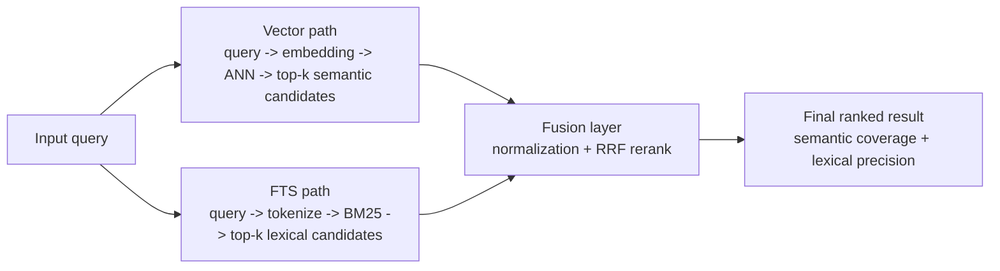
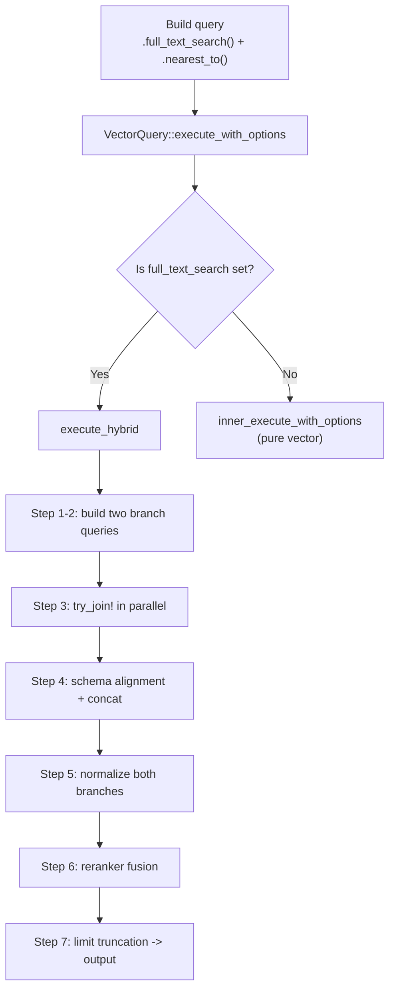
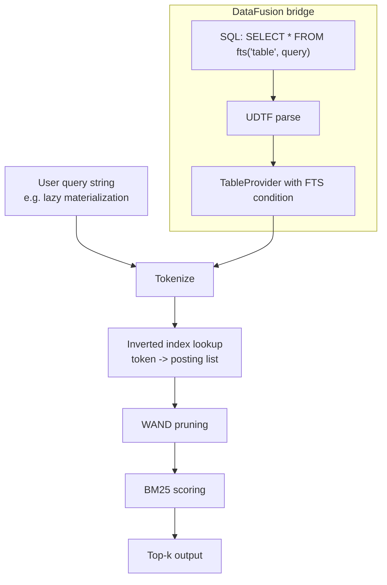
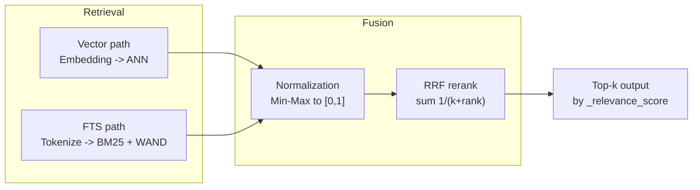

# LanceDB Hybrid Search Deep Dive: Execution Pipeline, Core Formulas, and Practical Tuning

> **Source Versions**: Based on `lancedb v0.23.0` and `lance-index v1.0.0`.

## 1. Why Hybrid Search Is Necessary

A single retrieval path always has blind spots in real-world workloads. Start with a concrete example.

**Scenario**: Your knowledge base contains an article titled `Tokio Runtime Async Scheduling Architecture`.

| Query | FTS (Full-Text Search) | Vector Search | Hybrid Search |
|------|-------------------------|---------------|---------------|
| `"Tokio Runtime"` | Exact lexical hit in title | Often retrieved, but may include other "async runtime" posts | Hits from both paths, typically ranked higher |
| `"Rust async runtime"` | May miss completely (different wording) | Semantic match, usually retrieved | Vector path catches recall gaps |
| `"tokio 1.38 changelog"` | Strong exact hit on "tokio" and version terms | May pull nearby but wrong versions | FTS path stabilizes exact constraints |

> **FTS (Full-Text Search)**: lexical matching over an inverted index, similar to keyword search engines.
>
> **Vector Search**: transforms text into dense embeddings, then uses ANN to retrieve semantically similar documents.

The core tension is:

- **FTS is strong at exact lexical constraints**, but weak under semantic rewrites ("async runtime" vs "Tokio Runtime").
- **Vector search is strong at semantic generalization**, but unstable under strict lexical constraints ("tokio 1.38" may still rank "tokio 1.35").

Hybrid search does not replace either path. It combines them.



## 2. Core Formulas: Intuition First, Then Source Code

### 2.1 RRF (Reciprocal Rank Fusion)

#### 2.1.1 What Problem RRF Solves

Hybrid search gives you two rankings: one from vector retrieval and one from FTS. The question is: **how do you merge two independent rankings into one final ranking?**

A naive idea is score summation, but score scales differ by nature (distance vs BM25 score). Direct summation is not principled. RRF avoids this by **ignoring raw scores and using rank only**. A higher position contributes a larger value; if a document ranks high in both paths, contributions accumulate.

#### 2.1.2 Formula

$$
\text{RRF}(d)=\sum_{i=1}^{m}\frac{1}{k+\operatorname{rank}_i(d)}
$$

Variable definitions:

| Symbol | Meaning | Example |
|------|------|------|
| $d$ | candidate document | doc id=42 |
| $m$ | number of retrieval paths | 2 (vector + FTS) |
| $\operatorname{rank}_i(d)$ | document rank in path $i$ | rank 3 in vector path |
| $k$ | smoothing constant | default 60 |

> **Intuition**: The core term is $\frac{1}{k+rank}$. Better rank means larger contribution, while $k$ controls head dominance.
>
> Without $k$ (i.e., $k=0$), top rank could dominate too aggressively. $k$ adds a denominator floor.

#### 2.1.3 How k Changes Ranking Shape

| rank (0-based) | score with k=1 | score with k=60 |
|---------------|----------------|-----------------|
| 0 | 1/(1+0) = **1.000** | 1/(60+0) = **0.01667** |
| 1 | 1/(1+1) = **0.500** | 1/(60+1) = **0.01639** |
| 2 | 1/(1+2) = **0.333** | 1/(60+2) = **0.01613** |
| 3 | 1/(1+3) = **0.250** | 1/(60+3) = **0.01587** |
| 4 | 1/(1+4) = **0.200** | 1/(60+4) = **0.01563** |
| **Rank1 vs Rank2 gap** | **2x** | **~1.02x** |

- **Smaller k**: stronger head dominance; top ranks separate more aggressively.
- **Larger k**: smoother decay; fusion becomes more democratic.
- **k=60** is the common recommendation from the original RRF paper ([Cormack et al., SIGIR 2009](https://plg.uwaterloo.ca/~gvcormac/cormacksigir09-rrf.pdf)).

#### 2.1.4 LanceDB Implementation

```rust
// lancedb-0.23.0/src/rerankers/rrf.rs:85-102
let mut rrf_score_map = BTreeMap::new();
let mut update_score_map = |(i, result_id)| {
    // i is a 0-based rank index from enumerate()
    let score = 1.0 / (i as f32 + self.k);
    rrf_score_map
        .entry(result_id)
        .and_modify(|e| *e += score)  // add if appears in multiple paths
        .or_insert(score);
};
// iterate vector ranking first, then FTS ranking
vector_ids.values().iter().enumerate().for_each(&mut update_score_map);
fts_ids.values().iter().enumerate().for_each(&mut update_score_map);
```

> **0-based vs 1-based**: LanceDB uses `enumerate()` (0-based). So top rank uses `1/(k+0)`, while papers often show `1/(k+1)`. This is a constant offset convention, not a conceptual mismatch.

Default k:

```rust
// lancedb-0.23.0/src/rerankers/rrf.rs:39-42
impl Default for RRFReranker {
    fn default() -> Self {
        Self { k: 60.0 }  // paper-recommended default
    }
}
```

### 2.2 BM25 Scoring Formula

> **BM25 (Best Matching 25)** is the classic lexical relevance scoring function used broadly by Lucene/Elasticsearch ecosystems. LanceDB uses BM25 in its FTS path.

#### 2.2.1 What BM25 Solves

FTS must answer: **for a query term, how relevant is each document?**

Raw term frequency alone fails because:

1. Extremely common terms are not discriminative.
2. Longer documents naturally contain more terms.

BM25 addresses this via three parts: IDF (rarity), TF saturation, and document length normalization.

#### 2.2.2 Formula Breakdown

$$
\text{BM25}(q,d)=\sum_{t\in q} \underbrace{IDF(t)}_{\text{term discrimination}} \cdot \underbrace{\frac{f(t,d)\cdot (k_1+1)}{f(t,d)+k_1\cdot\left(1-b+b\cdot \frac{|d|}{avgdl}\right)}}_{\text{TF + length normalization}}
$$

**1) IDF (Inverse Document Frequency)**

IDF quantifies rarity across the corpus.

$$
IDF(t)=\ln\left(\frac{N-n_t+0.5}{n_t+0.5}+1\right)
$$

Where $N$ is corpus size and $n_t$ is number of documents containing term $t$.

**2) TF part with saturation**

Term frequency contributes relevance, but with diminishing returns:

- biggest gain from 0 -> 1,
- then slower growth,
- upper-bounded behavior as frequency gets very large.

**3) Document length normalization**

$1-b+b\cdot\frac{|d|}{avgdl}$ compensates long-document bias.

#### 2.2.3 Meaning of K1 and B

| Parameter | Lance default | Controls | Effect |
|------|------|------|------|
| $k_1$ | **1.2** | TF saturation speed | larger $k_1$ -> high TF gains more weight; $k_1=0$ removes TF effect |
| $b$ | **0.75** | length penalty strength | $b=0$ no length penalty; $b=1$ full proportional normalization |

#### 2.2.4 Manual Calculation Example

Suppose a tiny corpus with 3 docs and query term `"LanceDB"`:

```text
doc₀: "LanceDB vector search"                           (3 terms)
doc₁: "vector database for search and analytics"       (6 terms)
doc₂: "LanceDB is a vector database"                    (5 terms)
```

**Step 1: Statistics**

- $N = 3$
- $n_t = 2$ (doc₀, doc₂ contain "LanceDB")
- $avgdl = (3 + 6 + 5) / 3 = 4.67$

**Step 2: IDF**

$$
IDF = \ln\left(\frac{3 - 2 + 0.5}{2 + 0.5} + 1\right) = \ln\left(\frac{1.5}{2.5} + 1\right) = \ln(1.6) \approx 0.47
$$

**Step 3: Document scores** ($k_1=1.2$, $b=0.75$, $f=1$)

doc₀:

$$
doc\_norm = 1.2 \times (1 - 0.75 + 0.75 \times \frac{3}{4.67}) = 1.2 \times 0.732 = 0.878
$$
$$
doc\_weight = \frac{2.2 \times 1}{1 + 0.878} = \frac{2.2}{1.878} = 1.171
$$
$$
score_0 = 0.47 \times 1.171 = \mathbf{0.550}
$$

doc₂:

$$
doc\_norm = 1.2 \times (1 - 0.75 + 0.75 \times \frac{5}{4.67}) = 1.2 \times 1.053 = 1.264
$$
$$
doc\_weight = \frac{2.2 \times 1}{1 + 1.264} = \frac{2.2}{2.264} = 0.972
$$
$$
score_2 = 0.47 \times 0.972 = \mathbf{0.457}
$$

doc₁ does not contain term -> $score_1 = 0$.

Conclusion: doc₀ > doc₂ due to shorter length and higher term density.

#### 2.2.5 Lance Source Implementation

```rust
// lance-index-1.0.0/src/scalar/inverted/scorer.rs:23-25
pub const K1: f32 = 1.2;
pub const B: f32 = 0.75;

// scorer.rs:132-136 — IDF
#[inline]
pub fn idf(token_docs: usize, num_docs: usize) -> f32 {
    let num_docs = num_docs as f32;
    ((num_docs - token_docs as f32 + 0.5) / (token_docs as f32 + 0.5) + 1.0).ln()
}

// scorer.rs:11-21 — total score = query_weight * doc_weight
pub trait Scorer: Send + Sync {
    fn query_weight(&self, token: &str) -> f32;
    fn doc_weight(&self, freq: u32, doc_tokens: u32) -> f32;
    fn score(&self, token: &str, freq: u32, doc_tokens: u32) -> f32 {
        self.query_weight(token) * self.doc_weight(freq, doc_tokens)
    }
}

// scorer.rs:124-129 — doc_weight
fn doc_weight(&self, freq: u32, doc_tokens: u32) -> f32 {
    let freq = freq as f32;
    let doc_tokens = doc_tokens as f32;
    let doc_norm = K1 * (1.0 - B + B * doc_tokens / self.avg_doc_length);
    (K1 + 1.0) * freq / (freq + doc_norm)
}
```

### 2.3 Normalization

#### 2.3.1 Why Normalization Is Required

Vector path and FTS path produce fundamentally different score spaces:

- vector: distance values,
- FTS: BM25 scores.

Direct combination is not meaningful without scale alignment.

#### 2.3.2 Min-Max Formula

$$
x' = \frac{x - \min(x)}{\max(x) - \min(x)}
$$

#### 2.3.3 Small-Range Protection

```rust
// lancedb-0.23.0/src/query/hybrid.rs:146-159
let max = max(&scores).unwrap_or(0.0);
let min = min(&scores).unwrap_or(0.0);

// if the range is tiny (< 10e-5), use max as fallback to avoid near-zero division
let rng = if max - min < 10e-5 { max } else { max - min };

// if range is exactly zero, skip normalization
if rng != 0.0 {
    let tmp = div(
        &sub(&scores, &Float32Array::new_scalar(min))?,
        &Float32Array::new_scalar(rng),
    )?;
    scores = downcast_array(&tmp);
}
```

## 3. Hybrid Execution Pipeline

### 3.0 End-to-End Architecture



### 3.1 Branching Rule at Entry

```rust
// lancedb-0.23.0/src/query.rs:1207-1218
async fn execute_with_options(&self, options: QueryExecutionOptions)
    -> Result<SendableRecordBatchStream>
{
    if self.request.base.full_text_search.is_some() {
        // FTS set -> hybrid path
        let hybrid_result = self.execute_hybrid(options).await?;
        return Ok(hybrid_result);
    }
    // otherwise pure vector path
    self.inner_execute_with_options(options).await
}
```

### 3.2 execute_hybrid in 7 Steps

**Step 1-2: Build two independent branch queries**

```rust
// lancedb-0.23.0/src/query.rs:1117-1123
// Step 1: FTS branch based on base query, with _rowid
let mut fts_query = Query::new(self.parent.clone());
fts_query.request = self.request.base.clone();
fts_query = fts_query.with_row_id();

// Step 2: vector branch cloned from full VectorQuery, but clear FTS condition
let mut vector_query = self.clone().with_row_id();
vector_query.request.base.full_text_search = None;  // avoid recursive hybrid call
```

**Step 3: Parallel execution with try_join!**

```rust
// src/query.rs:1124-1132
let (fts_results, vec_results) = try_join!(
    fts_query.execute_with_options(options.clone()),
    vector_query.inner_execute_with_options(options)
)?;
let (fts_results, vec_results) = try_join!(
    fts_results.try_collect::<Vec<_>>(),
    vec_results.try_collect::<Vec<_>>()
)?;
```

**Step 4: Schema alignment + batch concat**

```rust
// src/query.rs:1136-1140
let (fts_schema, vec_schema) = hybrid::query_schemas(&fts_results, &vec_results);
let mut fts_results = concat_batches(&fts_schema, fts_results.iter())?;
let mut vec_results = concat_batches(&vec_schema, vec_results.iter())?;
```

```rust
// lancedb-0.23.0/src/query/hybrid.rs:65-86
pub fn query_schemas(fts_results: &[RecordBatch], vec_results: &[RecordBatch])
    -> (Arc<Schema>, Arc<Schema>)
{
    match (fts_results.first().map(|r| r.schema()),
           vec_results.first().map(|r| r.schema())) {
        (Some(fts_schema), Some(vec_schema)) => (fts_schema, vec_schema),
        (None, Some(vec_schema)) => {
            // FTS empty -> infer compatible schema from vector schema by renaming
            // _distance to _score
            let fts_schema = with_field_name_replaced(&vec_schema, DIST_COL, SCORE_COL);
            (Arc::new(fts_schema), vec_schema)
        }
        // reverse direction omitted
    }
}
```

**Step 5: Normalize both branch scores**

```rust
// src/query.rs:1142-1148
if matches!(self.request.base.norm, Some(NormalizeMethod::Rank)) {
    vec_results = hybrid::rank(vec_results, DIST_COL, None)?;
    fts_results = hybrid::rank(fts_results, SCORE_COL, None)?;
}
vec_results = hybrid::normalize_scores(vec_results, DIST_COL, None)?;
fts_results = hybrid::normalize_scores(fts_results, SCORE_COL, None)?;
```

**Step 6: Reranker fusion**

```rust
// src/query.rs:1150-1170
let reranker = self.request.base.reranker.clone()
    .unwrap_or(Arc::new(RRFReranker::default()));

let mut results = reranker
    .rerank_hybrid(&fts_query.query.query(), vec_results, fts_results)
    .await?;

check_reranker_result(&results)?;
```

Reranker contract:

```rust
// lancedb-0.23.0/src/rerankers.rs:54-65
pub trait Reranker: std::fmt::Debug + Sync + Send {
    async fn rerank_hybrid(
        &self,
        query: &str,
        vector_results: RecordBatch,
        fts_results: RecordBatch,
    ) -> Result<RecordBatch>;
}
```

Validation requirement:

```rust
// rerankers.rs:99-110
pub fn check_reranker_result(result: &RecordBatch) -> Result<()> {
    if result.schema().column_with_name(RELEVANCE_SCORE).is_none() {
        return Err(Error::Schema {
            message: format!(
                "rerank_hybrid must return a RecordBatch with a column named {}",
                RELEVANCE_SCORE
            ),
        });
    }
    Ok(())
}
```

**Step 7: limit truncation + final projection**

```rust
// src/query.rs:1172-1183
let limit = self.request.base.limit.unwrap_or(DEFAULT_TOP_K);
if results.num_rows() > limit {
    results = results.slice(0, limit);
}
if !self.request.base.with_row_id {
    results = results.drop_column(ROW_ID)?;
}
```

### 3.3 Dataflow Summary

| Stage | Vector branch | FTS branch |
|------|------|------|
| after execution | `_rowid`, `_distance`, user fields... | `_rowid`, `_score`, user fields... |
| after schema alignment | compatible, merge-ready schema | compatible, merge-ready schema |
| after normalization | `_distance` in [0, 1] | `_score` in [0, 1] |
| after RRF | merged batch with `_relevance_score` | merged batch with `_relevance_score` |
| after limit | top-N, optional `_rowid` dropped | top-N, optional `_rowid` dropped |

## 4. Worked Example: Formula + Code Perspective

### 4.1 Setup

For query `"lazy materialization"`, assume top-3 from each branch:

```text
Vector branch (distance ascending):
  rank=0: doc_id=10
  rank=1: doc_id=20
  rank=2: doc_id=30

FTS branch (BM25 descending):
  rank=0: doc_id=20
  rank=1: doc_id=40
  rank=2: doc_id=10
```

### 4.2 RRF Computation (k=60)

Vector contributions:

| doc_id | rank | score = 1/(60+i) |
|------|------|------|
| 10 | 0 | 1/60 = 0.01667 |
| 20 | 1 | 1/61 = 0.01639 |
| 30 | 2 | 1/62 = 0.01613 |

FTS contributions and accumulation:

| doc_id | rank | score | accumulated |
|------|------|------|------|
| 20 | 0 | 1/60 = 0.01667 | 0.03306 |
| 40 | 1 | 1/61 = 0.01639 | 0.01639 |
| 10 | 2 | 1/62 = 0.01613 | 0.03279 |

Final ranking:

| rank | doc_id | RRF score | source composition |
|------|------|------|------|
| 1 | 20 | 0.03306 | vec rank1 + fts rank0 |
| 2 | 10 | 0.03279 | vec rank0 + fts rank2 |
| 3 | 40 | 0.01639 | fts-only rank1 |
| 4 | 30 | 0.01613 | vec-only rank2 |

### 4.3 Why RRF Is More Stable Than Common Alternatives

Assume normalized branch scores:

| doc_id | vector score | FTS score |
|------|------|------|
| 10 | 1.00 | 0.00 |
| 20 | 0.50 | 1.00 |
| 30 | 0.00 | — |
| 40 | — | 0.50 |

| Method | Result | Failure mode |
|------|------|------|
| weighted sum | 20 > 10 > 40 > 30 | one-path-only docs are penalized too hard |
| intersection only | keep 10, 20 only | drops useful one-path docs |
| **RRF** | 20 > 10 > 40 > 30 | robust to score-scale mismatch and path asymmetry |

## 5. FTS Execution Path in LanceDB

### 5.0 Full Picture



### 5.1 Core Concepts

- **DataFusion**: Arrow-native query engine used by LanceDB for planning/execution.
- **UDTF**: table-returning function. LanceDB uses `fts('table', 'query_json')` to inject FTS into SQL plans.
- **WAND**: top-k acceleration by upper-bound pruning; skips documents that cannot beat current heap threshold.

### 5.2 UDTF Bridge

```rust
// lancedb-0.23.0/src/table/datafusion/udtf/fts.rs:38-50
impl TableFunctionImpl for FtsTableFunction {
    fn call(&self, exprs: &[Expr]) -> DataFusionResult<Arc<dyn TableProvider>> {
        if exprs.len() != 2 {
            return plan_err!("fts() requires 2 parameters: fts(table_name, fts_query)");
        }
        let table_name = extract_string_literal(&exprs[0], "table_name")?;
        let query_json = extract_string_literal(&exprs[1], "fts_query")?;
        let fts_query = parse_fts_query(&query_json)?;
        self.resolver.resolve_table(&table_name, Some(fts_query))
    }
}
```

Example SQL:

```sql
SELECT id, text, _score
FROM fts('articles', '{"match": {"column": "text", "terms": "hybrid search"}}')
WHERE category = 'tech'
ORDER BY _score DESC
LIMIT 10
```

### 5.3 Cross-Partition BM25 Execution

Partition-local retrieval with WAND:

```rust
// lance-index-1.0.0/src/scalar/inverted/index.rs:788-805
pub fn bm25_search(&self, params: &FtsSearchParams, operator: Operator,
    mask: Arc<RowIdMask>, postings: Vec<PostingIterator>, metrics: &dyn MetricsCollector)
    -> Result<Vec<DocCandidate>>
{
    if postings.is_empty() { return Ok(Vec::new()); }
    let scorer = IndexBM25Scorer::new(std::iter::once(self));
    let mut wand = Wand::new(operator, postings.into_iter(), &self.docs, scorer);
    let hits = wand.search(params, mask, metrics)?;
    Ok(hits)
}
```

Global re-scoring across partitions:

```rust
// lance-index-1.0.0/src/scalar/inverted/index.rs:233-298
pub async fn bm25_search(&self, tokens: Arc<Tokens>, params: Arc<FtsSearchParams>,
    operator: Operator, ...) -> Result<(Vec<u64>, Vec<f32>)>
{
    let parts = self.partitions.iter().map(|part| { ... }).collect::<Vec<_>>();
    let mut parts = stream::iter(parts).buffer_unordered(get_num_compute_intensive_cpus());

    let scorer = IndexBM25Scorer::new(self.partitions.iter().map(|part| part.as_ref()));

    while let Some(res) = parts.try_next().await? {
        for DocCandidate { row_id, freqs, doc_length } in res {
            let mut score = 0.0;
            for (token, freq) in freqs.into_iter() {
                score += scorer.score(token.as_str(), freq, doc_length);
            }
            if candidates.len() < limit {
                candidates.push(Reverse(ScoredDoc::new(row_id, score)));
            } else if candidates.peek().unwrap().0.score.0 < score {
                candidates.pop();
                candidates.push(Reverse(ScoredDoc::new(row_id, score)));
            }
        }
    }
}
```

The key reason for this two-stage design:

- local WAND is fast with local stats,
- global re-scoring restores cross-partition comparability.

## 6. How to Tune Parameters

### 6.0 Parameter Layers

```text
+-----------------------------------------+
| Fusion layer: RRF k                     |  <- final ranking shape
+-----------------------------------------+
| Vector layer: nprobes, refine_factor, ef|  <- vector recall quality
+-----------------------------------------+
| FTS layer: limit, wand_factor           |  <- FTS recall quality
+-----------------------------------------+
```

### 6.1 Recommended Tuning Order

```text
Step 1            Step 2                Step 3               Step 4
Fix k=60      ->  Tune vector window -> Tune FTS window ->   Fine-tune k
```

Why this order:

1. Fix k first; it shapes ranking but does not increase candidate quality by itself.
2. Tune vector recall window (`nprobes`) next.
3. Tune FTS candidate window (`limit` / `wand_factor`) next.
4. Fine-tune k only after both branch inputs are stable.

### 6.2 Tradeoff Matrix

| Parameter | Recall impact | Latency impact | Why | Practical guidance |
|------|------|------|------|------|
| `nprobes` | **high** | **high** | scans more IVF clusters | start at 10, try 20-50, watch diminishing returns |
| `refine_factor` | medium-high | medium-high | larger re-ranking candidate pool | usually 2-5 is enough |
| `wand_factor` | medium | medium | looser pruning improves recall but costs compute | increase only when recall is insufficient |
| `RRF k` | ranking shape only | **very low** | arithmetic constant in fusion | start from 60 |

### 6.3 Example: nprobes Recall-Latency Tradeoff

Illustrative numbers (dataset-dependent):

```text
nprobes | vector recall@10 | vector latency
--------|------------------|---------------
1       | ~0.55            | ~2ms
5       | ~0.78            | ~8ms
10      | ~0.88            | ~15ms
20      | ~0.94            | ~28ms
50      | ~0.98            | ~65ms
100     | ~0.99            | ~130ms
```

Interpretation: recall gains are strongly diminishing, while latency tends to rise close to linearly.

### 6.4 Hard Constraints You Must Respect

1. `distance_type` must match index training distance type.
2. reranker output must include `_relevance_score`.
3. default limit truncates output (`DEFAULT_TOP_K`), so explicitly set larger limits during diagnosis.

## 7. Common Misconceptions

### Misconception 1: "Hybrid search is always faster"

Reality: hybrid is usually **more stable but slower**.

Even with `try_join!`, total latency is bounded by the slower branch, plus fusion overhead.

```text
pure vector latency: ~15ms
hybrid latency: max(15ms vector, 10ms FTS) + ~2ms fusion ~= 17ms
```

### Misconception 2: "Bigger candidate windows are always better"

Reality: there is strong diminishing return.

| FTS limit | useful new docs ratio | latency growth |
|------|------|------|
| 10 | high | baseline |
| 50 | medium | +3x to +5x |
| 500 | low | +30x to +50x |

Long-tail BM25 score distributions mean most extra candidates become noise.

### Misconception 3: "Tune on one query and you are done"

Reality: single-query tuning is brittle under real query distributions.

Use a representative query set spanning:

- frequent vs tail queries,
- exact lexical constraints,
- semantic rewrites,
- mixed ambiguity cases.

### Misconception 4: "RRF score is a probability"

Reality: RRF score is only an in-query ranking signal.

- It is not normalized to probability space.
- It is not comparable across different queries.
- It is valid for ordering candidates within one query only.

## 8. Code Usage Examples

### 8.1 Minimal Example

```rust
use std::{iter::once, sync::Arc};
use arrow_array::StringArray;
use lance_index::scalar::FullTextSearchQuery;
use lancedb::query::{ExecutableQuery, QueryBase, QueryExecutionOptions};

let query_str = "world records";
let query = Arc::new(StringArray::from_iter_values(once(query_str)));
let query_vector = embedding.compute_query_embeddings(query)?;

let mut stream = table
    .query()
    .full_text_search(FullTextSearchQuery::new(query_str.to_string()))
    .nearest_to(query_vector)?
    .limit(20)
    .execute_hybrid(QueryExecutionOptions::default())
    .await?;
```

### 8.2 Returned Result Structure

```text
+----------------------+----------+----------------------------------+
| Column               | Type     | Meaning                          |
+----------------------+----------+----------------------------------+
| user-defined fields  | original | original table payload           |
| _relevance_score     | Float32  | fused RRF score (descending)     |
| _rowid (optional)    | UInt64   | present when .with_row_id() used |
+----------------------+----------+----------------------------------+
```

### 8.3 Full Example with Custom Parameters

```rust
use lancedb::rerankers::rrf::RRFReranker;

let results = table
    .query()
    .full_text_search(FullTextSearchQuery::new("hybrid search".to_string()))
    .nearest_to(query_vector)?
    .limit(50)
    .nprobes(20)
    .refine_factor(3)
    .rerank(Arc::new(RRFReranker::new(30.0)))
    .with_row_id()
    .execute_hybrid(QueryExecutionOptions::default())
    .await?;
```

## 9. Summary



The engineering essence of LanceDB hybrid search is three-stage:

1. **Parallel dual-path retrieval**: vector path for semantic coverage, FTS path for lexical precision.
2. **Schema alignment + normalization**: make branch outputs mergeable and score-space compatible.
3. **RRF fusion reranking**: convert two branch rankings into one robust final ordering.

Formulas define theoretical behavior. Implementation details define production stability.

## Appendix: Code Index

### A. Query Construction and Execution Branching

| File | Lines | Responsibility |
|------|------|------|
| `lancedb-0.23.0/src/query.rs` | 331 | `QueryBase` defaults and shared parameters |
| `src/query.rs` | 1112-1183 | `execute_hybrid` main pipeline |
| `src/query.rs` | 1207-1218 | hybrid vs pure-vector branch decision |

### B. Fusion and Ranking

| File | Lines | Responsibility |
|------|------|------|
| `src/query/hybrid.rs` | 65-86 | schema alignment (`query_schemas`) |
| `src/query/hybrid.rs` | 123-174 | Min-Max normalization (`normalize_scores`) |
| `src/rerankers.rs` | 54-65 | `Reranker` trait contract |
| `src/rerankers.rs` | 99-110 | reranker output validation |
| `src/rerankers/rrf.rs` | 23-37 | `RRFReranker` definition and default k |
| `src/rerankers/rrf.rs` | 85-102 | RRF core scoring logic |

### C. FTS Indexing and Retrieval

| File | Lines | Responsibility |
|------|------|------|
| `src/table/datafusion/udtf/fts.rs` | 38-50 | DataFusion UDTF -> LanceDB bridge |
| `lance-index-1.0.0/src/scalar/inverted/scorer.rs` | 23-25 | BM25 constants `K1=1.2`, `B=0.75` |
| `scorer.rs` | 11-21 | `Scorer` trait (`query_weight * doc_weight`) |
| `scorer.rs` | 115-136 | `IndexBM25Scorer`: IDF + doc weight |
| `lance-index-1.0.0/src/scalar/inverted/index.rs` | 233 | cross-partition BM25 entry |
| `index.rs` | 788-805 | partition-local WAND retrieval |
| `lance-index-1.0.0/src/scalar/inverted/wand.rs` | 42-55 | `PostingIterator` core structure |
