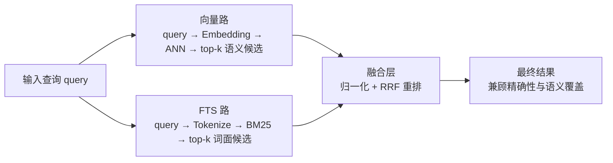
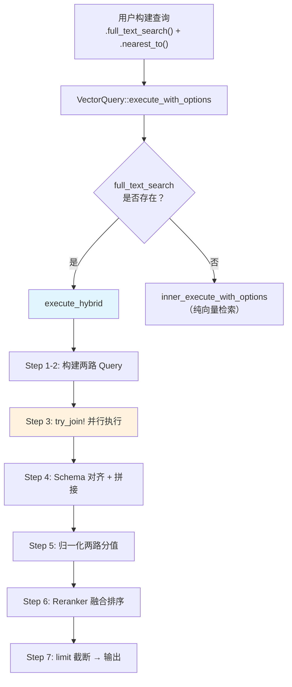
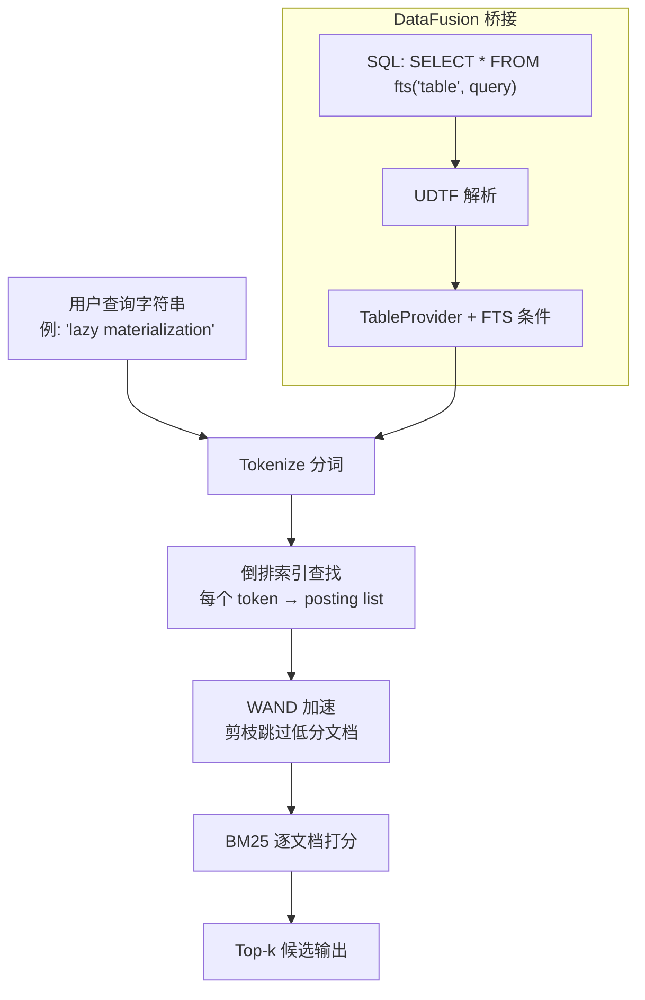
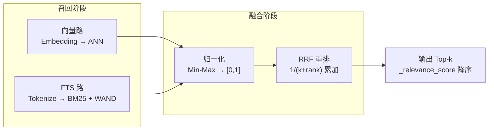

# LanceDB 混合检索深度解析：执行链路、核心公式与工程调优

> **源码版本**：基于 `lancedb v0.23.0` 与 `lance-index v1.0.0`。

## 1. 为什么需要混合检索

单一路径检索在真实场景中都有致命盲区。先看一个具体例子：

**场景**：知识库里有一篇文章标题是《Tokio Runtime 异步调度架构》。

| 查询 | FTS（全文检索） | 向量检索 | 混合检索 |
|------|---------------|---------|---------|
| `"Tokio Runtime"` | 精确命中标题词 | 可能召回，但也会拉进其他 "async runtime" 文章 | 两路都中，排名更高 |
| `"Rust 异步运行时"` | 完全不命中（关键词不同） | 语义匹配，成功召回 | 向量路兜底，不漏 |
| `"tokio 1.38 changelog"` | 精确命中 "tokio" | 可能把不相关的版本笔记也拉进来 | FTS 路锁定精确词 |

> 📝 **全文检索（FTS, Full-Text Search）**：按词的字面形式匹配，走倒排索引（Inverted Index），类似搜索引擎里的关键词搜索。
>
> **向量检索**：先把文本转成稠密向量（Embedding），再用近似最近邻（ANN）找语义最相似的文档。

核心矛盾在于：

- **FTS 擅长精确词约束**，但遇到同义词改写（"异步运行时" vs "Tokio Runtime"）就束手无策。
- **向量检索擅长语义泛化**，但对精确词约束不稳定——你搜 "tokio 1.38"，它可能把 "tokio 1.35" 也排在前面。

混合检索不是替代某一路，而是让两路互补：



## 2. 核心公式：先理解直觉，再看代码

### 2.1 RRF（Reciprocal Rank Fusion）融合公式

#### 2.1.1 RRF 要解决什么问题

混合检索有两路结果：向量路给出了一个排名，FTS 路给出了另一个排名。问题来了——**怎么把两个独立的排名合并成一个最终排名？**

最直观的想法是把两路的分值加起来，但两路的分值量纲不同（向量距离 vs BM25 分值），直接加没意义。RRF 的巧妙之处在于——**完全不看分值，只看名次**。每一路中排名越靠前的文档，贡献一个越大的分数；如果一个文档在多路中都排名靠前，它的分数就会累加，最终排名自然更高。

#### 2.1.2 公式

$$
\text{RRF}(d)=\sum_{i=1}^{m}\frac{1}{k+\operatorname{rank}_i(d)}
$$

变量定义：

| 符号 | 含义 | 示例 |
|------|------|------|
| $d$ | 候选文档 | 文档 id=42 |
| $m$ | 召回链路数量 | 2（向量路 + FTS 路） |
| $\operatorname{rank}_i(d)$ | 文档在第 $i$ 路中的名次 | 向量路排第 3 |
| $k$ | 平滑常数 | 默认 60 |

> 💡 **直觉**：公式的核心是 $\frac{1}{k + rank}$——**名次越靠前（rank 越小），这个分数越大；但 k 限制了头部的上限**。
>
> 如果没有 k（即 k=0），排名第 1 的文档贡献 1/0=无穷大，这显然不合理。k 给分母加了一个"底线"，使得即便是第 1 名，贡献也最多是 1/k。

#### 2.1.3 k 对排序的影响

k 的大小直接决定了"头部文档能比后面的领先多少"：

| rank (0-based) | k=1 时得分 | k=60 时得分 |
|---------------|------------|-------------|
| 0 | 1/(1+0) = **1.000** | 1/(60+0) = **0.01667** |
| 1 | 1/(1+1) = **0.500** | 1/(60+1) = **0.01639** |
| 2 | 1/(1+2) = **0.333** | 1/(60+2) = **0.01613** |
| 3 | 1/(1+3) = **0.250** | 1/(60+3) = **0.01587** |
| 4 | 1/(1+4) = **0.200** | 1/(60+4) = **0.01563** |
| **第1名 vs 第2名差距** | **2 倍** | **~1.02 倍** |

- **k 越小**：头部文档权重差距越极端，第 1 名远超其他。适合"高度信任单路排序"的场景。
- **k 越大**：相邻名次差距越平缓，融合越"民主"。适合"两路都不够可靠，需要互相投票"的场景。
- **k=60** 是 RRF 论文（[Cormack et al., SIGIR 2009](https://plg.uwaterloo.ca/~gvcormac/cormacksigir09-rrf.pdf)）实验得出的推荐值。

#### 2.1.4 LanceDB 中的实现

```rust
// lancedb-0.23.0/src/rerankers/rrf.rs:85-102
let mut rrf_score_map = BTreeMap::new();
let mut update_score_map = |(i, result_id)| {
    // i 是 0-based 的枚举索引，即文档在该路中的名次
    let score = 1.0 / (i as f32 + self.k);
    rrf_score_map
        .entry(result_id)
        .and_modify(|e| *e += score)  // 同一文档出现在多路中，分数累加
        .or_insert(score);
};
// 先遍历向量路结果（按向量排序），再遍历 FTS 路结果（按 BM25 排序）
vector_ids.values().iter().enumerate().for_each(&mut update_score_map);
fts_ids.values().iter().enumerate().for_each(&mut update_score_map);
```

> ⚠️ **0-based vs 1-based**：LanceDB 使用 `enumerate()` 产生 0-based 索引。也就是说第 1 名的 rank=0，公式变成 `1/(k+0)`。和学术论文常见的 1-based（`1/(k+1)`）差一个常数偏移。
>
> 影响：k=60 时，0-based 第 1 名得分 = 1/60 ≈ 0.01667；1-based 第 1 名得分 = 1/61 ≈ 0.01639。差距很小，不影响相对排序。

默认 k 值定义：

```rust
// lancedb-0.23.0/src/rerankers/rrf.rs:39-42
impl Default for RRFReranker {
    fn default() -> Self {
        Self { k: 60.0 }  // 论文推荐值
    }
}
```

### 2.2 BM25 评分公式

> 📝 **BM25（Best Matching 25）**：经典的文本相关性评分算法，被 Elasticsearch、Lucene 等几乎所有搜索引擎采用。LanceDB 的 FTS 路就用它给文档打分。

#### 2.2.1 BM25 要解决什么问题

FTS 路需要回答一个核心问题：**给定一个查询词，每篇文档和它有多相关？**

最朴素的做法是数词频——查询词在文档中出现越多次，就越相关。但这有两个明显问题：

1. **"the" 出现 100 次不代表文档和 "the" 更相关**——几乎所有文档都包含 "the"，它没有区分度。需要一个机制来降低常见词的权重。
2. **长文档天然词频更高**——一篇 10000 字的文档比 100 字的文档更容易包含某个词，但不代表它更相关。需要对文档长度做补偿。

BM25 用三个组件解决这两个问题：IDF 衡量词的区分度，TF 部分带饱和效应地衡量词频，文档长度归一化做长度补偿。

#### 2.2.2 公式拆解

$$
\text{BM25}(q,d)=\sum_{t\in q} \underbrace{IDF(t)}_{\text{词的区分度}} \cdot \underbrace{\frac{f(t,d)\cdot (k_1+1)}{f(t,d)+k_1\cdot\left(1-b+b\cdot \frac{|d|}{avgdl}\right)}}_{\text{词频 + 长度归一化}}
$$

这个公式由三个部分协同工作：

**1) IDF（Inverse Document Frequency, 逆文档频率）—— 衡量词的区分度**

IDF 回答的问题是：**这个词在整个语料库中有多"稀有"？** 一个词如果只在少数文档中出现（比如 "LanceDB"），说明它有很强的区分能力；如果几乎每篇文档都有（比如 "the"），那搜它也选不出什么来。IDF 就是把这种"稀有程度"量化成一个数字。

$$
IDF(t)=\ln\left(\frac{N-n_t+0.5}{n_t+0.5}+1\right)
$$

其中 $N$ 是文档总数，$n_t$ 是包含词 $t$ 的文档数。$n_t$ 越小（词越稀有），IDF 越大。

**2) TF（Term Frequency）部分 —— 衡量词频，但有饱和效应**

TF 部分回答的问题是：**查询词在这篇文档中出现了多少次？** 出现越多次，文档和查询越相关——但不是线性增长，而是有"饱和效应"：

分子 $f(t,d) \cdot (k_1+1)$ 和分母 $f(t,d) + k_1 \cdot (\ldots)$ 形成一个饱和函数：

- 词频从 0→1 时，得分增长最快。
- 词频继续增加时，增长逐渐放缓。
- 词频趋向无穷时，这部分趋向 $(k_1+1)$，不再增长。

> 💡 **直觉**：一个词在文档中出现 10 次比 1 次更相关，但出现 100 次不比 10 次好多少——总不能因为某个词被刷了 1000 次就认为它最相关吧？BM25 用 $k_1$ 控制这个"饱和速度"。

**3) 文档长度归一化 —— 补偿长文档的天然优势**

$1-b+b \cdot \frac{|d|}{avgdl}$ 这项解决的问题是：**长文档天然包含更多词，词频天然更高**。一篇 10000 字的综述和一篇 200 字的精确答案如果都出现了一次查询词，综述的词频占比远低于精确答案，应该适当降权。这项用文档长度和平均长度的比值来做补偿。

#### 2.2.3 K1 和 B 的含义

| 参数 | Lance 默认值 | 控制什么 | 效果 |
|------|-------------|---------|------|
| $k_1$ | **1.2** | TF 饱和速度 | $k_1$ 越大 → 高词频文档加分越多；$k_1$=0 → 词频完全不影响，只看 IDF |
| $b$ | **0.75** | 长度惩罚力度 | $b$=0 → 完全不惩罚长文档；$b$=1 → 完全按比例惩罚 |

#### 2.2.4 手动计算示例

假设一个 3 篇文档的小语料库，查询词是 `"LanceDB"`：

```
doc₀: "LanceDB vector search"             (3 个词)
doc₁: "vector database for search and analytics"  (6 个词)
doc₂: "LanceDB is a vector database"       (5 个词)
```

**Step 1: 基础统计**

- $N = 3$（文档总数）
- $n_t = 2$（doc₀ 和 doc₂ 包含 "LanceDB"）
- $avgdl = (3 + 6 + 5) / 3 = 4.67$（平均文档长度）

**Step 2: 计算 IDF**

$$
IDF = \ln\left(\frac{3 - 2 + 0.5}{2 + 0.5} + 1\right) = \ln\left(\frac{1.5}{2.5} + 1\right) = \ln(1.6) \approx 0.47
$$

这个值不大——因为 2/3 的文档都包含这个词，区分度有限。

**Step 3: 计算各文档得分**（$k_1=1.2$, $b=0.75$, $f=1$）

doc₀（3 个词，较短）：

$$
doc\_norm = 1.2 \times (1 - 0.75 + 0.75 \times \frac{3}{4.67}) = 1.2 \times 0.732 = 0.878
$$
$$
doc\_weight = \frac{2.2 \times 1}{1 + 0.878} = \frac{2.2}{1.878} = 1.171
$$
$$
score_0 = 0.47 \times 1.171 = \mathbf{0.550}
$$

doc₂（5 个词，较长）：

$$
doc\_norm = 1.2 \times (1 - 0.75 + 0.75 \times \frac{5}{4.67}) = 1.2 \times 1.053 = 1.264
$$
$$
doc\_weight = \frac{2.2 \times 1}{1 + 1.264} = \frac{2.2}{2.264} = 0.972
$$
$$
score_2 = 0.47 \times 0.972 = \mathbf{0.457}
$$

doc₁（不包含 "LanceDB"）：$score_1 = 0$

**结论**：doc₀ 得分高于 doc₂，因为 doc₀ 更短（3 词 vs 5 词），"LanceDB" 在其中的密度更高。这就是 $b$ 参数（长度惩罚）在起作用。

#### 2.2.5 Lance 源码实现

```rust
// lance-index-1.0.0/src/scalar/inverted/scorer.rs:23-25
pub const K1: f32 = 1.2;
pub const B: f32 = 0.75;

// scorer.rs:132-136 —— IDF 计算
#[inline]
pub fn idf(token_docs: usize, num_docs: usize) -> f32 {
    let num_docs = num_docs as f32;
    ((num_docs - token_docs as f32 + 0.5) / (token_docs as f32 + 0.5) + 1.0).ln()
}

// scorer.rs:11-21 —— Scorer trait: 总分 = query_weight × doc_weight
pub trait Scorer: Send + Sync {
    fn query_weight(&self, token: &str) -> f32;  // 即 IDF
    fn doc_weight(&self, freq: u32, doc_tokens: u32) -> f32;  // 即 TF + 长度归一化
    fn score(&self, token: &str, freq: u32, doc_tokens: u32) -> f32 {
        self.query_weight(token) * self.doc_weight(freq, doc_tokens)
    }
}

// scorer.rs:124-129 —— doc_weight 实现
fn doc_weight(&self, freq: u32, doc_tokens: u32) -> f32 {
    let freq = freq as f32;
    let doc_tokens = doc_tokens as f32;
    let doc_norm = K1 * (1.0 - B + B * doc_tokens / self.avg_doc_length);
    (K1 + 1.0) * freq / (freq + doc_norm)
}
```

> 🤔 **思考**：`score = query_weight * doc_weight` 的分离设计有什么好处？
>
> IDF（query_weight）对同一个查询词、同一个语料库来说是固定的，可以预计算一次复用。真正需要逐文档计算的只有 doc_weight（因为每个文档的词频和长度不同）。这种分离在 WAND 加速中至关重要——可以用 IDF 快速估算上界，跳过不可能进入 top-k 的文档。

### 2.3 归一化（Normalization）

#### 2.3.1 为什么混合检索必须归一化

向量路返回的是**距离**（如 L2 距离、余弦距离），值域取决于距离类型。FTS 路返回的是 **BM25 分值**，值域取决于语料库大小和词频分布。两者量纲完全不同，直接混合没有意义。

**示例**——归一化前后的分值对比：

```
归一化前（原始分值）:
  向量路 _distance: [0.05, 0.15, 0.30]   ← 越小越好
  FTS 路 _score:    [12.3, 8.7,  5.1]    ← 越大越好

归一化后（都映射到 [0, 1]）:
  向量路: [0.0,  0.4,  1.0]   ← 0.0 = 最好
  FTS 路: [1.0,  0.5,  0.0]   ← 1.0 = 最好
```

> 💡 **注意**：归一化不改变每一路内部的排序，只是统一量纲。对于 RRF 来说，它实际上只关心名次而非分值，所以归一化对 RRF 本身没影响。但归一化是为其他可能的 reranker（比如加权求和）准备的，LanceDB 的设计使得 reranker 可以替换。

#### 2.3.2 Min-Max 归一化公式

归一化的具体做法是 **Min-Max 缩放**：把一组分值中最小的映射到 0，最大的映射到 1，其余按比例线性插值。

$$
x' = \frac{x - \min(x)}{\max(x) - \min(x)}
$$

#### 2.3.3 极小范围保护

如果所有文档的分值几乎相同（比如都是 0.95），$\max - \min \approx 0$，做除法会导致数值爆炸。代码中的处理方式：

```rust
// lancedb-0.23.0/src/query/hybrid.rs:146-159
let max = max(&scores).unwrap_or(0.0);
let min = min(&scores).unwrap_or(0.0);

// 当范围极小（< 10e-5）时，用 max 代替 range，避免除以接近零的数
let rng = if max - min < 10e-5 { max } else { max - min };

// 如果 range 为 0（所有分值相同或都是 0），保持原样不做归一化
if rng != 0.0 {
    let tmp = div(
        &sub(&scores, &Float32Array::new_scalar(min))?,
        &Float32Array::new_scalar(rng),
    )?;
    scores = downcast_array(&tmp);
}
```

> ⚠️ **工程细节**：当 `max - min < 10e-5` 时，代码用 `max` 代替 `max - min` 作为除数。这意味着所有分值会被映射到很小的范围，避免了除以零，但可能产生接近零的归一化值。当分值全部相同时（`rng == 0`），代码直接跳过归一化。

## 3. 混合检索执行链路

### 3.0 整体架构



### 3.1 执行分流（入口判断）

查询进入 `VectorQuery::execute_with_options` 后，只看一个条件：有没有设置 FTS。

```rust
// lancedb-0.23.0/src/query.rs:1207-1218
async fn execute_with_options(&self, options: QueryExecutionOptions)
    -> Result<SendableRecordBatchStream>
{
    if self.request.base.full_text_search.is_some() {
        // 设置了 FTS → 走混合路径
        let hybrid_result = self.execute_hybrid(options).await?;
        return Ok(hybrid_result);
    }
    // 没有 FTS → 走纯向量路径
    self.inner_execute_with_options(options).await
}
```

### 3.2 execute_hybrid 七步详解

> 📝 **Schema 对齐**：FTS 路返回的列是 `(_rowid, _score, ...用户字段)`，向量路返回的列是 `(_rowid, _distance, ...用户字段)`。列名不同、列数可能不同。要把两路结果合并成一个 RecordBatch 送给 reranker，必须先把它们的 Schema（列定义）统一起来。

以下是 `execute_hybrid` 的完整执行流程，每一步附代码：

**Step 1-2: 构造两路独立的 Query**

```rust
// lancedb-0.23.0/src/query.rs:1117-1123
// Step 1: 构造 FTS 分支 —— 基于原始 query 的 base 部分，带上 _rowid
let mut fts_query = Query::new(self.parent.clone());
fts_query.request = self.request.base.clone();
fts_query = fts_query.with_row_id();

// Step 2: 构造向量分支 —— 克隆完整 VectorQuery，但把 FTS 条件清掉
let mut vector_query = self.clone().with_row_id();
vector_query.request.base.full_text_search = None;  // 防止分支污染：向量路不走 FTS
```

> 💡 **为什么要清掉 `full_text_search`？** 如果不清掉，向量路执行时又会走进 `execute_hybrid`，形成无限递归。

**Step 3: 并行执行两路**

```rust
// src/query.rs:1124-1132
// try_join! 同时发起两路查询，任一失败则整体失败
let (fts_results, vec_results) = try_join!(
    fts_query.execute_with_options(options.clone()),
    vector_query.inner_execute_with_options(options)
)?;
// 收集所有 RecordBatch
let (fts_results, vec_results) = try_join!(
    fts_results.try_collect::<Vec<_>>(),
    vec_results.try_collect::<Vec<_>>()
)?;
```

**Step 4: Schema 对齐 + 拼接**

```rust
// src/query.rs:1136-1140
let (fts_schema, vec_schema) = hybrid::query_schemas(&fts_results, &vec_results);
let mut fts_results = concat_batches(&fts_schema, fts_results.iter())?;
let mut vec_results = concat_batches(&vec_schema, vec_results.iter())?;
```

`query_schemas` 处理两路 Schema 不匹配的情况——如果一路返回空（比如 FTS 没有命中任何文档），会从另一路的 Schema 推导出兼容的列定义：

```rust
// lancedb-0.23.0/src/query/hybrid.rs:65-86
pub fn query_schemas(fts_results: &[RecordBatch], vec_results: &[RecordBatch])
    -> (Arc<Schema>, Arc<Schema>)
{
    match (fts_results.first().map(|r| r.schema()),
           vec_results.first().map(|r| r.schema())) {
        (Some(fts_schema), Some(vec_schema)) => (fts_schema, vec_schema),
        (None, Some(vec_schema)) => {
            // FTS 路为空 → 从向量路 Schema 推导 FTS Schema，把 _distance 列名改为 _score
            let fts_schema = with_field_name_replaced(&vec_schema, DIST_COL, SCORE_COL);
            (Arc::new(fts_schema), vec_schema)
        }
        // ... 反向同理
    }
}
```

**Step 5: 归一化**

```rust
// src/query.rs:1142-1148
// 可选的 Rank 归一化模式：先把分值转成名次，再做 Min-Max
if matches!(self.request.base.norm, Some(NormalizeMethod::Rank)) {
    vec_results = hybrid::rank(vec_results, DIST_COL, None)?;
    fts_results = hybrid::rank(fts_results, SCORE_COL, None)?;
}
// Min-Max 归一化，把两路分值都映射到 [0, 1]
vec_results = hybrid::normalize_scores(vec_results, DIST_COL, None)?;
fts_results = hybrid::normalize_scores(fts_results, SCORE_COL, None)?;
```

> 📝 **两种归一化模式**：
> - `Score`（默认）：直接对原始分值做 Min-Max。
> - `Rank`：先把分值转成排名（1st, 2nd, 3rd...），再对排名做 Min-Max。当原始分值分布极端时（如极端长尾），Rank 模式更稳定。

**Step 6: Reranker 融合排序**

```rust
// src/query.rs:1150-1170
// 没有指定 reranker 时，默认使用 RRF(k=60)
let reranker = self.request.base.reranker.clone()
    .unwrap_or(Arc::new(RRFReranker::default()));

let mut results = reranker
    .rerank_hybrid(&fts_query.query.query(), vec_results, fts_results)
    .await?;

// 校验 reranker 输出必须包含 _relevance_score 列
check_reranker_result(&results)?;
```

Reranker 契约——所有 reranker 必须实现的接口：

```rust
// lancedb-0.23.0/src/rerankers.rs:54-65
pub trait Reranker: std::fmt::Debug + Sync + Send {
    /// 接收两路结果，返回融合后的单一 RecordBatch
    /// 输出必须包含 _relevance_score 列
    async fn rerank_hybrid(
        &self,
        query: &str,
        vector_results: RecordBatch,
        fts_results: RecordBatch,
    ) -> Result<RecordBatch>;
}
```

校验逻辑——缺少 `_relevance_score` 列会直接报错：

```rust
// rerankers.rs:99-110
pub fn check_reranker_result(result: &RecordBatch) -> Result<()> {
    if result.schema().column_with_name(RELEVANCE_SCORE).is_none() {
        return Err(Error::Schema {
            message: format!(
                "rerank_hybrid must return a RecordBatch with a column named {}",
                RELEVANCE_SCORE  // 即 "_relevance_score"
            ),
        });
    }
    Ok(())
}
```

**Step 7: limit 截断 + 输出**

```rust
// src/query.rs:1172-1183
let limit = self.request.base.limit.unwrap_or(DEFAULT_TOP_K);
if results.num_rows() > limit {
    results = results.slice(0, limit);  // 只取前 limit 条
}
// 如果用户没有要求返回 _rowid，去掉它
if !self.request.base.with_row_id {
    results = results.drop_column(ROW_ID)?;
}
```

### 3.3 数据流总览

下面用表格展示两路数据在各阶段的字段变化：

| 阶段 | 向量路 | FTS 路 |
|------|--------|--------|
| 查询执行后 | `_rowid`, `_distance`, `用户字段...` | `_rowid`, `_score`, `用户字段...` |
| Schema 对齐后 | 列定义统一，可合并 | 列定义统一，可合并 |
| 归一化后 | `_distance` ∈ [0, 1] | `_score` ∈ [0, 1] |
| RRF 融合后 | 合并为一个 RecordBatch：`_rowid`, `用户字段...`, `_relevance_score` |
| limit 截断后 | 前 N 条，可选去掉 `_rowid` |

## 4. 公式与代码的逐步算例

### 4.1 场景设定

假设查询 `"lazy materialization"`，两路各返回了 top-3：

```
向量路结果（按距离排序，小 → 大）:
  rank=0: doc_id=10  (距离最近)
  rank=1: doc_id=20
  rank=2: doc_id=30

FTS 路结果（按 BM25 排序，高 → 低）:
  rank=0: doc_id=20  (BM25 最高)
  rank=1: doc_id=40
  rank=2: doc_id=10
```

注意 doc_id=20 和 doc_id=10 同时出现在两路中；doc_id=30 只在向量路，doc_id=40 只在 FTS 路。

### 4.2 RRF 计算过程（k=60）

**遍历向量路**（enumerate 产生 0-based 索引）：

| doc_id | rank (i) | score = 1/(60+i) |
|--------|----------|-------------------|
| 10 | 0 | 1/60 = 0.01667 |
| 20 | 1 | 1/61 = 0.01639 |
| 30 | 2 | 1/62 = 0.01613 |

**遍历 FTS 路**（累加到已有分数）：

| doc_id | rank (i) | score = 1/(60+i) | 累加后 |
|--------|----------|-------------------|--------|
| 20 | 0 | 1/60 = 0.01667 | 0.01639 + 0.01667 = **0.03306** |
| 40 | 1 | 1/61 = 0.01639 | **0.01639** |
| 10 | 2 | 1/62 = 0.01613 | 0.01667 + 0.01613 = **0.03279** |

**最终排序**（降序）：

| 排名 | doc_id | RRF 分数 | 来源 |
|------|--------|----------|------|
| 1 | 20 | 0.03306 | 向量路 rank=1 + FTS 路 rank=0 |
| 2 | 10 | 0.03279 | 向量路 rank=0 + FTS 路 rank=2 |
| 3 | 40 | 0.01639 | 仅 FTS 路 rank=1 |
| 4 | 30 | 0.01613 | 仅向量路 rank=2 |

### 4.3 为什么 RRF 比其他融合方式更稳定？

用同样的输入，对比三种融合方式：

**假设归一化后的分值**：

| doc_id | 向量分 (归一化) | FTS 分 (归一化) |
|--------|---------------|----------------|
| 10 | 1.00 | 0.00 |
| 20 | 0.50 | 1.00 |
| 30 | 0.00 | — |
| 40 | — | 0.50 |

| 融合方式 | 排序结果 | 问题 |
|---------|---------|------|
| **加权求和**（0.5×向量 + 0.5×FTS） | 20(0.75) > 10(0.50) > 40(0.25) > 30(0.00) | 只出现在一路的文档被惩罚——缺失路分值为 0，即使它在出现的那路排名很高（如 doc_40 FTS 第 2 名） |
| **取交集** | 只保留 10, 20 | 丢掉了只被一路召回的文档（doc_30, doc_40），召回率下降 |
| **RRF** | 20 > 10 > 40 > 30 | 每路独立贡献分数，不惩罚单路命中；出现在两路的文档自然获得更高分 |

> 💡 **RRF 的优势**：它只看"名次"不看"分值"，所以不受两路分值分布差异的影响。即使向量路给出的距离全部在 [0.01, 0.03]，FTS 路给出的 BM25 全部在 [5.0, 15.0]，RRF 都一视同仁。

## 5. FTS 在 LanceDB 中的执行路径

### 5.0 FTS 执行全景



### 5.1 核心概念

> 📝 **DataFusion**：Apache Arrow 生态中的 SQL 查询引擎。LanceDB 用 DataFusion 做查询计划生成和执行。
>
> **UDTF（User-Defined Table Function, 用户定义表函数）**：一种可以返回"表"的函数。LanceDB 通过 `fts('table_name', 'query_json')` 这个 UDTF 把全文检索嵌入到 DataFusion 的 SQL 执行计划中，使得 FTS 查询可以和 SQL 的 WHERE、JOIN、GROUP BY 等操作自然组合。
>
> **WAND（Weighted AND）**：一种跳表加速的 top-k 检索算法。核心思想是维护一个"最低分阈值"——如果某个文档的分数上界都达不到阈值，就直接跳过不打分，避免对全部文档做 BM25 计算。在大规模语料库中可以显著减少计算量。

### 5.2 UDTF 桥接

LanceDB 通过 `FtsTableFunction` 把 FTS 查询注入到 DataFusion：

```rust
// lancedb-0.23.0/src/table/datafusion/udtf/fts.rs:38-50
impl TableFunctionImpl for FtsTableFunction {
    fn call(&self, exprs: &[Expr]) -> DataFusionResult<Arc<dyn TableProvider>> {
        if exprs.len() != 2 {
            return plan_err!("fts() requires 2 parameters: fts(table_name, fts_query)");
        }
        // 参数1: 表名（字符串字面量）
        let table_name = extract_string_literal(&exprs[0], "table_name")?;
        // 参数2: FTS 查询（JSON 格式）
        let query_json = extract_string_literal(&exprs[1], "fts_query")?;
        let fts_query = parse_fts_query(&query_json)?;
        // 返回一个带 FTS 条件的 TableProvider
        self.resolver.resolve_table(&table_name, Some(fts_query))
    }
}
```

这使得你可以在 SQL 中直接写：

```sql
SELECT id, text, _score
FROM fts('articles', '{"match": {"column": "text", "terms": "hybrid search"}}')
WHERE category = 'tech'
ORDER BY _score DESC
LIMIT 10
```

### 5.3 BM25 跨分区执行

LanceDB 的数据按分区（Partition）存储。BM25 搜索分两层：

**第一层：分区内检索（WAND 加速）**

```rust
// lance-index-1.0.0/src/scalar/inverted/index.rs:788-805
pub fn bm25_search(&self, params: &FtsSearchParams, operator: Operator,
    mask: Arc<RowIdMask>, postings: Vec<PostingIterator>, metrics: &dyn MetricsCollector)
    -> Result<Vec<DocCandidate>>
{
    if postings.is_empty() { return Ok(Vec::new()); }
    // 创建分区内的 BM25 scorer
    let scorer = IndexBM25Scorer::new(std::iter::once(self));
    // 用 WAND 算法执行 top-k 检索
    let mut wand = Wand::new(operator, postings.into_iter(), &self.docs, scorer);
    let hits = wand.search(params, mask, metrics)?;
    Ok(hits)
}
```

**第二层：跨分区聚合（全局 BM25 重打分）**

分区内用的是局部统计量（局部 IDF、局部 avgdl），跨分区需要用全局统计量重新打分，以确保不同分区的分值可比：

```rust
// lance-index-1.0.0/src/scalar/inverted/index.rs:233-298
pub async fn bm25_search(&self, tokens: Arc<Tokens>, params: Arc<FtsSearchParams>,
    operator: Operator, ...) -> Result<(Vec<u64>, Vec<f32>)>
{
    // 并行执行各分区的 BM25 搜索
    let parts = self.partitions.iter().map(|part| { ... }).collect::<Vec<_>>();
    let mut parts = stream::iter(parts).buffer_unordered(get_num_compute_intensive_cpus());

    // 用全局统计量创建 scorer，对候选结果重新打分
    let scorer = IndexBM25Scorer::new(self.partitions.iter().map(|part| part.as_ref()));

    while let Some(res) = parts.try_next().await? {
        for DocCandidate { row_id, freqs, doc_length } in res {
            let mut score = 0.0;
            for (token, freq) in freqs.into_iter() {
                score += scorer.score(token.as_str(), freq, doc_length);
            }
            // 维护全局 top-k 堆
            if candidates.len() < limit {
                candidates.push(Reverse(ScoredDoc::new(row_id, score)));
            } else if candidates.peek().unwrap().0.score.0 < score {
                candidates.pop();
                candidates.push(Reverse(ScoredDoc::new(row_id, score)));
            }
        }
    }
}
```

> 💡 **两层打分的原因**：分区内 WAND 用局部统计量快速筛选候选（速度快但分值不可跨分区比较），全局聚合时用全局统计量重打分（确保最终排序正确）。

## 6. 参数到底怎么调

### 6.0 参数分层

混合检索的参数分为三个独立的层次，每层影响不同的环节：

```
┌──────────────────────────────────────────┐
│  融合层: RRF k                            │  ← 控制最终排序形态
├──────────────────────────────────────────┤
│  向量层: nprobes, refine_factor, ef       │  ← 控制向量路召回质量
├──────────────────────────────────────────┤
│  FTS 层: limit, wand_factor              │  ← 控制 FTS 路召回质量
└──────────────────────────────────────────┘
```

### 6.1 推荐调参顺序

```
Step 1           Step 2           Step 3           Step 4
固定 k=60    →   调向量召回窗口  →   调 FTS 候选窗口  →   微调 k
```

**为什么是这个顺序？**

1. **先固定 k=60**：k 只影响融合层的排序"形态"（头部集中 vs 平缓），不影响各路能召回多少好文档。用论文推荐值先跑起来。
2. **再调向量路**（nprobes）：这是直接影响向量召回率的旋钮。nprobes 不够会漏掉好的候选文档，再好的融合也救不回来。
3. **再调 FTS 路**（limit / wand_factor）：同理，确保 FTS 路的候选窗口足够大。
4. **最后微调 k**：此时两路输入已经稳定，调 k 可以观察头部排序的变化。

### 6.2 权衡矩阵

| 参数 | 召回影响 | 延迟影响 | 原因 | 调优建议 |
|------|---------|---------|------|---------|
| `nprobes` | **高** | **高** | 每增加一个 probe，向量路就多扫一个聚类中心的候选区，召回提升但 I/O 和计算量线性增加 | 先从 nprobes=10 开始，逐步增加到 20-50 观察 recall 变化；超过一定阈值后收益递减 |
| `refine_factor` | 中高 | 中高 | 向量路先粗筛 refine_factor × limit 个候选，再精排到 limit。增大提高精度但计算量线性增加 | 通常 2-5 足够，更大的值回报递减 |
| `wand_factor` | 中 | 中 | WAND 算法的候选扩展因子。越大 → 被跳过的文档越少 → recall 越高但越慢 | 默认值通常够用，只在 recall 不达标时增大 |
| `RRF k` | 排序形态 | **极低** | 只改变一次除法的常数，不产生额外 I/O 或计算 | k=60 起步，通常不需要调 |

### 6.3 调参示例：nprobes 的 recall-latency 权衡

以下为示意性数据（实际取决于数据集和索引类型）：

```
nprobes | 向量路 recall@10 | 向量路延迟
--------|------------------|----------
1       | ~0.55            | ~2ms
5       | ~0.78            | ~8ms
10      | ~0.88            | ~15ms
20      | ~0.94            | ~28ms
50      | ~0.98            | ~65ms
100     | ~0.99            | ~130ms
```

> ⚠️ **以上数字是示意性的，实际表现取决于数据集大小、向量维度、索引类型（IVF / HNSW）等因素。关键信息：recall 的提升呈明显的边际递减，但延迟接近线性增长。**

### 6.4 必须明确的约束

**约束 1: distance_type 必须一致**

查询时指定的 `distance_type` 必须与向量索引训练时使用的类型一致（如 L2、Cosine），否则返回的距离值没有意义，排序结果混乱。

**约束 2: Reranker 输出必须包含 `_relevance_score`**

这是 `check_reranker_result` 强制检查的。如果你实现自定义 reranker 但忘记在输出中加这一列，会得到如下错误：

```
Error: Schema error: rerank_hybrid must return a RecordBatch
with a column named _relevance_score
```

**约束 3: 注意默认 limit 截断**

如果不显式设置 `limit`，LanceDB 会用 `DEFAULT_TOP_K`（通常为 10）截断结果。调试时，如果你怀疑是召回不够，请先显式设一个较大的 limit。

## 7. 常见误区

### 误区 1: "混合检索比单路更快"

**真相**：混合检索通常**更稳定但更慢**。

**证据**：看 `execute_hybrid` 的执行流程——它用 `try_join!` 并行执行两路查询。即便两路完全并行，总延迟也取决于**较慢的那一路**，再加上归一化和 RRF 融合的开销。

```
纯向量检索延迟:  ~15ms（单路 ANN）
混合检索延迟:    ~max(15ms向量, 10ms FTS) + ~2ms归一化/RRF ≈ 17ms
```

混合检索的价值不在于速度，而在于**召回稳定性**——覆盖了单路漏掉的候选。

### 误区 2: "候选窗口越大越好"

**真相**：存在明显的**边际收益递减**。

**证据**：以 FTS 路的 limit 为例：

| FTS limit | 新增候选中有多少是"好文档" | 延迟增长 |
|-----------|-------------------------|---------|
| 10 | 高（前 10 基本都相关） | 基准 |
| 50 | 中（大部分新增已不太相关） | +3-5x |
| 500 | 低（绝大多数新增是噪音） | +30-50x |

BM25 分值呈长尾分布——前几名得分远高于后面。把 limit 从 10 扩到 500，多拉进来的 490 个候选大部分 BM25 分很低，经过 RRF 融合后也排不到前面，白白浪费了 I/O 和计算。

### 误区 3: "单条 query 调参就够了"

**真相**：单条 query 调出来的"最优参数"可能在**线上查询分布下崩溃**。

**证据**：查询分布通常是长尾的——80% 是常见查询，20% 是冷门/边界查询。在一条热门 query 上调到 nprobes=5 效果很好，但冷门 query（向量空间中分布稀疏的查询）可能需要 nprobes=20 才能达到同样的 recall。

正确做法：用一组代表性查询集（覆盖高频、低频、精确词、语义改写等场景）做批量评估，取整体表现最好的参数。

### 误区 4: "RRF 分数可以当概率用"

**真相**：RRF 分数**只是一个融合排序分**，没有概率意义。

**证据**：

- RRF 分值的上界取决于链路数量和 k 值：两路 RRF 的理论最大值 = `2 × 1/k`（当文档在两路都排第 1）。k=60 时最大值 ≈ 0.033。
- 分值不在 [0, 1] 范围内，也没有归一化到概率空间。
- 不同查询的 RRF 分值不可横向比较——query A 的最高分 0.033 和 query B 的最高分 0.033 不代表相关程度相同。

RRF 分数唯一的正确用法是：在**同一次查询内**，对候选文档做排序。

## 8. 代码调用示例

### 8.1 最小示例

```rust
use std::{iter::once, sync::Arc};
use arrow_array::StringArray;
use lance_index::scalar::FullTextSearchQuery;
use lancedb::query::{ExecutableQuery, QueryBase, QueryExecutionOptions};

// 1. 准备查询文本
let query_str = "world records";

// 2. 生成查询向量（通过 embedding 模型）
let query = Arc::new(StringArray::from_iter_values(once(query_str)));
let query_vector = embedding.compute_query_embeddings(query)?;

// 3. 构建混合查询：同时指定 FTS + 向量
let mut stream = table
    .query()
    .full_text_search(FullTextSearchQuery::new(query_str.to_string()))  // FTS 路
    .nearest_to(query_vector)?   // 向量路
    .limit(20)                   // 最终返回 top-20
    .execute_hybrid(QueryExecutionOptions::default())  // 触发混合执行
    .await?;
```

### 8.2 返回结果结构

`execute_hybrid` 返回一个 `RecordBatchStream`，每个 `RecordBatch` 的 Schema 如下：

```
┌──────────────────┬──────────┬──────────────────────┐
│ 列名             │ 类型     │ 说明                 │
├──────────────────┼──────────┼──────────────────────┤
│ 用户定义的列...   │ 原始类型 │ 表中的数据列         │
│ _relevance_score │ Float32  │ RRF 融合分（降序排列）│
│ _rowid (可选)    │ UInt64   │ 需 .with_row_id() 开启│
└──────────────────┴──────────┴──────────────────────┘
```

### 8.3 完整示例（自定义参数）

```rust
use lancedb::rerankers::rrf::RRFReranker;

let results = table
    .query()
    .full_text_search(FullTextSearchQuery::new("hybrid search".to_string()))
    .nearest_to(query_vector)?
    .limit(50)                          // 最终返回 top-50
    .nprobes(20)                        // 向量路：扫描 20 个聚类中心
    .refine_factor(3)                   // 向量路：粗筛 3 倍候选再精排
    .rerank(Arc::new(RRFReranker::new(30.0)))  // 自定义 k=30
    .with_row_id()                      // 在结果中保留 _rowid
    .execute_hybrid(QueryExecutionOptions::default())
    .await?;
```

## 9. 总结



LanceDB 混合检索的工程本质是三个阶段：

1. **双路并行召回**：向量路负责语义覆盖（ANN），FTS 路负责精确词命中（BM25 + WAND 加速）。两路通过 `try_join!` 并行执行。
2. **对齐与归一化**：Schema 对齐处理两路列名差异（`_distance` vs `_score`），Min-Max 归一化统一量纲。
3. **RRF 融合重排**：只看名次不看分值，天然免疫量纲差异。两路都命中的文档获得分数累加，排名更高。

公式决定理论上限，实现细节决定工程稳定性。

## 附录: 代码索引

### A. 查询构建与执行分流

| 文件 | 行号 | 职责 |
|------|------|------|
| `lancedb-0.23.0/src/query.rs` | 331 | `QueryBase` 通用参数与默认行为 |
| `src/query.rs` | 1112-1183 | `execute_hybrid` 主执行链路 |
| `src/query.rs` | 1207-1218 | 混合 / 纯向量执行分流入口 |

### B. 融合与排序

| 文件 | 行号 | 职责 |
|------|------|------|
| `src/query/hybrid.rs` | 65-86 | 两路结果 Schema 对齐（`query_schemas`） |
| `src/query/hybrid.rs` | 123-174 | Min-Max 归一化（`normalize_scores`） |
| `src/rerankers.rs` | 54-65 | `Reranker` trait 定义 |
| `src/rerankers.rs` | 99-110 | Reranker 输出校验（`check_reranker_result`） |
| `src/rerankers/rrf.rs` | 23-37 | `RRFReranker` 结构定义，k 默认值 |
| `src/rerankers/rrf.rs` | 85-102 | RRF 核心计算逻辑 |

### C. FTS 索引与检索

| 文件 | 行号 | 职责 |
|------|------|------|
| `src/table/datafusion/udtf/fts.rs` | 38-50 | DataFusion UDTF → LanceDB 桥接 |
| `lance-index-1.0.0/src/scalar/inverted/scorer.rs` | 23-25 | BM25 常量 `K1=1.2`, `B=0.75` |
| `scorer.rs` | 11-21 | `Scorer` trait（`query_weight × doc_weight`） |
| `scorer.rs` | 115-136 | `IndexBM25Scorer` 实现：IDF + doc_weight |
| `lance-index-1.0.0/src/scalar/inverted/index.rs` | 233 | 跨分区 BM25 搜索入口 |
| `index.rs` | 788-805 | 分区内 WAND 检索 |
| `lance-index-1.0.0/src/scalar/inverted/wand.rs` | 42-55 | `PostingIterator` 结构定义 |
