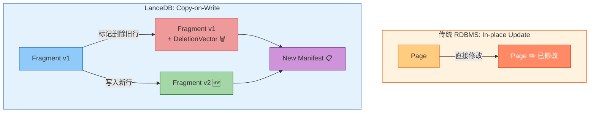
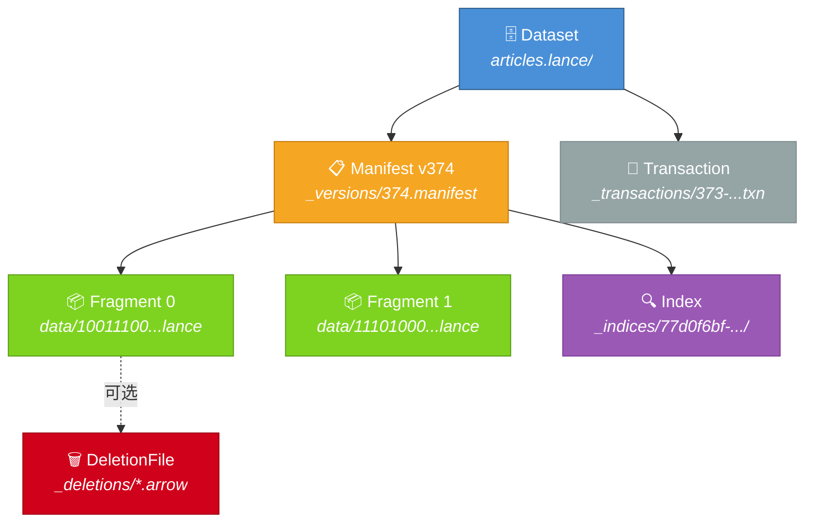
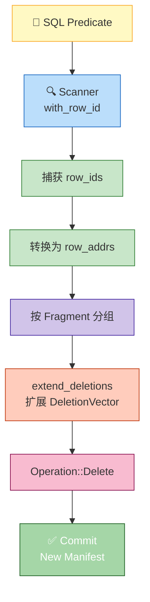
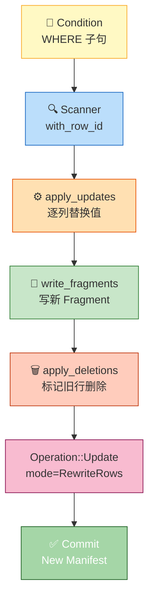
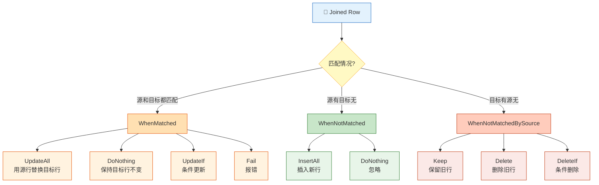
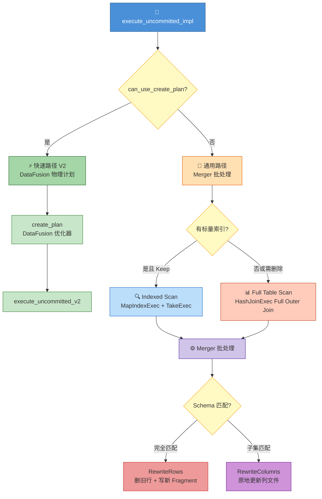
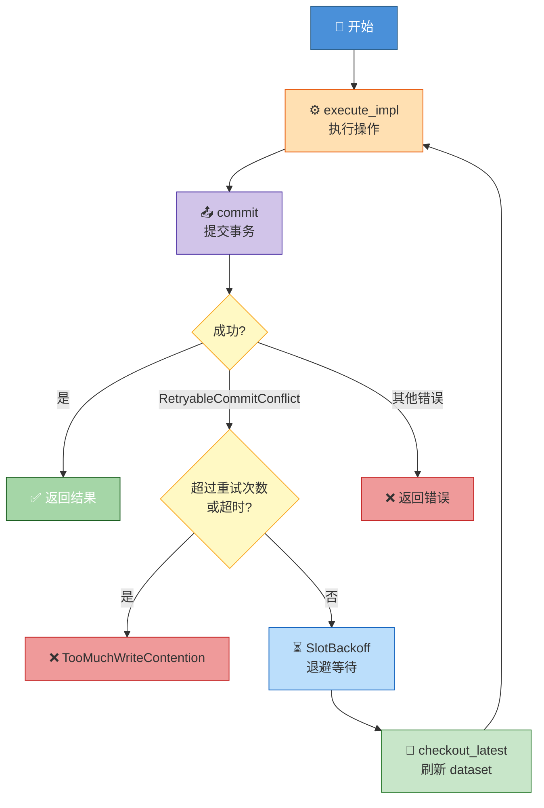
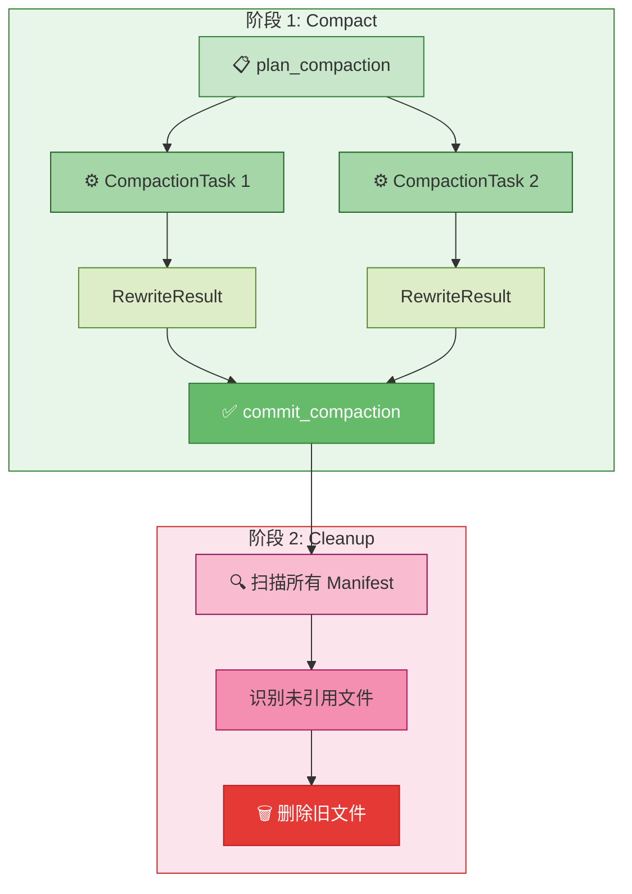
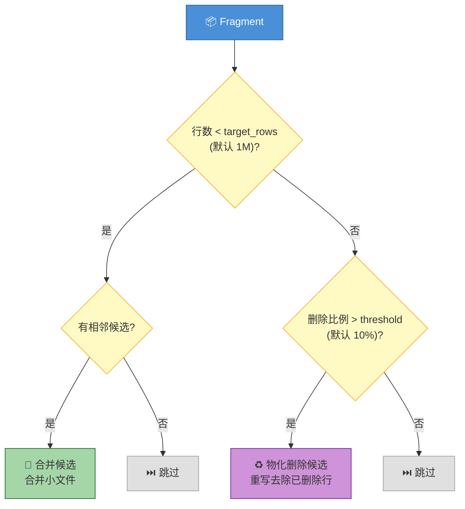

# LanceDB Update/Upsert 机制源码深度解析

> **源码版本**：基于 `lancedb v0.23.0` + `lance v1.0.0`（lance-core v1.0.0, arrow v56.2）

📌 **本文范围**：深入分析 LanceDB 的 Delete、Update、Merge Insert（Upsert）三大写操作的源码实现，以及 GC（Compact + Cleanup）机制和整体架构优劣。不涉及向量索引构建和查询优化。

## 1. 引言：Copy-on-Write 架构下的更新挑战

LanceDB 基于 Lance 列式格式构建，采用 **Copy-on-Write（CoW）** 存储模型。与传统 RDBMS 的原地更新不同，Lance 中的每次修改都会产生新的数据文件，旧数据通过版本管理保留。

这引出一个核心问题：**在 CoW 架构下，如何高效支持行级更新？**



> 🤔 **Think About**: CoW 意味着更新一行数据需要写入一个新文件并标记旧行删除。这种设计的代价是什么？好处又是什么？答案将在第 8 章揭晓。

**本文结构**：
- §2 架构背景 → §3 Delete → §4 Update → §5 Merge Insert → §6 并发控制 → §7 GC → §8 架构分析

---

## 2. 架构背景：Lance 的 CoW 存储模型

### 2.1 存储层级结构

Lance 的数据组织遵循 **Dataset → Manifest → Fragment → DataFile** 的层级结构。以本项目的 `articles.lance` 表为例，实际磁盘目录如下：

```
articles.lance/                          ← Dataset（一张表 = 一个目录）
├── _versions/                           ← Manifest 文件（每个版本一个）
│   └── 374.manifest                     ← 当前版本 v374 的元数据快照
├── _transactions/                       ← 事务日志
│   └── 373-682e2000-...-.txn            ← 事务 373 的提交记录
├── _deletions/                          ← DeletionVector 文件
│   └── (空 = 当前无逻辑删除)             ← 删除后会出现 .arrow 文件
├── _indices/                            ← 索引文件（每个索引一个 UUID 目录）
│   ├── 77d0f6bf-.../                    ← 某个 FTS 索引
│   │   ├── metadata.lance
│   │   ├── part_214_docs.lance
│   │   ├── part_214_invert.lance
│   │   └── part_214_tokens.lance
│   └── ... (共 29 个索引目录)
└── data/                                ← 数据文件（Fragment 的 DataFile）
    ├── 10011100...042fd44b.lance         ← Fragment 0 的列式数据 (15 KB)
    └── 11101000...9838364.lance          ← Fragment 1 的列式数据 (3.4 MB)
```

这些目录和文件对应的逻辑层级关系：



> 📝 **Terminology**:
> - **Dataset**: 一张表的完整数据，对应磁盘上的 `.lance/` 目录
> - **Manifest**: 某个版本的元数据快照（`_versions/N.manifest`），记录该版本包含哪些 Fragment
> - **Fragment**: 数据的基本存储单元，对应 `data/` 下的 `.lance` 文件，包含列式编码的数据
> - **DeletionVector**: 使用 `RoaringTreemap` 存储被逻辑删除的行的 local offset，保存在 `_deletions/` 目录
> - **Transaction**: 事务日志（`_transactions/` 下的 `.txn` 文件），记录每次写操作的元数据

### 2.2 事务操作类型

所有写操作通过 `Transaction` 提交，核心是 `Operation` 枚举（`lance-1.0.0/src/dataset/transaction.rs`）：

```rust
// lance-1.0.0/src/dataset/transaction.rs
pub enum Operation {
    Append { fragments, .. },
    Delete { updated_fragments, deleted_fragment_ids, predicate },
    Update { removed_fragment_ids, updated_fragments, new_fragments,
             fields_modified, update_mode, .. },
    Rewrite { groups, rewritten_indices, .. },
    // ... 其他操作
}
```

每次操作产生新的 Manifest 版本，旧版本保留用于时间旅行。

### 2.3 LanceDB 层 API

LanceDB 在 Lance 之上提供了更高层的 API（`lancedb-0.23.0/src/table.rs`）：

| API | 行号 | 说明 |
|-----|------|------|
| `table.update()` | `:808` | 条件更新列值 |
| `table.delete(predicate)` | `:861` | 条件删除行 |
| `table.merge_insert(&["key"])` | `:1034` | Upsert / Find-or-Create |
| `table.optimize()` | `:1215` | 压缩 + 清理 |

---

## 3. Delete：逻辑删除与 DeletionVector

Delete 是最基础的写操作，也是 Update 和 Merge Insert 的底层依赖。Lance 的删除是**逻辑删除**——不物理移除数据，而是在 Fragment 上附加一个 DeletionVector 标记哪些行已被删除。

### 3.1 数据流总览



### 3.2 三路分支优化

`DeleteJob::execute_impl`（`delete.rs:160-228`）在执行前会对 predicate 进行优化，产生三种分支：

```rust
// delete.rs:169-222
if matches!(filter_expr, Expr::Literal(ScalarValue::Boolean(Some(false)), _)) {
    // 分支 1: predicate = false → 不删除任何行，但仍提交新版本
    (Vec::new(), Vec::new(), Some(RowIdTreeMap::new()))
} else if matches!(filter_expr, Expr::Literal(ScalarValue::Boolean(Some(true)), _)) {
    // 分支 2: predicate = true → 直接删除所有 Fragment，无需扫描
    let deleted_fragment_ids = dataset.get_fragments().iter()
        .map(|f| f.id() as u64).collect();
    (Vec::new(), deleted_fragment_ids, None)
} else {
    // 分支 3: 常规 predicate → Scanner 扫描匹配行
    let stream = scanner.try_into_stream().await?.into();
    let (stream, row_id_rx) = make_rowid_capture_stream(stream, ...)?;
    // 消费 stream 捕获 row_ids → 转换为 row_addrs → apply_deletions
}
```

> 💡 **Key Point**: `predicate = false` 时虽然不删除任何行，但仍会提交一个新版本。这是为了保证操作的原子性语义——调用者可以确信操作已完成。

### 3.3 apply_deletions：Fragment 级删除标记

核心函数 `apply_deletions`（`delete.rs:28-72`）将 row_addrs 按 Fragment 分组，对每个 Fragment 调用 `extend_deletions`：

```rust
// delete.rs:43-61
let mut stream = futures::stream::iter(dataset.get_fragments())
    .map(move |fragment| {
        let bitmaps_ref = bitmaps.clone();
        async move {
            let fragment_id = fragment.id();
            if let Some(bitmap) = bitmaps_ref.get(&(fragment_id as u32)) {
                match fragment.extend_deletions(*bitmap).await {
                    Ok(Some(new_fragment)) => Ok(FragmentChange::Modified(...)),
                    Ok(None) => Ok(FragmentChange::Removed(fragment_id as u64)),
                    // extend_deletions 返回 None 表示该 Fragment 所有行都被删除
                    Err(e) => Err(e),
                }
            } else {
                Ok(FragmentChange::Unchanged)
            }
        }
    })
    .buffer_unordered(dataset.object_store.io_parallelism());
```

> ⚠️ **Gotcha**: `extend_deletions` 返回 `None` 时，表示该 Fragment 的所有行都已被删除。此时 Fragment 会被标记为 `Removed`，在新 Manifest 中不再出现。

### 3.4 数据流示例

```
表: Fragment 0 [id=0..50], Fragment 1 [id=50..100]
执行: delete("id < 10 OR id >= 90")

结果:
  Fragment 0: DeletionVector = {0,1,2,...,9}  (local offset 0-9)
              deletion_file.num_deleted_rows = 10
  Fragment 1: DeletionVector = {40,41,...,49}  (local offset 40-49, 对应 id=90..100)
              deletion_file.num_deleted_rows = 10
  逻辑行数: 80 (物理行数仍为 100)
```

---

## 4. Update：读取-修改-写回的行级更新

Update 操作的本质是 **"delete old + insert new"**——读取匹配行，在内存中修改列值，写入新 Fragment，然后标记旧行删除。

### 4.1 数据流总览



### 4.2 UpdateBuilder：SQL 表达式驱动

`UpdateBuilder`（`update.rs:58-69`）使用 Builder 模式构建更新任务：

```rust
// update.rs:58-69
pub struct UpdateBuilder {
    dataset: Arc<Dataset>,
    condition: Option<Expr>,           // WHERE 子句（DataFusion Expr）
    updates: HashMap<String, Expr>,    // SET column = expr
    conflict_retries: u32,             // 默认 10
    retry_timeout: Duration,           // 默认 30s
}
```

`set()` 方法（`update.rs:98-183`）将 SQL 字符串解析为 DataFusion `Expr`，并自动处理类型转换：

```rust
// update.rs:98-99 (简化)
pub fn set(mut self, column: impl AsRef<str>, value: &str) -> Result<Self> {
    let planner = Planner::new(schema.clone());
    let mut expr = planner.parse_expr(value)?;
    // 自动 cast 到目标列类型
    if dest_type != src_type {
        expr = expr.cast_to(&dest_type, &df_schema)?;
    }
    self.updates.insert(column, expr);
}
```

### 4.3 execute_impl：核心执行流程

`UpdateJob::execute_impl`（`update.rs:268-368`）是 Update 的核心：

**Step 1**: Scanner 扫描匹配行，同时捕获 row_ids

```rust
// update.rs:269-281
let mut scanner = self.dataset.scan();
scanner.with_row_id();
if let Some(expr) = &self.condition {
    scanner.filter_expr(expr.clone());
}
let stream = scanner.try_into_stream().await?.into();
let (stream, row_id_rx) = make_rowid_capture_stream(stream, ...)?;
```

**Step 2**: 对每个 batch 调用 `apply_updates` 替换列值

```rust
// update.rs:409-418
fn apply_updates(
    mut batch: RecordBatch,
    updates: Arc<HashMap<String, Arc<dyn PhysicalExpr>>>,
) -> DFResult<RecordBatch> {
    for (column, expr) in updates.iter() {
        let new_values = expr.evaluate(&batch)?.into_array(batch.num_rows())?;
        batch = batch.replace_column_by_name(column.as_str(), new_values)?;
    }
    Ok(batch)
}
```

> 💡 **Key Point**: `apply_updates` 使用 DataFusion 的 `PhysicalExpr::evaluate` 对整个 batch 进行向量化计算，然后用 `replace_column_by_name` 替换列。这意味着你可以使用任意 SQL 表达式，如 `"'bar' || cast(id as string)"`。

**Step 3**: 写入新 Fragment + 标记旧行删除

```rust
// update.rs:312-353 (简化)
// 写入新 Fragment
let (new_fragments, _) = write_fragments_internal(..., Box::pin(stream), ...).await?;
// 获取被更新行的 row_ids
let removed_row_ids = row_id_rx.try_recv()?;
// 转换为 row_addrs 并标记删除
let (old_fragments, removed_fragment_ids) = self.apply_deletions(&row_addrs).await?;
```

**Step 4**: 提交 `Operation::Update`

```rust
// update.rs:383-394
let operation = Operation::Update {
    removed_fragment_ids,
    updated_fragments: old_fragments,
    new_fragments,
    fields_modified: vec![],  // RewriteRows 模式不修改字段
    update_mode: Some(RewriteRows),
    ..
};
```

### 4.4 数据流示例

```
表: Fragment 0 [id=0..10, name="old"], Fragment 1 [id=10..20, name="old"]
执行: update().update_where("id >= 15").set("name", "'new_' || cast(id as string)")

Step 1: Scanner 扫描 id >= 15 的行 → 得到 id=15..20 (来自 Fragment 1)
Step 2: apply_updates → name 列替换为 "new_15", "new_16", ..., "new_19"
Step 3: 写入 Fragment 2 (新) [id=15..20, name="new_15".."new_19"]
Step 4: Fragment 1 添加 DeletionVector = {5,6,7,8,9} (local offset)

结果:
  Fragment 0: 不变 [id=0..10, name="old"]
  Fragment 1: DeletionVector = {5..9}, 逻辑行 [id=10..15, name="old"]
  Fragment 2: 新 [id=15..20, name="new_15".."new_19"]
```

> ⚠️ **Gotcha**: Update 不是原地修改！每次 Update 都会创建新的 Fragment 文件。如果频繁更新少量行，会产生大量小文件，需要定期运行 `optimize()` 合并。

---

## 5. Merge Insert（Upsert）：最强大的合并操作

Merge Insert 是 LanceDB 中最复杂也最强大的写操作，对应 SQL 的 `MERGE` 语句。它可以在一次事务中同时完成插入、更新和删除。

> ⏭️ 如果不熟悉 Delete 和 Update 的机制，建议先阅读 §3 和 §4。

### 5.1 三种策略枚举

`merge_insert.rs:201-280` 定义了三个策略枚举，控制不同匹配情况下的行为：



### 5.2 常见组合模式

| 模式 | WhenMatched | WhenNotMatched | WhenNotMatchedBySource | 用途 |
|------|-------------|----------------|------------------------|------|
| **Upsert** | UpdateAll | InsertAll | Keep | 有则更新，无则插入 |
| **Find-or-Create** | DoNothing | InsertAll | Keep | 有则跳过，无则插入 |
| **Region Replace** | UpdateAll | InsertAll | DeleteIf(expr) | 替换某个区域的数据 |
| **Insert-only** | Fail | InsertAll | Keep | 仅插入，重复则报错 |

默认行为是 **Find-or-Create**（`merge_insert.rs:370-391`）：

```rust
// merge_insert.rs:378-389
MergeInsertParams {
    on,
    when_matched: WhenMatched::DoNothing,      // 匹配时不更新
    insert_not_matched: true,                   // 不匹配时插入
    delete_not_matched_by_source: WhenNotMatchedBySource::Keep,  // 保留旧行
    conflict_retries: 10,
    retry_timeout: Duration::from_secs(30),
    use_index: true,
    ..
}
```

### 5.3 两条执行路径

`execute_uncommitted_impl`（`merge_insert.rs:1422-1584`）根据条件选择不同的执行路径：



**快速路径条件**（`merge_insert.rs:1395-1420`）：
- `when_matched` 是 UpdateAll / UpdateIf / Fail
- 无标量索引或 `use_index = false`
- 源 schema 与目标 schema 完全匹配
- `when_not_matched_by_source` 是 Keep

### 5.4 Join 策略详解

#### 5.4.1 Indexed Scan（有标量索引时）

当 join key 上有标量索引且 `WhenNotMatchedBySource::Keep` 时，使用索引路径（`merge_insert.rs:577-710`）：

```
Source Data → ReplayExec(fork) → MapIndexExec(索引查找) → TakeExec(取目标行)
                                                                    ↓
Source Data ←──────────────────── HashJoinExec(Full) ←──── Target Rows
```

> 💡 **Key Point**: Indexed Scan 避免了全表扫描，但需要将源数据完全加载到内存（`Capacity::Unbounded`）。对于大批量 upsert，这可能成为内存瓶颈。

#### 5.4.2 Full Table Scan（无索引或需要删除时）

无索引时使用 DataFusion 的 Full Outer Join（`merge_insert.rs:744-797`）：

```rust
// merge_insert.rs:772-774 (FullCompatible 路径)
let existing = session_ctx.read_lance(self.dataset.clone(), true, false)?;
let existing = Self::prefix_columns(existing, "target_");
let joined = new_data.join(existing, JoinType::Full, &join_cols, &target_cols, None)?;
```

> ⚠️ **Gotcha**: Full Table Scan 需要扫描整张表！当 `WhenNotMatchedBySource` 不是 `Keep` 时（即需要删除目标表中未匹配的行），即使有索引也会强制使用全表扫描（`merge_insert.rs:811-814`）。

### 5.5 RewriteRows vs RewriteColumns

Merge Insert 有两种更新模式，取决于源数据的 schema 是否与目标完全匹配：

| 特性 | RewriteRows | RewriteColumns |
|------|-------------|----------------|
| 触发条件 | 源 schema = 目标 schema | 源 schema ⊂ 目标 schema |
| 操作方式 | 删除旧行 + 写入新 Fragment | 原地更新 Fragment 的列文件 |
| 写放大 | 高（整行重写） | 低（仅更新部分列） |
| 支持删除 | 是 | 否 |
| 代码路径 | `merge_insert.rs:1496-1570` | `merge_insert.rs:1466-1495` |

**RewriteColumns** 的核心是 `update_fragments`（`merge_insert.rs:829-1060`），它使用 `interleave_batches` 将更新数据与原始数据合并：

```rust
// merge_insert.rs:1022 (简化)
// indices 数组指定每行从哪个 batch 取值：
// (0, offset) = 从原始数据取, (batch_idx, offset) = 从更新数据取
let updated_batch = interleave_batches(&source_batches, &indices)?;
updater.update(updated_batch).await?;
```

### 5.6 数据流示例

```
目标表: [{id:1, name:"a"}, {id:2, name:"b"}, {id:3, name:"c"}]
源数据: [{id:2, name:"B"}, {id:4, name:"d"}]

Upsert (on=["id"], when_matched=UpdateAll, when_not_matched=InsertAll):

Step 1: Full Outer Join
  | source_id | source_name | target_id | target_name | _rowid |
  |-----------|-------------|-----------|-------------|--------|
  | 2         | "B"         | 2         | "b"         | 0x0001 |  ← matched
  | 4         | "d"         | NULL      | NULL        | NULL   |  ← not matched
  | NULL      | NULL        | 1         | "a"         | 0x0000 |  ← not matched by source
  | NULL      | NULL        | 3         | "c"         | 0x0002 |  ← not matched by source

Step 2: Merger 分类
  - id=2: matched → UpdateAll → 输出 {id:2, name:"B"}, 标记 _rowid=0x0001 删除
  - id=4: not matched → InsertAll → 输出 {id:4, name:"d"}
  - id=1,3: not matched by source → Keep → 不输出

Step 3: 写入新 Fragment [{id:2, name:"B"}, {id:4, name:"d"}]
Step 4: 标记 _rowid=0x0001 删除

结果: [{id:1, name:"a"}, {id:3, name:"c"}, {id:2, name:"B"}, {id:4, name:"d"}]
```

---

## 6. 乐观并发控制与冲突重试

Delete、Update、Merge Insert 三个操作都实现了 `RetryExecutor` trait，共享同一套乐观并发控制机制。

### 6.1 RetryExecutor trait

```rust
// retry.rs:33-46
pub trait RetryExecutor: Clone {
    type Data;
    type Result;
    async fn execute_impl(&self) -> Result<Self::Data>;           // 执行操作逻辑
    async fn commit(&self, dataset: Arc<Dataset>, data: Self::Data) -> Result<Self::Result>;  // 提交
    fn update_dataset(&mut self, dataset: Arc<Dataset>);          // 刷新 dataset 引用
}
```

### 6.2 execute_with_retry 循环

核心重试逻辑在 `execute_with_retry`（`retry.rs:79-134`）：



关键实现细节：

```rust
// retry.rs:88-128 (简化)
while backoff.attempt() <= config.max_retries {
    let data = executor_clone.execute_impl().await?;
    match executor.commit(dataset_ref.clone(), data).await? {
        Ok(result) => return Ok(result),
        Err(Error::RetryableCommitConflict { .. }) => {
            if backoff.attempt() == 0 {
                // 首次冲突：用首次执行时间 * 1.1 作为退避单位
                backoff = backoff.with_unit((start.elapsed().as_millis() * 11 / 10) as u32);
            }
            tokio::time::sleep(backoff.next_backoff()).await;
            // 刷新到最新版本
            ds.checkout_latest().await?;
            dataset_ref = Arc::new(ds);
        }
        Err(e) => return Err(e),
    }
}
```

> 💡 **Key Point**: SlotBackoff 的退避单位是首次执行时间的 110%。这意味着如果首次执行花了 100ms，退避时间将是 110ms、220ms、330ms...（线性增长）。这种设计让退避时间与操作复杂度成正比。

### 6.3 默认配置

```rust
// retry.rs:24-31
impl Default for RetryConfig {
    fn default() -> Self {
        Self {
            max_retries: 10,
            retry_timeout: Duration::from_secs(30),
        }
    }
}
```

---

## 7. GC：垃圾回收与空间回收

由于 CoW 架构下每次修改都产生新文件，旧文件不会自动删除。Lance 提供两阶段 GC：**Compact**（合并碎片）和 **Cleanup**（删除旧文件）。

### 7.1 两阶段 GC 总览



### 7.2 Compact：合并碎片与物化删除

`CompactionOptions`（`optimize.rs:120-174`）控制压缩行为：

```rust
// optimize.rs:120-174
pub struct CompactionOptions {
    pub target_rows_per_fragment: usize,          // 默认 1M (1024 * 1024)
    pub max_rows_per_group: usize,                // 默认 1024
    pub max_bytes_per_file: Option<usize>,        // 默认 None
    pub materialize_deletions: bool,              // 默认 true
    pub materialize_deletions_threshold: f32,     // 默认 0.1 (10%)
    pub num_threads: Option<usize>,               // 默认 CPU 核数
    pub defer_index_remap: bool,                  // 默认 false
}
```

**压缩候选选择逻辑**：



**物化删除**是将逻辑删除转为物理删除的关键步骤：重写 Fragment，跳过 DeletionVector 中标记的行，生成不含已删除行的新文件。

> 💡 **Key Point**: 压缩操作会改变 row ID，因此需要重映射索引。如果设置 `defer_index_remap = true`，可以延迟索引重映射以提高压缩速度，但查询性能可能暂时下降。

### 7.3 Cleanup：删除旧文件

`CleanupTask`（`cleanup.rs:89-143`）负责删除不再需要的文件：

**清理目标**：
- 旧 Manifest 文件（超过阈值且非最新版本）
- 未引用的数据文件（任何有效 Manifest 都不引用）
- 未引用的删除文件
- 未引用的索引文件

**安全策略**（`cleanup.rs:1-35`）：

```
文件被至少一个 Manifest 引用（即使是旧的）
  → 标记为 "verified"，可以安全删除

文件未被任何 Manifest 引用
  → 检查文件年龄
  → 超过 7 天 → 删除（假设不是正在进行的事务）
  → 不到 7 天 → 保留（可能是正在进行的事务的一部分）
```

```rust
// cleanup.rs:112
const UNVERIFIED_THRESHOLD_DAYS: i64 = 7;
```

**保护机制**：
- 永远不删除最新版本的 Manifest
- 永远不删除 tagged 版本的 Manifest
- 版本号大于当前 dataset 版本的 Manifest 不删除（可能是并发写入）

> ⚠️ **Gotcha**: 如果你的应用需要保留历史版本用于时间旅行，需要在 Cleanup 之前为重要版本打 tag，否则旧版本的 Manifest 会被清理。

### 7.4 GC 最佳实践

```
建议在以下情况运行 optimize():
1. 累计添加/修改 ≥ 10 万行
2. 或执行 ≥ 20 次修改操作
3. 或 Fragment 数量超过预期（小文件过多）

运行顺序: compact_files() → cleanup()
```

---

## 8. 架构优劣分析

### 8.1 CoW 架构的优势

| 优势 | 说明 | 源码依据 |
|------|------|----------|
| **时间旅行** | 每次修改产生新 Manifest，可 `checkout` 到任意历史版本 | Manifest 版本链 |
| **无锁读取** | 读操作基于不可变的 Manifest 快照，不阻塞写 | Dataset 持有 Arc\<Manifest\> |
| **原子提交** | 写操作通过 Manifest 切换实现原子性，不存在半写状态 | `CommitBuilder::execute` |
| **适合对象存储** | 只有追加和删除操作，天然适配 S3/GCS 等对象存储 | 无原地修改 |
| **版本回溯** | 支持 `restore` 恢复到历史版本，支持 `tags` 标记重要版本 | `Dataset::restore/tags` |

### 8.2 CoW 架构的劣势

| 劣势 | 说明 | 影响 |
|------|------|------|
| **写放大** | 更新 1 行需要重写整个 batch（或至少写新文件 + DeletionVector） | 频繁小更新代价高 |
| **空间放大** | 旧版本文件需要 GC 才能回收，期间占用额外存储 | 需要定期运行 optimize |
| **小文件问题** | 每次 Update/Merge Insert 都产生新 Fragment | 影响读取性能 |
| **全表扫描** | Merge Insert 无索引时需要 Full Outer Join 全表扫描 | 大表 upsert 性能瓶颈 |
| **GC 复杂性** | 需要两阶段 GC（Compact + Cleanup），且有 7 天安全阈值 | 运维成本 |

### 8.3 与其他系统对比

| 特性 | LanceDB (Lance) | Delta Lake | Apache Iceberg | 传统 RDBMS |
|------|-----------------|------------|----------------|------------|
| 更新模型 | CoW | CoW | CoW / MoR | In-place |
| 删除方式 | DeletionVector | DeletionVector (v2.3+) | Position Delete / Equality Delete | 原地标记 |
| 行级更新 | delete + insert | delete + insert | delete + insert | 原地修改 |
| 并发控制 | 乐观锁 + 重试 | 乐观锁 | 乐观锁 | 悲观锁 / MVCC |
| 时间旅行 | 原生支持 | 原生支持 | 原生支持 | 有限（binlog） |
| 向量索引 | 原生支持 | 不支持 | 不支持 | 扩展支持 |
| 存储格式 | Lance（列式） | Parquet | Parquet / ORC | 行式 / 列式 |
| GC 机制 | Compact + Cleanup | VACUUM | expire_snapshots + rewrite | 自动 |

> 🤔 **Think About**: LanceDB 与 Delta Lake 的 DeletionVector 机制非常相似（都使用 RoaringBitmap 变体），但 Lance 的列式格式针对向量数据做了优化（如 IVF-PQ 索引的原生支持）。如果你的场景不涉及向量搜索，Delta Lake 可能是更成熟的选择。

### 8.4 适用场景总结

**适合 LanceDB 的场景**：
- 向量数据库 + 元数据管理（核心场景）
- 批量写入 + 低频更新
- 需要时间旅行和版本管理
- 本地优先的知识管理工作流

**不适合 LanceDB 的场景**：
- 高频小批量更新（OLTP 场景）
- 需要强一致性的多写者并发
- 对存储空间极度敏感的场景

---

## 9. 源码索引

### 9.1 LanceDB 层（lancedb v0.23.0）

| 文件 | 行号 | 关键结构/函数 | 说明 |
|------|------|--------------|------|
| `src/table.rs` | `:808` | `Table::update()` | Update 入口 |
| `src/table.rs` | `:861` | `Table::delete()` | Delete 入口 |
| `src/table.rs` | `:1034` | `Table::merge_insert()` | Merge Insert 入口 |
| `src/table.rs` | `:1215` | `Table::optimize()` | 优化入口 |

### 9.2 Lance 核心层（lance v1.0.0）

| 文件 | 行号 | 关键结构/函数 | 说明 |
|------|------|--------------|------|
| `dataset/write/update.rs` | `:58-69` | `UpdateBuilder` | Update 构建器 |
| `dataset/write/update.rs` | `:268-368` | `UpdateJob::execute_impl` | Update 核心执行 |
| `dataset/write/update.rs` | `:409-418` | `apply_updates` | 逐列替换值 |
| `dataset/write/delete.rs` | `:28-72` | `apply_deletions` | Fragment 级删除标记 |
| `dataset/write/delete.rs` | `:160-228` | `DeleteJob::execute_impl` | Delete 核心执行 |
| `dataset/write/merge_insert.rs` | `:201-280` | `WhenMatched/WhenNotMatched/WhenNotMatchedBySource` | 三策略枚举 |
| `dataset/write/merge_insert.rs` | `:356-516` | `MergeInsertBuilder/MergeInsertJob` | Merge Insert 构建器 |
| `dataset/write/merge_insert.rs` | `:577-710` | `create_indexed_scan_joined_stream` | 索引 Join 路径 |
| `dataset/write/merge_insert.rs` | `:744-797` | `create_full_table_joined_stream` | 全表扫描 Join 路径 |
| `dataset/write/merge_insert.rs` | `:806-827` | `create_joined_stream` | Join 路由逻辑 |
| `dataset/write/merge_insert.rs` | `:829-1060` | `update_fragments` | RewriteColumns 原地更新 |
| `dataset/write/merge_insert.rs` | `:1422-1584` | `execute_uncommitted_impl` | Merge Insert 核心执行 |
| `dataset/write/merge_insert.rs` | `:1801-1881` | `Merger` | 批处理合并器 |
| `dataset/write/retry.rs` | `:33-46` | `RetryExecutor` | 重试 trait |
| `dataset/write/retry.rs` | `:79-134` | `execute_with_retry` | 重试循环 |
| `dataset/optimize.rs` | `:120-174` | `CompactionOptions` | 压缩配置 |
| `dataset/cleanup.rs` | `:89-143` | `CleanupTask` | GC 清理任务 |
| `dataset/cleanup.rs` | `:112` | `UNVERIFIED_THRESHOLD_DAYS` | 7 天安全阈值 |
| `dataset/transaction.rs` | - | `Operation` 枚举 | 事务操作定义 |

源码根路径：`~/.cargo/registry/src/rsproxy.cn-e3de039b2554c837/`

---

## References

- [Lance Format Specification](https://lance.org/format) — Lance 三层规范（File Format + Table Format + Catalog Spec）
- [LanceDB Documentation](https://docs.lancedb.com/) — LanceDB 官方文档
- [Lance GitHub Repository](https://github.com/lancedb/lance) — Lance 核心引擎源码
- [Apache Arrow Columnar Format](https://arrow.apache.org/docs/format/Columnar.html) — Lance 底层依赖的列式格式
- [Roaring Bitmaps](https://roaringbitmap.org/) — DeletionVector 的底层数据结构
- [Delta Lake Deletion Vectors](https://docs.delta.io/latest/delta-deletion-vectors.html) — 类似的逻辑删除机制
- [Lance table format explained simply](https://tontinton.com/posts/lance/) — Lance 格式通俗解读

---
