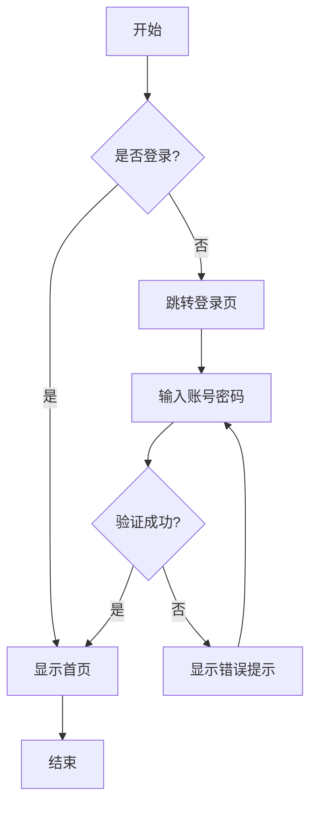
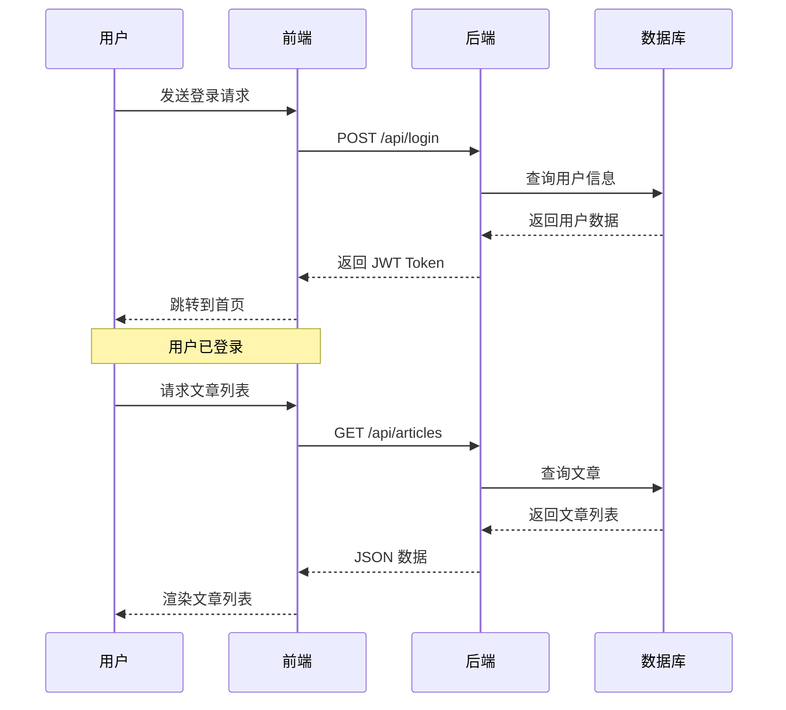
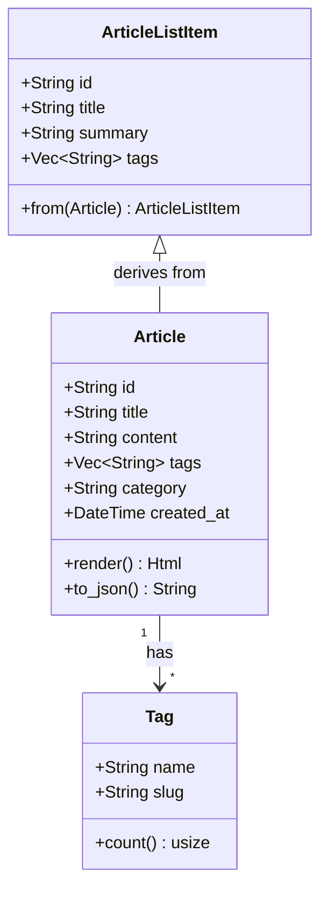
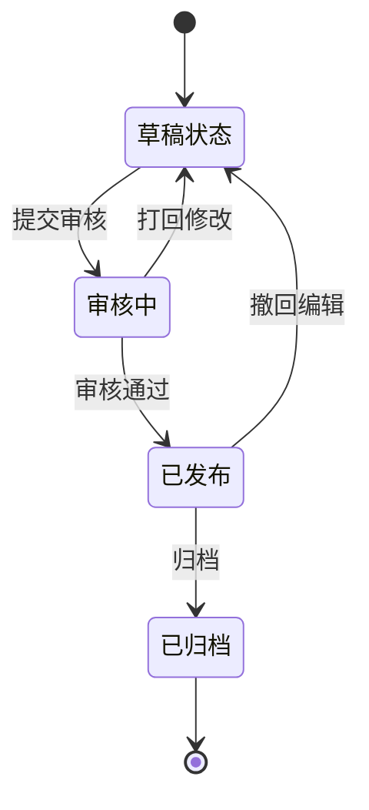
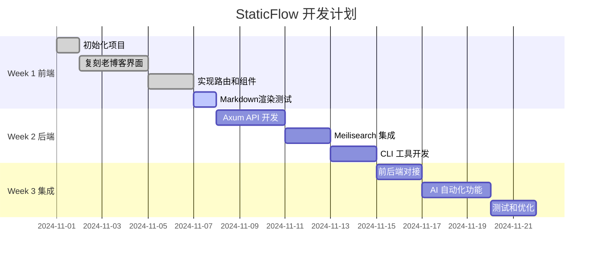
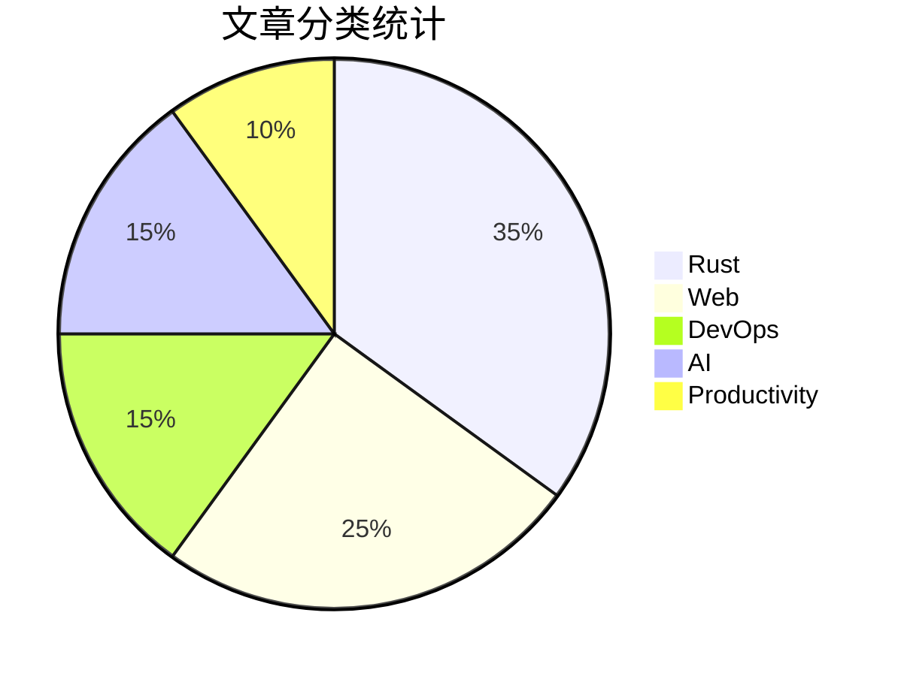
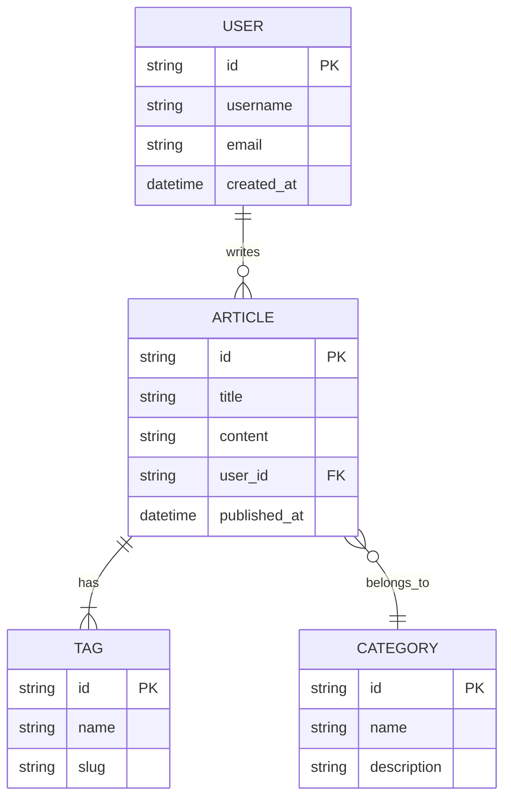
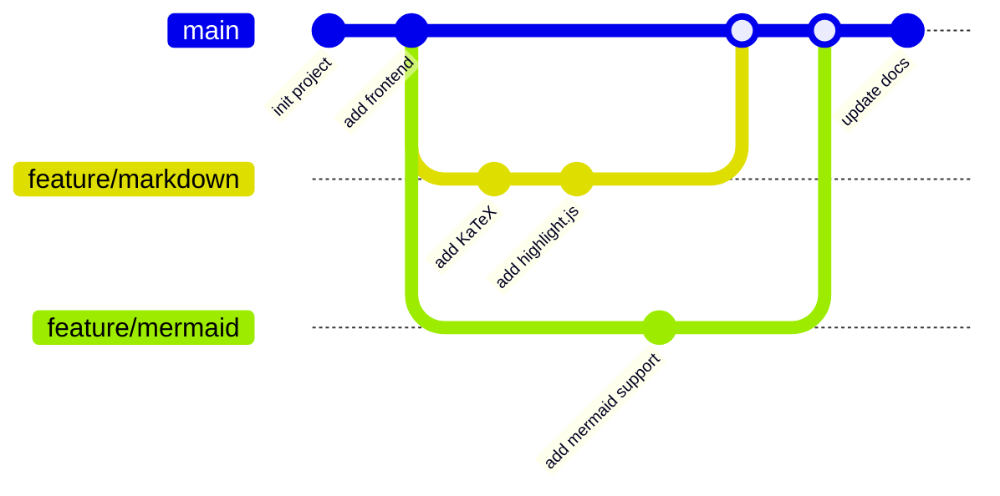
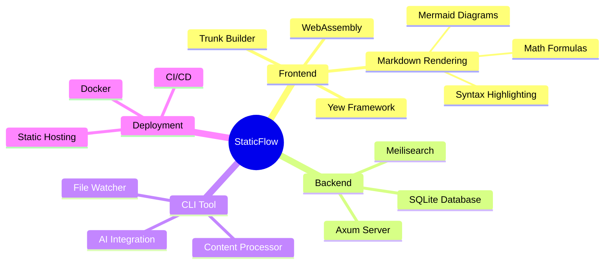
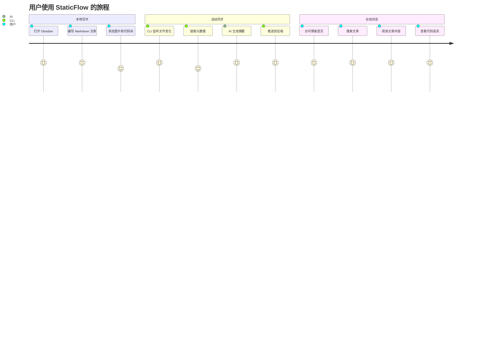

# Markdown 渲染测试文档

本文档用于测试 StaticFlow 前端的 Markdown 渲染功能，包括代码语法高亮、数学公式和 Mermaid 图表支持。

## 目录

1. [代码语法高亮测试](#代码语法高亮测试)
2. [数学公式测试](#数学公式测试)
3. [Mermaid 图表测试](#mermaid-图表测试)
4. [混合内容测试](#混合内容测试)

---

## 代码语法高亮测试

### Rust 代码

```rust
use yew::prelude::*;

#[function_component(HelloWorld)]
pub fn hello_world() -> Html {
    let counter = use_state(|| 0);
    let increment = {
        let counter = counter.clone();
        Callback::from(move |_| counter.set(*counter + 1))
    };

    html! {
        <div>
            <h1>{ format!("Counter: {}", *counter) }</h1>
            <button onclick={increment}>{ "+1" }</button>
        </div>
    }
}
```

### JavaScript 代码

```javascript
function fibonacci(n) {
    if (n <= 1) return n;
    return fibonacci(n - 1) + fibonacci(n - 2);
}

const result = [1, 2, 3, 4, 5].map(n => fibonacci(n));
console.log(result); // [1, 1, 2, 3, 5]
```

### Python 代码

```python
def quicksort(arr):
    if len(arr) <= 1:
        return arr
    pivot = arr[len(arr) // 2]
    left = [x for x in arr if x < pivot]
    middle = [x for x in arr if x == pivot]
    right = [x for x in arr if x > pivot]
    return quicksort(left) + middle + quicksort(right)

print(quicksort([3, 6, 8, 10, 1, 2, 1]))
```

### Bash 脚本

```bash
#!/bin/bash
for i in {1..10}; do
    echo "Processing file $i..."
    if [ -f "input_$i.txt" ]; then
        cat "input_$i.txt" | grep "pattern" > "output_$i.txt"
    else
        echo "File not found!" >&2
    fi
done
```

### JSON 配置

```json
{
  "name": "static-flow-frontend",
  "version": "0.1.0",
  "dependencies": {
    "yew": "0.21",
    "wasm-bindgen": "0.2"
  },
  "devDependencies": {
    "trunk": "^0.20.0"
  }
}
```

### SQL 查询

```sql
SELECT
    u.username,
    COUNT(p.id) as post_count,
    MAX(p.created_at) as last_post
FROM users u
LEFT JOIN posts p ON u.id = p.user_id
WHERE u.is_active = true
GROUP BY u.id, u.username
HAVING post_count > 5
ORDER BY post_count DESC
LIMIT 10;
```

## 数学公式测试

### 行内公式

这是一个行内公式：$E = mc^2$，它描述了质能等价关系。

质量为 $m$ 的物体具有的能量为 $E$，其中 $c$ 是光速（约 $3 \times 10^8$ m/s）。

### 块级公式

二次方程的求根公式：

$$
x = \frac{-b \pm \sqrt{b^2 - 4ac}}{2a}
$$

傅里叶变换：

$$
F(\omega) = \int_{-\infty}^{\infty} f(t) e^{-i\omega t} dt
$$

矩阵乘法：

$$
\begin{bmatrix}
a & b \\
c & d
\end{bmatrix}
\begin{bmatrix}
x \\
y
\end{bmatrix}
=
\begin{bmatrix}
ax + by \\
cx + dy
\end{bmatrix}
$$

欧拉公式（数学中最美的公式之一）：

$$
e^{i\pi} + 1 = 0
$$

## 混合内容测试

### 示例：快速排序算法分析

快速排序的平均时间复杂度为 $O(n \log n)$，最坏情况为 $O(n^2)$。

**实现代码**：

```rust
fn quicksort<T: Ord>(arr: &mut [T]) {
    if arr.len() <= 1 {
        return;
    }
    let pivot = partition(arr);
    quicksort(&mut arr[0..pivot]);
    quicksort(&mut arr[pivot + 1..]);
}

fn partition<T: Ord>(arr: &mut [T]) -> usize {
    let pivot = arr.len() - 1;
    let mut i = 0;
    for j in 0..pivot {
        if arr[j] <= arr[pivot] {
            arr.swap(i, j);
            i += 1;
        }
    }
    arr.swap(i, pivot);
    i
}
```

**时间复杂度分析**：

设 $T(n)$ 为排序 $n$ 个元素的时间，分区操作需要 $O(n)$ 时间。

- 最好情况：每次都平分数组
  $$
  T(n) = 2T(n/2) + O(n) = O(n \log n)
  $$

- 最坏情况：每次只分出一个元素
  $$
  T(n) = T(n-1) + O(n) = O(n^2)
  $$

## 特殊符号测试

希腊字母：$\alpha, \beta, \gamma, \Delta, \Sigma, \Omega$

数学符号：$\sum_{i=1}^{n} i = \frac{n(n+1)}{2}$

积分：$\int_0^1 x^2 dx = \frac{1}{3}$

极限：$\lim_{x \to \infty} \frac{1}{x} = 0$

偏导数：$\frac{\partial f}{\partial x}$

向量：$\vec{v} = \langle x, y, z \rangle$

## 渲染验证清单

- [ ] Rust 代码块有语法高亮
- [ ] JavaScript 代码块有语法高亮
- [ ] Python 代码块有语法高亮
- [ ] Bash 代码块有语法高亮
- [ ] JSON 代码块有语法高亮
- [ ] SQL 代码块有语法高亮
- [ ] 行内公式 $E = mc^2$ 正确渲染
- [ ] 块级公式正确渲染且居中
- [ ] 复杂公式（矩阵、积分、求和）正确渲染
- [ ] 代码和公式混排正常显示

---

**注意**：如果公式或代码高亮未生效，请检查浏览器控制台是否有 JavaScript 错误。

---

## Mermaid 图表测试

### 流程图 (Flowchart)



### 时序图 (Sequence Diagram)



### 类图 (Class Diagram)



### 状态图 (State Diagram)



### 甘特图 (Gantt Chart)



### 饼图 (Pie Chart)



### ER 图 (Entity Relationship)



### Git 分支图 (Git Graph)



### 思维导图 (Mindmap)



### 旅程图 (User Journey)




## 渲染验证清单

### 代码高亮
- [ ] Rust 代码块有语法高亮
- [ ] JavaScript 代码块有语法高亮
- [ ] Python 代码块有语法高亮
- [ ] Bash 代码块有语法高亮
- [ ] JSON 代码块有语法高亮
- [ ] SQL 代码块有语法高亮

### 数学公式
- [ ] 行内公式 $E = mc^2$ 正确渲染
- [ ] 块级公式正确渲染且居中
- [ ] 复杂公式（矩阵、积分、求和）正确渲染
- [ ] 代码和公式混排正常显示

### Mermaid 图表
- [ ] 流程图 (Flowchart) 正确渲染
- [ ] 时序图 (Sequence Diagram) 正确渲染
- [ ] 类图 (Class Diagram) 正确渲染
- [ ] 状态图 (State Diagram) 正确渲染
- [ ] 甘特图 (Gantt Chart) 正确渲染
- [ ] 饼图 (Pie Chart) 正确渲染
- [ ] ER 图 (Entity Relationship) 正确渲染
- [ ] Git 分支图 (Git Graph) 正确渲染
- [ ] 思维导图 (Mindmap) 正确渲染
- [ ] 旅程图 (User Journey) 正确渲染

### 主题适配
- [ ] 切换到暗色主题后，Mermaid 图表自动使用暗色主题
- [ ] 切换到亮色主题后，Mermaid 图表自动使用亮色主题
- [ ] 代码高亮主题跟随系统主题切换

---

**调试提示**：
- 如果 Mermaid 图表未渲染，打开浏览器控制台检查是否有错误
- 确保 `window.mermaid` 已定义
- 检查 `.mermaid` 类的 div 元素是否正确生成
- 如果公式或代码高亮未生效，刷新页面（Ctrl+F5）清除缓存
