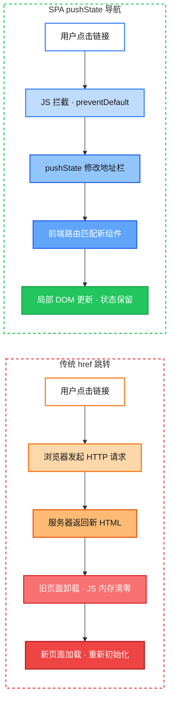
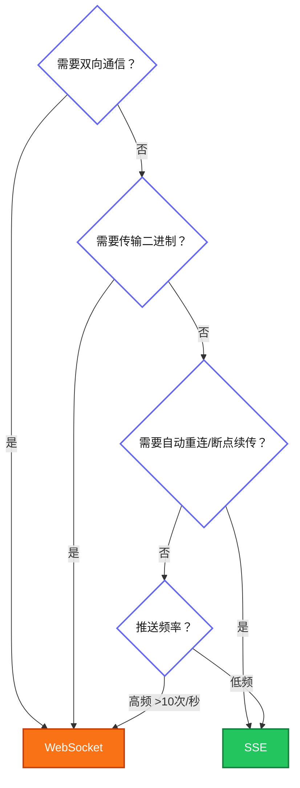
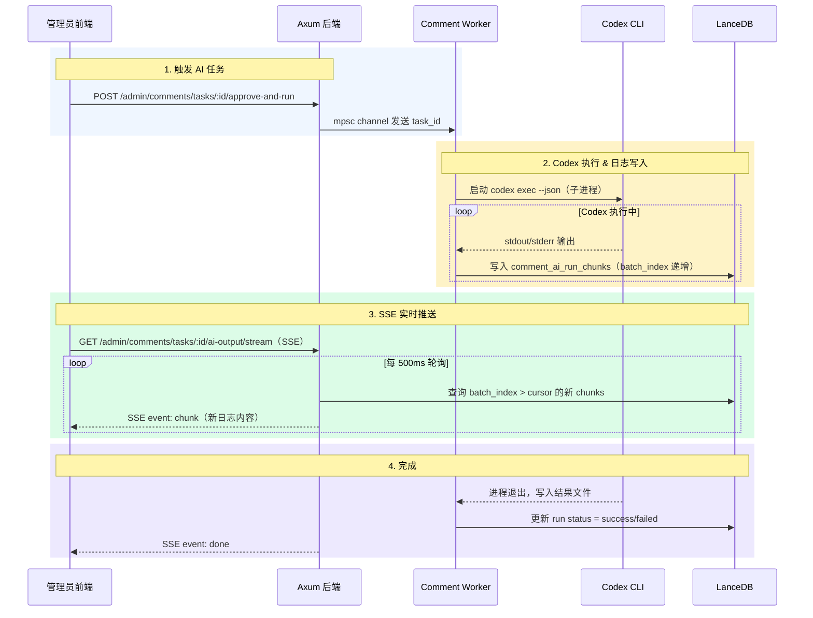

# SPA 导航 vs 传统跳转：一次 Rust + WASM 全栈项目的实战踩坑

> **项目版本**: 基于 StaticFlow `master` 分支 (2026-02)
> **技术栈**: Rust + Yew + WebAssembly + Trunk

## 1. 问题：搜索一下，音乐就没了

StaticFlow 是一个 Rust 全栈博客系统，前端用 Yew 框架编译为 WebAssembly 运行在浏览器中。它有一个全局音乐播放器——用户可以一边听歌一边浏览文章、搜索内容。

但在实际使用中发现了一个严重问题：**用户正在播放音乐时，点击搜索或切换搜索模式，音乐立刻停止，迷你播放器消失，整个页面白屏重载**。

这不是 bug，而是一个架构层面的认知偏差——我们在 SPA 里用了传统多页应用的导航方式。

> 📌 **本文范围**: 聚焦 SPA 导航与传统 `<a href>` 跳转的本质区别，以及在 WASM SPA 中这个差异带来的放大效应。同时延伸讨论 SEO 与 SPA 的关系，以及前端流式通信协议（SSE vs WebSocket）的选型。不涉及 SSR、SSG 等服务端渲染方案。

## 2. 两种导航方式的本质区别

在深入代码之前，先建立一个清晰的心智模型。

### 2.1 对比总览



| 维度 | 传统 `<a href>` | SPA `pushState` |
|------|----------------|-----------------|
| 网络请求 | 浏览器向服务器请求完整 HTML | 无请求（或仅 API 数据请求） |
| 页面生命周期 | 旧页面 `unload` → 新页面 `load` | 同一页面，组件切换 |
| JS 内存状态 | 全部丢失 | 完整保留 |
| DOM 元素 | 全部销毁重建 | 仅变化部分更新 |
| 地址栏 URL | 浏览器原生更新 | `history.pushState()` 更新 |
| 后退按钮 | 浏览器原生处理 | 监听 `popstate` 事件 |
| 白屏时间 | 有（等待新页面加载） | 无（即时切换） |

### 2.2 在 WASM SPA 中的放大效应

对于普通 JavaScript SPA，全页刷新的代价是重新执行 JS bundle。但对于 WASM SPA，代价要大得多：

```
传统 JS SPA 刷新:
  下载 HTML → 解析 CSS → 下载 JS bundle → 执行 JS → 渲染
  ~200-500ms

WASM SPA 刷新:
  下载 HTML → 解析 CSS → 下载 WASM binary (~2-5MB)
  → WebAssembly.instantiateStreaming() 编译
  → 初始化 Rust 运行时 → 渲染
  ~1-3s (首次), ~500ms-1s (有缓存)
```

> 💡 **关键点**: WASM 的编译和实例化开销远大于 JS 的解析执行。每次全页刷新都意味着重新走一遍这个流程，用户体验上就是明显的白屏等待。

## 3. StaticFlow 的组件架构：为什么状态会丢失

要理解问题的根源，需要先看 StaticFlow 的组件树结构。

### 3.1 应用组件树

```
App (main.rs:18)
└── MusicPlayerProvider (main.rs:21)     ← 全局音乐状态
    └── BrowserRouter (router.rs:190)    ← Yew 前端路由
        └── AppRouterInner (router.rs:197)
            ├── Header                    ← 导航栏 + 搜索框
            ├── Switch<Route>             ← 页面内容（根据 URL 切换）
            │   ├── SearchPage
            │   ├── MusicLibraryPage
            │   ├── MusicPlayerPage
            │   └── ...
            ├── Footer
            ├── PersistentAudio           ← <audio> 元素（路由外）
            └── MiniPlayer               ← 迷你播放器悬浮条
```

关键设计：`PersistentAudio` 和 `MiniPlayer` 放在 `Switch<Route>` 外面，与路由无关。这意味着**在 SPA 导航下**，无论用户切换到哪个页面，音乐播放器的 `<audio>` 元素和迷你播放器都不会被销毁。

但如果触发了全页刷新，整个组件树从 `App` 开始重建，`MusicPlayerState` 回到 `Default`，`<audio>` 元素被销毁——音乐自然就停了。

### 3.2 音乐播放器状态结构

```rust
// frontend/src/music_context.rs:15
pub struct MusicPlayerState {
    pub current_song: Option<SongDetail>,
    pub song_id: Option<String>,
    pub playing: bool,
    pub current_time: f64,
    pub duration: f64,
    pub volume: f64,
    pub minimized: bool,
    pub visible: bool,
    pub history: Vec<(String, SongDetail)>,
    pub playlist_ids: Vec<String>,
    // ...
}
```

这个状态通过 Yew 的 `use_reducer` + `ContextProvider` 在整个组件树中共享：

```rust
// frontend/src/main.rs:18-24
fn app() -> Html {
    html! {
        <MusicPlayerProvider>      // ← use_reducer(MusicPlayerState::default)
            <router::AppRouter />
        </MusicPlayerProvider>
    }
}
```

> 🤔 **思考**: `use_reducer` 的状态存在于 WASM 的线性内存中。全页刷新 = WASM 实例销毁 = 线性内存释放 = 所有 Rust 堆上的数据归零。这不是 Yew 的问题，而是 WebAssembly 的运行模型决定的。

## 4. 问题代码：SPA 里的 "传统跳转"

### 4.1 搜索页面的模式切换（修复前）

搜索页面支持多种模式（文章、图片、音乐），音乐搜索又有子模式（关键词、语义、混合）。修复前，模式切换使用的是普通 `<a>` 标签：

```html
<!-- 修复前：search.rs 中的模式切换链接 -->
<a href="/search?q=周杰伦&mode=music&music_sub=semantic"
   class="px-5 py-2.5 rounded-xl ...">
  语义搜索
</a>
```

用户点击这个链接时，浏览器的默认行为是：

```
1. 发起 GET /search?q=周杰伦&mode=music&music_sub=semantic
2. 服务器返回 index.html（因为是 SPA，所有路由都返回同一个 HTML）
3. 浏览器卸载当前页面
4. 重新加载 index.html
5. 重新下载/编译 WASM
6. Yew 从零开始渲染
7. MusicPlayerState::default() → playing: false, current_song: None
```

**结果**: 音乐停止，播放器消失，用户需要重新选歌。

### 4.2 Header 搜索框（修复前）

Header 中的搜索图标同样使用了 `<a href>`：

```html
<!-- 修复前：header.rs 中的搜索入口 -->
<a href="/search?q=&mode=image" class="nav-icon-btn ...">
  <i class="fa-solid fa-images"></i>
</a>
```

### 4.3 音乐库页面的搜索（修复前）

音乐库页面的 hero 搜索框更直接——用 `window.location.set_href()` 跳转：

```rust
// 修复前：music_library.rs
let url = format!("/search?q={encoded}&mode=music");
window().location().set_href(&url);  // ← 等同于 <a href>，触发全页刷新
```

## 5. 修复方案：拦截跳转，走 SPA 路由

### 5.1 核心工具函数：`spa_navigate`

```rust
// frontend/src/pages/search.rs:27-40
fn spa_navigate(href: &str) {
    if let Some(window) = web_sys::window() {
        if let Ok(history) = window.history() {
            // 1. 只修改地址栏 URL，不触发页面加载
            let _ = history.push_state_with_url(
                &wasm_bindgen::JsValue::NULL,
                "",
                Some(href),
            );
            // 2. 手动触发 popstate，让 Yew Router 感知 URL 变化
            if let Ok(event) = Event::new("popstate") {
                let _ = window.dispatch_event(&event);
            }
        }
    }
}
```

> 💡 **关键点**: `pushState` 本身不会触发 `popstate` 事件（只有浏览器的前进/后退按钮才会）。所以需要手动 `dispatch_event` 一个 `popstate`，Yew 的 `BrowserRouter` 监听到这个事件后，会重新匹配路由并更新 `Switch<Route>` 内的组件。

### 5.2 搜索页面：事件委托拦截

搜索页面内有大量动态生成的 `<a>` 标签（模式切换、分页等）。逐个给每个 `<a>` 加 `onclick` 不现实，所以采用**事件委托**模式：

```rust
// frontend/src/pages/search.rs:42-62
fn intercept_search_links(e: MouseEvent) {
    let search_prefix = crate::config::route_path("/search");
    // 从点击目标向上冒泡，找到最近的 <a> 元素
    let mut node = e.target()
        .and_then(|t| t.dyn_into::<web_sys::Element>().ok());
    while let Some(el) = node {
        if el.tag_name().eq_ignore_ascii_case("A") {
            if let Some(href) = el.get_attribute("href") {
                // 只拦截指向搜索页的链接
                if href.starts_with(&search_prefix) {
                    e.prevent_default();  // 阻止浏览器默认跳转
                    spa_navigate(&href);  // 走 SPA 路由
                    return;
                }
            }
            break;
        }
        node = el.parent_element();  // 继续向上查找
    }
}
```

这个处理器挂在搜索页面的根 `<main>` 元素上，利用 DOM 事件冒泡机制，一个 handler 拦截所有子元素中的 `<a>` 点击。

**数据流**:

```
用户点击 <a href="/search?mode=music&music_sub=semantic">
  ↓ 事件冒泡到 <main onclick={intercept_search_links}>
  ↓ 找到 <a>，href 以 /search 开头
  ↓ e.prevent_default() 阻止浏览器跳转
  ↓ spa_navigate("/search?mode=music&music_sub=semantic")
  ↓ pushState 更新地址栏
  ↓ dispatch popstate 事件
  ↓ Yew BrowserRouter 重新匹配路由
  ↓ SearchPage 组件重新渲染（读取新的 query params）
  ↓ MusicPlayerState 不受影响，音乐继续播放 ✓
```

### 5.3 Header 搜索：`spa_search_click` 回调

Header 中的搜索入口是固定的几个 `<a>` 标签，直接用 `onclick` 回调：

```rust
// frontend/src/components/header.rs:16-33
fn spa_search_click(href: String) -> Callback<MouseEvent> {
    Callback::from(move |e: MouseEvent| {
        e.prevent_default();
        if let Some(window) = web_sys::window() {
            if let Ok(history) = window.history() {
                let _ = history.push_state_with_url(
                    &wasm_bindgen::JsValue::NULL,
                    "",
                    Some(&href),
                );
                if let Ok(event) = web_sys::Event::new("popstate") {
                    let _ = window.dispatch_event(&event);
                }
            }
        }
    })
}

// 使用：header.rs:328-330
<a href={image_search_href.clone()}
   onclick={spa_search_click(image_search_href.clone())}
   class="nav-icon-btn ...">
```

> 📝 **注意**: `href` 属性仍然保留，这是为了：(1) 右键"在新标签页打开"仍然有效；(2) SEO 友好；(3) JS 禁用时的降级。`onclick` 中的 `prevent_default()` 只在正常左键点击时生效。

### 5.4 音乐库搜索：替换 `set_href`

```rust
// 修复后：frontend/src/pages/music_library.rs:82-93
let url = crate::config::route_path(
    &format!("/search?q={encoded}&mode=music")
);
if let Some(window) = web_sys::window() {
    if let Ok(history) = window.history() {
        let _ = history.push_state_with_url(
            &wasm_bindgen::JsValue::NULL,
            "",
            Some(&url),
        );
        if let Ok(event) = web_sys::Event::new("popstate") {
            let _ = window.dispatch_event(&event);
        }
    }
}
```

## 6. 修复前后对比

### 6.1 用户体验对比

| 场景 | 修复前 | 修复后 |
|------|--------|--------|
| 播放音乐时搜索 | 音乐停止，白屏 1-3s | 音乐继续，即时切换 |
| 切换搜索模式 | 全页重载，WASM 重新编译 | 组件局部更新 |
| 搜索后点后退 | 再次全页重载 | 即时返回上一状态 |
| 迷你播放器 | 消失后重新出现（空状态） | 始终可见，状态保持 |

### 6.2 性能对比

```
修复前（全页刷新）:
  HTML 解析 ─── WASM 下载 ─── 编译 ─── 初始化 ─── 渲染
  |←─────────── 1000-3000ms ──────────────→|

修复后（SPA 导航）:
  pushState ─ popstate ─ 组件 diff ─ DOM patch
  |←────── 10-50ms ──────→|
```

### 6.3 代码改动量

整个修复涉及 3 个文件，核心改动不到 80 行：

- `search.rs`: +`spa_navigate()` 函数 + `intercept_search_links()` 事件委托
- `header.rs`: +`spa_search_click()` 回调，应用到 2 个 `<a>` 标签
- `music_library.rs`: `set_href()` → `push_state_with_url()` + `dispatch_event()`

## 7. 经验总结与避坑指南

### 7.1 SPA 中的导航陷阱

在 SPA 框架中，以下写法都会触发全页刷新，**绕过前端路由**：

```rust
// ❌ 这些都会导致全页刷新
window().location().set_href("/search?q=test");
window().location().assign("/search?q=test");
window().location().replace("/search?q=test");

// ❌ 没有 onclick 拦截的 <a> 标签
html! { <a href="/search?q=test">{"搜索"}</a> }
```

正确的 SPA 导航方式：

```rust
// ✅ 方式一：Yew Router 的 Link 组件（推荐，适合静态路由）
html! { <Link<Route> to={Route::Search}>{"搜索"}</Link<Route>> }

// ✅ 方式二：手动 pushState（适合动态 URL、带 query params）
history.push_state_with_url(&JsValue::NULL, "", Some(&url));
window.dispatch_event(&Event::new("popstate").unwrap());

// ✅ 方式三：保留 href + onclick 拦截（兼顾 SEO 和右键菜单）
html! {
    <a href={url.clone()} onclick={spa_search_click(url)}>{"搜索"}</a>
}
```

### 7.2 为什么 Yew 的 `Link<Route>` 没有完全解决问题

Yew Router 提供了 `Link<Route>` 组件，它内部已经做了 `pushState` 导航。但在 StaticFlow 的搜索场景中，URL 包含动态 query parameters（`?q=xxx&mode=music&music_sub=semantic`），而 `Route` 枚举通常只定义路径部分。动态拼接 query string 后，直接用 `<a href>` 更方便——但也更容易忘记拦截。

> ⚠️ **踩坑点**: 在 Yew 中，如果你用 `<a href={dynamic_url}>` 而不是 `<Link<Route>>`，**必须**手动添加 `onclick` 拦截，否则就是传统跳转。这在开发时不容易发现，因为功能上"看起来正常"——页面确实跳转了，只是代价是全页刷新。

### 7.3 WASM SPA 的特殊考量

在 WASM SPA 中，全页刷新的代价比 JS SPA 更高：

1. **WASM 编译开销**: `WebAssembly.instantiateStreaming()` 需要编译整个 `.wasm` 文件，即使有 V8 Code Cache，首次编译仍需数百毫秒
2. **Rust 运行时初始化**: 全局状态、内存分配器、panic handler 都需要重新初始化
3. **IndexedDB 缓存探测**: 如果使用了 WASM 字节码缓存（如 StaticFlow 的 monkey-patch 方案），还需要额外的异步 I/O
4. **无法序列化恢复**: 不像 JS 可以用 `sessionStorage` 轻松保存/恢复状态，Rust 的复杂结构体（如包含 `Rc`、回调的 `MusicPlayerState`）无法直接序列化

因此，**在 WASM SPA 中，确保所有内部导航走 pushState 路由，比在 JS SPA 中更加重要**。

### 7.4 什么时候该用传统 `<a href>` 跳转

虽然 SPA 内部应该尽量走 pushState 路由，但传统 href 跳转在以下场景中是正确甚至必要的：

**1. 跳转到外部网站**

```html
<a href="https://github.com/user/repo">GitHub</a>
```

跨域只能走浏览器原生导航，pushState 无法修改 URL 的 origin 部分。

**2. 跳转到不同的应用或子系统**

比如主站是 SPA，但 `/admin` 是另一个独立部署的应用，或者 `/api/docs` 是后端渲染的 Swagger 页面——这些不在前端路由管辖范围内，必须用真实跳转。

**3. 需要完整页面刷新的场景**

- 用户登出后，需要清空所有内存状态（token、缓存、WebSocket 连接）
- 应用检测到新版本发布，需要强制加载最新的 JS/WASM bundle
- 某些错误恢复场景，状态已经脏了，最干净的方式就是重载

**4. 文件下载**

```html
<a href="/api/export/report.pdf" download>下载报告</a>
```

浏览器需要原生处理 `Content-Disposition: attachment` 响应头，pushState 做不了这个。

**5. `target="_blank"` 新窗口打开**

新窗口是独立的浏览上下文，没有共享内存状态可言，用 href 是唯一选择。

**6. SEO 和无 JS 降级**

`<a href>` 本身作为 HTML 属性保留是有意义的——搜索引擎爬虫不执行 JS，它只看 `href`。所以最佳实践是**同时保留 href 和 onclick 拦截**：

```rust
// 正常点击 → onclick 拦截，走 SPA
// 右键"新标签页打开" → 走 href，正常加载
// 爬虫抓取 → 只看 href，能发现页面链接
<a href={url.clone()} onclick={spa_search_click(url)}>
```

> 💡 **简单判断**: SPA 内部同应用的页面切换走 pushState，其他一切走 href。

## 8. 延伸：SEO 与 SPA 的关系

### 8.1 什么是 SEO

SEO（Search Engine Optimization，搜索引擎优化）的核心目标是让搜索引擎（Google、Bing、百度）更容易发现和理解网页内容，从而在搜索结果中获得更高的排名。

与 SPA 导航直接相关的关键点：**搜索引擎爬虫通常不执行 JavaScript/WASM**。它拿到 HTML 后，只看静态内容：

```html
<!-- 爬虫能看到这个链接，知道 /search 页面存在 -->
<a href="/search?mode=music">音乐搜索</a>

<!-- 爬虫看不懂这个，因为它不会执行 onclick -->
<button onclick="navigateTo('/search?mode=music')">音乐搜索</button>
```

### 8.2 SPA 中的 SEO 最佳实践

这就是为什么前面 §5.3 中强调"保留 href 属性 + onclick 拦截"：

```rust
<a href={url.clone()} onclick={spa_search_click(url)}>
```

三种访问者，三种行为：

| 访问者 | 行为 | 结果 |
|--------|------|------|
| 普通用户左键点击 | `onclick` 拦截 → pushState | SPA 导航，状态保留 |
| 用户右键"新标签页打开" | 走 `href` | 新标签页完整加载 |
| 搜索引擎爬虫 | 只看 `href` 属性 | 发现页面链接，建立索引 |

StaticFlow 的 `index.html` 中已经做了基础 SEO 工作——`og:title`、`og:description`、`canonical`、结构化 meta 标签等（见 `frontend/index.html:1-30`）。但如果内部链接全用 JS 导航而不保留 `href`，爬虫就无法发现页面之间的链接关系，SEO 效果会大打折扣。

> 📝 **SEO 常见手段**: 合理的 `<title>`、`<meta description>`、语义化 HTML 标签（`<article>`、`<nav>`）、`sitemap.xml`、结构化数据（JSON-LD）、`canonical` URL 等。

## 9. 延伸：前端流式通信——SSE vs WebSocket

SPA 导航解决的是"页面切换不丢状态"的问题。但在实际应用中，还有另一个常见需求：**服务端主动向前端推送数据**（如 AI 流式回复、实时通知、日志流）。这涉及两种主要协议：SSE 和 WebSocket。

### 9.1 SSE（Server-Sent Events）

SSE 是基于 HTTP 的单向推送协议，服务端通过长连接持续向浏览器发送文本事件。

浏览器端使用 `EventSource` API：

```javascript
const es = new EventSource("/api/stream");

es.onmessage = (event) => {
    console.log(event.data);       // 收到服务端推送的数据
    console.log(event.lastEventId); // 当前事件 ID
};

es.onerror = () => {
    // 连接断开后，浏览器会自动重连
    // 重连时自动带上 Last-Event-ID 请求头
};
```

服务端响应格式（纯文本）：

```
HTTP/1.1 200 OK
Content-Type: text/event-stream
Cache-Control: no-cache
Connection: keep-alive

id: 1
event: message
data: {"text": "你好"}

id: 2
event: message
data: {"text": "，世界"}

: 这是注释，用于保持连接（心跳）

id: 3
event: done
data: [DONE]
```

> 💡 **关键特性——自动重连与断点续传**: SSE 内置了自动重连机制。当连接断开（包括页面刷新后重新创建 `EventSource`）时，浏览器会自动在重连请求中携带 `Last-Event-ID` 头，值为最后收到的事件 `id`。服务端可以据此从断点继续推送，而不是从头开始。这个能力是 SSE 相比 WebSocket 最独特的优势之一。

### 9.2 WebSocket

WebSocket 是独立于 HTTP 的全双工通信协议，客户端和服务端可以随时互发消息。

```javascript
const ws = new WebSocket("wss://example.com/ws");

ws.onopen = () => {
    ws.send(JSON.stringify({ type: "subscribe", channel: "chat" }));
};

ws.onmessage = (event) => {
    console.log(event.data);
};

ws.onclose = () => {
    // 连接断开，需要自己实现重连逻辑
    // 需要自己维护"上次收到哪条消息"的状态
    setTimeout(() => reconnect(), 3000);
};
```

### 9.3 SSE vs WebSocket 详细对比

| 维度 | SSE | WebSocket |
|------|-----|-----------|
| 通信方向 | 单向（服务端 → 客户端） | 双向（全双工） |
| 底层协议 | 标准 HTTP/1.1 或 HTTP/2 | 独立的 `ws://` / `wss://` 协议 |
| 连接建立 | 普通 HTTP GET 请求 | HTTP Upgrade 握手后切换协议 |
| 数据格式 | 纯文本（通常 JSON） | 文本或二进制（ArrayBuffer/Blob） |
| 自动重连 | 浏览器内置，带 `Last-Event-ID` | 无，需自行实现 |
| 断点续传 | 原生支持（`id` + `Last-Event-ID`） | 无，需自行实现消息序号和重放 |
| 穿透代理/CDN | 容易（就是 HTTP 请求） | 有时需要额外配置（Upgrade 头） |
| 浏览器 API | `EventSource`（极简） | `WebSocket`（稍复杂） |
| 并发连接限制 | HTTP/1.1 下受同域 6 连接限制；HTTP/2 无此问题 | 不受 HTTP 连接数限制 |
| 适用场景 | 服务端推送：通知、日志流、AI 流式回复 | 双向交互：聊天、协同编辑、游戏 |

### 9.4 如何选择



**选 SSE 的典型场景**:
- AI 对话的流式回复（ChatGPT、Claude 都用 SSE）
- 服务端日志/事件流推送
- 实时通知（新评论、新消息提醒）
- 股票行情、比分更新等单向数据流

**选 WebSocket 的典型场景**:
- 即时聊天（客户端也需要频繁发消息）
- 多人协同编辑（如 Google Docs）
- 在线游戏（低延迟双向通信）
- 需要传输二进制数据（音视频流、文件传输）

### 9.5 SSE 与 SPA 导航的关系

回到本文的主题——SSE 的自动重连特性与 SPA 导航有一个有趣的交集：

- **SPA 内部导航**（pushState）：`EventSource` 连接不受影响，持续接收数据
- **全页刷新**（href 跳转）：`EventSource` 被销毁，但浏览器重新创建时会自动重连并带上 `Last-Event-ID`，服务端可以从断点续传

这意味着即使在全页刷新的场景下，SSE 也能优雅地恢复——这是 WebSocket 做不到的。不过，SPA 导航仍然是更优的选择，因为它避免了重连的延迟和服务端重放的开销。

### 9.6 深入理解 SSE 断点续传机制

在实际使用 SSE 之前，有两个常见疑问值得澄清。

#### 9.6.1 断点续传是客户端主动发起的吗？

是的。SSE 的断点续传是**客户端驱动**的，流程如下：

```
1. 服务端推送事件时带上 id 字段：
   id: 42
   data: {"content": "hello"}

2. 浏览器自动记住最后收到的 id（存在 EventSource 内部状态中）

3. 连接断开（网络抖动、页面刷新等）

4. 浏览器自动重连时，在 HTTP 请求头中带上：
   Last-Event-ID: 42

5. 服务端读取这个头，从 id=42 之后的消息开始推送
```

关键点：
- 浏览器的 `EventSource` 自动管理 `Last-Event-ID`，前端代码不需要手动处理
- 重连间隔默认约 3 秒，服务端可以通过 `retry:` 字段自定义（单位毫秒）：
  ```
  retry: 5000
  data: reconnect interval set to 5s
  ```
- 页面刷新后需要**重新创建** `EventSource` 实例，此时如果前端代码没有保存上次的 event id，就无法利用 `Last-Event-ID`——这是"自动重连"和"页面刷新后恢复"的区别

> ⚠️ **注意**: "自动重连"指的是同一个 `EventSource` 实例在连接断开后的自动恢复（浏览器行为，带 `Last-Event-ID`）。"页面刷新后恢复"需要前端自己把上次的 event id 存到 `sessionStorage` 等持久化存储中，然后在 URL 中传给服务端。

#### 9.6.2 服务端需要保存历史消息吗？

**取决于你是否需要断点续传**。

- 如果只需要"实时推送，断了就断了"（如股票行情），服务端不需要保存历史
- 如果需要断点续传（如 AI 任务日志流），服务端必须有办法根据 `Last-Event-ID` 查到后续消息

常见的服务端存储策略：

| 策略 | 适用场景 | 示例 |
|------|---------|------|
| 内存队列（环形缓冲区） | 短期重放，消息量小 | 最近 1000 条通知 |
| 数据库持久化 | 长期可查，需要精确重放 | AI 任务执行日志 |
| 消息队列（Kafka/Redis Stream） | 高吞吐，多消费者 | 实时数据管道 |
| 不保存 | 纯实时推送，不需要重放 | 心跳、临时状态 |

StaticFlow 采用的是**数据库持久化**方案——每个 chunk 写入 LanceDB 并带有 `batch_index`，这使得断点续传和历史回放都成为可能。

### 9.7 StaticFlow 中的 SSE 实战：Codex Worker 日志流

StaticFlow 使用 SSE 实现了 AI Worker（Codex）执行日志的实时流式推送。这是一个完整的生产级 SSE 案例。

#### 9.7.1 整体架构



#### 9.7.2 后端 SSE 端点

StaticFlow 有两个 SSE 端点，分别用于评论 AI 和音乐心愿 AI：

| 端点 | 用途 |
|------|------|
| `GET /admin/comments/tasks/:task_id/ai-output/stream` | 评论 AI 回复日志流 |
| `GET /admin/music-wishes/tasks/:wish_id/ai-output/stream` | 音乐心愿处理日志流 |

评论 AI 端点的核心实现（`backend/src/handlers.rs:1958`）：

```rust
pub async fn admin_stream_comment_task_ai_output(
    State(state): State<AppState>,
    headers: HeaderMap,
    Path(task_id): Path<String>,
    Query(query): Query<AdminCommentAiOutputStreamQuery>,
) -> Result<Sse<impl Stream<Item = Result<Event, Infallible>>>, ...>
```

查询参数：
- `run_id`：指定某次 AI 运行（可选，默认最新一次）
- `from_batch_index`：从指定 chunk 索引开始推送（用于断点续传）
- `poll_ms`：轮询间隔，200-5000ms，默认 500ms

SSE 事件类型：
- `chunk`：新的日志输出片段
- `done`：AI 运行完成（成功或失败）
- `error`：流错误或数据库查询失败

> 📝 **设计选择**: StaticFlow 没有使用标准的 SSE `id` 字段 + `Last-Event-ID` 头来实现断点续传，而是用了自定义的 `from_batch_index` 查询参数。这是因为 chunks 已经持久化在 LanceDB 中并带有 `batch_index`，用查询参数更直接，也更容易在 UI 上实现"跳转到指定位置"的功能。

#### 9.7.3 Worker 日志泵送

Worker 通过 `pump_child_stream` 函数将 Codex 子进程的 stdout/stderr 实时写入数据库（`backend/src/comment_worker.rs:493`）：

```rust
async fn pump_child_stream(
    store: Arc<CommentDataStore>,
    run_id: &str,
    task_id: &str,
    stream: &str,           // "stdout" 或 "stderr"
    sequence: Arc<AtomicI32>, // 全局递增的 batch_index
    reader: impl AsyncRead + Unpin,
) -> Result<String> {
    let mut lines = BufReader::new(reader).lines();
    while let Some(line) = lines.next_line().await? {
        let batch_index = sequence.fetch_add(1, Ordering::Relaxed);
        store.append_ai_run_chunk(NewCommentAiRunChunkInput {
            chunk_id: format!("{run_id}-{batch_index}"),
            run_id, task_id, stream, batch_index, content: line,
        }).await?;
    }
    Ok(collected)
}
```

数据流：`Codex stdout → 逐行读取 → 分配 batch_index → 写入 LanceDB → SSE 端点轮询推送`

#### 9.7.4 前端 EventSource 消费

评论 AI 流页面（`frontend/src/pages/admin_ai_stream.rs:142`）：

```rust
let stream_url = build_admin_comment_ai_stream_url(
    task_id, Some(&run_id), None,
);
match EventSource::new(&stream_url) {
    Ok(source) => {
        // 处理 message 事件（默认事件类型）
        let onmessage = Closure::<dyn FnMut(MessageEvent)>::new(
            move |event: MessageEvent| {
                let payload: AdminCommentAiStreamEvent =
                    serde_json::from_str(&event.data().as_string().unwrap())?;
                match payload.event_type.as_str() {
                    "chunk" => { /* 追加到 UI */ },
                    "done"  => { /* 标记完成 */ },
                    "error" => { /* 显示错误 */ },
                    _ => {},
                }
            },
        );
        source.set_onmessage(Some(onmessage.as_ref().unchecked_ref()));

        // 处理连接错误
        let onerror = Closure::<dyn FnMut(Event)>::new(move |_| {
            // readyState == 0: 浏览器正在自动重连，不报错
            // readyState == 2: 连接永久关闭，显示错误
            if source_ref.ready_state() == 2 {
                stream_status.set("error".to_string());
            }
        });
        source.set_onerror(Some(onerror.as_ref().unchecked_ref()));
    },
    Err(_) => { /* 创建 EventSource 失败 */ },
}
```

音乐心愿流页面（`frontend/src/pages/admin_music_wish_stream.rs:102`）使用了**命名事件**，区别于评论流的默认 `message` 事件：

```rust
// 监听命名事件而非 onmessage
source.add_event_listener_with_callback("chunk", on_chunk.as_ref().unchecked_ref());
source.add_event_listener_with_callback("done", on_done.as_ref().unchecked_ref());
source.add_event_listener_with_callback("error", on_error.as_ref().unchecked_ref());
```

> 💡 **两种事件模式对比**: 评论流把所有事件都发到默认的 `message` 事件中，通过 JSON 内的 `event_type` 字段区分；音乐流使用 SSE 原生的 `event:` 字段发送命名事件（`chunk`/`done`/`error`），前端用 `addEventListener` 分别监听。后者更符合 SSE 规范的设计意图，前者在只有一个 `onmessage` 回调时更简洁。

#### 9.7.5 完整数据流总结

```
管理员点击"审批并运行"
  → POST 请求创建 AI 运行记录
  → mpsc channel 通知 Worker
  → Worker 启动 Codex 子进程（codex exec --json）
  → Codex 执行 AI Skill，stdout 输出执行日志
  → Worker 逐行读取，写入 LanceDB（comment_ai_run_chunks 表）
  → 前端 EventSource 连接 SSE 端点
  → 后端每 500ms 轮询 LanceDB，推送新 chunks
  → 前端实时渲染日志输出
  → Codex 完成，Worker 更新运行状态
  → 后端推送 done 事件，关闭 SSE 流
```

## 10. 代码索引

| 文件 | 关键函数/结构 | 行号 |
|------|-------------|------|
| `frontend/src/pages/search.rs` | `spa_navigate()` | :27 |
| `frontend/src/pages/search.rs` | `intercept_search_links()` | :45 |
| `frontend/src/components/header.rs` | `spa_search_click()` | :17 |
| `frontend/src/pages/music_library.rs` | hero 搜索 `push_state_with_url` | :86 |
| `frontend/src/music_context.rs` | `MusicPlayerState` | :15 |
| `frontend/src/music_context.rs` | `MusicPlayerProvider` | :246 |
| `frontend/src/components/persistent_audio.rs` | `PersistentAudio` | :110 |
| `frontend/src/components/persistent_audio.rs` | `try_play()` | :13 |
| `frontend/src/main.rs` | `App` 组件树根 | :18 |
| `frontend/src/router.rs` | `BrowserRouter` + `Switch<Route>` | :190 |
| `backend/src/handlers.rs` | 评论 AI SSE 端点 | :1958 |
| `backend/src/handlers.rs` | 音乐心愿 AI SSE 端点 | :3920 |
| `backend/src/comment_worker.rs` | `spawn_comment_worker()` | :153 |
| `backend/src/comment_worker.rs` | `pump_child_stream()` | :493 |
| `frontend/src/pages/admin_ai_stream.rs` | 评论 AI 流前端 EventSource | :142 |
| `frontend/src/pages/admin_music_wish_stream.rs` | 音乐心愿流前端 EventSource | :102 |
| `scripts/comment_ai_worker_runner.sh` | Codex 执行脚本 | :1-121 |

## 参考

- [MDN: History.pushState()](https://developer.mozilla.org/en-US/docs/Web/API/History/pushState)
- [MDN: popstate event](https://developer.mozilla.org/en-US/docs/Web/API/Window/popstate_event)
- [MDN: EventSource (SSE)](https://developer.mozilla.org/en-US/docs/Web/API/EventSource)
- [MDN: Server-Sent Events 使用指南](https://developer.mozilla.org/en-US/docs/Web/API/Server-sent_events/Using_server-sent_events)
- [MDN: WebSocket API](https://developer.mozilla.org/en-US/docs/Web/API/WebSocket)
- [Yew Framework: Router](https://yew.rs/docs/concepts/router)
- [WebAssembly: Loading and running](https://developer.mozilla.org/en-US/docs/WebAssembly/Loading_and_running)
