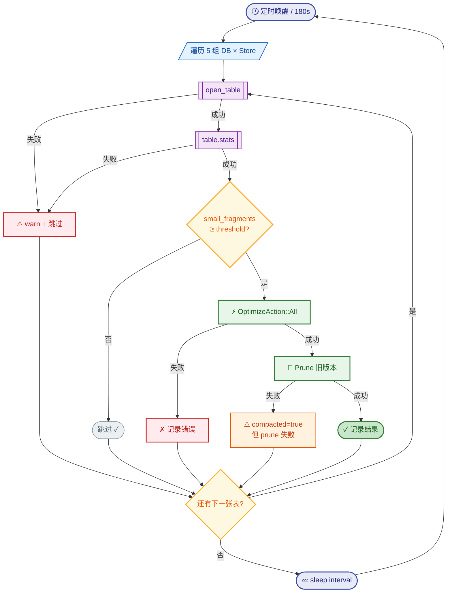

# StaticFlow 统一 LanceDB 后台表压缩器：碎片驱动的自动维护

> 3 个数据库、22 张表、一个 105 行的压缩器，和一次优雅关闭的踩坑。

---

## 1. 问题 — 碎片在暗处生长

StaticFlow 使用 LanceDB 作为唯一存储引擎，数据分布在三个独立的数据库中：

| 数据库 | 路径 | 表数量 |
|---|---|---|
| Content DB | `lancedb/` | 8 张（articles, images, taxonomies, article_views, api_behavior_events + article_requests 系列 3 张） |
| Comments DB | `lancedb-comments/` | 5 张（comment_tasks, comment_published, comment_audit_logs, comment_ai_runs, comment_ai_run_chunks） |
| Music DB | `lancedb-music/` | 9 张（songs, music_plays, music_comments + music_wishes 系列 3 张 + music_wish_ai_runs, music_wish_ai_run_chunks） |

LanceDB 的存储模型基于 Lance 格式：每次 append 操作产生一个新的 **fragment**（数据片段）。
fragment 是 Lance 文件的最小物理单元，类似于 LSM-Tree 的 SSTable。当 fragment 数量持续
累积而不做合并时，读取路径需要扫描更多的小文件，查询延迟逐步上升。

旧方案只覆盖了 22 张表中的 **1 张**：`api_behavior_events`。它的 flusher 每 10 次
batch flush 触发一次 compact：

```rust
// 旧代码 — behavior event flusher 中的 compact 逻辑
const BEHAVIOR_COMPACT_EVERY_N_FLUSHES: u64 = 10;

flush_count += 1;
if flush_count % BEHAVIOR_COMPACT_EVERY_N_FLUSHES == 0 {
    let mutex = compact_mutex.clone();
    let store_ref = store.clone();
    tokio::spawn(async move {
        let _guard = mutex.lock().await;
        if let Err(e) = store_ref.compact_behavior_events().await {
            tracing::warn!("compact failed: {e}");
        }
    });
}
```

其余 21 张表完全依赖手动执行 `sf-cli db optimize`。在实际运行中，没有人会记得定期
去压缩每一张表——碎片就这样在暗处悄悄生长。

> 💡 **Key Point**: 单表 compact 方案无法扩展。当系统从 1 个 DB 增长到 3 个 DB、
> 从 5 张表增长到 22 张表时，需要一个统一的、自动的压缩机制。

---

## 2. 设计 — 碎片驱动而非时间驱动

核心思路很简单：**不按时间定期压缩，而是扫描每张表的碎片数量，超过阈值才执行 compact**。

### 时间驱动 vs 碎片驱动

| 维度 | 时间驱动（旧方案） | 碎片驱动（新方案） |
|---|---|---|
| 触发条件 | 每 N 次 flush / 每 M 分钟 | `num_small_fragments >= threshold` |
| 低流量表 | 无写入也会触发（空转） | 自动跳过（碎片数不达标） |
| 高写入表 | 固定频率，可能不够及时 | 碎片累积快 → 更频繁触发 |
| 新增表 | 需要单独接入 compact 逻辑 | 加一行表名即可 |
| 手动 compact | 可能与自动冲突 | 手动执行后碎片数归零，自动跳过 |

### 行为特征

- **低流量表**：碎片数长期低于阈值 → 每轮扫描跳过，零开销
- **高写入表**：碎片快速累积 → 自然触发压缩
- **手动 compact 不冲突**：手动执行 `sf-cli db optimize` 后碎片归零，下一轮自动跳过
- **表未创建**：`open_table` 失败时 warn 并跳过，不影响其他表

### 数据流



---

## 3. 核心实现 — `optimize.rs`（105 行）

整个压缩逻辑封装在 `shared/src/optimize.rs` 中，只有两个公开接口：

### 数据结构

```rust
// shared/src/optimize.rs:5-17

pub struct CompactConfig {
    pub fragment_threshold: usize,   // 碎片数阈值，默认 10
    pub prune_older_than_hours: i64, // prune 保留时间，默认 2 小时
}

pub struct CompactResult {
    pub table: String,          // 表名
    pub small_fragments: usize, // 扫描到的碎片数
    pub compacted: bool,        // 是否执行了 compact
    pub error: Option<String>,  // 错误信息（如有）
}
```

### 入口函数

```rust
// shared/src/optimize.rs:27-37

pub async fn scan_and_compact_tables(
    db: &Connection,
    table_names: &[&str],
    config: &CompactConfig,
) -> Vec<CompactResult> {
    let mut results = Vec::new();
    for &name in table_names {
        results.push(check_and_compact(db, name, config).await);
    }
    results
}
```

### 核心逻辑 — `check_and_compact()`

这是整个压缩器的心脏，采用**逐步 match + 提前返回**的错误处理策略：

```rust
// shared/src/optimize.rs:39-105

async fn check_and_compact(db: &Connection, name: &str, config: &CompactConfig) -> CompactResult {
    // Step 1: 打开表
    let table = match db.open_table(name).execute().await {
        Ok(t) => t,
        Err(err) => return CompactResult {
            table: name.to_string(), small_fragments: 0,
            compacted: false, error: Some(format!("open failed: {err:#}")),
        },
    };

    // Step 2: 获取统计信息
    let stats = match table.stats().await {
        Ok(s) => s,
        Err(err) => return CompactResult {
            table: name.to_string(), small_fragments: 0,
            compacted: false, error: Some(format!("stats failed: {err:#}")),
        },
    };

    // Step 3: 阈值检查
    let small = stats.fragment_stats.num_small_fragments;
    if small < config.fragment_threshold {
        return CompactResult {
            table: name.to_string(), small_fragments: small,
            compacted: false, error: None,
        };
    }

    // Step 4: 执行 compact
    if let Err(err) = table.optimize(OptimizeAction::All).await {
        return CompactResult {
            table: name.to_string(), small_fragments: small,
            compacted: false, error: Some(format!("compact failed: {err:#}")),
        };
    }

    // Step 5: 清理旧版本
    if let Err(err) = table.optimize(OptimizeAction::Prune {
        older_than: Some(chrono::Duration::hours(config.prune_older_than_hours)),
        delete_unverified: Some(false),
        error_if_tagged_old_versions: Some(false),
    }).await {
        // compact 成功但 prune 失败 → 仍标记 compacted = true
        return CompactResult {
            table: name.to_string(), small_fragments: small,
            compacted: true, error: Some(format!("prune failed: {err:#}")),
        };
    }

    CompactResult {
        table: name.to_string(), small_fragments: small,
        compacted: true, error: None,
    }
}
```

> 💡 **Key Point**: compact 和 prune 是两个独立操作。即使 prune 失败，compact 已经
> 完成了碎片合并，数据完整性不受影响。因此 prune 失败时 `compacted` 仍为 `true`。

---

## 4. Store 层改造 — 暴露 connection + 表名

压缩器需要两样东西：LanceDB `Connection`（用于 `open_table`）和表名列表。
每个 store 添加了统一的暴露模式：

```rust
// 统一模式：每个 store 都添加
pub const XXX_TABLE_NAMES: &[&str] = &["table_a", "table_b", ...];

impl XxxStore {
    pub fn connection(&self) -> &Connection {
        &self.db
    }
}
```

### 5 个 Store 的表名清单

| Store | 模块 | DB | 表名常量 | 表 |
|---|---|---|---|---|
| `StaticFlowDataStore` | `lancedb_api.rs:230` | Content | `CONTENT_TABLE_NAMES` | articles, images, taxonomies, article_views, api_behavior_events |
| `ArticleRequestStore` | `article_request_store.rs:111` | Content | `ARTICLE_REQUEST_TABLE_NAMES` | article_requests, article_request_ai_runs, article_request_ai_run_chunks |
| `CommentDataStore` | `comments_store.rs:209` | Comments | `COMMENT_TABLE_NAMES` | comment_tasks, comment_published, comment_audit_logs, comment_ai_runs, comment_ai_run_chunks |
| `MusicDataStore` | `music_store.rs:40` | Music | `MUSIC_TABLE_NAMES` | songs, music_plays, music_comments |
| `MusicWishStore` | `music_wish_store.rs:109` | Music | `MUSIC_WISH_TABLE_NAMES` | music_wishes, music_wish_ai_runs, music_wish_ai_run_chunks |

注意 Content DB 被 `StaticFlowDataStore` 和 `ArticleRequestStore` 两个 store 扫描，
Music DB 被 `MusicDataStore` 和 `MusicWishStore` 两个 store 扫描。这意味着同一个 DB
的 connection 会被打开两次。

> 💡 **Key Point**: `open_table` + `stats()` 的开销极低（只读元数据，不扫描数据），
> 不值得为了避免重复 connection 而引入复杂的去重逻辑。简单胜过聪明。

---

## 5. 调度层 — `spawn_table_compactor()`

调度逻辑在 `backend/src/state.rs:380-463`，是一个标准的 `tokio::spawn` 后台任务：

```rust
// backend/src/state.rs:380-393

fn spawn_table_compactor(
    store: Arc<StaticFlowDataStore>,
    comment_store: Arc<CommentDataStore>,
    music_store: Arc<MusicDataStore>,
    music_wish_store: Arc<MusicWishStore>,
    article_request_store: Arc<ArticleRequestStore>,
    mut shutdown_rx: watch::Receiver<bool>,
) {
    let interval_secs = env_u64("TABLE_COMPACT_SCAN_INTERVAL_SECS", 180, 30);
    let threshold = env_usize("TABLE_COMPACT_FRAGMENT_THRESHOLD", 10, 2);
    let config = CompactConfig {
        fragment_threshold: threshold,
        prune_older_than_hours: 2,
    };
```

### 60 秒启动延迟

```rust
// backend/src/state.rs:397-406

tokio::select! {
    biased;
    _ = shutdown_rx.changed() => {
        if *shutdown_rx.borrow() {
            tracing::info!("table compactor cancelled during startup delay");
            return;
        }
    }
    _ = tokio::time::sleep(Duration::from_secs(60)) => {}
}
```

启动后等待 60 秒再开始首次扫描。原因：多个 store 在 `connect()` 时会执行 schema
migration（如 `add_columns(NewColumnTransform::AllNulls(...))`），如果压缩器立即启动，
可能与 migration 产生竞争。60 秒足够所有 migration 完成。

### 5 组 DB 扫描

```rust
// backend/src/state.rs:417-441

for (db_label, conn, tables) in [
    ("content",  store.connection(),                 lancedb_api::CONTENT_TABLE_NAMES),
    ("content",  article_request_store.connection(),  article_request_store::ARTICLE_REQUEST_TABLE_NAMES),
    ("comments", comment_store.connection(),          comments_store::COMMENT_TABLE_NAMES),
    ("music",    music_store.connection(),             music_store::MUSIC_TABLE_NAMES),
    ("music",    music_wish_store.connection(),        music_wish_store::MUSIC_WISH_TABLE_NAMES),
] {
    let results = scan_and_compact_tables(conn, tables, &config).await;
    for r in &results {
        if let Some(err) = &r.error {
            tracing::warn!("compactor {db_label}/{}: {err}", r.table);
        } else if r.compacted {
            tracing::info!(
                "compacted {db_label}/{} (had {} small fragments)",
                r.table, r.small_fragments
            );
            total_compacted += 1;
        }
    }
}
```

### 环境变量配置

| 变量 | 默认值 | 最小值 | 说明 |
|---|---|---|---|
| `TABLE_COMPACT_SCAN_INTERVAL_SECS` | 180 | 30 | 扫描间隔（秒） |
| `TABLE_COMPACT_FRAGMENT_THRESHOLD` | 10 | 2 | 触发 compact 的碎片数阈值 |

### 日志策略

- 每张表 compact 成功 → `info`
- 每张表出错 → `warn`
- 整轮有 compact 发生 → `info`（汇总）
- 整轮无 compact → **静默**（避免日志噪音）

---

## 6. 踩坑 — 优雅关闭的缺失

### 问题

初版实现用的是裸 `tokio::spawn` + 无限 `loop { sleep }`：

```rust
// ❌ 初版 — 没有 shutdown 信号
fn spawn_table_compactor(/* stores... */) {
    tokio::spawn(async move {
        tokio::time::sleep(Duration::from_secs(60)).await; // startup delay
        loop {
            // ... scan and compact ...
            tokio::time::sleep(Duration::from_secs(180)).await;
        }
    });
}
```

按 Ctrl+C 后，`axum::serve` 的 graceful shutdown 会停止接受新连接，但这个
`tokio::spawn` 的任务没有任何退出机制——它会永远 sleep 下去，导致进程无法退出。

### 分析

Tokio 的 `tokio::spawn` 创建的任务是独立的：runtime shutdown 时会 **abort** 所有
未完成的任务，但如果 `main()` 在 `axum::serve().await` 之后就返回了，runtime 会
正常 drop，此时 spawned task 可能还在 sleep 中。更关键的是，如果 flusher 也有同样
的问题，最后一批 buffer 中的事件会丢失。

### 解决方案

引入 `tokio::sync::watch` channel 作为一写多读的 shutdown 广播：

**Step 1**: `AppState` 添加 shutdown 基础设施

```rust
// backend/src/state.rs:145,188,230-233

pub(crate) shutdown_tx: watch::Sender<bool>,

// 在 AppState::new() 中：
let (shutdown_tx, shutdown_rx) = watch::channel(false);

// 公开方法：
pub fn shutdown(&self) {
    let _ = self.shutdown_tx.send(true);
}
```

**Step 2**: 所有 sleep 点用 `tokio::select! { biased; }` 包裹

```rust
// backend/src/state.rs:451-460 — compactor 的 sleep 点

tokio::select! {
    biased;
    _ = shutdown_rx.changed() => {
        if *shutdown_rx.borrow() {
            tracing::info!("table compactor shutting down");
            return;
        }
    }
    _ = tokio::time::sleep(Duration::from_secs(interval_secs)) => {}
}
```

**Step 3**: `main.rs` 接线

```rust
// backend/src/main.rs:60-66

axum::serve(listener, app)
    .with_graceful_shutdown(async move {
        let _ = tokio::signal::ctrl_c().await;
        tracing::info!("shutdown signal received, stopping background tasks...");
        app_state_ref.shutdown();
    })
    .await?;
```

Ctrl+C → `ctrl_c()` future 完成 → `app_state_ref.shutdown()` 发送 `true` →
所有持有 `shutdown_rx` 的后台任务在下一个 `select!` 点收到信号 → 清理并退出。

> 💡 **Key Point**: `biased` 关键字保证 `shutdown_rx.changed()` 分支**优先检查**。
> 没有 `biased` 时，`tokio::select!` 会随机选择就绪的分支，可能导致 shutdown 信号
> 被 sleep 分支"抢走"一轮。

### Before / After

```
Before:  Ctrl+C → axum 停止 → spawned tasks 继续 sleep → 进程挂起
After:   Ctrl+C → axum 停止 → watch::send(true) → 所有 tasks 收到信号 → 清理退出
```

---

## 7. 连锁简化 — Flusher 重构

统一压缩器的引入让 behavior event flusher 可以大幅简化。

### 移除的代码

- `BEHAVIOR_COMPACT_EVERY_N_FLUSHES` 常量
- `compact_mutex: Arc<Mutex<()>>` — 防止并发 compact 的互斥锁
- `flush_count % N == 0` 分支 — 每 N 次 flush 触发 compact
- `store.compact_behavior_events()` 调用

### Flusher 职责回归纯粹

重构后的 flusher 只做一件事：**收集事件 → batch write**。compact 的职责完全交给
统一压缩器。

```rust
// backend/src/state.rs:307-376 — 重构后的 flusher（精简版）

fn spawn_behavior_event_flusher(
    store: Arc<StaticFlowDataStore>,
    mut shutdown_rx: watch::Receiver<bool>,
) -> mpsc::Sender<NewApiBehaviorEventInput> {
    let (tx, mut rx) = mpsc::channel(2048);

    tokio::spawn(async move {
        let flush_interval = Duration::from_secs(5);
        let mut buffer = Vec::with_capacity(50);

        loop {
            let event = tokio::select! {
                biased;
                _ = shutdown_rx.changed() => {
                    if *shutdown_rx.borrow() {
                        // 优雅关闭：flush 残余 buffer
                        if !buffer.is_empty() {
                            let _ = store.append_api_behavior_events(
                                buffer.drain(..).collect()
                            ).await;
                        }
                        return;
                    }
                    continue;
                }
                result = tokio::time::timeout(flush_interval, rx.recv()) => result,
            };

            // ... 正常的 batch 收集和 flush 逻辑 ...
        }
    });

    tx
}
```

同时获得了 shutdown 能力：收到关闭信号时，先 flush 残余 buffer 中的事件，确保
不丢数据，然后退出。

### Before / After

| 维度 | Before | After |
|---|---|---|
| compact 逻辑 | flusher 内嵌 | 统一压缩器 |
| 互斥锁 | `compact_mutex` | 不需要 |
| flush 计数 | `flush_count % N` | 不需要 |
| shutdown | 无 | `watch::Receiver` |
| 最终 flush | 丢失 | 保证 flush |

---

## 8. 总结

### 改动文件清单

| 文件 | 改动类型 |
|---|---|
| `shared/src/optimize.rs` | **新建** — 碎片驱动压缩核心（105 行） |
| `shared/src/lib.rs:20-21` | 注册 `optimize` 模块 |
| `shared/src/lancedb_api.rs:230,248` | 添加 `CONTENT_TABLE_NAMES` + `connection()` |
| `shared/src/comments_store.rs:209,227` | 添加 `COMMENT_TABLE_NAMES` + `connection()` |
| `shared/src/music_store.rs:40,545` | 添加 `MUSIC_TABLE_NAMES` + `connection()` |
| `shared/src/music_wish_store.rs:109,123` | 添加 `MUSIC_WISH_TABLE_NAMES` + `connection()` |
| `shared/src/article_request_store.rs:111,125` | 添加 `ARTICLE_REQUEST_TABLE_NAMES` + `connection()` |
| `backend/src/state.rs:188,230-233,307-376,380-463` | `shutdown_tx` + flusher 简化 + `spawn_table_compactor()` |
| `backend/src/main.rs:60-66` | graceful shutdown 接线 |

### 前后对比

| 维度 | 旧方案 | 新方案 |
|---|---|---|
| 覆盖范围 | 1/22 张表 | 22/22 张表 |
| 触发机制 | 时间驱动（每 N 次 flush） | 碎片驱动（`num_small_fragments >= threshold`） |
| 配置 | 硬编码 | 环境变量（`TABLE_COMPACT_SCAN_INTERVAL_SECS`, `TABLE_COMPACT_FRAGMENT_THRESHOLD`） |
| 优雅关闭 | 无 | `watch` channel + `select! { biased; }` |
| Flusher 职责 | flush + compact | 纯 flush |
| 新增表接入 | 写新的 compact 逻辑 | 在 `*_TABLE_NAMES` 加一行 |

### 扩展性

新增一个 store 或表时，只需要：

1. 在 store 模块中定义 `TABLE_NAMES` 常量和 `connection()` 方法
2. 在 `spawn_table_compactor()` 的遍历数组中加一行

不需要修改 `optimize.rs`，不需要新的定时器，不需要新的互斥锁。

这就是碎片驱动设计的好处：**压缩器不关心表是什么、数据长什么样，它只关心碎片数**。
