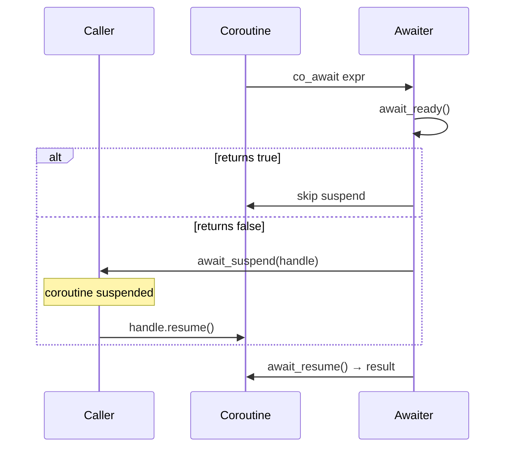

# 视频文稿：AI 如何改变了我的学习方式

> 目标时长：17-18 分钟 | 语言：中文 | 风格：技术叙事
> 三条叙事线：AI 改变学习（主线）、Skills > Agents（副线）、本地优先（暗线）

**视频标题**：AI 改变了我的学习方式，于是我用 Rust + LanceDB 造了 StaticFlow

**B站标签**：`Rust` `LanceDB` `AI编程` `开源项目` `知识管理` `向量数据库` `Claude Code` `StaticFlow` `AI学习` `Skills` `WebAssembly` `本地优先`

---

## 第一幕：开场钩子（0:00 - 2:30）

### [0:00-0:15] 黑屏 + 打字效果

**画面**：纯黑背景，白色等宽字体逐字打出

**台词（文字）**：

> 一年前，我还在手动翻文档学新技术。
> 现在……

*（停顿 1 秒，切入蒙太奇）*

### [0:15-0:45] 快节奏蒙太奇

**画面**：配节奏感电子 BGM，每 2-3 秒切一个画面

| 时间 | 画面内容 |
|------|---------|
| 0:15 | Claude 3.5 Sonnet → Claude 4.5/4.6 Opus |
| 0:20 | GPT-4o → o1 → GPT-5.1/5.2/5.3 Codex |
| 0:25 | Cursor 编辑器界面 |
| 0:28 | Windsurf 编辑器界面 |
| 0:31 | Claude Code 终端界面 |
| 0:34 | Codex CLI 终端界面 |
| 0:37 | MCP 生态连接图（多个 server 连接到 client） |
| 0:40 | Skills 工作流 → GitHub Copilot → Kiro → 各种 AI IDE 快切 |
| 0:43 | 文字叠加：「2025-2026：AI 编程元年」 |

### [0:45-1:30] 画外音

**画面**：画外音配终端操作画面

**台词**：

> 2025 年到 2026 年，AI 编程领域发生了什么？
>
> 模型能力从"能帮你补全代码"，跳到了"能理解整个项目"。
> Claude 从 3.5 一路迭代到 4.6 Opus，GPT 从 4o 到了 5.3 Codex。
> Cursor、Windsurf、Claude Code、Codex CLI……AI 编程工具井喷式爆发。
> MCP 生态、Skills 工作流，AI 不只是写代码，还能驱动完整的工程流程。
>
> 但对我来说，最大的变化不是写代码更快了。
> 是学习方式——彻底变了。
>
> 以前学一个新技术，路径是这样的：
> 找教程，抄例子，踩坑，再找教程，再踩坑。
>
> 现在的路径完全不同：
> 跟 AI 对话，理解原理，让 AI 帮我把理解沉淀成文档，存进我的知识库。
> 每一次学习，都变成了知识库里可检索、可复用的资产。

### [1:30-2:00] 引出核心理念

**画面**：屏幕切到一张截图或文字卡片，显示引用

**文字卡片**：

```
"Don't build agents, build skills instead."
                    — Anthropic Expert Talk
```

**台词**：

> Anthropic 的专家说过一句话，我觉得是这两年最重要的工程洞察：
> "Don't build agents, build skills instead."
> 不要造 Agent，要造 Skill。
>
> 这句话直接影响了我做接下来这个项目的整个架构决策。

### [2:00-2:30] 过渡到项目

**画面**：浏览器打开 `https://acking-you.github.io/`，快速滚动展示网站首页

**台词**：

> 所以今天我要展示的，不是一个 AI Agent 项目。
> 而是一个用 Skill 驱动的、本地优先的知识管理系统——StaticFlow。
> 我会先带你看它的功能，然后用一个真实的学习场景，
> 演示 AI 到底怎么改变了我的学习方式。

*（画面 zoom in 到网站 logo，转场）*

---

## 第二幕：StaticFlow 项目介绍（2:30 - 5:30）

### [2:30-3:30] 项目定位

**画面**：编辑器中展示项目目录结构，或 Excalidraw 架构概览图

**台词**：

> StaticFlow，一句话概括：本地优先的写作和知识管理系统。
>
> 核心思路很简单：
> 通过 AI 对话理解概念，再由 Skill 生成结构化笔记，
> Agent 通过 CLI 同步到 LanceDB，前端从 LanceDB 查询展示。
> 所有数据都在本地机器上，不依赖任何云数据库。

**画面**：切到项目结构图（可用 Excalidraw 或终端 tree 命令）

```
static-flow/
├── frontend/     ← Yew WASM 前端
├── backend/      ← Axum 后端（LanceDB 查询层）
├── shared/       ← 前后端共享类型定义
├── cli/          ← sf-cli · Agent 操作接口
├── skills/       ← 7 个 AI Skills
├── docs/         ← 20+ 篇技术深度文档
└── scripts/      ← 自动化脚本
```

**台词**：

> 项目结构一目了然。前端、后端、共享类型、Agent CLI 接口、AI Skills。
> 全部用 Rust 写。

### [3:30-4:30] 技术栈亮点

**画面**：代码编辑器，依次高亮展示关键依赖

**台词**：

> 技术栈选型说一下。
>
> 前端用 Yew 框架，编译成 WebAssembly。
> 后端用 Axum，Tokio 异步运行时。
> 数据库用 LanceDB——这是一个嵌入式的向量数据库，
> 不需要起额外的数据库进程，直接读写本地文件。
>
> 为什么选 Rust 全栈？
> 因为 Yew 和 Axum 可以共享一个 shared crate，
> 前后端的类型定义写一次，两边都能用。
> 改一个字段，编译器帮你检查所有调用方。
> 这在 TypeScript 全栈里也能做到，但 Rust 的类型系统更严格，重构更安心。

### [4:30-5:30] 部署拓扑

**画面**：Excalidraw 动画版架构图，从左到右逐步展开

```
┌─────────────────┐
│  GitHub Pages   │  ← 前端静态文件
│  (Frontend)     │
└────────┬────────┘
         │ HTTPS
┌────────▼────────┐
│  Cloud Nginx    │  ← TLS 终止 + 路径过滤
│  :443           │
└────────┬────────┘
         │ TCP tunnel
┌────────▼────────┐
│  pb-mapper      │  ← 本地 ↔ 云端隧道
│  tunnel         │
└────────┬────────┘
         │
┌────────▼────────┐
│  Local Backend  │  ← Axum :3000
│  + LanceDB     │  ← 数据永远在本地
└─────────────────┘
```

**台词**：

> 部署架构比较有意思。
>
> 前端部署在 GitHub Pages，这是静态文件，免费托管。
> 后端跑在我自己的电脑上。
> 中间通过 pb-mapper——这是我写的另一个工具——打一条 TCP 隧道，
> 让前端能访问到本地的 API。
>
> 云端 Nginx 负责 TLS 终止和路径过滤，
> Admin 接口只在本地可访问，网络层就隔离了，不需要写认证代码。
>
> 数据备份怎么办？
> 用 Git Xet 把 LanceDB 的数据文件同步到 HuggingFace Datasets。
> 相当于用 Git 管理数据库快照。

*（转场：「架构讲完了，来看具体功能。」）*

---

## 第三幕：功能演示走查（5:30 - 11:00）

> 制作提示：每个功能 45-75 秒，节奏紧凑。网站操作提前录好，后期加速 + 高亮鼠标。

### [5:30-6:30] 功能 1：混合搜索

**画面**：网站搜索页面实操

**台词**：

> 第一个功能：搜索。
>
> StaticFlow 的搜索不是简单的关键词匹配。
> 它是 FTS 全文检索加向量语义检索的混合模式，用 RRF 算法融合排序。

**操作演示**：
1. 搜索框输入「网络协议」→ 展示全文检索结果（命中 1 篇直接包含关键词的文章）
2. 切换到语义搜索 → 展示向量检索结果（命中多篇语义相关文章：HTTP 解析、TCP 实现等）

**台词**：

> 看，全文检索搜"网络协议"，只命中一篇标题或正文直接包含这个词的文章。
> 但切到语义搜索，命中了好几篇——HTTP 解析、TCP 实现、WebSocket 协议……
> 这些文章里不一定出现"网络协议"四个字，但语义上高度相关。
>
> 混合检索的价值就在这里：
> 内容直接命中的排在前面，语义相关的补充在后面，RRF 算法融合排序。
>
> 这个混合检索的实现细节，我写了一篇深度解析文档，
> 基于 LanceDB 0.23 的源码拆解的。感兴趣的可以去看。

**画面**：快速闪现 `docs/lancedb-hybrid-search-implementation-deep-dive.md` 文档标题

### [6:30-7:30] 功能 2：AI 评论回复系统

**画面**：网站文章详情页

**台词**：

> 第二个功能：评论系统。完全自建，不用 Disqus 这类第三方服务。

**操作演示**：
1. 在文章中选中一段文字 → 弹出评论按钮
2. 点击按钮 → 弹出评论输入框 → 输入评论 → 提交
3. 切到 Admin 页面 → 看到待审核评论
4. 点击「Approve & Run AI」→ 触发 AI 回复
5. 展示 SSE 流式输出界面，AI 回复逐字出现

**台词**：

> 两种评论入口：选中文本精确评论，和页脚通用评论。
> 选中文本的评论会锚定到具体段落，方便讨论具体内容。
>
> 评论提交后进入审核队列。
> 管理员审核通过后，后端会调用 Codex CLI 生成 AI 回复。
> Codex 会读取文章全文作为上下文，生成有针对性的回答。
>
> 整个链路：提交 → LanceDB 任务队列 → Admin 审核 → Codex Worker → SSE 实时推送。
> 匿名评论，用 SHA256 指纹做身份标识，不收集任何个人信息。

### [7:30-8:15] 功能 3：Skill 工作流打通

**画面**：编辑器中展示 skills/ 目录结构，快速切换几个 SKILL.md

**台词**：

> 第三个功能，也是我认为最核心的：Skill 工作流打通。
>
> StaticFlow 的 7 个 Skill 串联了从对话到发布的完整链路：
> AI 对话理解概念 → Skill 生成结构化笔记 → Skill 翻译双语版本 → Agent 通过 CLI 自动发布。
> 全链路 Agent 自动化，每个 Skill 就是一个 Markdown 文件，
> 描述工作流、约束和输出合约。
> AI 加载这个文件，就知道该怎么执行任务。
> 不需要写框架代码，Markdown 文件本身就是 Agent 的"大脑"。

### [8:15-9:00] 功能 4：双语支持 + Mermaid 渲染

**画面**：文章详情页

**操作演示**：
1. 展示一篇中文文章 → 切换到英文版本
2. 滚动到 Mermaid 图表 → 点击全屏按钮
3. 全屏查看 → 点击下载 PNG → 点击复制源码

**台词**：

> 所有文章支持中英双语。
> 翻译不是逐行机翻，是 AI 整篇理解后重写的英文版本。
> 用的是 article-bilingual-translation-publisher 这个 Skill。
>
> Mermaid 图表渲染支持三个操作：全屏查看、下载 PNG 或 SVG、复制源码。
> 超过 15 行的代码块自动折叠，避免页面太长。

### [9:00-10:00] 功能 5：sf-cli 工具链

**画面**：终端全屏

**台词**：

> sf-cli 是给 Coding Agent 使用的操作接口。
> Skill 通过 CLI 完成对 LanceDB 的各项操作：写入、查询、索引管理、同步。

**操作演示**（终端实操，每条命令停留 3-4 秒展示输出）：

```bash
# 查看数据库有哪些表
sf-cli db --db-path /mnt/e/static-flow-data/lancedb list-tables

# 同步笔记目录：扫描 Markdown、导入图片、改写链接、upsert 文章
sf-cli sync-notes --db-path /mnt/e/static-flow-data/lancedb \
  --dir ./content --recursive --generate-thumbnail

# 全文搜索
sf-cli api --db-path /mnt/e/static-flow-data/lancedb search --q "coroutine"

# 语义搜索
sf-cli api --db-path /mnt/e/static-flow-data/lancedb semantic-search --q "协程实现"
```

**台词**：

> sync-notes 这一条命令做了很多事：
> 扫描目录里的 Markdown 文件，解析里面的图片引用，
> 把图片写入 images 表，改写 Markdown 里的链接，
> 然后 upsert 文章到 articles 表，最后更新分类和标签。
> 一条命令，完整的内容入库流程。

### [10:00-10:30] 功能 6：API 行为监控

**画面**：Admin 页面的行为监控 tab

**操作演示**：
1. 展示监控面板概览
2. 按 endpoint 筛选
3. 按设备类型聚合
4. 展示请求明细表

**台词**：

> 不是简单的 page view 计数。
> 每个 API 请求都有完整的行为上下文：
> 状态码、响应耗时、设备类型、浏览器、操作系统、IP 地区。
> 可以下钻到具体接口、具体设备、具体时间段。
> 全部存在 LanceDB 里，列存格式，聚合查询很快。

### [10:30-11:00] 功能 7：7 个 AI Skills 概览

**画面**：编辑器中展示 skills/ 目录，快速切换每个 SKILL.md 的标题

**台词**：

> 回到开头那句话——Don't build agents, build skills。
>
> StaticFlow 有 7 个 Skill，每个专注一件事：

**画面**：文字列表逐行出现

> 1. staticflow-cli-publisher——发布文章和图片到 LanceDB
> 2. article-bilingual-translation-publisher——中译英加双语摘要
> 3. article-summary-architect——生成结构化摘要
> 4. comment-review-ai-responder——AI 评论回复
> 5. tech-impl-deep-dive-writer——技术深度文档写作
> 6. huggingface-git-xet-dataset-publisher——数据同步到 HuggingFace
> 7. caddy-https-reverse-proxy——HTTPS 反向代理部署
>
> 每个 Skill 就是一个 Markdown 文件，描述工作流、约束和输出合约。
> Claude Code 或 Codex 加载这个文件，就知道该怎么执行任务。
> 不需要写代码造 Agent，Skill 文件本身就是 Agent 的"大脑"。

*（转场：「功能看完了。现在来看最关键的部分——AI 到底怎么改变了我的学习方式。」）*

---

## 第四幕：C++20 协程学习实战（11:00 - 15:00）⭐ 视频高潮

> 制作提示：这是全片最重要的段落。AI 对话部分建议提前录制好，后期加速剪辑，
> 保留关键问答，跳过等待时间。旁白穿插在操作之间。

### [11:00-11:30] 设定场景

**画面**：画外音配 cppreference 网页截图

**台词**：

> 好，功能看完了。现在来看最关键的部分。
>
> 假设我现在要学 C++20 的协程。
> 传统路径你们都知道：
> 打开 cppreference，看一堆模板元编程的语法，
> 找 CppCon 的视频看两个小时，
> 抄一个 demo 编译，报一堆错，
> 去 StackOverflow 搜，发现答案是三年前的，编译器版本对不上。
>
> 现在的路径完全不同。

### [11:30-13:00] AI 对话学习过程

**画面**：Claude Code 或 Codex CLI 终端界面

#### 第一轮对话

**操作**：在终端输入提问

```
> 解释 C++20 coroutine 的 promise_type 机制，
  用一个最小可编译的 generator 例子说明
```

**画面**：AI 回复逐步展开（加速播放），包含：
- `promise_type` 的生命周期解释
- 一个 20 行左右的 `Generator<int>` 最小实现
- `initial_suspend`、`final_suspend`、`yield_value` 的作用说明

**旁白**（在 AI 回复展开过程中）：

> 注意，我不是在让 AI 帮我写生产代码。
> 我是在跟它对话，理解原理。
> 第一轮，我让它给我一个最小可编译的例子，
> 把 promise_type 的核心机制讲清楚。

#### 第二轮对话

**操作**：继续追问

```
> co_await 的 awaiter 三件套
  （await_ready / await_suspend / await_resume）
  的执行时序是什么？画一个流程图
```

**画面**：AI 回复中包含一个 Mermaid 流程图



**旁白**：

> 第二轮，我追问 co_await 的执行时序。
> AI 直接给了一个 sequence diagram。
> 这比看文档高效太多了——
> 文档告诉你每个函数的签名，但不告诉你它们之间的调用顺序。
> AI 能把这个时序关系可视化出来。

#### 第三轮对话

**操作**：跨语言对比

```
> 对比 C++20 coroutine 和 Rust async/await 的实现差异，
  从编译器变换、内存布局、调度器三个维度
```

**画面**：AI 回复中包含一个对比表格

| 维度 | C++20 Coroutine | Rust async/await |
|------|-----------------|------------------|
| 编译器变换 | 状态机 + 堆分配 coroutine frame | 状态机 + 编译期确定大小的 Future enum |
| 内存布局 | 堆上分配，`promise_type` 控制分配器 | 栈上或 `Box::pin`，编译器计算 Future 大小 |
| 调度器 | 无内置调度器，需自行实现或用库 | 运行时提供（tokio/async-std） |

**旁白**：

> 第三轮，跨语言对比。
> 因为我同时写 Rust 和 C++，
> 让 AI 从编译器变换、内存布局、调度器三个维度做对比，
> 帮我建立跨语言的统一心智模型。
>
> 每一轮对话，我都在追问更深的 why 和 how。
> AI 的价值不是给你答案——是帮你快速建立正确的心智模型。

### [13:00-14:30] Skill 驱动的知识沉淀

**画面**：从终端切到 Claude Code 对话界面，再切回终端

**台词**：

> 对话结束了，我对 C++20 协程有了清晰的理解。
> 但如果到这里就停了，三个月后我会忘掉大部分细节。
>
> 所以下一步：让 Skill 帮我把理解沉淀成结构化知识。

#### 步骤 1：AI 对话建立理解

**画面**：Claude Code 终端中的对话记录

**台词**：

> 刚才的三轮对话，已经帮我建立了对 C++20 协程的心智模型。
> 核心概念、代码示例、跨语言对比，都在对话上下文里了。

#### 步骤 2：Skill 结构化

**画面**：Claude Code 终端

**台词**：

> 然后用 tech-impl-deep-dive-writer 这个 Skill，
> 让 AI 按工程文档的标准重新组织这篇草稿。

**操作**：在 Claude Code 中调用 Skill

> 这个 Skill 有明确的写作契约：
> 声明式名词短语标题，不用问题式标题；
> 机制优先，先解释设计意图和工作原理，代码位置只作为佐证；
> 总体到细节的层次结构。
>
> AI 不是帮你写文章，是帮你把零散的理解组织成结构化的知识。

#### 步骤 3：双语翻译

**台词**：

> 接着调用 article-bilingual-translation-publisher，生成英文版本。
> 这样这篇文章在语义搜索时，中英文查询都能命中。

#### 步骤 4：Agent 自动发布

**画面**：终端执行命令

```bash
sf-cli write-article \
  --db-path /mnt/e/static-flow-data/lancedb \
  --file ./content/cpp20-coroutine-deep-dive.md \
  --tags "c++,coroutine,async,promise_type" \
  --category "Language Deep Dive"
```

**画面**：命令输出，显示写入成功

**台词**：

> Agent 调用 sf-cli，一条命令完成入库。
> sf-cli 会自动解析 frontmatter、导入引用的图片、
> 生成向量索引、更新分类标签。

#### 步骤 5：验证

**画面**：终端 + 浏览器

```bash
sf-cli api --db-path /mnt/e/static-flow-data/lancedb \
  semantic-search --q "协程 promise_type"
```

**画面**：搜索结果命中刚发布的文章

**操作**：刷新网站，新文章出现在文章列表中

**台词**：

> 语义搜索验证一下——"协程 promise_type"，命中了。
> 刷新网站，新文章已经在列表里了。

### [14:30-15:00] 升华

**画面**：画外音配流程图

**流程图**（画面展示）：

```
AI 对话理解 → Skill 生成笔记 → Skill 结构化 → Agent 自动发布 → 向量索引可搜索
     ↑                                                              │
     └──────────── 下次学习时语义搜索召回 ←─────────────────────────┘
```

**台词**：

> 完整的闭环：
> AI 对话理解，Skill 生成笔记，Skill 结构化，Agent 自动发布，向量索引可搜索。
>
> 下次我再学相关的东西，比如 C++20 的 ranges 或者 modules，
> 语义搜索会把这篇协程文章召回来，作为关联知识。
>
> 这就是 AI 改变学习方式的核心：
> 不是让你学得更快，
> 是让你的学习成果有了可检索、可积累、可复用的载体。
> 每一次学习都在给知识库添砖加瓦，而不是看完就忘。

---

## 第五幕：pb-mapper 简介（15:00 - 16:00）

### [15:00-15:30] 工具介绍

**画面**：部署架构图中高亮 pb-mapper 部分

**台词**：

> 简单提一下 pb-mapper。
> 刚才部署架构里看到了，StaticFlow 的后端跑在我自己电脑上，
> 前端在 GitHub Pages 上怎么访问本地 API？
> 就是靠 pb-mapper——一个 TCP 隧道工具，也是我用 Rust 写的。

### [15:30-16:00] 简要演示

**画面**：终端命令

```bash
# 本地端：注册本地服务到隧道
pb-mapper-server-cli tcp-server \
  --key staticflow-api-https \
  --addr 127.0.0.1:3443 \
  --pb-mapper-server <cloud-ip>:7666

# 云端：暴露端点
pb-mapper-client-cli tcp-server \
  --key staticflow-api-https \
  --addr 0.0.0.0:8888 \
  --pb-mapper-server 127.0.0.1:7666
```

**台词**：

> 两条命令：本地端注册服务，云端暴露端点。
> TCP 层透传，HTTP headers 完整保留。
>
> pb-mapper 的详细实现会在另一期视频里展开——
> 怎么用 Rust 写一个高性能的 TCP 隧道工具，
> 包括连接复用、心跳保活、断线重连这些细节。
> 今天不展开，留个悬念。

---

## 第六幕：总结 + CTA（16:00 - 17:30）

### [16:00-16:45] 三个核心观点

**画面**：文字卡片逐张出现，配画外音

**台词**：

> 回顾一下今天的三个核心观点。

**卡片 1**：

```
长期记忆 > 短期记忆
每次学习产出可检索的知识，AI 随时调用辅助新的学习
```

> 第一，AI 改变学习方式的关键是把短期记忆变成长期记忆。
> 每次学习都产出可检索的知识，存进知识库，
> 下次学新东西时，AI 随时检索调用，辅助新的学习。

**卡片 2**：

```
Skills > Agents
7 个 Skill 文件 = 7 个可复用的 AI 工作流
```

> 第二，Don't build agents, build skills。
> StaticFlow 的 7 个 Skill 就是这个理念的实践。
> 每个 Skill 是一个 Markdown 文件，描述工作流和约束，
> AI 加载后就能执行。不需要写框架代码。

**卡片 3**：

```
本地优先
数据在自己手里，不依赖云服务
```

> 第三，本地优先。
> LanceDB 嵌入式数据库，后端跑在本地，
> 数据永远在自己手里。
> 备份用 Git 推到 HuggingFace，但主权在你。

### [16:45-17:30] CTA

**画面**：GitHub 仓库页面 + 网站首页

**台词**：

> StaticFlow 是开源的，代码在 GitHub 上。
> 如果你也在思考怎么用 AI 改善自己的学习和知识管理流程，
> 欢迎 star、fork、提 issue，一起交流。
>
> 下期视频会详细讲 pb-mapper 的实现——
> 怎么用 Rust 写一个 TCP 隧道工具，
> 包括连接复用、NAT 穿透、断线重连这些硬核细节。
>
> 我是 ackingliu，我们下期见。

*（结束画面：GitHub 仓库链接 + 网站链接 + 「下期预告：pb-mapper」）*

---

## 附录：制作备忘

### 素材清单

| 素材 | 来源 | 用途 |
|------|------|------|
| 模型发布页截图 | Claude/GPT 官网 | 第一幕蒙太奇 |
| AI IDE 界面截图 | Cursor/Windsurf/Claude Code | 第一幕蒙太奇 |
| Anthropic Expert Talk 截图 | YouTube | 第一幕引用 |
| 网站首页录屏 | https://acking-you.github.io/ | 第二幕 + 第三幕 |
| 部署架构图 | Excalidraw 制作 | 第二幕 + 第五幕 |
| 搜索演示录屏 | 网站搜索页 | 第三幕功能 1 |
| 评论系统演示录屏 | 网站文章页 + Admin | 第三幕功能 2 |
| 趋势图演示录屏 | 网站文章页 | 第三幕功能 3 |
| sf-cli 终端录屏 | 本地终端 | 第三幕功能 5 |
| Admin 监控面板录屏 | Admin 页面 | 第三幕功能 6 |
| C++20 协程 AI 对话录屏 | Claude Code 终端 | 第四幕（提前录制） |
| Obsidian 编辑器截图 | 本地 Obsidian | 第四幕步骤 1 |
| Skill 调用录屏 | Claude Code 终端 | 第四幕步骤 2-3 |
| 发布验证录屏 | 终端 + 浏览器 | 第四幕步骤 4-5 |
| GitHub 仓库页面 | GitHub | 第六幕 CTA |

### 节奏控制

- 第一幕（2.5 min）：快，蒙太奇 + 节奏感 BGM
- 第二幕（3 min）：中速，信息密度高但不赶
- 第三幕（5.5 min）：紧凑，每个功能 ≤75 秒
- 第四幕（4 min）：慢下来，这是高潮，给观众消化时间
- 第五幕（1 min）：快，点到为止
- 第六幕（1.5 min）：中速，干脆收尾

### 画面切换策略

- 代码/终端画面：zoom in 聚焦关键行，避免全屏代码墙
- 网站演示：提前录好操作，后期 1.5x-2x 加速 + 高亮鼠标轨迹
- 架构图：用 Excalidraw 制作，可考虑逐步展开动画
- 全程画外音 + 屏幕录制，不出镜
- 文字卡片：关键引用和总结用文字卡片，停留 3-5 秒
