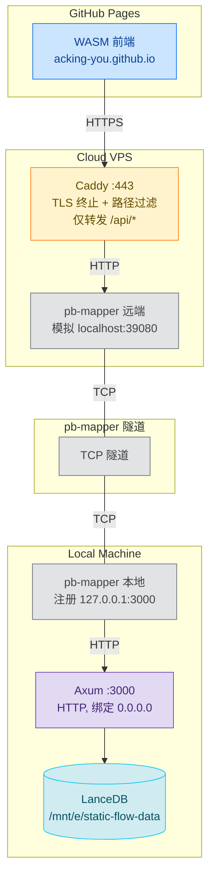
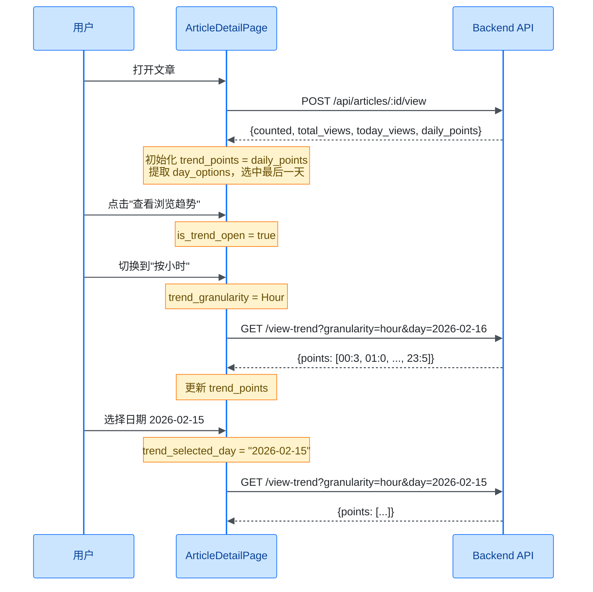
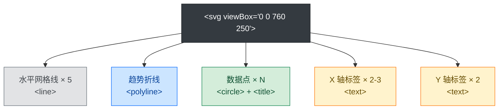

# 浏览趋势图全栈实现：从用户点击到 SVG 渲染的完整数据链路

> **代码版本**：基于 StaticFlow 当前 `master` 分支。

## 1. 为什么要自建浏览统计

个人博客接入 Google Analytics 或百度统计，意味着把用户行为数据交给第三方。对于一个本地优先的知识管理系统来说，这不太合适：

- **隐私**：不想向第三方暴露读者的 IP 和浏览行为
- **依赖**：第三方服务挂了，统计就断了
- **灵活性**：想要按天/按小时的细粒度趋势，而不是第三方仪表盘的固定视图

StaticFlow 的技术栈是 Rust 全栈 —— Axum 后端 + Yew WASM 前端 + LanceDB 嵌入式数据库。在这个栈上自建浏览统计，核心挑战是：

1. 如何在无 cookie、无登录的场景下做用户去重
2. 如何用嵌入式列存数据库（无原生 GROUP BY）做时间序列聚合
3. 如何在 WASM 环境中零依赖渲染趋势图

### 1.1 数据流总览

一次完整的浏览追踪 + 趋势展示，经过以下链路：

```mermaid
graph LR
    A["用户打开文章"] --> B["WASM 前端<br/>POST /api/articles/:id/view"]
    B --> C["远端 Caddy/Nginx :443<br/>TLS 终止 + 路径过滤"]
    C --> D["pb-mapper<br/>模拟远端 localhost"]
    D --> E["本地 Axum :3000<br/>指纹生成 + 去重"]
    E --> F["LanceDB<br/>merge_insert upsert"]
    F --> G["分桶聚合<br/>day / hour"]
    G --> H["JSON 响应"]
    H --> I["ViewTrendChart<br/>纯 SVG 渲染"]

    classDef user fill:#d4edda,stroke:#28a745,color:#155724
    classDef frontend fill:#cce5ff,stroke:#0d6efd,color:#084298
    classDef network fill:#fff3cd,stroke:#fd7e14,color:#664d03
    classDef backend fill:#e2d9f3,stroke:#6f42c1,color:#432874
    classDef database fill:#d1ecf1,stroke:#0dcaf0,color:#055160
    classDef render fill:#d4edda,stroke:#198754,color:#0f5132

    class A user
    class B frontend
    class C,D network
    class E backend
    class F,G database
    class H backend
    class I render
```



> 📌 **本文范围**：覆盖从后端浏览追踪、去重机制、分桶聚合、运行时配置、部署架构到前端 SVG 渲染的完整链路。不涉及文章内容管理和搜索功能。

## 2. 后端 — 浏览事件追踪与去重

用户打开一篇文章时，前端发送 `POST /api/articles/:id/view`。后端需要解决两个问题：**识别用户**和**防止重复计数**。

### 2.1 客户端指纹生成

在无 cookie、无登录的场景下，我们用 `SHA256(IP | User-Agent)` 生成客户端指纹。这不是完美的用户标识（同一 NAT 下的不同用户会被合并），但对个人博客场景足够用。

> 💡 **Key Point**：为什么不用 cookie 或 localStorage？
> - WASM 前端部署在 GitHub Pages，API 在自有域名，跨域 cookie 受 SameSite 限制
> - localStorage 指纹容易被清除，且无法在服务端验证
> - IP + UA 的方案完全在服务端完成，前端零改动

**指纹生成** — `backend/src/handlers.rs:509-522`：

```rust
fn build_client_fingerprint(headers: &HeaderMap) -> String {
    let ip = extract_client_ip(headers);
    let user_agent = headers
        .get(header::USER_AGENT)
        .and_then(|value| value.to_str().ok())
        .map(str::trim)
        .filter(|value| !value.is_empty())
        .unwrap_or("unknown");
    let raw = format!("{ip}|{user_agent}");

    let mut hasher = Sha256::new();
    hasher.update(raw.as_bytes());
    format!("{:x}", hasher.finalize())
}
```

**IP 提取优先级链** — `backend/src/handlers.rs:524-530`：

```rust
fn extract_client_ip(headers: &HeaderMap) -> String {
    // Trust X-Real-IP first (explicitly set by reverse proxy),
    // then fall back to X-Forwarded-For chain.
    parse_first_ip_from_header(headers.get("x-real-ip"))
        .or_else(|| parse_first_ip_from_header(headers.get("x-forwarded-for")))
        .unwrap_or_else(|| "unknown".to_string())
}
```

优先级：`X-Real-IP` > `X-Forwarded-For` 第一个有效 IP > `"unknown"`。

**IP 归一化** — `backend/src/handlers.rs:537-578`：

`normalize_ip_token` 函数处理了多种 IP 格式：

| 输入格式 | 示例 | 归一化结果 |
|----------|------|-----------|
| 纯 IPv4 | `203.0.113.9` | `203.0.113.9` |
| IPv4:port | `198.51.100.1:4567` | `198.51.100.1` |
| 纯 IPv6 | `2001:db8::1` | `2001:db8::1` |
| [IPv6]:port | `[2001:db8::1]:8080` | `2001:db8::1` |
| RFC7239 for= | `for=198.51.100.77` | `198.51.100.77` |
| 无效值 | `not-an-ip` | `None`（跳过） |

> ⚠️ **Gotcha**：`X-Forwarded-For` 可能包含多个 IP（`client, proxy1, proxy2`），我们只取第一个有效的。这在多层代理场景下是正确的，因为第一个 IP 是最接近客户端的。

### 2.2 时间窗口去重机制

同一个用户短时间内多次刷新页面，不应该每次都计为一次新浏览。我们用**时间窗口去重**来解决这个问题。

**核心公式** — `shared/src/lancedb_api.rs:233-235`：

```rust
let dedupe_window_ms = (dedupe_window_seconds.max(1) as i64) * 1_000;
let dedupe_bucket = now_ms / dedupe_window_ms;
let record_id = format!("{article_id}:{client_fingerprint}:{dedupe_bucket}");
```

`dedupe_bucket` 是一个整数，表示当前时间落在哪个去重窗口内。默认窗口是 60 秒，意味着同一用户在 60 秒内的多次访问只记录一次。

**去重时间轴示意**：

```
时间轴 (dedupe_window = 60s)
├────── bucket 0 ──────┼────── bucket 1 ──────┼────── bucket 2 ──────┤
0s                    60s                   120s                   180s
  ▲ click (10s)          ▲ click (70s)          ▲ click (130s)
  id: art:fp:0           id: art:fp:1           id: art:fp:2
  counted: true          counted: true          counted: true

  ▲ click (30s)
  id: art:fp:0 (已存在)
  counted: false
```

**去重流程** — `shared/src/lancedb_api.rs:239-255`：

```rust
// Step 1: 检查去重键是否已存在
let counted = table
    .count_rows(Some(format!("id = '{escaped_id}'")))
    .await? == 0;

// Step 2: upsert — 存在则更新 updated_at，不存在则插入
let record = ArticleViewRecord {
    id: record_id,
    article_id: article_id.to_string(),
    viewed_at: now_ms,
    day_bucket: day_bucket.clone(),
    hour_bucket: hour_bucket.clone(),
    client_fingerprint: client_fingerprint.to_string(),
    created_at: now_ms,
    updated_at: now_ms,
};
upsert_article_view_record(&table, &record).await?;
```

返回的 `counted: bool` 告诉前端本次请求是否被计为新增浏览。

> 🤔 **Think About**：为什么用 `count_rows` + `merge_insert` 两步，而不是直接 `merge_insert` 后检查？
> 因为 LanceDB 的 `merge_insert` 不返回"是否实际插入了新行"的信息。我们需要先查一次来确定 `counted` 状态。

### 2.3 分桶策略

每条浏览记录同时携带 `day_bucket` 和 `hour_bucket`，用于后续的聚合查询。

**时区处理** — `shared/src/lancedb_api.rs:228-232, 1810-1814`：

```rust
const SHANGHAI_TIMEZONE: &str = "Asia/Shanghai";

fn shanghai_tz() -> FixedOffset {
    FixedOffset::east_opt(8 * 3600).expect("UTC+8 offset should be valid")
}

let now = Utc::now();
let now_local = now.with_timezone(&shanghai_tz());
let day_bucket = now_local.format("%Y-%m-%d").to_string();   // "2026-02-16"
let hour_bucket = now_local.format("%Y-%m-%d %H").to_string(); // "2026-02-16 14"
```

> 💡 **Key Point**：为什么用 `FixedOffset` 而不是 `chrono-tz`？
> `chrono-tz` 会引入完整的 IANA 时区数据库（几百 KB），对于固定 UTC+8 的场景完全没必要。`FixedOffset::east_opt(8 * 3600)` 一行搞定，零额外依赖。

### 2.4 LanceDB 存储层

**ArticleViewRecord Schema** — `shared/src/lancedb_api.rs:1799-1832`：

```rust
struct ArticleViewRecord {
    id: String,                // 去重键: {article_id}:{fingerprint}:{dedupe_bucket}
    article_id: String,        // 文章 ID
    viewed_at: i64,            // 浏览时间戳（毫秒）
    day_bucket: String,        // "2026-02-16"
    hour_bucket: String,       // "2026-02-16 14"
    client_fingerprint: String,// SHA256 哈希
    created_at: i64,           // 首次创建时间
    updated_at: i64,           // 最后更新时间
}
```

对应的 Arrow Schema 使用 `Utf8` 和 `Timestamp(Millisecond)` 类型。

**Upsert 实现** — `shared/src/lancedb_api.rs:1868-1878`：

```rust
async fn upsert_article_view_record(table: &Table, record: &ArticleViewRecord) -> Result<()> {
    let batch = build_article_view_batch(record)?;
    let schema = batch.schema();
    let batches = RecordBatchIterator::new(vec![Ok(batch)].into_iter(), schema);

    let mut merge = table.merge_insert(&["id"]);
    merge.when_matched_update_all(None);   // 已存在 → 更新所有字段
    merge.when_not_matched_insert_all();   // 不存在 → 插入新行
    merge.execute(Box::new(batches)).await?;
    Ok(())
}
```

**表自动创建** — `shared/src/lancedb_api.rs:193-217`：

```rust
async fn article_views_table(&self) -> Result<Table> {
    match self.db.open_table(&self.article_views_table).execute().await {
        Ok(table) => Ok(table),
        Err(_) => {
            // 表不存在，创建空表后重新打开
            let schema = article_view_schema();
            let batch = RecordBatch::new_empty(schema.clone());
            let batches = RecordBatchIterator::new(vec![Ok(batch)].into_iter(), schema);
            self.db.create_table(&self.article_views_table, Box::new(batches))
                .execute().await?;
            self.db.open_table(&self.article_views_table).execute().await
                .context("failed to open article_views table")
        },
    }
}
```

> 💡 **Key Point**：LanceDB 不支持 `CREATE TABLE IF NOT EXISTS` 语义，所以用 open → 失败 → create → re-open 的模式来实现幂等的表初始化。

## 3. 后端 — 趋势聚合查询

浏览记录写入后，需要按天或按小时聚合成趋势数据点。LanceDB 是列存数据库，没有原生的 `GROUP BY`，所以聚合在应用层完成。

### 3.1 按天聚合

**fetch_article_view_day_counts** — `shared/src/lancedb_api.rs:1880-1906`：

```rust
async fn fetch_article_view_day_counts(
    table: &Table,
    article_id: &str,
) -> Result<HashMap<String, u32>> {
    let filter = format!("article_id = '{}'", escape_literal(article_id));
    let batches = table
        .query()
        .only_if(filter)
        .select(Select::columns(&["day_bucket"]))  // 只读 day_bucket 列
        .execute()
        .await?
        .try_collect::<Vec<_>>()
        .await?;

    let mut counts: HashMap<String, u32> = HashMap::new();
    for batch in batches {
        let day_array = string_array(&batch, "day_bucket")?;
        for idx in 0..batch.num_rows() {
            if day_array.is_null(idx) { continue; }
            let day = day_array.value(idx).to_string();
            *counts.entry(day).or_insert(0) += 1;
        }
    }
    Ok(counts)
}
```

> 🤔 **Think About**：全量扫描 + HashMap 计数，性能如何？
> 对于个人博客场景（几千到几万条浏览记录），这完全没问题。LanceDB 的列存格式意味着只读 `day_bucket` 一列，I/O 开销很小。如果数据量增长到百万级，可以考虑加 `day_bucket` 过滤条件来缩小扫描范围。

**build_recent_day_points** — `shared/src/lancedb_api.rs:1945-1963`：

聚合结果是一个 `HashMap<String, u32>`，但前端需要的是**连续的日期序列**（缺失的日期补零）：

```rust
fn build_recent_day_points(
    day_counts: &HashMap<String, u32>,
    end_day: &str,
    days: usize,
) -> Result<Vec<ArticleViewPoint>> {
    let end_date = NaiveDate::parse_from_str(end_day, "%Y-%m-%d")?;
    let mut points = Vec::with_capacity(days);
    for offset in (0..days).rev() {
        let day = end_date - ChronoDuration::days(offset as i64);
        let key = day.format("%Y-%m-%d").to_string();
        points.push(ArticleViewPoint {
            key: key.clone(),
            views: *day_counts.get(&key).unwrap_or(&0),  // 缺失日期补零
        });
    }
    Ok(points)
}
```

**具体例子**：假设今天是 2026-02-16，请求最近 7 天的趋势，数据库中只有 02-14 和 02-16 有记录：

```
HashMap: {"2026-02-14": 3, "2026-02-16": 5}

输出 points:
  2026-02-10: 0  ← 补零
  2026-02-11: 0  ← 补零
  2026-02-12: 0  ← 补零
  2026-02-13: 0  ← 补零
  2026-02-14: 3
  2026-02-15: 0  ← 补零
  2026-02-16: 5
```

### 3.2 按小时聚合

**fetch_article_view_hour_counts_for_day** — `shared/src/lancedb_api.rs:1908-1943`：

```rust
async fn fetch_article_view_hour_counts_for_day(
    table: &Table,
    article_id: &str,
    day: &str,
) -> Result<HashMap<String, u32>> {
    let filter = format!(
        "article_id = '{}' AND day_bucket = '{}'",
        escape_literal(article_id), escape_literal(day)
    );
    let batches = table.query()
        .only_if(filter)
        .select(Select::columns(&["hour_bucket"]))
        .execute().await?
        .try_collect::<Vec<_>>().await?;

    let mut counts: HashMap<String, u32> = HashMap::new();
    for batch in batches {
        let hour_array = string_array(&batch, "hour_bucket")?;
        for idx in 0..batch.num_rows() {
            if hour_array.is_null(idx) { continue; }
            let bucket = hour_array.value(idx);
            // "2026-02-16 14" → 提取末尾 "14"
            let hour = bucket.rsplit(' ').next().unwrap_or("").trim();
            if hour.len() != 2 || !hour.chars().all(|ch| ch.is_ascii_digit()) {
                continue;
            }
            *counts.entry(hour.to_string()).or_insert(0) += 1;
        }
    }
    Ok(counts)
}
```

**固定 24 点输出** — `shared/src/lancedb_api.rs:325-333`：

```rust
let points = (0..24)
    .map(|hour| {
        let key = format!("{hour:02}");
        ArticleViewPoint {
            views: *hour_counts.get(&key).unwrap_or(&0),
            key,
        }
    })
    .collect::<Vec<_>>();
```

无论当天有没有数据，都输出 00-23 共 24 个点，缺失小时补零。

### 3.3 API 端点设计

系统提供两个浏览相关的公开端点：

**POST /api/articles/:id/view** — `backend/src/handlers.rs:161-183`

追踪浏览 + 返回初始趋势数据，一次请求完成两件事：

```rust
pub async fn track_article_view(
    State(state): State<AppState>,
    Path(id): Path<String>,
    headers: HeaderMap,
) -> Result<Json<ArticleViewTrackResponse>, ...> {
    ensure_article_exists(&state, &id).await?;
    let config = state.view_analytics_config.read().await.clone();
    let fingerprint = build_client_fingerprint(&headers);
    let tracked = state.store.track_article_view(
        &id, &fingerprint,
        config.trend_default_days,
        config.dedupe_window_seconds,
        config.trend_max_days,
    ).await?;
    Ok(Json(tracked))
}
```

响应包含 `counted`（是否计为新增）、`total_views`、`today_views` 和 `daily_points`（默认 30 天日趋势）。

> 💡 **Key Point**：为什么 POST 请求同时返回趋势数据？
> 减少前端初始加载时的请求数。用户打开文章时，一次 POST 同时完成浏览追踪和初始趋势数据获取，避免额外的 GET 请求。

**GET /api/articles/:id/view-trend** — `backend/src/handlers.rs:185-231`

按需查询趋势数据，支持两种粒度：

| 参数 | 类型 | 说明 |
|------|------|------|
| `granularity` | `day` \| `hour` | 聚合粒度，默认 `day` |
| `days` | `usize` | 天数窗口（仅 day 粒度），默认 30，上限 180 |
| `day` | `YYYY-MM-DD` | 指定日期（仅 hour 粒度，必填） |

**日期格式校验** — `backend/src/handlers.rs:590-604`：

```rust
fn is_valid_day_format(value: &str) -> bool {
    if value.len() != 10 { return false; }
    let bytes = value.as_bytes();
    for (index, byte) in bytes.iter().enumerate() {
        if index == 4 || index == 7 {
            if *byte != b'-' { return false; }
        } else if !byte.is_ascii_digit() { return false; }
    }
    true
}
```

> 💡 **Key Point**：为什么手写字节级校验而不用正则或 `NaiveDate::parse_from_str`？
> 这是一个热路径上的快速预检。字节级校验是 O(10) 的常量时间操作，比正则编译和日期解析都快。真正的日期合法性校验（如 02-30 是否存在）在后续的 `NaiveDate::parse_from_str` 中完成。

## 4. 运行时配置热加载

浏览统计的三个核心参数支持运行时修改，无需重启后端。

### 4.1 配置结构

**ViewAnalyticsRuntimeConfig** — `backend/src/state.rs:13-34`：

```rust
pub const DEFAULT_VIEW_DEDUPE_WINDOW_SECONDS: u64 = 60;
pub const DEFAULT_VIEW_TREND_DAYS: usize = 30;
pub const DEFAULT_VIEW_TREND_MAX_DAYS: usize = 180;
pub const MAX_CONFIGURABLE_VIEW_DEDUPE_WINDOW_SECONDS: u64 = 3600;
pub const MAX_CONFIGURABLE_VIEW_TREND_DAYS: usize = 365;

#[derive(Debug, Clone, Serialize, Deserialize)]
pub struct ViewAnalyticsRuntimeConfig {
    pub dedupe_window_seconds: u64,   // 去重窗口：1-3600 秒
    pub trend_default_days: usize,    // 默认趋势天数：1-365
    pub trend_max_days: usize,        // 最大趋势天数：1-365
}
```

| 参数 | 默认值 | 范围 | 作用 |
|------|--------|------|------|
| `dedupe_window_seconds` | 60 | 1-3600 | 同一指纹在此窗口内只计一次 |
| `trend_default_days` | 30 | 1-365 | 前端不指定 days 时的默认值 |
| `trend_max_days` | 180 | 1-365 | days 参数的上限 |

### 4.2 热加载机制

配置存储在 `AppState` 的 `Arc<RwLock<ViewAnalyticsRuntimeConfig>>` 中 — `backend/src/state.rs:42`：

```rust
pub struct AppState {
    pub(crate) store: Arc<StaticFlowDataStore>,
    // ... 其他缓存字段
    pub(crate) view_analytics_config: Arc<RwLock<ViewAnalyticsRuntimeConfig>>,
}
```

每次处理请求时，通过 `read().await` 获取当前配置的快照：

```rust
let config = state.view_analytics_config.read().await.clone();
```

更新时通过 `write().await` 原子替换：

```rust
let mut writer = state.view_analytics_config.write().await;
*writer = next.clone();
```

### 4.3 Admin API

**GET/POST /admin/view-analytics-config** — `backend/src/routes.rs:62-65`

更新接口支持**部分更新语义** — 只传需要修改的字段：

```rust
fn apply_view_analytics_config_update(
    current: ViewAnalyticsRuntimeConfig,
    request: UpdateViewAnalyticsConfigRequest,
) -> Result<ViewAnalyticsRuntimeConfig, ...> {
    let mut next = current;

    if let Some(value) = request.dedupe_window_seconds {
        if value == 0 || value > MAX_CONFIGURABLE_VIEW_DEDUPE_WINDOW_SECONDS {
            return Err(bad_request("`dedupe_window_seconds` must be between 1 and 3600"));
        }
        next.dedupe_window_seconds = value;
    }
    // trend_max_days, trend_default_days 同理...

    // 交叉校验：default 不能超过 max
    if next.trend_default_days > next.trend_max_days {
        return Err(bad_request(
            "`trend_default_days` must be less than or equal to `trend_max_days`"
        ));
    }
    Ok(next)
}
```

> ⚠️ **Gotcha**：交叉校验发生在所有字段更新之后。如果你同时修改 `trend_default_days` 和 `trend_max_days`，校验的是最终状态，而不是中间状态。这意味着你可以在一次请求中把 default 从 30 改到 200、max 从 180 改到 365，不会因为中间状态 `200 > 180` 而报错。

## 5. 部署架构 — API/Admin 隔离与多层代理

### 5.1 整体拓扑

StaticFlow 采用本地优先架构。后端和数据库运行在本地机器上，通过 pb-mapper 隧道暴露到公网。



> 💡 **Key Point**：本地不需要 Nginx。pb-mapper 的作用是把本地 HTTP 服务直接映射到远端，让它在远端看起来像一个 localhost 服务。远端的 Caddy/Nginx 负责 TLS 终止和路径过滤。

### 5.2 路由前缀分离与路径过滤

后端路由通过前缀区分公开 API 和管理接口 — `backend/src/routes.rs:47-65`：

```rust
Router::new()
    // 公开 API — /api/* 前缀
    .route("/api/articles", get(handlers::list_articles))
    .route("/api/articles/:id", get(handlers::get_article))
    .route("/api/articles/:id/view", post(handlers::track_article_view))
    .route("/api/articles/:id/view-trend", get(handlers::get_article_view_trend))
    // ... 其他公开端点

    // 管理接口 — /admin/* 前缀
    .route(
        "/admin/view-analytics-config",
        get(handlers::get_view_analytics_config)
            .post(handlers::update_view_analytics_config),
    )
```

**隔离机制**：远端 Caddy/Nginx 只转发 `/api/` 路径，其他路径返回 404：

```
请求路径                              结果
GET  /api/articles                   ✅ 转发到后端
POST /api/articles/:id/view          ✅ 转发到后端
GET  /admin/view-analytics-config    ❌ Caddy 返回 404
POST /admin/view-analytics-config    ❌ Caddy 返回 404
```

Admin 端点只能通过本地直连 `http://127.0.0.1:3000/admin/...` 访问：

```bash
# 本地直连 — 可以访问
curl http://127.0.0.1:3000/admin/view-analytics-config

# 通过公网 — 被 Caddy 拦截，返回 404
curl https://api.yourdomain.com/admin/view-analytics-config  # 404
```

> 📝 **Terminology**：这里的"隔离"是**网络层隔离**，不是认证隔离。后端代码中没有 JWT/Token/API Key 等认证中间件。对于单人运维的个人项目，网络层隔离（Caddy 路径过滤 + 后端绑定本地）已经足够。

### 5.3 Caddy 双模式

远端 Caddy 支持两种 TLS 证书获取方式：

| 模式 | 证书获取 | 适用场景 |
|------|---------|---------|
| Domain-first | Let's Encrypt HTTP-01 | 有自有域名，80 端口可用 |
| DuckDNS fallback | Let's Encrypt DNS-01 | 无自有域名或 80 端口不可用 |

Domain-first 模式的 Caddyfile 核心配置：

```caddyfile
api.yourdomain.com {
    reverse_proxy 127.0.0.1:39080 {
        # pb-mapper 模拟的本地端口
    }
}
```

Caddy 自动处理证书申请、续期和 HTTPS 重定向，零配置。

### 5.4 IP 透传链路

指纹准确性依赖于 IP 的正确透传。在多层代理场景下：

```
用户真实 IP: 203.0.113.9
  → Caddy 设置 X-Real-IP: 203.0.113.9
  → pb-mapper 透传 HTTP headers
  → Axum 读取 X-Real-IP → 203.0.113.9 ✅
```

后端的 IP 提取优先级（§2.1）确保了：只要远端 Caddy/Nginx 正确设置了 `X-Real-IP`，后端就能拿到用户的真实 IP。

### 5.5 CORS 配置

**生产环境** — `backend/src/routes.rs:18-35`：

```rust
let cors = match std::env::var("RUST_ENV").as_deref() {
    Ok("production") => {
        if let Some(origins) = allowed_origins {
            CorsLayer::new().allow_origin(origins)  // ALLOWED_ORIGINS 环境变量
        } else {
            CorsLayer::new().allow_origin(
                "https://acking-you.github.io".parse::<HeaderValue>().unwrap()
            )
        }
    },
    _ => CorsLayer::new().allow_origin(Any),  // 开发环境：允许所有来源
};
```

生产环境默认只允许 `https://acking-you.github.io`，可通过 `ALLOWED_ORIGINS` 环境变量配置多个来源（逗号分隔）。

## 6. 前端 — WASM 中的趋势图渲染

这是整个功能中最有意思的部分：在 Yew WASM 框架中，不依赖任何 JS 图表库，纯手绘 SVG 实现趋势折线图。

### 6.1 API 层

前端通过两个函数与后端交互 — `frontend/src/api.rs:186-290`：

**track_article_view** — 页面加载时调用：

```rust
pub async fn track_article_view(id: &str) -> Result<ArticleViewTrackResponse, String> {
    let url = format!("{}/articles/{}/view", API_BASE, urlencoding::encode(id));
    let response = Request::post(&url)
        .header("Cache-Control", "no-cache, no-store, max-age=0")
        .header("Pragma", "no-cache")
        .send().await?;
    response.json().await
}
```

**fetch_article_view_trend** — 切换粒度/日期时调用：

```rust
pub async fn fetch_article_view_trend(
    id: &str,
    granularity: &str,
    days: Option<usize>,
    day: Option<&str>,
) -> Result<ArticleViewTrendResponse, String> {
    let mut url = format!(
        "{}/articles/{}/view-trend?granularity={}",
        API_BASE, urlencoding::encode(id), urlencoding::encode(granularity),
    );
    if let Some(days) = days { url.push_str(&format!("&days={days}")); }
    if let Some(day) = day { url.push_str(&format!("&day={}", urlencoding::encode(day))); }
    // ... send GET request
}
```

**Mock 模式**：通过 `#[cfg(feature = "mock")]` 编译时切换，本地开发无需启动后端：

```rust
#[cfg(feature = "mock")]
{
    return Ok(ArticleViewTrackResponse {
        article_id: id.to_string(),
        counted: true,
        total_views: 128,
        today_views: 12,
        daily_points: (0..30).map(|offset| ArticleViewPoint {
            key: format!("2026-02-{:02}", offset + 1),
            views: ((offset * 7 + 11) % 42) as u32,
        }).collect(),
        // ...
    });
}
```

### 6.2 状态管理

文章详情页管理了 8 个趋势相关的状态 — `frontend/src/pages/article_detail.rs:69-76`：

```rust
let view_total = use_state(|| None::<usize>);          // 总浏览量
let view_today = use_state(|| None::<u32>);             // 今日浏览量
let trend_points = use_state(Vec::<ArticleViewPoint>::new); // 当前数据点
let trend_day_options = use_state(Vec::<String>::new);  // 可选日期列表
let trend_selected_day = use_state(|| None::<String>);  // 选中的日期
let trend_loading = use_state(|| false);                // 加载状态
let trend_error = use_state(|| None::<String>);         // 错误信息
let trend_granularity = use_state(|| TrendGranularity::Day); // 粒度
```

加上 `is_trend_open`（面板开关），共 9 个状态。

**数据加载流程**：



**响应式数据加载** — `frontend/src/pages/article_detail.rs:338-408`：

```rust
use_effect_with(
    // 监听四元组变化
    (article_id.clone(), *is_trend_open, *trend_granularity, (*trend_selected_day).clone()),
    move |(id, is_open, granularity, selected_day)| {
        if *is_open {
            trend_loading.set(true);
            trend_error.set(None);
            wasm_bindgen_futures::spawn_local(async move {
                let response = match granularity {
                    TrendGranularity::Day => {
                        fetch_article_view_trend(&article_id, "day", None, None).await
                    },
                    TrendGranularity::Hour => {
                        let day = selected_day.unwrap_or_default();
                        if day.trim().is_empty() {
                            trend_error.set(Some("missing trend day".to_string()));
                            return;
                        }
                        fetch_article_view_trend(&article_id, "hour", None, Some(&day)).await
                    },
                };
                match response {
                    Ok(data) => {
                        trend_points.set(data.points.clone());
                        view_total.set(Some(data.total_views));
                        // Day 模式下更新日期选项
                        if data.granularity == "day" {
                            let mut days = data.points.iter()
                                .map(|item| item.key.clone()).collect::<Vec<_>>();
                            days.sort(); days.dedup();
                            let selected = days.last().cloned();
                            trend_day_options.set(days);
                            if selected.is_some() { trend_selected_day.set(selected); }
                        }
                    },
                    Err(error) => trend_error.set(Some(error)),
                }
                trend_loading.set(false);
            });
        }
        || ()
    },
);
```

> 💡 **Key Point**：`use_effect_with` 监听的是一个四元组 `(article_id, is_trend_open, granularity, selected_day)`。任何一个值变化都会触发重新加载。但只有 `is_trend_open == true` 时才实际发请求，避免面板关闭时的无效请求。

### 6.3 全屏 Overlay 面板

趋势面板是一个全屏遮罩 + 居中内容区的 Overlay：

```
┌─────────────────────────────────────────────────────────────┐
│  半透明遮罩 (fixed inset-0 z-[96] bg-black/40)             │
│  ┌───────────────────────────────────────────────────────┐  │
│  │  内容区 (max-w-[920px] max-h-[88vh])                  │  │
│  │  ┌─────────────────────────────────────────────────┐  │  │
│  │  │  标题栏：浏览趋势 | 总浏览：128 | 今日：12 | ✕  │  │  │
│  │  ├─────────────────────────────────────────────────┤  │  │
│  │  │  粒度切换：[按天] [按小时]                        │  │  │
│  │  │  日期选择：[2026-02-16 ▼]  (仅小时模式)          │  │  │
│  │  ├─────────────────────────────────────────────────┤  │  │
│  │  │                                                   │  │  │
│  │  │           ViewTrendChart 组件                     │  │  │
│  │  │                                                   │  │  │
│  │  └─────────────────────────────────────────────────┘  │  │
│  └───────────────────────────────────────────────────────┘  │
└─────────────────────────────────────────────────────────────┘
```

**交互细节**：
- 点击遮罩关闭面板，点击内容区不关闭（`onclick` 事件冒泡阻止）
- 粒度切换：两个 pill 样式按钮，当前选中项高亮
- 日期选择器：仅在 Hour 模式下显示，选项来自 Day 模式的 points keys
- 三态渲染：Loading（"趋势加载中..."）→ Error（红色提示框）→ Data（ViewTrendChart）

**i18n 支持** — `frontend/src/i18n/zh_cn.rs:275-284`：

```rust
pub const TREND_TOOLTIP: &str = "查看浏览趋势";
pub const TREND_TITLE: &str = "浏览趋势";
pub const TREND_SUBTITLE: &str = "按天或按小时查看浏览变化";
pub const TREND_TAB_DAY: &str = "按天";
pub const TREND_TAB_HOUR: &str = "按小时";
pub const TREND_SELECT_DAY: &str = "日期";
pub const TREND_LOADING: &str = "趋势加载中...";
pub const TREND_EMPTY: &str = "暂无趋势数据";
pub const TREND_TOTAL_TEMPLATE: &str = "总浏览：{}";
pub const TREND_CLOSE_ARIA: &str = "关闭趋势面板";
```

### 6.4 ViewTrendChart 组件 — 零依赖 SVG 图表

这是整个功能的视觉核心。完整实现在 `frontend/src/components/view_trend_chart.rs`，仅 183 行 Rust 代码，零外部依赖。

#### 6.4.1 组件接口

```rust
#[derive(Properties, Clone, PartialEq)]
pub struct ViewTrendChartProps {
    pub points: Vec<ArticleViewPoint>,  // 数据点列表
    #[prop_or_default]
    pub empty_text: String,             // 空数据提示文本
    #[prop_or_default]
    pub class: Classes,                 // 自定义样式类
}
```

空数据时渲染一个居中提示文本，有数据时渲染 SVG 图表。

#### 6.4.2 画布与坐标系

```
┌──────────────────────────────────────────────────────────────────┐
│                    padding_top = 16                               │
│    ┌──────────────────────────────────────────────────────────┐  │
│    │                                                          │  │
│ p  │                                                          │  │
│ a  │              plot_width = 700                             │  │
│ d  │              plot_height = 198                            │  │
│ d  │                                                          │  │
│ i  │                                                          │  │
│ n  │                                                          │  │
│ g  └──────────────────────────────────────────────────────────┘  │
│ _l                 padding_bottom = 36                            │
│ e                                                                │
│ f  ←44→ ←──────────────── 700 ────────────────→ ←16→             │
│ t                                                padding_right   │
│ =                                                                │
│ 44                                                               │
└──────────────────────────────────────────────────────────────────┘
  总宽度 = 760, 总高度 = 250
```

```rust
let width = 760.0_f64;
let height = 250.0_f64;
let padding_left = 44.0_f64;    // 留给 Y 轴标签
let padding_right = 16.0_f64;
let padding_top = 16.0_f64;
let padding_bottom = 36.0_f64;  // 留给 X 轴标签
let plot_width = width - padding_left - padding_right;   // 700
let plot_height = height - padding_top - padding_bottom;  // 198
```

SVG 使用 `viewBox="0 0 760 250"` + CSS `w-full min-w-[520px]`，实现响应式缩放。小屏设备上，外层 `div` 的 `overflow-x-auto` 允许水平滚动。

#### 6.4.3 坐标映射公式

**X 轴**：数据点均匀分布在绘图区域内。

```rust
let x_step = if points_len > 1 {
    plot_width / (points_len.saturating_sub(1) as f64)
} else {
    0.0  // 单点时 x_step 无意义
};

let x = if points_len > 1 {
    padding_left + (index as f64) * x_step
} else {
    padding_left + plot_width / 2.0  // 单点居中
};
```

**Y 轴**：归一化到 `[0, max_value]`，然后翻转（因为 SVG Y 轴向下）。

```rust
let max_value = props.points.iter()
    .map(|p| p.views).max().unwrap_or(1).max(1) as f64;

let ratio = (point.views as f64) / max_value;
let y = padding_top + (1.0 - ratio) * plot_height;
```

> 🤔 **Think About**：为什么是 `1.0 - ratio` 而不是 `ratio`？
>
> SVG 坐标系的 Y 轴是**向下**的：`y=0` 在顶部，`y=250` 在底部。但我们希望数值越大，点越靠上。所以需要翻转：
> - `views = max_value` → `ratio = 1.0` → `y = padding_top + 0 * plot_height` = 顶部 ✅
> - `views = 0` → `ratio = 0.0` → `y = padding_top + 1.0 * plot_height` = 底部 ✅

**具体例子**：假设 `max_value = 10`，`padding_top = 16`，`plot_height = 198`：

| views | ratio | 1.0 - ratio | y = 16 + (1-r) × 198 |
|-------|-------|-------------|----------------------|
| 10 | 1.0 | 0.0 | 16（顶部） |
| 5 | 0.5 | 0.5 | 115（中间） |
| 0 | 0.0 | 1.0 | 214（底部） |

#### 6.4.4 SVG 元素层次

整个图表由以下 SVG 元素组成：



| 元素 | 数量 | 用途 | 关键属性 |
|------|------|------|----------|
| `<line>` | 5 | 水平网格线（0%, 25%, 50%, 75%, 100%） | `stroke="rgba(128,128,128,0.18)"` |
| `<polyline>` | 1 | 趋势折线 | `stroke="var(--primary)"`, `stroke-width="2.5"` |
| `<circle>` | N | 数据点 | `r="3.5"`, `fill="var(--primary)"` |
| `<title>` | N | 悬停提示（浏览器原生 tooltip） | `{key}: {views}` |
| `<text>` | 2-3 | X 轴标签（首/尾/中间） | `text-anchor="middle"`, `font-size: 11px` |
| `<text>` | 2 | Y 轴标签（max_value 和 0） | `text-anchor="end"`, `font-size: 11px` |

**网格线** — `view_trend_chart.rs:111-124`：

```rust
{ for (0..=4).map(|idx| {
    let ratio = idx as f64 / 4.0;
    let y = padding_top + ratio * plot_height;
    html! {
        <line
            x1={padding_left.to_string()}
            y1={format!("{y:.2}")}
            x2={(padding_left + plot_width).to_string()}
            y2={format!("{y:.2}")}
            stroke="rgba(128,128,128,0.18)"
            stroke-width="1"
        />
    }
}) }
```

5 条网格线将绘图区域等分为 4 份，对应 Y 轴的 100%、75%、50%、25%、0%。

**折线** — `view_trend_chart.rs:126-131`：

```rust
let polyline_points = point_positions.iter()
    .map(|(x, y, _)| format!("{x:.2},{y:.2}"))
    .collect::<Vec<_>>()
    .join(" ");

<polyline
    fill="none"
    stroke="var(--primary)"
    stroke-width="2.5"
    points={polyline_points}
/>
```

所有数据点的坐标拼接成 `"44.00,16.00 54.00,115.00 64.00,214.00 ..."` 格式。

**数据点 + 悬停提示** — `view_trend_chart.rs:133-145`：

```rust
{ for point_positions.iter().map(|(x, y, point)| {
    html! {
        <g>
            <circle cx={format!("{x:.2}")} cy={format!("{y:.2}")}
                    r="3.5" fill="var(--primary)" />
            <title>{ format!("{}: {}", point.key, point.views) }</title>
        </g>
    }
}) }
```

> 📝 **Terminology**：`<title>` 是 SVG 的原生悬停提示元素，浏览器会在鼠标悬停时显示其文本内容。样式不可定制（由浏览器控制），但零 JS 代码。

**X 轴标签策略** — `view_trend_chart.rs:86-91`：

```rust
let mut x_label_indices = vec![0, points_len.saturating_sub(1)];
if points_len > 4 {
    x_label_indices.push(points_len / 2);  // 超过 4 个点时加中间标签
}
x_label_indices.sort_unstable();
x_label_indices.dedup();
```

- 数据点 ≤ 4 个：只显示首尾标签
- 数据点 > 4 个：显示首、中、尾三个标签

这避免了标签过密导致的重叠问题。

#### 6.4.5 CSS 变量与主题适配

组件使用 CSS 自定义属性而非硬编码颜色：

| CSS 变量 | 用途 | Light 主题示例 | Dark 主题示例 |
|----------|------|---------------|--------------|
| `--primary` | 折线和数据点颜色 | `#2563eb` | `#60a5fa` |
| `--muted` | 轴标签颜色 | `#6b7280` | `#9ca3af` |
| `--border` | 容器边框 | `#e5e7eb` | `#374151` |
| `--surface` | 容器背景 | `#ffffff` | `#1f2937` |

主题切换时，CSS 变量自动更新，SVG 元素跟随变化，无需 JS 逻辑。

#### 6.4.6 完整组件源码

以下是 `frontend/src/components/view_trend_chart.rs` 的完整 183 行代码：

```rust
use yew::prelude::*;

use crate::api::ArticleViewPoint;

#[derive(Properties, Clone, PartialEq)]
pub struct ViewTrendChartProps {
    pub points: Vec<ArticleViewPoint>,

    #[prop_or_default]
    pub empty_text: String,

    #[prop_or_default]
    pub class: Classes,
}

#[function_component(ViewTrendChart)]
pub fn view_trend_chart(props: &ViewTrendChartProps) -> Html {
    // ── 空数据状态 ──
    if props.points.is_empty() {
        return html! {
            <div class={classes!(
                "rounded-xl", "border", "border-[var(--border)]",
                "bg-[var(--surface)]", "px-4", "py-8",
                "text-center", "text-sm", "text-[var(--muted)]",
                props.class.clone()
            )}>
                {
                    if props.empty_text.is_empty() { "No trend data" }
                    else { props.empty_text.as_str() }
                }
            </div>
        };
    }

    // ── 画布尺寸与内边距 ──
    let width = 760.0_f64;
    let height = 250.0_f64;
    let padding_left = 44.0_f64;
    let padding_right = 16.0_f64;
    let padding_top = 16.0_f64;
    let padding_bottom = 36.0_f64;
    let plot_width = width - padding_left - padding_right;
    let plot_height = height - padding_top - padding_bottom;

    // ── Y 轴最大值（至少为 1，避免除零）──
    let max_value = props.points.iter()
        .map(|point| point.views).max().unwrap_or(1).max(1) as f64;

    // ── X 轴步长 ──
    let points_len = props.points.len();
    let x_step = if points_len > 1 {
        plot_width / (points_len.saturating_sub(1) as f64)
    } else { 0.0 };

    // ── 计算每个点的 (x, y) 坐标 ──
    let point_positions = props.points.iter().enumerate()
        .map(|(index, point)| {
            let x = if points_len > 1 {
                padding_left + (index as f64) * x_step
            } else {
                padding_left + plot_width / 2.0  // 单点居中
            };
            let ratio = (point.views as f64) / max_value;
            let y = padding_top + (1.0 - ratio) * plot_height;  // SVG Y 轴翻转
            (x, y, point)
        })
        .collect::<Vec<_>>();

    // ── 折线坐标字符串 ──
    let polyline_points = point_positions.iter()
        .map(|(x, y, _)| format!("{x:.2},{y:.2}"))
        .collect::<Vec<_>>().join(" ");

    // ── X 轴标签位置：首、尾、中间（超过 4 点时）──
    let mut x_label_indices = vec![0, points_len.saturating_sub(1)];
    if points_len > 4 { x_label_indices.push(points_len / 2); }
    x_label_indices.sort_unstable();
    x_label_indices.dedup();

    // ── SVG 渲染 ──
    html! {
        <div class={classes!(
            "rounded-xl", "border", "border-[var(--border)]",
            "bg-[var(--surface)]", "px-3", "py-3", "overflow-x-auto",
            props.class.clone()
        )}>
            <svg viewBox={format!("0 0 {width} {height}")}
                 class={classes!("w-full", "min-w-[520px]")}
                 role="img" aria-label="view trend chart">

                // 水平网格线 × 5
                { for (0..=4).map(|idx| {
                    let ratio = idx as f64 / 4.0;
                    let y = padding_top + ratio * plot_height;
                    html! {
                        <line x1={padding_left.to_string()} y1={format!("{y:.2}")}
                              x2={(padding_left + plot_width).to_string()} y2={format!("{y:.2}")}
                              stroke="rgba(128,128,128,0.18)" stroke-width="1" />
                    }
                }) }

                // 趋势折线
                <polyline fill="none" stroke="var(--primary)"
                          stroke-width="2.5" points={polyline_points} />

                // 数据点 + 悬停提示
                { for point_positions.iter().map(|(x, y, point)| {
                    html! {
                        <g>
                            <circle cx={format!("{x:.2}")} cy={format!("{y:.2}")}
                                    r="3.5" fill="var(--primary)" />
                            <title>{ format!("{}: {}", point.key, point.views) }</title>
                        </g>
                    }
                }) }

                // X 轴标签
                { for x_label_indices.iter().map(|index| {
                    let (x, _, point) = point_positions[*index];
                    html! {
                        <text x={format!("{x:.2}")} y={(height - 10.0).to_string()}
                              text-anchor="middle" fill="var(--muted)"
                              style="font-size: 11px;">
                            { point.key.clone() }
                        </text>
                    }
                }) }

                // Y 轴标签：最大值
                <text x={(padding_left - 8.0).to_string()}
                      y={(padding_top + 2.0).to_string()}
                      text-anchor="end" fill="var(--muted)" style="font-size: 11px;">
                    { max_value.round().to_string() }
                </text>
                // Y 轴标签：零值
                <text x={(padding_left - 8.0).to_string()}
                      y={(padding_top + plot_height + 4.0).to_string()}
                      text-anchor="end" fill="var(--muted)" style="font-size: 11px;">
                    { "0" }
                </text>
            </svg>
        </div>
    }
}
```

## 7. 工程亮点与设计取舍

### 7.1 零依赖 SVG vs Chart.js/D3

| 维度 | 零依赖 SVG | Chart.js/D3 |
|------|-----------|-------------|
| Bundle 增量 | 0 KB | 50-200 KB（JS） |
| WASM 兼容性 | 原生支持（Yew html! 宏） | 需要 JS interop 桥接 |
| 主题适配 | CSS 变量自动跟随 | 需要手动监听主题切换 |
| 交互能力 | 仅浏览器原生 tooltip | 缩放、拖拽、点击事件 |
| 开发成本 | 手动计算坐标 | 声明式 API |

**选择理由**：StaticFlow 的趋势图是展示型的简单折线图（最多 180 个数据点），不需要缩放、拖拽等复杂交互。零依赖方案在 WASM 环境中最自然，且不增加 bundle 体积。

### 7.2 时间窗口去重 vs Session 去重

| 维度 | 时间窗口去重 | Session 去重 |
|------|------------|-------------|
| 状态管理 | 无状态（去重键编码在 record ID 中） | 需要 session store |
| 前端改动 | 零（完全服务端） | 需要 cookie/token 管理 |
| 跨域限制 | 无 | SameSite cookie 限制 |
| 精确度 | 窗口边界可能误判 | 更精确 |
| 可配置性 | 窗口大小运行时可调 | session TTL 通常固定 |

**选择理由**：WASM 前端部署在 GitHub Pages，API 在自有域名，跨域 cookie 管理复杂。时间窗口去重完全在服务端完成，前端零改动，且窗口大小可通过 Admin API 运行时调整。

### 7.3 网络层隔离 vs Auth Middleware

| 维度 | 网络层隔离 | Auth Middleware |
|------|-----------|----------------|
| 代码量 | 0 行（Caddy 配置） | JWT/Token 验证逻辑 |
| 性能开销 | 0（请求根本到不了后端） | 每次请求解析 token |
| 安全边界 | 网络层（Caddy 路径过滤） | 应用层（token 验证） |
| 适用场景 | 单人运维的个人项目 | 多人协作的团队项目 |

**选择理由**：StaticFlow 是个人项目，Admin 端点只有一个人用。Caddy 只转发 `/api/*` 路径，`/admin/*` 在网络层就被拦截了，请求根本到不了后端。零代码、零性能开销。

### 7.4 LanceDB 列存做分析

| 优势 | 劣势 |
|------|------|
| 嵌入式，无需额外进程 | 无原生 GROUP BY |
| 列存格式，聚合查询只读需要的列 | 需要客户端 HashMap 聚合 |
| merge_insert 支持 upsert 语义 | 无事务保证 |
| 与主数据库（文章表）共享同一个 LanceDB 实例 | 大数据量下全量扫描可能变慢 |

**应对策略**：当前的全量扫描 + HashMap 计数方案，在个人博客的数据量级（几千到几万条记录）下完全可接受。如果未来数据量增长，可以：
1. 在查询时加 `day_bucket` 范围过滤，缩小扫描范围
2. 定期归档历史数据到汇总表

## 8. 测试覆盖

### 8.1 后端单元测试

IP 提取和配置更新的测试 — `backend/src/handlers.rs:679-770`：

```rust
#[test]
fn extract_client_ip_prefers_x_real_ip() {
    let mut headers = HeaderMap::new();
    headers.insert("x-real-ip", HeaderValue::from_static("203.0.113.9"));
    headers.insert("x-forwarded-for", HeaderValue::from_static("198.51.100.1"));
    assert_eq!(extract_client_ip(&headers), "203.0.113.9");
}

#[test]
fn extract_client_ip_normalizes_ip_with_port() {
    let mut headers = HeaderMap::new();
    headers.insert("x-real-ip", HeaderValue::from_static("198.51.100.1:4567"));
    assert_eq!(extract_client_ip(&headers), "198.51.100.1");
}

#[test]
fn extract_client_ip_supports_rfc7239_for_token() {
    let mut headers = HeaderMap::new();
    headers.insert("x-forwarded-for", HeaderValue::from_static("for=198.51.100.77"));
    assert_eq!(extract_client_ip(&headers), "198.51.100.77");
}

#[test]
fn update_view_analytics_config_rejects_invalid_ranges() {
    let result = apply_view_analytics_config_update(
        ViewAnalyticsRuntimeConfig::default(),
        UpdateViewAnalyticsConfigRequest {
            dedupe_window_seconds: Some(0),
            trend_default_days: None,
            trend_max_days: None,
        },
    );
    assert!(result.is_err());
}
```

### 8.2 前端 Mock 模式

通过 Cargo feature flag 在编译时切换 — `frontend/src/api.rs:187-203`：

```rust
#[cfg(feature = "mock")]
{
    return Ok(ArticleViewTrackResponse {
        counted: true,
        total_views: 128,
        today_views: 12,
        daily_points: (0..30).map(|offset| ArticleViewPoint {
            key: format!("2026-02-{:02}", offset + 1),
            views: ((offset * 7 + 11) % 42) as u32,
        }).collect(),
        // ...
    });
}
```

Mock 数据生成确定性的伪随机分布（`(offset * 7 + 11) % 42`），方便视觉调试。

## 9. 代码索引

| 文件 | 行号 | 内容 |
|------|------|------|
| `backend/src/handlers.rs` | 161-183 | `track_article_view` 端点 |
| `backend/src/handlers.rs` | 185-231 | `get_article_view_trend` 端点 |
| `backend/src/handlers.rs` | 233-251 | Admin 配置 GET/POST |
| `backend/src/handlers.rs` | 509-522 | `build_client_fingerprint` |
| `backend/src/handlers.rs` | 524-578 | `extract_client_ip` + `normalize_ip_token` |
| `backend/src/handlers.rs` | 590-604 | `is_valid_day_format` |
| `backend/src/handlers.rs` | 643-677 | `apply_view_analytics_config_update` |
| `backend/src/handlers.rs` | 679-770 | 单元测试 |
| `backend/src/routes.rs` | 18-44 | CORS 配置 |
| `backend/src/routes.rs` | 47-65 | API/Admin 路由定义 |
| `backend/src/state.rs` | 13-56 | 运行时配置结构与 AppState |
| `shared/src/lancedb_api.rs` | 193-217 | 表自动创建 |
| `shared/src/lancedb_api.rs` | 219-283 | `track_article_view` 核心逻辑 |
| `shared/src/lancedb_api.rs` | 285-347 | 趋势查询（day/hour） |
| `shared/src/lancedb_api.rs` | 1798-1878 | Schema + Arrow batch + upsert |
| `shared/src/lancedb_api.rs` | 1880-1963 | 聚合函数 + 日期补零 |
| `frontend/src/api.rs` | 39-64 | 数据结构定义 |
| `frontend/src/api.rs` | 186-290 | API 调用函数 |
| `frontend/src/components/view_trend_chart.rs` | 1-183 | ViewTrendChart 完整组件 |
| `frontend/src/pages/article_detail.rs` | 40-44 | TrendGranularity 枚举 |
| `frontend/src/pages/article_detail.rs` | 69-76 | 趋势状态声明 |
| `frontend/src/pages/article_detail.rs` | 117-177 | 初始数据加载 |
| `frontend/src/pages/article_detail.rs` | 338-408 | 响应式趋势数据加载 |
| `frontend/src/i18n/zh_cn.rs` | 275-284 | 趋势相关 i18n 字符串 |
