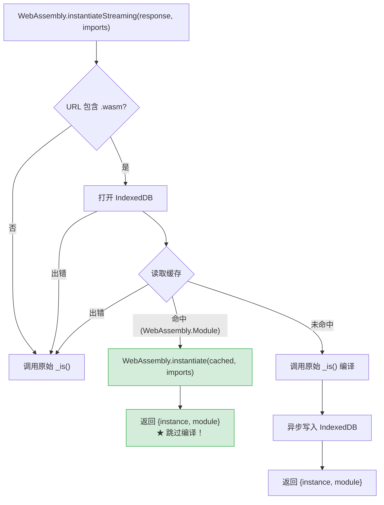

# 深入剖析 WASM SPA 冷启动延迟：从浏览器编译缓存驱逐到 IndexedDB 持久化修复

> **项目背景**：StaticFlow — 基于 Yew (Rust) + Trunk + wasm-bindgen 构建的 SPA 技术博客，WASM 产物 1.9 MB。
>
> **代码版本**：基于 `master` 分支 `b6b9ca8` 提交。

---

## 一、问题现象

### 1.1 Bug 描述

在 StaticFlow 的任何前端页面上，只要用户长时间不操作（大约 30 分钟以上），再点击浏览器刷新按钮，页面会卡在白屏状态很久——可能 3 到 10 秒甚至更长。

打开 Chrome DevTools 的 Network 面板观察，会发现一个非常反直觉的现象：

- **刷新后的前几秒内，Network 面板完全空白**——没有任何 HTTP 请求发出
- 突然某一瞬间，所有 API 请求（文章列表、歌曲列表等）同时涌出，页面瞬间渲染完成
- 之后连续刷新都是秒加载
- 但只要再次长时间不操作，问题又会复现

### 1.2 关键线索

这个现象的核心矛盾是：**页面卡住了，但没有网络请求**。

如果是网络问题（CDN 慢、API 超时），Network 面板一定会显示 pending 状态的请求。但这里什么都没有。这意味着瓶颈不在网络 I/O，而是某种 **CPU 密集型的本地计算**在阻塞应用启动。

对于一个 WASM SPA 来说，最大的 CPU 密集型本地计算只有一个——**WebAssembly 模块编译**。

---

## 二、WASM 在浏览器中的完整生命周期

要理解这个 bug，我们需要先搞清楚一个 WASM SPA 从 HTML 加载到用户看到页面的完整链路。

### 2.1 加载链路：从 HTML 到 WASM 执行

StaticFlow 使用 [Trunk](https://trunkrs.dev/) 作为构建工具。Trunk 在构建时会将 `index.html` 中的 `<link data-trunk rel="rust" />` 指令替换为一段 `<script type="module">` 胶水代码。

**源码中的 Trunk 指令**（`frontend/index.html:132-134`）：

```html
<!-- Trunk will compile Rust to WASM -->
<link data-trunk rel="rust" data-wasm-opt="0" />
```

**构建后生成的模块脚本**（`frontend/dist/index.html:135-145`）：

```html
<script type="module">
import init, * as bindings from '/static-flow-frontend-53f92742ae8cdc40.js';
const wasm = await init({
  module_or_path: '/static-flow-frontend-53f92742ae8cdc40_bg.wasm'
});

window.wasmBindings = bindings;
dispatchEvent(new CustomEvent("TrunkApplicationStarted", {detail: {wasm}}));
</script>
```

同时 Trunk 还会在 `<head>` 末尾注入资源预加载提示（`dist/index.html:180`）：

```html
<link rel="modulepreload" href="/static-flow-frontend-53f92742ae8cdc40.js"
      crossorigin="anonymous" integrity="sha384-..." />
<link rel="preload" href="/static-flow-frontend-53f92742ae8cdc40_bg.wasm"
      crossorigin="anonymous" integrity="sha384-..."
      as="fetch" type="application/wasm" />
```

这段代码触发了以下加载链路：

```
浏览器解析 HTML
  │
  ├─ 遇到 <link rel="modulepreload"> ──→ 预加载 JS 胶水代码（67 KB）
  ├─ 遇到 <link rel="preload" as="fetch"> ──→ 预加载 WASM 文件（1.9 MB）
  │
  └─ 遇到 <script type="module"> ──→ 延迟执行（HTML 解析完成后）
       │
       ├─ import init from '...js'     // 加载 wasm-bindgen 胶水代码
       ├─ init({ module_or_path })      // 触发 WASM 初始化
       │    ├─ fetch(url)               // 获取 WASM 字节（可能命中缓存）
       │    ├─ instantiateStreaming()    // ★ 编译 + 实例化（CPU 密集）
       │    └─ __wbg_finalize_init()    // 调用 WASM 的 main()
       │         └─ wasm.__wbindgen_start()  // Yew Renderer 挂载
       │
       └─ dispatch("TrunkApplicationStarted")  // 通知外部：应用已启动
```

> 💡 **Key Point**：`<script type="module">` 是延迟执行的——浏览器会先完成 HTML 解析，再按顺序执行模块脚本。但脚本内部的 `await init(...)` 会阻塞后续代码，直到 WASM 编译和实例化全部完成。

### 2.2 wasm-bindgen 胶水代码的内部流程

`init()` 函数的真实实现在 wasm-bindgen 生成的 JS 文件中。让我们逐步拆解。

**Step 1：入口函数 `__wbg_init()`**（`static-flow-frontend-*.js:1545-1569`）

```javascript
async function __wbg_init(module_or_path) {
    if (wasm !== undefined) return wasm;  // 防止重复初始化

    // 解析参数
    if (typeof module_or_path !== 'undefined') {
        if (Object.getPrototypeOf(module_or_path) === Object.prototype) {
            ({module_or_path} = module_or_path)  // 解构 { module_or_path: '...' }
        }
    }

    // 构建 imports 对象（Rust 侧需要的所有 JS 绑定）
    const imports = __wbg_get_imports();

    // URL/string → fetch Promise
    if (typeof module_or_path === 'string' || ...) {
        module_or_path = fetch(module_or_path);  // ← 发起 HTTP 请求（或命中缓存）
    }

    // 核心：加载 + 编译 + 实例化
    const { instance, module } = await __wbg_load(await module_or_path, imports);

    return __wbg_finalize_init(instance, module);
}
```

**Step 2：加载函数 `__wbg_load()`**（`static-flow-frontend-*.js:316-347`）

```javascript
async function __wbg_load(module, imports) {
    if (typeof Response === 'function' && module instanceof Response) {
        // 优先使用流式编译（边下载边编译）
        if (typeof WebAssembly.instantiateStreaming === 'function') {
            try {
                return await WebAssembly.instantiateStreaming(module, imports);
                //          ^^^^^^^^^^^^^^^^^^^^^^^^^^^^^^^^^^^^^^^^^^^^^^^^
                //          这一行是整个加载链路中最耗时的操作
            } catch (e) {
                // MIME type 不对时降级
                if (module.headers.get('Content-Type') !== 'application/wasm') {
                    console.warn("Falling back to WebAssembly.instantiate...");
                }
            }
        }
        // 降级：先下载完整字节，再编译
        const bytes = await module.arrayBuffer();
        return await WebAssembly.instantiate(bytes, imports);
    } else {
        // 直接传入 WebAssembly.Module 对象（跳过编译）
        const instance = await WebAssembly.instantiate(module, imports);
        if (instance instanceof WebAssembly.Instance) {
            return { instance, module };
        }
        return instance;
    }
}
```

**Step 3：完成初始化 `__wbg_finalize_init()`**（`static-flow-frontend-*.js:1511-1520`）

```javascript
function __wbg_finalize_init(instance, module) {
    wasm = instance.exports;
    __wbg_init.__wbindgen_wasm_module = module;
    cachedDataViewMemory0 = null;
    cachedUint8ArrayMemory0 = null;

    wasm.__wbindgen_start();  // ← 调用 Rust 的 main() 函数
    return wasm;
}
```

这里的 `__wbindgen_start()` 最终调用的是 Rust 侧的 `main()` 函数（`frontend/src/main.rs:27-29`）：

```rust
fn main() {
    yew::Renderer::<App>::new().render();
}
```

至此，Yew 框架挂载到 DOM，开始渲染组件，发起 API 请求。

> 📝 **Terminology**：`instantiateStreaming` = 编译 + 实例化一步完成。它接收一个 `Response` 对象（或其 Promise），内部同时进行字节下载和编译，比先 `arrayBuffer()` 再 `instantiate()` 更高效。

### 2.3 编译与实例化：两个不同的阶段

WebAssembly 的加载分为两个截然不同的阶段：

| 阶段 | API | 输入 | 输出 | 性质 |
|------|-----|------|------|------|
| **编译** | `WebAssembly.compile()` | WASM 字节码 | `WebAssembly.Module` | CPU 密集，耗时与文件大小成正比 |
| **实例化** | `WebAssembly.instantiate()` | `Module` + `imports` | `WebAssembly.Instance` | 轻量，绑定内存/表/全局变量 |

`WebAssembly.instantiateStreaming()` 将两者合并为一步，但内部仍然是先编译再实例化。

**编译阶段**是将 WASM 字节码翻译为目标平台的机器码。对于 1.9 MB 的 WASM 文件，这个过程涉及：

- 解析和验证 WASM 二进制格式
- 将 WASM 指令翻译为 x86-64 / ARM64 机器码
- 优化生成的机器码（寄存器分配、指令选择等）

> 🤔 **Think About**：为什么 WASM 编译比 JavaScript 编译慢得多？因为 WASM 是强类型的低级字节码，编译器需要生成高质量的机器码（类似 AOT 编译），而 JavaScript 引擎通常先用解释器快速启动，再用 JIT 逐步优化热点函数。WASM 没有"先解释后编译"的渐进策略——它必须一次性编译完成才能执行。

**实例化阶段**相对轻量，主要工作是：

- 分配线性内存（`WebAssembly.Memory`）
- 绑定导入函数（`imports` 对象中的 JS 函数）
- 初始化全局变量和表
- 执行 WASM 模块的 `start` 函数

### 2.4 浏览器的三层缓存体系

浏览器对 WASM 模块维护了三层缓存，每层有不同的生命周期和驱逐策略：

```
┌─────────────────────────────────────────────────────────────┐
│  Layer 1: HTTP 磁盘缓存 (HTTP Disk Cache)                    │
│  ─────────────────────────────────────────                   │
│  存储内容：原始 .wasm 字节文件                                  │
│  生命周期：受 Cache-Control / ETag 控制，通常持久存在            │
│  驱逐条件：缓存过期、用户清除浏览数据、磁盘空间不足              │
│  读取速度：~1-10ms（磁盘 I/O）                                │
├─────────────────────────────────────────────────────────────┤
│  Layer 2: V8 Code Cache (编译后机器码缓存)                    │
│  ─────────────────────────────────────────                   │
│  存储内容：编译后的机器码（WebAssembly.Module 的序列化形式）     │
│  生命周期：内存敏感，由浏览器自主管理                            │
│  驱逐条件：★ 标签页长时间不活跃、内存压力、浏览器重启            │
│  读取速度：~1-5ms（内存/磁盘）                                │
├─────────────────────────────────────────────────────────────┤
│  Layer 3: 运行时 Instance                                    │
│  ─────────────────────────────────────────                   │
│  存储内容：实例化后的 WASM 实例（内存、表、全局变量）            │
│  生命周期：与页面生命周期绑定                                   │
│  驱逐条件：页面刷新、导航离开                                   │
│  读取速度：0ms（已在内存中）                                   │
└─────────────────────────────────────────────────────────────┘
```

正常的加载流程是逐层向上查找：

```
刷新页面
  → Layer 3 已销毁（页面刷新）
  → 检查 Layer 2（V8 Code Cache）
    → 命中：直接实例化，跳过编译 ──→ 快速启动（~100ms）
    → 未命中：
      → 检查 Layer 1（HTTP 磁盘缓存）
        → 命中：读取字节，重新编译 ──→ 慢速启动（3-10s）★
        → 未命中：发起网络请求 ──→ 首次加载
```

> ⚠️ **Gotcha**：V8 Code Cache 的驱逐策略是不透明的。Chrome 没有公开精确的驱逐时间阈值，但根据 Chromium 源码和社区观察，以下因素会触发驱逐：
> - 标签页在后台超过约 30 分钟
> - 系统内存压力（其他应用占用大量内存）
> - 浏览器进程重启
> - 缓存条目数量超过上限

---

## 三、冷启动延迟的根因分析

### 3.1 热启动 vs 冷启动：时间线对比

理解了三层缓存体系后，我们可以精确还原两种场景的时间线。

**场景 A：热启动（刚使用过，Layer 2 命中）**

```
t=0ms    浏览器刷新，开始解析 HTML
t=5ms    遇到 <link rel="preload" as="fetch"> → 从 HTTP 磁盘缓存读取 .wasm
t=8ms    遇到 <script type="module"> → 延迟执行队列
t=15ms   HTML 解析完成，开始执行模块脚本
t=16ms   fetch(wasm_url) → 磁盘缓存命中，返回 Response
t=18ms   WebAssembly.instantiateStreaming(response, imports)
           → V8 发现 Code Cache 中有编译后的 Module
           → 跳过编译，直接反序列化机器码
t=25ms   实例化完成 → __wbg_finalize_init()
t=26ms   wasm.__wbindgen_start() → Yew main() → Renderer::render()
t=30ms   Yew 组件挂载，发起 API 请求
t=80ms   API 响应返回，页面渲染完成
         ─────────────────────────────────
         总耗时：~80ms ✅
```

**场景 B：冷启动（长时间不活跃，Layer 2 被驱逐）**

```
t=0ms    浏览器刷新，开始解析 HTML
t=5ms    遇到 <link rel="preload" as="fetch"> → 从 HTTP 磁盘缓存读取 .wasm
t=8ms    遇到 <script type="module"> → 延迟执行队列
t=15ms   HTML 解析完成，开始执行模块脚本
t=16ms   fetch(wasm_url) → 磁盘缓存命中，返回 Response
t=18ms   WebAssembly.instantiateStreaming(response, imports)
           → V8 检查 Code Cache → 未命中！
           → 开始从原始字节编译 1.9 MB WASM 模块
           → CPU 密集编译中...（无网络请求，页面白屏）
           → ...
           → ...
t=4500ms 编译完成！
t=4502ms 实例化完成 → __wbg_finalize_init()
t=4503ms wasm.__wbindgen_start() → Yew main() → Renderer::render()
t=4510ms Yew 组件挂载，发起 API 请求 ← "突然一瞬间所有请求发出"
t=4560ms API 响应返回，页面渲染完成 ← "一瞬间恢复正常"
         ─────────────────────────────────
         总耗时：~4500ms ❌（其中 ~4480ms 是纯编译时间）
```

> 💡 **Key Point**：两种场景的唯一区别就在 `instantiateStreaming` 这一步。热启动时它只需要反序列化已编译的机器码（~10ms），冷启动时它需要从头编译整个 WASM 模块（数秒）。

### 3.2 为什么 Network 面板没有请求

这是最容易让人困惑的地方。让我们逐步推理：

1. **`fetch(wasm_url)` 命中了 HTTP 磁盘缓存**
   - 原始 .wasm 字节仍然在磁盘缓存中（Layer 1 没有过期）
   - `fetch()` 直接从磁盘读取，不发起网络请求
   - 在 DevTools Network 面板中，这类请求要么显示为 `(disk cache)` 且耗时 0ms，要么根本不显示（取决于 DevTools 的过滤设置）

2. **`instantiateStreaming()` 开始 CPU 密集编译**
   - 它拿到了完整的 Response（字节已经在内存中）
   - 编译工作在后台线程进行，但 `await` 阻塞了模块脚本的执行
   - 在编译完成之前，后续的 JavaScript 代码不会执行

3. **Yew 的 `main()` 还没被调用**
   - `__wbg_finalize_init()` 中的 `wasm.__wbindgen_start()` 是在 `await` 之后
   - Yew 的 `Renderer::<App>::new().render()` 还没执行
   - 没有组件挂载 → 没有 `use_effect` 触发 → 没有 API 请求

4. **页面 body 中没有可见内容**
   - HTML body 只有一个 `<noscript>` 标签和一些隐藏的 SVG/div
   - Yew 还没渲染任何 DOM → 用户看到白屏

这就是为什么用户看到的是：**白屏 → 等待 → 突然所有请求同时发出 → 页面瞬间完成**。

```
时间轴：
0s        2s        4s        5s
│─────────│─────────│─────────│
│  白屏（WASM 编译中）  │API│渲染│
│  Network: 空        │ ↑ │ ↑ │
│                     │ 所有请求同时发出
│                     │   页面瞬间完成
```

### 3.3 影响因素

冷启动延迟的严重程度取决于多个因素：

| 因素 | 影响 | StaticFlow 的情况 |
|------|------|-------------------|
| WASM 文件大小 | 线性正相关：文件越大，编译越慢 | 1.9 MB（`data-wasm-opt="0"` 未优化） |
| CPU 性能 | 直接影响编译速度 | 因用户设备而异 |
| 浏览器内存压力 | 影响 Code Cache 驱逐频率 | WSL2 环境下内存竞争更激烈 |
| 不活跃时长 | 越久越可能触发 Code Cache 驱逐 | 约 30 分钟以上 |
| wasm-opt 优化级别 | 优化后文件更小，编译更快 | 当前为 0（未优化） |

> 🤔 **Think About**：`data-wasm-opt="0"` 意味着 Trunk 不会对 WASM 产物运行 wasm-opt 优化。虽然 `Trunk.toml` 中注释说"we'll optimize manually in post_build hook"，但实际上并没有配置 post_build hook。这意味着 1.9 MB 的 WASM 文件可能还有显著的压缩空间。

---

## 四、修复方案

### 4.1 思路：绕过 V8 Code Cache 的驱逐

既然问题的根因是 V8 Code Cache 被驱逐后需要重新编译，那么解决方案的核心思路就是：**在 V8 Code Cache 之外，维护一份我们自己可控的编译缓存**。

浏览器提供了一个完美的存储方案：**IndexedDB**。

IndexedDB 有几个关键特性使它适合这个场景：

1. **支持结构化克隆 `WebAssembly.Module`**：从 Chrome 57 / Firefox 53 / Safari 14.1 开始，`WebAssembly.Module` 对象可以直接存入 IndexedDB，浏览器会序列化编译后的机器码
2. **持久化存储**：不受 V8 Code Cache 的驱逐策略影响，数据持久存在直到被显式删除
3. **异步 API**：不阻塞主线程
4. **容量充足**：通常有数百 MB 到数 GB 的配额

```
修复后的缓存层次：

┌─────────────────────────────────────────────┐
│  Layer 1: HTTP 磁盘缓存 (raw .wasm bytes)    │  ← 不变
├─────────────────────────────────────────────┤
│  Layer 2: V8 Code Cache (compiled code)      │  ← 可能被驱逐
├─────────────────────────────────────────────┤
│  Layer 2.5: IndexedDB (compiled Module) ★    │  ← 新增！持久化
├─────────────────────────────────────────────┤
│  Layer 3: 运行时 Instance                    │  ← 不变
└─────────────────────────────────────────────┘

查找顺序：Layer 3 → Layer 2 → Layer 2.5 → Layer 1 → 网络
```

### 4.2 实现：Monkey-Patch `WebAssembly.instantiateStreaming`

我们的策略是在 wasm-bindgen 的胶水代码执行之前，拦截 `WebAssembly.instantiateStreaming` 函数，注入 IndexedDB 缓存逻辑。

这段代码放在 `<head>` 中、Trunk 的 `<link data-trunk rel="rust" />` 之前，确保在模块脚本执行前生效（`frontend/index.html:81-129`）：

```javascript
(function () {
  // IndexedDB 配置
  var DB = 'sf-wasm-cache', STORE = 'compiled';

  function openDB() {
    return new Promise(function (ok, fail) {
      var r = indexedDB.open(DB, 1);
      r.onupgradeneeded = function () { r.result.createObjectStore(STORE); };
      r.onsuccess = function () { ok(r.result); };
      r.onerror = function () { fail(r.error); };
    });
  }

  // 保存原始函数引用
  var _is = WebAssembly.instantiateStreaming;
  if (!_is) return;  // 浏览器不支持 instantiateStreaming，跳过

  // 替换为带缓存的版本
  WebAssembly.instantiateStreaming = function (source, imports) {
    var resp;
    return Promise.resolve(source)
      .then(function (r) { resp = r; return r.url || ''; })
      .then(function (url) {
        // 只拦截 .wasm 请求
        if (!url.includes('.wasm')) return _is.call(WebAssembly, resp, imports);

        return openDB()
          .then(function (db) {
            // Step 1: 尝试从 IndexedDB 读取缓存的 Module
            return new Promise(function (ok) {
              var tx = db.transaction(STORE, 'readonly');
              var rq = tx.objectStore(STORE).get(url);
              rq.onsuccess = function () { ok(rq.result || null); };
              rq.onerror = function () { ok(null); };
            });
          })
          .then(function (cached) {
            if (cached instanceof WebAssembly.Module) {
              // ★ 缓存命中！直接实例化，跳过编译
              return WebAssembly.instantiate(cached, imports)
                .then(function (instance) {
                  return { instance: instance, module: cached };
                });
            }

            // 缓存未命中，走原始编译路径
            return _is.call(WebAssembly, resp, imports)
              .then(function (result) {
                // 编译完成后，异步写入 IndexedDB 缓存
                openDB().then(function (db) {
                  var tx = db.transaction(STORE, 'readwrite');
                  var st = tx.objectStore(STORE);
                  st.clear();  // 清除旧版本缓存
                  st.put(result.module, url);  // 以 URL 为 key 存储
                }).catch(function () {});
                return result;
              });
          })
          // IndexedDB 出错时降级到原始路径
          .catch(function () { return _is.call(WebAssembly, resp, imports); });
      })
      // 最外层兜底：任何异常都降级
      .catch(function () { return _is.call(WebAssembly, source, imports); });
  };
})();
```

**执行流程图**：



**关键设计决策**：

1. **以 URL 为缓存 key**：Trunk 在文件名中嵌入了 content hash（如 `static-flow-frontend-53f92742ae8cdc40_bg.wasm`），每次构建产生不同的 URL，天然实现缓存失效
2. **`st.clear()` 清除旧条目**：每次写入新缓存前清空整个 store，避免旧版本 Module 堆积
3. **多层 `.catch()` 降级**：IndexedDB 不可用（如隐私模式）、Module 不兼容（如构建更新后 imports 变化）等任何异常，都 fallback 到原始的 `instantiateStreaming`
4. **非阻塞写入**：缓存写入是 fire-and-forget 的，不影响首次加载性能

> ⚠️ **Gotcha**：当缓存的 Module 与当前的 `imports` 不匹配时（例如代码更新后 wasm-bindgen 生成了新的 import 签名），`WebAssembly.instantiate(cached, imports)` 会抛出 `LinkError`。这个错误会被 `.catch()` 捕获，自动降级到重新编译路径。下次加载时，新的 Module 会覆盖旧缓存。

### 4.3 Loading Spinner：消除白屏感知

即使有了 IndexedDB 缓存，首次访问或构建更新后仍然需要编译。为了消除白屏体验，我们在 HTML body 中添加一个轻量的加载指示器（`frontend/index.html:127-145`）：

```html
<!-- Loading indicator shown while WASM compiles; removed once app mounts -->
<div id="sf-loading" style="position:fixed;inset:0;z-index:99999;
     display:flex;flex-direction:column;align-items:center;
     justify-content:center;background:var(--bg,#fafafa);
     transition:opacity .3s ease">
  <style>
    @keyframes sf-spin { to { transform: rotate(360deg) } }
    #sf-loading-ring {
      width: 36px; height: 36px;
      border: 3px solid #e5e7eb;
      border-top-color: #0078d4;
      border-radius: 50%;
      animation: sf-spin .8s linear infinite;
    }
    #sf-loading-text {
      margin-top: 12px;
      font: 500 14px/1 system-ui, sans-serif;
      color: #6b7280;
    }
    /* Dark mode */
    [data-theme="dark"] #sf-loading { background: #0d1117 }
    [data-theme="dark"] #sf-loading-ring {
      border-color: #30363d;
      border-top-color: #58a6ff;
    }
    [data-theme="dark"] #sf-loading-text { color: #8b949e }
  </style>
  <div id="sf-loading-ring"></div>
  <div id="sf-loading-text">Loading…</div>
</div>

<script>
  addEventListener('TrunkApplicationStarted', function () {
    var el = document.getElementById('sf-loading');
    if (el) {
      el.style.opacity = '0';
      setTimeout(function () { el.remove(); }, 320);
    }
  });
</script>
```

**设计要点**：

- **内联样式和 `<style>`**：不依赖任何外部 CSS 文件，确保在所有资源加载前就能渲染
- **`TrunkApplicationStarted` 事件**：Trunk 在 WASM 初始化完成后派发此事件（`dist/index.html:143`），此时 Yew 已经调用了 `render()`，DOM 已就绪
- **淡出动画**：`opacity: 0` + 320ms 延迟移除，避免闪烁
- **Dark mode 适配**：通过 `[data-theme="dark"]` 选择器匹配主题（主题在更早的脚本中已设置）

### 4.4 效果对比

| 场景 | 修复前 | 修复后 |
|------|--------|--------|
| 冷启动（Code Cache 被驱逐） | 3-10s 白屏，无任何反馈 | ~200ms（IndexedDB 读取 + 实例化）+ spinner |
| 首次访问（无任何缓存） | 正常编译 + 白屏 | 正常编译 + spinner + 写入 IndexedDB |
| 构建更新后首次访问 | 正常编译 + 白屏 | 正常编译 + spinner + 新 Module 覆盖旧缓存 |
| 热启动（Code Cache 命中） | ~100ms | ~100ms（IndexedDB 查询被 Code Cache 抢先） |
| IndexedDB 不可用 | N/A | 自动降级，行为与修复前一致 |

> 💡 **Key Point**：修复后的冷启动路径是 `IndexedDB.get()` → `WebAssembly.instantiate(module, imports)`。IndexedDB 读取一个序列化的 Module 通常在 50-150ms，实例化在 10-50ms。相比重新编译 1.9 MB WASM 的 3-10 秒，这是数量级的提升。

---

## 五、延伸思考

### 5.1 wasm-opt 优化

StaticFlow 当前的 Trunk 配置（`Trunk.toml`）：

```toml
release = true
```

配合 `index.html` 中的 `data-wasm-opt="0"`，意味着 Rust 代码以 release 模式编译（启用 LLVM 优化），但 Trunk 不会运行 wasm-opt 后处理。

wasm-opt 可以进一步优化 WASM 二进制：

- **死代码消除**：移除未使用的函数和数据段
- **指令合并**：将多条 WASM 指令合并为更高效的形式
- **内存布局优化**：重排数据段以提高局部性

对于 1.9 MB 的未优化 WASM，wasm-opt `-Oz`（优化大小）通常可以减少 20-40% 的体积。更小的文件意味着更快的编译速度，即使在 Code Cache 未命中的情况下也能显著缩短等待时间。

### 5.2 代码分割的未来

目前 wasm-bindgen 不支持 WASM 代码分割（code splitting）。整个 Yew 应用被编译为单一的 .wasm 文件，无论用户访问哪个页面都需要加载和编译全部代码。

Rust/WASM 生态中有一些探索方向：

- **wasm-split**：Emscripten 提供的工具，可以将 WASM 模块拆分为主模块和延迟加载模块
- **Component Model**：WebAssembly Component Model 提案可能在未来支持更细粒度的模块组合
- **手动拆分**：将独立功能（如 Mermaid 渲染、KaTeX 数学公式）保留为 JS 库，只将核心 UI 逻辑编译为 WASM

### 5.3 Service Worker 预缓存

另一个可选方案是使用 Service Worker 预缓存 WASM 文件。Service Worker 可以：

- 在后台预编译 WASM 模块（使用 `WebAssembly.compileStreaming`）
- 将编译后的 Module 存入 Cache API
- 拦截 fetch 请求，直接返回缓存的 Response

但 Service Worker 方案的复杂度显著高于 IndexedDB monkey-patch，且需要处理更新、版本管理、离线策略等额外问题。对于 StaticFlow 这样的 GitHub Pages 静态站点，IndexedDB 方案的 ROI 更高。

### 5.4 与 JavaScript 冷启动的对比

JavaScript 也有类似的 Code Cache 机制（V8 的 "code serialization"），但 JS 冷启动通常不会像 WASM 这样严重，原因是：

| 维度 | JavaScript | WebAssembly |
|------|-----------|-------------|
| 编译策略 | 渐进式：解释器 → Baseline JIT → Optimizing JIT | 一次性 AOT 编译 |
| 首次执行 | 解释器可以立即开始执行 | 必须等待编译完成 |
| 编译粒度 | 按函数编译，热点函数才优化 | 整个模块一次性编译 |
| 编译复杂度 | 初始编译很快（Ignition 解释器） | 需要生成高质量机器码 |
| Code Cache 未命中影响 | 用户几乎无感（解释器兜底） | 白屏数秒 |

这就是为什么同样大小的 JS bundle 和 WASM 文件，WASM 的冷启动延迟会严重得多。JavaScript 的"先解释后编译"策略天然提供了渐进式加载体验，而 WASM 的"全量编译后执行"策略在 Code Cache 未命中时会造成明显的启动延迟。

---

## 六、总结

WASM SPA 的冷启动延迟是一个容易被忽视但影响显著的问题。它的根因在于浏览器 V8 Code Cache 的驱逐策略——当用户长时间不活跃后，编译后的机器码被回收，下次加载需要从原始字节重新编译整个模块。

这个问题的诊断线索非常明确：**页面卡住但 Network 面板无请求** = CPU 密集的 WASM 重编译。

修复方案是在 V8 Code Cache 之外建立一层 IndexedDB 持久化缓存，通过 monkey-patch `WebAssembly.instantiateStreaming` 实现透明的缓存读写。配合 loading spinner 消除白屏感知，用户体验从"3-10 秒白屏无反馈"提升到"200ms 内完成加载"。

---

## 代码索引

| 文件 | 行号 | 内容 |
|------|------|------|
| `frontend/index.html` | 81-129 | IndexedDB WASM 缓存 monkey-patch |
| `frontend/index.html` | 127-145 | Loading spinner + TrunkApplicationStarted 监听 |
| `frontend/index.html` | 132-134 | Trunk WASM 构建指令 |
| `frontend/Trunk.toml` | 1-27 | Trunk 构建配置（release=true, wasm-opt=0） |
| `frontend/src/main.rs` | 27-29 | Yew 应用入口 `main()` |
| `frontend/dist/static-flow-frontend-*.js` | 316-347 | wasm-bindgen `__wbg_load()` |
| `frontend/dist/static-flow-frontend-*.js` | 1545-1569 | wasm-bindgen `__wbg_init()` |
| `frontend/dist/static-flow-frontend-*.js` | 1511-1520 | wasm-bindgen `__wbg_finalize_init()` |
| `frontend/dist/index.html` | 135-145 | Trunk 生成的模块脚本 |
| `frontend/dist/index.html` | 180 | Trunk 生成的 preload 提示 |

## 参考资料

- [WebAssembly Compilation Pipeline (V8 Blog)](https://v8.dev/blog/wasm-compilation-pipeline)
- [WebAssembly Caching (MDN)](https://developer.mozilla.org/en-US/docs/WebAssembly/Caching_modules)
- [Trunk Documentation](https://trunkrs.dev/)
- [wasm-bindgen Guide](https://rustwasm.github.io/wasm-bindgen/)

