# 深入剖析 WASM SPA 冷启动延迟：从浏览器编译缓存驱逐到 IndexedDB 持久化修复

> **项目背景**：StaticFlow — 基于 Yew (Rust) + Trunk + wasm-bindgen 构建的 SPA 技术博客，WASM 产物约 1.9 MB（wasm-opt `-Oz --converge` 优化后）。
>
> **代码版本**：基于 `master` 分支最新提交。

---

## 一、问题现象

### 1.1 Bug 描述

在 StaticFlow 的任何前端页面上，只要用户长时间不操作（大约 30 分钟以上），再点击浏览器刷新按钮，页面会卡在白屏状态很久——可能 3 到 10 秒甚至更长。

打开 Chrome DevTools 的 Network 面板观察，会发现一个非常反直觉的现象：

- **刷新后的前几秒内，Network 面板完全空白**——没有任何 HTTP 请求发出
- 突然某一瞬间，所有 API 请求（文章列表、歌曲列表等）同时涌出，页面瞬间渲染完成
- 之后连续刷新都是秒加载
- 但只要再次长时间不操作，问题又会复现

### 1.2 关键线索

这个现象的核心矛盾是：**页面卡住了，但没有网络请求**。

如果是网络问题（CDN 慢、API 超时），Network 面板一定会显示 pending 状态的请求。但这里什么都没有。这意味着瓶颈不在网络 I/O，而是某种 **CPU 密集型的本地计算**在阻塞应用启动。

对于一个 WASM SPA 来说，最大的 CPU 密集型本地计算只有一个——**WebAssembly 模块编译**。

---

## 二、WASM 在浏览器中的完整生命周期

要理解这个 bug，我们需要先搞清楚一个 WASM SPA 从 HTML 加载到用户看到页面的完整链路。

### 2.1 加载链路：从 HTML 到 WASM 执行

StaticFlow 使用 [Trunk](https://trunkrs.dev/) 作为构建工具。Trunk 在构建时会将 `index.html` 中的 `<link data-trunk rel="rust" />` 指令替换为一段 `<script type="module">` 胶水代码。

**源码中的 Trunk 指令**（`frontend/index.html`）：

```html
<!-- Trunk will compile Rust to WASM -->
<!-- Disable built-in wasm-opt; post_build hook runs it with correct feature flags -->
<link data-trunk rel="rust" data-wasm-opt="0" />
```

> 💡 Trunk 内置的 wasm-opt 不支持传递 `--enable-*` flags。StaticFlow 通过 `data-wasm-opt="0"` 禁用内置 wasm-opt，改用 `Trunk.toml` 中的 `post_build` hook 手动调用 `wasm-opt -Oz --converge --enable-bulk-memory --enable-nontrapping-float-to-int`，详见第五节。

**构建后生成的模块脚本**（`frontend/dist/index.html:135-145`）：

```html
<script type="module">
import init, * as bindings from '/static-flow-frontend-53f92742ae8cdc40.js';
const wasm = await init({
  module_or_path: '/static-flow-frontend-53f92742ae8cdc40_bg.wasm'
});

window.wasmBindings = bindings;
dispatchEvent(new CustomEvent("TrunkApplicationStarted", {detail: {wasm}}));
</script>
```

同时 Trunk 还会在 `<head>` 末尾注入资源预加载提示（`dist/index.html:180`）：

```html
<link rel="modulepreload" href="/static-flow-frontend-53f92742ae8cdc40.js"
      crossorigin="anonymous" integrity="sha384-..." />
<link rel="preload" href="/static-flow-frontend-53f92742ae8cdc40_bg.wasm"
      crossorigin="anonymous" integrity="sha384-..."
      as="fetch" type="application/wasm" />
```

这段代码触发了以下加载链路：

```
浏览器解析 HTML
  │
  ├─ 遇到 <link rel="modulepreload"> ──→ 预加载 JS 胶水代码（67 KB）
  ├─ 遇到 <link rel="preload" as="fetch"> ──→ 预加载 WASM 文件（1.9 MB）
  │
  └─ 遇到 <script type="module"> ──→ 延迟执行（HTML 解析完成后）
       │
       ├─ import init from '...js'     // 加载 wasm-bindgen 胶水代码
       ├─ init({ module_or_path })      // 触发 WASM 初始化
       │    ├─ fetch(url)               // 获取 WASM 字节（可能命中缓存）
       │    ├─ instantiateStreaming()    // ★ 编译 + 实例化（CPU 密集）
       │    └─ __wbg_finalize_init()    // 调用 WASM 的 main()
       │         └─ wasm.__wbindgen_start()  // Yew Renderer 挂载
       │
       └─ dispatch("TrunkApplicationStarted")  // 通知外部：应用已启动
```

> 💡 **Key Point**：`<script type="module">` 是延迟执行的——浏览器会先完成 HTML 解析，再按顺序执行模块脚本。但脚本内部的 `await init(...)` 会阻塞后续代码，直到 WASM 编译和实例化全部完成。

### 2.2 wasm-bindgen 胶水代码的内部流程

`init()` 函数的真实实现在 wasm-bindgen 生成的 JS 文件中。让我们逐步拆解。

**Step 1：入口函数 `__wbg_init()`**（`static-flow-frontend-*.js:1545-1569`）

```javascript
async function __wbg_init(module_or_path) {
    if (wasm !== undefined) return wasm;  // 防止重复初始化

    // 解析参数
    if (typeof module_or_path !== 'undefined') {
        if (Object.getPrototypeOf(module_or_path) === Object.prototype) {
            ({module_or_path} = module_or_path)  // 解构 { module_or_path: '...' }
        }
    }

    // 构建 imports 对象（Rust 侧需要的所有 JS 绑定）
    const imports = __wbg_get_imports();

    // URL/string → fetch Promise
    if (typeof module_or_path === 'string' || ...) {
        module_or_path = fetch(module_or_path);  // ← 发起 HTTP 请求（或命中缓存）
    }

    // 核心：加载 + 编译 + 实例化
    const { instance, module } = await __wbg_load(await module_or_path, imports);

    return __wbg_finalize_init(instance, module);
}
```

**Step 2：加载函数 `__wbg_load()`**（`static-flow-frontend-*.js:316-347`）

```javascript
async function __wbg_load(module, imports) {
    if (typeof Response === 'function' && module instanceof Response) {
        // 优先使用流式编译（边下载边编译）
        if (typeof WebAssembly.instantiateStreaming === 'function') {
            try {
                return await WebAssembly.instantiateStreaming(module, imports);
                //          ^^^^^^^^^^^^^^^^^^^^^^^^^^^^^^^^^^^^^^^^^^^^^^^^
                //          这一行是整个加载链路中最耗时的操作
            } catch (e) {
                // MIME type 不对时降级
                if (module.headers.get('Content-Type') !== 'application/wasm') {
                    console.warn("Falling back to WebAssembly.instantiate...");
                }
            }
        }
        // 降级：先下载完整字节，再编译
        const bytes = await module.arrayBuffer();
        return await WebAssembly.instantiate(bytes, imports);
    } else {
        // 直接传入 WebAssembly.Module 对象（跳过编译）
        const instance = await WebAssembly.instantiate(module, imports);
        if (instance instanceof WebAssembly.Instance) {
            return { instance, module };
        }
        return instance;
    }
}
```

**Step 3：完成初始化 `__wbg_finalize_init()`**（`static-flow-frontend-*.js:1511-1520`）

```javascript
function __wbg_finalize_init(instance, module) {
    wasm = instance.exports;
    __wbg_init.__wbindgen_wasm_module = module;
    cachedDataViewMemory0 = null;
    cachedUint8ArrayMemory0 = null;

    wasm.__wbindgen_start();  // ← 调用 Rust 的 main() 函数
    return wasm;
}
```

这里的 `__wbindgen_start()` 最终调用的是 Rust 侧的 `main()` 函数（`frontend/src/main.rs:27-29`）：

```rust
fn main() {
    yew::Renderer::<App>::new().render();
}
```

至此，Yew 框架挂载到 DOM，开始渲染组件，发起 API 请求。

> 📝 **Terminology**：`instantiateStreaming` = 编译 + 实例化一步完成。它接收一个 `Response` 对象（或其 Promise），内部同时进行字节下载和编译，比先 `arrayBuffer()` 再 `instantiate()` 更高效。

### 2.3 编译与实例化：两个不同的阶段

WebAssembly 的加载分为两个截然不同的阶段：

| 阶段 | API | 输入 | 输出 | 性质 |
|------|-----|------|------|------|
| **编译** | `WebAssembly.compile()` | WASM 字节码 | `WebAssembly.Module` | CPU 密集，耗时与文件大小成正比 |
| **实例化** | `WebAssembly.instantiate()` | `Module` + `imports` | `WebAssembly.Instance` | 轻量，绑定内存/表/全局变量 |

`WebAssembly.instantiateStreaming()` 将两者合并为一步，但内部仍然是先编译再实例化。

**编译阶段**是将 WASM 字节码翻译为目标平台的机器码。对于 1.9 MB 的 WASM 文件，这个过程涉及：

- 解析和验证 WASM 二进制格式
- 将 WASM 指令翻译为 x86-64 / ARM64 机器码
- 优化生成的机器码（寄存器分配、指令选择等）

> 🤔 **Think About**：为什么 WASM 编译比 JavaScript 编译慢得多？因为 WASM 是强类型的低级字节码，编译器需要生成高质量的机器码（类似 AOT 编译），而 JavaScript 引擎通常先用解释器快速启动，再用 JIT 逐步优化热点函数。WASM 没有"先解释后编译"的渐进策略——它必须一次性编译完成才能执行。

**实例化阶段**相对轻量，主要工作是：

- 分配线性内存（`WebAssembly.Memory`）
- 绑定导入函数（`imports` 对象中的 JS 函数）
- 初始化全局变量和表
- 执行 WASM 模块的 `start` 函数

### 2.4 浏览器的三层缓存体系

浏览器对 WASM 模块维护了三层缓存，每层有不同的生命周期和驱逐策略：

```
┌─────────────────────────────────────────────────────────────┐
│  Layer 1: HTTP 磁盘缓存 (HTTP Disk Cache)                    │
│  ─────────────────────────────────────────                   │
│  存储内容：原始 .wasm 字节文件                                  │
│  生命周期：受 Cache-Control / ETag 控制，通常持久存在            │
│  驱逐条件：缓存过期、用户清除浏览数据、磁盘空间不足              │
│  读取速度：~1-10ms（磁盘 I/O）                                │
├─────────────────────────────────────────────────────────────┤
│  Layer 2: V8 Code Cache (编译后机器码缓存)                    │
│  ─────────────────────────────────────────                   │
│  存储内容：编译后的机器码（WebAssembly.Module 的序列化形式）     │
│  生命周期：内存敏感，由浏览器自主管理                            │
│  驱逐条件：★ 标签页长时间不活跃、内存压力、浏览器重启            │
│  读取速度：~1-5ms（内存/磁盘）                                │
├─────────────────────────────────────────────────────────────┤
│  Layer 3: 运行时 Instance                                    │
│  ─────────────────────────────────────────                   │
│  存储内容：实例化后的 WASM 实例（内存、表、全局变量）            │
│  生命周期：与页面生命周期绑定                                   │
│  驱逐条件：页面刷新、导航离开                                   │
│  读取速度：0ms（已在内存中）                                   │
└─────────────────────────────────────────────────────────────┘
```

正常的加载流程是逐层向上查找：

```
刷新页面
  → Layer 3 已销毁（页面刷新）
  → 检查 Layer 2（V8 Code Cache）
    → 命中：直接实例化，跳过编译 ──→ 快速启动（~100ms）
    → 未命中：
      → 检查 Layer 1（HTTP 磁盘缓存）
        → 命中：读取字节，重新编译 ──→ 慢速启动（3-10s）★
        → 未命中：发起网络请求 ──→ 首次加载
```

> ⚠️ **Gotcha**：V8 Code Cache 的驱逐策略是不透明的。Chrome 没有公开精确的驱逐时间阈值，但根据 Chromium 源码和社区观察，以下因素会触发驱逐：
> - 标签页在后台超过约 30 分钟
> - 系统内存压力（其他应用占用大量内存）
> - 浏览器进程重启
> - 缓存条目数量超过上限

---

## 三、冷启动延迟的根因分析

### 3.1 热启动 vs 冷启动：时间线对比

理解了三层缓存体系后，我们可以精确还原两种场景的时间线。

**场景 A：热启动（刚使用过，Layer 2 命中）**

```
t=0ms    浏览器刷新，开始解析 HTML
t=5ms    遇到 <link rel="preload" as="fetch"> → 从 HTTP 磁盘缓存读取 .wasm
t=8ms    遇到 <script type="module"> → 延迟执行队列
t=15ms   HTML 解析完成，开始执行模块脚本
t=16ms   fetch(wasm_url) → 磁盘缓存命中，返回 Response
t=18ms   WebAssembly.instantiateStreaming(response, imports)
           → V8 发现 Code Cache 中有编译后的 Module
           → 跳过编译，直接反序列化机器码
t=25ms   实例化完成 → __wbg_finalize_init()
t=26ms   wasm.__wbindgen_start() → Yew main() → Renderer::render()
t=30ms   Yew 组件挂载，发起 API 请求
t=80ms   API 响应返回，页面渲染完成
         ─────────────────────────────────
         总耗时：~80ms ✅
```

**场景 B：冷启动（长时间不活跃，Layer 2 被驱逐）**

```
t=0ms    浏览器刷新，开始解析 HTML
t=5ms    遇到 <link rel="preload" as="fetch"> → 从 HTTP 磁盘缓存读取 .wasm
t=8ms    遇到 <script type="module"> → 延迟执行队列
t=15ms   HTML 解析完成，开始执行模块脚本
t=16ms   fetch(wasm_url) → 磁盘缓存命中，返回 Response
t=18ms   WebAssembly.instantiateStreaming(response, imports)
           → V8 检查 Code Cache → 未命中！
           → 开始从原始字节编译 1.9 MB WASM 模块
           → CPU 密集编译中...（无网络请求，页面白屏）
           → ...
           → ...
t=4500ms 编译完成！
t=4502ms 实例化完成 → __wbg_finalize_init()
t=4503ms wasm.__wbindgen_start() → Yew main() → Renderer::render()
t=4510ms Yew 组件挂载，发起 API 请求 ← "突然一瞬间所有请求发出"
t=4560ms API 响应返回，页面渲染完成 ← "一瞬间恢复正常"
         ─────────────────────────────────
         总耗时：~4500ms ❌（其中 ~4480ms 是纯编译时间）
```

> 💡 **Key Point**：两种场景的唯一区别就在 `instantiateStreaming` 这一步。热启动时它只需要反序列化已编译的机器码（~10ms），冷启动时它需要从头编译整个 WASM 模块（数秒）。

### 3.2 为什么 Network 面板没有请求

这是最容易让人困惑的地方。让我们逐步推理：

1. **`fetch(wasm_url)` 命中了 HTTP 磁盘缓存**
   - 原始 .wasm 字节仍然在磁盘缓存中（Layer 1 没有过期）
   - `fetch()` 直接从磁盘读取，不发起网络请求
   - 在 DevTools Network 面板中，这类请求要么显示为 `(disk cache)` 且耗时 0ms，要么根本不显示（取决于 DevTools 的过滤设置）

2. **`instantiateStreaming()` 开始 CPU 密集编译**
   - 它拿到了完整的 Response（字节已经在内存中）
   - 编译工作在后台线程进行，但 `await` 阻塞了模块脚本的执行
   - 在编译完成之前，后续的 JavaScript 代码不会执行

3. **Yew 的 `main()` 还没被调用**
   - `__wbg_finalize_init()` 中的 `wasm.__wbindgen_start()` 是在 `await` 之后
   - Yew 的 `Renderer::<App>::new().render()` 还没执行
   - 没有组件挂载 → 没有 `use_effect` 触发 → 没有 API 请求

4. **页面 body 中没有可见内容**
   - HTML body 只有一个 `<noscript>` 标签和一些隐藏的 SVG/div
   - Yew 还没渲染任何 DOM → 用户看到白屏

这就是为什么用户看到的是：**白屏 → 等待 → 突然所有请求同时发出 → 页面瞬间完成**。

```
时间轴：
0s        2s        4s        5s
│─────────│─────────│─────────│
│  白屏（WASM 编译中）  │API│渲染│
│  Network: 空        │ ↑ │ ↑ │
│                     │ 所有请求同时发出
│                     │   页面瞬间完成
```

### 3.3 影响因素

冷启动延迟的严重程度取决于多个因素：

| 因素 | 影响 | StaticFlow 的情况 |
|------|------|-------------------|
| WASM 文件大小 | 线性正相关：文件越大，编译越慢 | ~1.9 MB（wasm-opt `-Oz --converge` 优化后） |
| CPU 性能 | 直接影响编译速度 | 因用户设备而异 |
| 浏览器内存压力 | 影响 Code Cache 驱逐频率 | WSL2 环境下内存竞争更激烈 |
| 不活跃时长 | 越久越可能触发 Code Cache 驱逐 | 约 30 分钟以上 |
| wasm-opt 优化级别 | 优化后文件更小，编译更快 | `-Oz --converge`（post_build hook） |

> 🤔 **Think About**：`data-wasm-opt="0"` 意味着 Trunk 不会对 WASM 产物运行内置 wasm-opt。StaticFlow 通过 `Trunk.toml` 的 `post_build` hook 手动调用 wasm-opt，传入 `--enable-bulk-memory --enable-nontrapping-float-to-int -Oz --converge`，既解决了 Trunk 内置 wasm-opt 不支持 feature flags 的问题，又实现了多轮收敛优化。

---

## 四、修复方案

### 4.1 思路：绕过 V8 Code Cache 的驱逐

既然问题的根因是 V8 Code Cache 被驱逐后需要重新编译，那么解决方案的核心思路就是：**在 V8 Code Cache 之外，维护一份我们自己可控的持久化缓存**。

浏览器提供了一个合适的存储方案：**IndexedDB**。

IndexedDB 有几个关键特性使它适合这个场景：

1. **支持存储 `ArrayBuffer`**：WASM 原始字节可以通过结构化克隆直接存入 IndexedDB
2. **持久化存储**：不受 V8 Code Cache 的驱逐策略影响，数据持久存在直到被显式删除
3. **异步 API**：不阻塞主线程
4. **容量充足**：通常有数百 MB 到数 GB 的配额

> ⚠️ **重要变更**：早期方案尝试直接存储 `WebAssembly.Module` 对象到 IndexedDB。但现代浏览器（Chrome 100+）已经禁止通过结构化克隆序列化 `WebAssembly.Module`，会抛出 `DataCloneError: A WebAssembly.Module can not be serialized for storage.`（参见 [WebAssembly/spec#821](https://github.com/WebAssembly/spec/issues/821)）。因此当前方案改为存储原始 WASM 字节（`ArrayBuffer`），加载时通过 `WebAssembly.instantiate(bytes, imports)` 重新编译。V8 对相同字节有内部编译缓存加速，实测从 IndexedDB 加载+编译仅需 ~32ms。

```
修复后的缓存层次：

┌─────────────────────────────────────────────┐
│  Layer 1: HTTP 磁盘缓存 (raw .wasm bytes)    │  ← 不变
├─────────────────────────────────────────────┤
│  Layer 2: V8 Code Cache (compiled code)      │  ← 可能被驱逐
├─────────────────────────────────────────────┤
│  Layer 2.5: IndexedDB (raw bytes) ★          │  ← 新增！持久化
├─────────────────────────────────────────────┤
│  Layer 3: 运行时 Instance                    │  ← 不变
└─────────────────────────────────────────────┘

查找顺序：Layer 3 → Layer 2 → Layer 2.5 → Layer 1 → 网络

注：Layer 2 的查找由浏览器内部透明处理，对 JS 不可见。
当 V8 Code Cache 命中时，instantiateStreaming 直接返回（~8ms）；
当 Code Cache 未命中但 IndexedDB 有缓存时，从字节编译（~32ms）；
两者都未命中时，走完整的 fetch + compile 路径。
```

### 4.2 实现：Monkey-Patch `WebAssembly.instantiateStreaming`

我们的策略是在 wasm-bindgen 的胶水代码执行之前，拦截 `WebAssembly.instantiateStreaming` 函数，注入 IndexedDB 缓存逻辑。

这段代码放在 `<head>` 中、Trunk 的 `<link data-trunk rel="rust" />` 之前，确保在模块脚本执行前生效（`frontend/index.html`）：

```javascript
(function () {
  // IndexedDB 配置（SCHEMA=2：从旧版 Module 存储迁移到 ArrayBuffer 存储）
  var DB = 'sf-wasm-cache', STORE = 'compiled', SCHEMA = 2;

  function openDB() {
    return new Promise(function (ok, fail) {
      var r = indexedDB.open(DB, SCHEMA);
      r.onupgradeneeded = function () {
        var db = r.result;
        // 清除旧 schema 的 store（可能包含无法反序列化的 Module 数据）
        if (db.objectStoreNames.contains(STORE)) db.deleteObjectStore(STORE);
        db.createObjectStore(STORE);
      };
      r.onsuccess = function () { ok(r.result); };
      r.onerror = function () { fail(r.error); };
    });
  }

  // 保存原始函数引用
  var _is = WebAssembly.instantiateStreaming;
  if (!_is) return;  // 浏览器不支持 instantiateStreaming，跳过

  // 替换为带缓存的版本
  WebAssembly.instantiateStreaming = function (source, imports) {
    var resp;
    return Promise.resolve(source)
      .then(function (r) { resp = r; return r.url || ''; })
      .then(function (url) {
        // 只拦截 .wasm 请求
        if (!url.includes('.wasm')) return _is.call(WebAssembly, resp, imports);

        return openDB()
          .then(function (db) {
            // Step 1: 尝试从 IndexedDB 读取缓存的 ArrayBuffer
            return new Promise(function (ok) {
              var tx = db.transaction(STORE, 'readonly');
              var rq = tx.objectStore(STORE).get(url);
              rq.onsuccess = function () { ok(rq.result || null); };
              rq.onerror = function () { ok(null); };
            });
          })
          .then(function (cached) {
            if (cached instanceof ArrayBuffer && cached.byteLength > 0) {
              // ★ 缓存命中！从字节编译+实例化
              // V8 对相同字节有内部编译缓存，实测 ~32ms
              return WebAssembly.instantiate(cached, imports);
            }

            // 缓存未命中，走原始编译路径
            // clone response：一路给 instantiateStreaming，一路读字节存 IndexedDB
            var cloned = resp.clone();
            return _is.call(WebAssembly, resp, imports)
              .then(function (result) {
                // 异步读取字节并写入 IndexedDB（fire-and-forget）
                cloned.arrayBuffer().then(function (bytes) {
                  return openDB().then(function (db) {
                    var tx = db.transaction(STORE, 'readwrite');
                    var st = tx.objectStore(STORE);
                    st.clear();  // 清除旧版本缓存
                    st.put(bytes, url);  // 以 URL 为 key 存储原始字节
                  });
                }).catch(function () {});
                return result;
              });
          })
          // IndexedDB 出错时降级到原始路径
          .catch(function () { return _is.call(WebAssembly, resp, imports); });
      })
      // 最外层兜底：任何异常都降级
      .catch(function () { return _is.call(WebAssembly, source, imports); });
  };
})();
```

**执行流程图**：

```mermaid
flowchart TD
    A["WebAssembly.instantiateStreaming(response, imports)"] --> B{URL 包含 .wasm?}
    B -- 否 --> C["调用原始 _is()"]
    B -- 是 --> D["打开 IndexedDB"]
    D --> E{读取缓存}
    E -- "命中 (ArrayBuffer)" --> F["WebAssembly.instantiate(bytes, imports)<br/>V8 内部编译缓存加速 ~32ms"]
    F --> G["返回 {instance, module}<br/>★ 跳过网络！"]
    E -- 未命中 --> H["resp.clone() + 调用原始 _is() 编译"]
    H --> I["cloned.arrayBuffer() → 异步写入 IndexedDB"]
    I --> J["返回 {instance, module}"]
    D -- 出错 --> C
    E -- 出错 --> C

    style G fill:#d4edda,stroke:#28a745
    style F fill:#d4edda,stroke:#28a745
```



**关键设计决策**：

1. **存储 `ArrayBuffer` 而非 `WebAssembly.Module`**：现代浏览器已禁止通过结构化克隆序列化 `WebAssembly.Module`（抛出 `DataCloneError`）。存储原始字节虽然仍需编译，但 V8 对相同字节有内部编译缓存，实测仅需 ~32ms
2. **`resp.clone()` 分流**：一路给 `instantiateStreaming` 做流式编译（不阻塞首次加载），一路从 clone 读 `arrayBuffer()` 异步写入 IndexedDB
3. **以 URL 为缓存 key**：Trunk 在文件名中嵌入了 content hash（如 `static-flow-frontend-ca613c6015850c85_bg.wasm`），每次构建产生不同的 URL，天然实现缓存失效
4. **`st.clear()` 清除旧条目**：每次写入新缓存前清空整个 store，避免旧版本字节堆积
5. **IndexedDB schema 升级**：`SCHEMA=2` 自动清理旧版 store 中无法反序列化的 Module 数据
6. **多层 `.catch()` 降级**：IndexedDB 不可用（如隐私模式）、编译失败等任何异常，都 fallback 到原始的 `instantiateStreaming`
7. **非阻塞写入**：缓存写入是 fire-and-forget 的，不影响首次加载性能

> ⚠️ **Gotcha**：当缓存的字节与当前的 `imports` 不匹配时（例如代码更新后 wasm-bindgen 生成了新的 import 签名），`WebAssembly.instantiate(bytes, imports)` 会抛出 `LinkError`。但由于 URL 包含 content hash，构建更新后 URL 变化 → IndexedDB 中找不到新 key → 自动走 CACHE MISS 路径 → 新字节覆盖旧缓存。

### 4.3 Loading Spinner：消除白屏感知

即使有了 IndexedDB 缓存，首次访问或构建更新后仍然需要编译。为了消除白屏体验，我们在 HTML body 中添加一个轻量的加载指示器（`frontend/index.html:127-145`）：

```html
<!-- Loading indicator shown while WASM compiles; removed once app mounts -->
<div id="sf-loading" style="position:fixed;inset:0;z-index:99999;
     display:flex;flex-direction:column;align-items:center;
     justify-content:center;background:var(--bg,#fafafa);
     transition:opacity .3s ease">
  <style>
    @keyframes sf-spin { to { transform: rotate(360deg) } }
    #sf-loading-ring {
      width: 36px; height: 36px;
      border: 3px solid #e5e7eb;
      border-top-color: #0078d4;
      border-radius: 50%;
      animation: sf-spin .8s linear infinite;
    }
    #sf-loading-text {
      margin-top: 12px;
      font: 500 14px/1 system-ui, sans-serif;
      color: #6b7280;
    }
    /* Dark mode */
    [data-theme="dark"] #sf-loading { background: #0d1117 }
    [data-theme="dark"] #sf-loading-ring {
      border-color: #30363d;
      border-top-color: #58a6ff;
    }
    [data-theme="dark"] #sf-loading-text { color: #8b949e }
  </style>
  <div id="sf-loading-ring"></div>
  <div id="sf-loading-text">Loading…</div>
</div>

<script>
  addEventListener('TrunkApplicationStarted', function () {
    var el = document.getElementById('sf-loading');
    if (el) {
      el.style.opacity = '0';
      setTimeout(function () { el.remove(); }, 320);
    }
  });
</script>
```

**设计要点**：

- **内联样式和 `<style>`**：不依赖任何外部 CSS 文件，确保在所有资源加载前就能渲染
- **`TrunkApplicationStarted` 事件**：Trunk 在 WASM 初始化完成后派发此事件（`dist/index.html:143`），此时 Yew 已经调用了 `render()`，DOM 已就绪
- **淡出动画**：`opacity: 0` + 320ms 延迟移除，避免闪烁
- **Dark mode 适配**：通过 `[data-theme="dark"]` 选择器匹配主题（主题在更早的脚本中已设置）

### 4.4 效果对比

| 场景 | 修复前 | 修复后 |
|------|--------|--------|
| 冷启动（Code Cache 被驱逐） | 3-10s 白屏，无任何反馈 | ~32ms（IndexedDB 读取字节 + V8 内部编译缓存加速）+ spinner |
| 首次访问（无任何缓存） | 正常编译 + 白屏 | 正常编译 + spinner + 异步写入 IndexedDB |
| 构建更新后首次访问 | 正常编译 + 白屏 | 正常编译 + spinner + 新字节覆盖旧缓存 |
| 热启动（Code Cache 命中） | ~8ms | ~8ms（V8 Code Cache 抢先命中，IndexedDB 路径不影响） |
| IndexedDB 不可用 | N/A | 自动降级，行为与修复前一致 |

> 💡 **Key Point**：修复后的冷启动路径是 `IndexedDB.get(url)` → `WebAssembly.instantiate(bytes, imports)`。IndexedDB 读取 ~1.9 MB 的 ArrayBuffer 通常在 5-15ms，V8 对相同字节的编译缓存命中后实例化在 15-30ms。相比重新编译 1.9 MB WASM 的 3-10 秒，这是两个数量级的提升。

---

## 五、延伸思考

### 5.1 wasm-opt 优化

StaticFlow 当前的编译配置（workspace `Cargo.toml`）：

```toml
[profile.release]
opt-level = "z"   # 优化体积（WASM 重要）
lto = true        # 链接时优化
codegen-units = 1 # 单一代码生成单元，更好的优化
panic = "abort"   # Panic 时直接中止，减小体积
strip = true      # 移除调试符号
```

配合 `frontend/.cargo/config.toml` 中的 target features：

```toml
[target.wasm32-unknown-unknown]
rustflags = [
  "-C", "link-arg=--export-table",
  "-C", "target-feature=+bulk-memory",
]
```

以及 `Trunk.toml` 中的 post_build hook：

```toml
[[hooks]]
stage = "post_build"
command = "bash"
command_arguments = ["scripts/wasm-opt-post-build.sh"]
```

`scripts/wasm-opt-post-build.sh` 调用 wasm-opt 并传入正确的 feature flags：

```bash
"$WASM_OPT" \
  --enable-bulk-memory \
  --enable-nontrapping-float-to-int \
  -Oz \
  --converge \
  "$wasm" -o "$wasm"
```

> 💡 **为什么需要 post_build hook？** Trunk 内置的 `data-wasm-opt="z"` 调用 wasm-opt 时只传 `-Oz`，不传 `--enable-*` flags。而 Rust 编译器默认启用了 `bulk-memory` 和 `nontrapping-fptoint` 特性，生成的 WASM 包含 `memory.copy` 和 `i32.trunc_sat_f64_u` 等指令。wasm-opt 不认识这些指令就会报 `wasm-validator error`。通过 post_build hook 手动调用并传入 feature flags 解决了这个问题。
>
> `--converge` 让 wasm-opt 反复运行优化 passes 直到产物不再缩小，通常能额外省 1-3%。

### 5.2 代码分割的未来

目前 wasm-bindgen 不支持 WASM 代码分割（code splitting）。整个 Yew 应用被编译为单一的 .wasm 文件，无论用户访问哪个页面都需要加载和编译全部代码。

Rust/WASM 生态中有一些探索方向：

- **wasm-split**：Emscripten 提供的工具，可以将 WASM 模块拆分为主模块和延迟加载模块
- **Component Model**：WebAssembly Component Model 提案可能在未来支持更细粒度的模块组合
- **手动拆分**：将独立功能（如 Mermaid 渲染、KaTeX 数学公式）保留为 JS 库，只将核心 UI 逻辑编译为 WASM

### 5.3 Service Worker 预缓存

另一个可选方案是使用 Service Worker 预缓存 WASM 文件。Service Worker 可以：

- 在后台预编译 WASM 模块（使用 `WebAssembly.compileStreaming`）
- 将编译后的 Module 存入 Cache API
- 拦截 fetch 请求，直接返回缓存的 Response

但 Service Worker 方案的复杂度显著高于 IndexedDB monkey-patch，且需要处理更新、版本管理、离线策略等额外问题。对于 StaticFlow 这样的 GitHub Pages 静态站点，IndexedDB 方案的 ROI 更高。

### 5.4 与 JavaScript 冷启动的对比

JavaScript 也有类似的 Code Cache 机制（V8 的 "code serialization"），但 JS 冷启动通常不会像 WASM 这样严重，原因是：

| 维度 | JavaScript | WebAssembly |
|------|-----------|-------------|
| 编译策略 | 渐进式：解释器 → Baseline JIT → Optimizing JIT | 一次性 AOT 编译 |
| 首次执行 | 解释器可以立即开始执行 | 必须等待编译完成 |
| 编译粒度 | 按函数编译，热点函数才优化 | 整个模块一次性编译 |
| 编译复杂度 | 初始编译很快（Ignition 解释器） | 需要生成高质量机器码 |
| Code Cache 未命中影响 | 用户几乎无感（解释器兜底） | 白屏数秒 |

这就是为什么同样大小的 JS bundle 和 WASM 文件，WASM 的冷启动延迟会严重得多。JavaScript 的"先解释后编译"策略天然提供了渐进式加载体验，而 WASM 的"全量编译后执行"策略在 Code Cache 未命中时会造成明显的启动延迟。

---

## 六、总结

WASM SPA 的冷启动延迟是一个容易被忽视但影响显著的问题。它的根因在于浏览器 V8 Code Cache 的驱逐策略——当用户长时间不活跃后，编译后的机器码被回收，下次加载需要从原始字节重新编译整个模块。

这个问题的诊断线索非常明确：**页面卡住但 Network 面板无请求** = CPU 密集的 WASM 重编译。

修复方案是在 V8 Code Cache 之外建立一层 IndexedDB 持久化缓存，通过 monkey-patch `WebAssembly.instantiateStreaming` 实现透明的缓存读写。由于现代浏览器已禁止序列化 `WebAssembly.Module` 到 IndexedDB，方案改为存储原始 WASM 字节（`ArrayBuffer`），利用 V8 对相同字节的内部编译缓存实现 ~32ms 的快速恢复。配合 loading spinner 消除白屏感知，用户体验从"3-10 秒白屏无反馈"提升到"32ms 内完成加载"。

同时，通过 Trunk post_build hook 配置 `wasm-opt -Oz --converge --enable-bulk-memory --enable-nontrapping-float-to-int`，解决了 Trunk 内置 wasm-opt 不支持 feature flags 的问题，实现了 WASM 产物的极致体积优化。

---

## 代码索引

| 文件 | 内容 |
|------|------|
| `frontend/index.html` | IndexedDB WASM 字节缓存 monkey-patch |
| `frontend/index.html` | Loading spinner + TrunkApplicationStarted 监听 |
| `frontend/index.html` | Trunk WASM 构建指令（`data-wasm-opt="0"`） |
| `frontend/Trunk.toml` | Trunk 构建配置（release=true, post_build hook） |
| `frontend/scripts/wasm-opt-post-build.sh` | wasm-opt 优化脚本（`-Oz --converge --enable-bulk-memory --enable-nontrapping-float-to-int`） |
| `frontend/.cargo/config.toml` | WASM target rustflags（`+bulk-memory`） |
| `Cargo.toml` | workspace release profile（`opt-level="z"`, `lto=true`, `codegen-units=1`, `panic="abort"`, `strip=true`） |
| `frontend/src/main.rs` | Yew 应用入口 `main()` |

## 参考资料

- [Code caching for WebAssembly developers (V8 Blog)](https://v8.dev/blog/wasm-code-caching)
- [WebAssembly compilation pipeline (V8 Docs)](https://v8.dev/docs/wasm-compilation-pipeline)
- [Don't allow IndexedDB serialization of WebAssembly.Module (spec#821)](https://github.com/WebAssembly/spec/issues/821)
- [Using IndexedDB (MDN)](https://developer.mozilla.org/en-US/docs/Web/API/IndexedDB_API/Using_IndexedDB)
- [Trunk Documentation](https://trunkrs.dev/guide/)
- [wasm-bindgen Guide](https://rustwasm.github.io/wasm-bindgen/)

