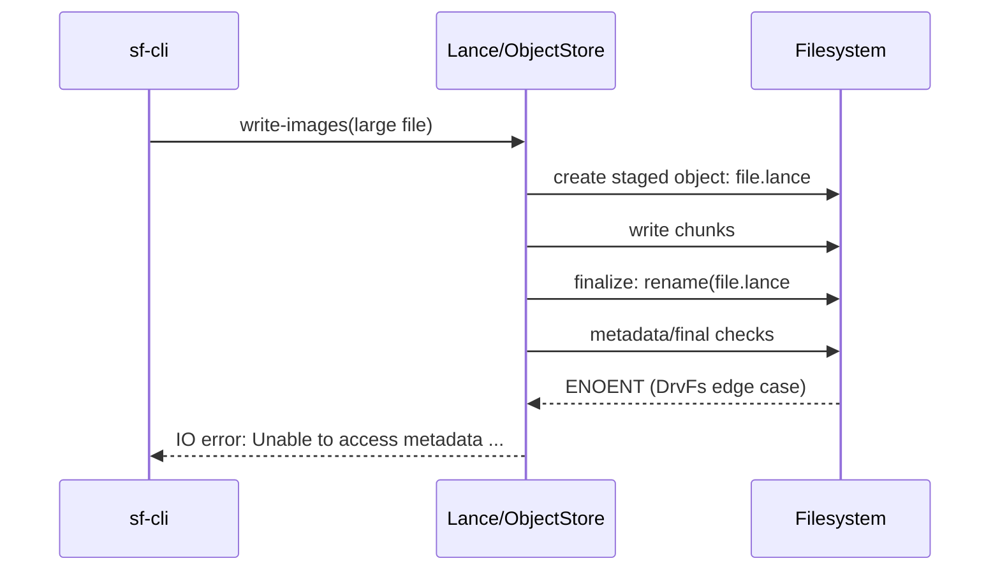

# WSL 挂载盘踩坑复盘：为什么 LanceDB 在 DrvFs 上会触发 metadata ENOENT，而 ext4 正常

## 1. 背景

在 StaticFlow 的图片入库流程中，我们使用 `sf-cli write-images` 把图片写入 LanceDB 的 `images` 表。数据库目录最初放在 WSL 挂载盘：

- `/mnt/e/static-flow-data/lancedb`（对应 Windows NTFS，通过 **DrvFs** 暴露给 WSL）

问题表现是：

- 小图通常写入成功
- 大图（触发 multipart/staged upload）偶发或稳定失败
- 失败日志核心是：`Unable to access metadata for ...lance#1: No such file or directory`

同样的数据、同样的命令，把 DB 目录切到 WSL 原生 ext4（例如 `/home/...`）后，写入成功率恢复正常。

---

## 2. 事故现象（Symptoms）

典型错误（精简后）：

```text
LanceError(IO): External error:
Unable to access metadata for .../images.lance/data/<uuid>.lance#1: No such file or directory
```

关键特征：

1. 报错路径带 `#1` 后缀（staged upload 临时文件特征）
2. 小文件较少触发，大文件更易触发
3. 同命令在 ext4 路径可复现“从失败变成功”

---

## 3. 根因结论（Root Cause）

### 3.1 根因不是业务逻辑，而是文件系统语义差异

这次问题的本质是：

- Lance / object_store 在本地对象写入时会走 staged upload（临时文件 -> rename -> metadata/finalize）
- 在 WSL 的 DrvFs（`/mnt/*`）上，这条链路与 Linux 原生 POSIX 语义并不完全等价
- 结果是某些阶段出现 `ENOENT`（尤其是带 `#suffix` 的 staged 文件）

即：**数据库引擎假设的“类 POSIX 原子行为”与 DrvFs 的实现细节存在缝隙**。

### 3.2 代码链路证据

从依赖代码可以看到关键点：

1. Lance IO 对大对象写入会进入 multipart/staged 流程（阈值约 5MB）
2. 本地 object store staged 上传会创建 `dest#<n>` 的临时对象
3. 完成阶段会执行 rename/finalize，并继续 metadata 相关操作
4. 在 DrvFs 上该链路出现 `metadata ENOENT`

可对应到依赖实现中的关键位置（版本以本地 lock 为准）：

- `lance-io` 的 object writer 初始分段阈值为 `5MB`（`INITIAL_UPLOAD_STEP`）
- `object_store::local` 的 staged 上传会创建 `目标文件名 + #后缀` 的临时对象
- 完成阶段会做 `rename(src, dest)` 和后续 metadata/finalize
- 现场报错路径恰好是 staged 临时对象：`.../data/<id>.lance#1`

这与我们现场现象完全对齐：

- “大图更容易失败” <- 因为更容易触发 staged/multipart
- “路径里出现 #1” <- staged 本地临时对象命名

### 3.3 失败时序图（简化）



### 3.4 为什么 ext4 正常

ext4 是 Linux 原生文件系统，和 Rust/Lance 依赖栈（tokio + object_store + lance）默认假设的语义更一致：

- rename / inode / metadata 行为更稳定
- 对“先写临时文件再提交”的数据库工作负载兼容性更高

所以同样命令迁移到 ext4 后可稳定成功。

---

## 4. DrvFs 与 ext4 的差异（重点）

| 维度 | DrvFs（`/mnt/c`, `/mnt/d`, `/mnt/e`） | ext4（WSL Linux 文件系统） |
|---|---|---|
| 底层 | Windows NTFS 通过 WSL 翻译层映射 | Linux 原生文件系统 |
| 语义目标 | 尽量兼容 Linux，但非完整 POSIX 等价 | POSIX 语义原生实现 |
| 元数据/权限 | 可能依赖映射与挂载选项（如 `metadata`） | 原生 uid/gid/权限语义 |
| DB/日志型 workload | 可能出现边缘兼容问题 | 通常更稳定 |
| 小文件/高频 rename | 兼容性和性能都可能波动 | 更适合数据库场景 |
| 推荐用途 | 跨系统共享文件、源码交换 | 数据库、缓存、索引、构建产物 |

> 工程建议：**把 LanceDB、SQLite、索引缓存这类“高频 IO + 原子写”数据放在 ext4，不放在 `/mnt/*`。**

### 4.1 DrvFs 更容易踩坑的机制原因

DrvFs 的设计目标是“Windows 与 Linux 互通”，不是“数据库场景下的 Linux 原子语义完全等价”。因此在下面这些点上，数据库 workload 更容易触发边缘问题：

1. 元数据语义是翻译层行为，不是 ext4 原生 inode 语义  
2. 路径、权限、大小写、时间戳等都可能受 Windows/WSL 映射策略影响  
3. 临时文件 + rename + metadata/finalize 这类链式操作，对语义一致性要求更高  
4. `/mnt/*` 路径还会受宿主机侧工具（索引/杀软/同步）干扰概率影响

这也是为什么“平时看着能用”的路径，在数据库写入高峰和大文件场景下突然暴露问题。

---

## 5. 可复现实验（Repro）

### 5.1 在 DrvFs 路径写入（容易触发）

```bash
./target/release/sf-cli write-images \
  --db-path /mnt/e/static-flow-data/lancedb \
  --dir /tmp/large-images
```

可能出现：

- `...Unable to access metadata for ...lance#1`

### 5.2 在 ext4 路径写入（对照组）

```bash
./target/release/sf-cli init --db-path /home/ts_user/tmp/lancedb-ext4-test
./target/release/sf-cli write-images \
  --db-path /home/ts_user/tmp/lancedb-ext4-test \
  --dir /tmp/large-images
```

通常可看到：

- 同批大图写入成功
- `count-rows images` 与预期匹配

---

## 6. 这次踩坑的真正教训

### 6.1 “能访问”不代表“适合作数据库路径”

`/mnt/e` 在日常文件读写看起来没问题，但数据库类 workload 对文件系统语义要求更高，问题通常在高并发、临时文件、rename/finalize、fsync 边界才暴露。

### 6.2 失败是“系统层耦合”而不是“单张图片坏了”

当报错集中在 staged 文件 `#1` 时，不应该只盯图片格式，更应该优先检查：

1. 存储路径是否在 DrvFs
2. 是否触发了大文件 staged/multipart
3. 是否存在跨层路径语义差异

---

## 7. 解决方案与落地建议

### 7.1 最优方案（推荐）

1. LanceDB 主库迁移到 ext4 路径（例如 `/home/...`）
2. 通过定时同步或发布流程再镜像到 Windows/HF 仓库
3. 后端只读写 ext4 主库

### 7.2 次优方案（临时）

如果暂时必须用 `/mnt/*`：

1. 先对超大图片做尺寸/体积优化，降低 multipart 触发概率
2. 每次批量入库后做完整校验（行数、抽样读取、搜索接口冒烟）
3. 保留可回滚快照，避免故障扩大

---

## 8. 运维检查清单（Checklist）

```text
[ ] LanceDB 路径是否在 ext4（不是 /mnt/*）
[ ] 批量写入后是否 count-rows 验证
[ ] /api/images 与 /api/image-search 是否做冒烟
[ ] 是否保留最近可回滚快照
[ ] 是否区分“共享目录”和“数据库目录”
```

---

## 9. 一句话总结

这次问题不是 Rust 代码写错，也不是 LanceDB 本身不可用，而是 **WSL DrvFs 与 Linux ext4 在数据库关键 IO 语义上的差异** 被大文件 staged upload 放大了。把数据库路径迁到 ext4，是最直接、最稳妥的工程解法。
