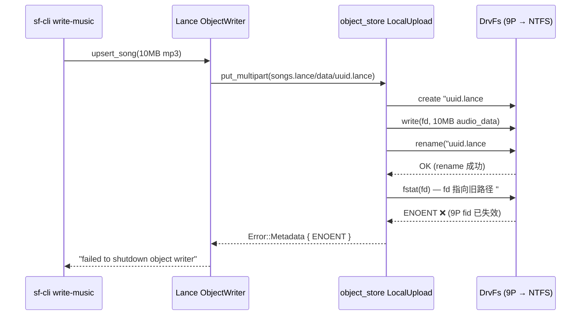

# 从规避到根治：object_store fstat-after-rename 在 WSL DrvFs 上的源码级修复

> 前篇：[WSL 挂载盘踩坑复盘：为什么 LanceDB 在 DrvFs 上会触发 metadata ENOENT，而 ext4 正常](./wsl-drvfs-ext4-lancedb-io-pitfall.md)

## 1. 背景：同一个坑，第二次掉进去

上一篇文章中，我们在 `sf-cli write-images` 写入大图片时遇到了 LanceDB 在 WSL DrvFs（`/mnt/e/`）上的 `Unable to access metadata ...#1: ENOENT` 错误。当时的结论是"把数据库迁到 ext4"，属于规避方案。

这次，我们在开发 Music Hub 功能时，需要把 10MB 级别的 MP3 音频文件写入 LanceDB 的 `songs` 表（`audio_data` 列为 `LargeBinary` 类型）。数据库路径仍然在 `/mnt/e/static-flow-data/lancedb-music`。

毫不意外，同样的错误再次出现：

```text
Error: failed to upsert song

Caused by:
  lance error: LanceError(IO):
    failed to shutdown object writer for
    mnt/e/static-flow-data/lancedb-music/songs.lance/data/<uuid>.lance:
    Generic LocalFileSystem error:
    Unable to access metadata for
    /mnt/e/static-flow-data/lancedb-music/songs.lance/data/<uuid>.lance#1:
    No such file or directory (os error 2)
```

这次我们决定不再绕路，直接追踪源码找到精确根因并修复。

---

## 2. 错误栈追踪

从错误信息中提取两个关键源码位置：

```text
lance-io-1.0.0/src/object_writer.rs:306:17
lance-1.0.0/src/dataset/write/merge_insert.rs:1348:25
```

### 2.1 Lance IO 层：只是错误包装

`lance-io/src/object_writer.rs:306` 的 `shutdown()` 方法：

```rust
pub async fn shutdown(&mut self) -> Result<WriteResult> {
    AsyncWriteExt::shutdown(self).await.map_err(|e| {
        Error::io(
            format!("failed to shutdown object writer for {}: {}", self.path, e),
            location!(),  // <- 306行，仅包装错误
        )
    })?;
    // ...
}
```

这里只是把底层错误包了一层。真正的失败发生在更下层的 `object_store` crate。

### 2.2 object_store 层：找到精确根因

`object_store-0.12.4/src/local.rs:807-826`，`LocalUpload::complete()` 方法：

```rust
async fn complete(&mut self) -> Result<PutResult> {
    let src = self.src.take().ok_or(Error::Aborted)?;
    let s = Arc::clone(&self.state);
    maybe_spawn_blocking(move || {
        let file = s.file.lock();
        std::fs::rename(&src, &s.dest)?;           // ① rename 临时文件
        let metadata = file.metadata()?;             // ② fstat(旧fd) ← 这里失败
        Ok(PutResult {
            e_tag: Some(get_etag(&metadata)),
            version: None,
        })
    })
    .await
}
```

### 2.3 `#1` 后缀的来源

同文件 `local.rs:748-752`：

```rust
fn staged_upload_path(dest: &std::path::Path, suffix: &str) -> PathBuf {
    let mut staging_path = dest.as_os_str().to_owned();
    staging_path.push("#");       // 添加 # 分隔符
    staging_path.push(suffix);    // 添加递增数字（从 1 开始）
    staging_path.into()
}
```

`#1` 是 staged upload 的临时文件命名规则：先写入 `xxx.lance#1`，完成后 rename 为 `xxx.lance`。

---

## 3. 根因：rename 后 fstat 旧文件描述符

### 3.1 失败的精确时序

```text
1. open("xxx.lance#1", O_WRONLY|O_CREAT) → fd=5     ✓ 创建临时文件
2. write(fd=5, audio_data, 10MB)                      ✓ 写入音频数据
3. rename("xxx.lance#1", "xxx.lance")                  ✓ 重命名成功
4. fstat(fd=5)                                         ✗ ENOENT ← 失败！
```

### 3.2 为什么 ext4 上正常

在 POSIX 兼容的文件系统（ext4、xfs、btrfs）上：

- `rename()` 只改变目录项（directory entry），不改变 inode
- 文件描述符 fd 指向 inode，不指向路径
- 因此 rename 后 fd 仍然有效，`fstat(fd)` 正常返回

```text
fd=5 → inode 12345 → "xxx.lance#1"
                  rename()
fd=5 → inode 12345 → "xxx.lance"     ← inode 不变，fd 仍有效
```

### 3.3 为什么 DrvFs 上失败

WSL2 通过 **9P 协议** 访问 Windows NTFS 分区（`/mnt/*` 挂载点使用 `drvfs` 驱动）：

```bash
$ mount | grep /mnt/e
E:\ on /mnt/e type 9p (rw,noatime,dirsync,aname=drvfs;...)
```

9P 是网络文件系统协议，文件句柄语义与本地文件系统不同：

- `rename()` 在 Windows 层面可能涉及文件句柄重建
- 9P 的 fid（file identifier）在 rename 后可能失效
- `fstat()` 通过已失效的 fid 查询，返回 `ENOENT`

```text
fd=5 → 9P fid → "xxx.lance#1" (Windows NTFS)
                  rename()
fd=5 → 9P fid → ???                ← fid 失效，fstat 返回 ENOENT
```

### 3.4 失败时序图



---

## 4. 修复方案：调换两行代码

### 4.1 修复思路

`metadata()` 的目的是获取文件大小和修改时间来生成 ETag。这些信息在 rename 前后不会变化（rename 不修改文件内容）。因此可以安全地把 `metadata()` 调到 `rename()` 之前：

```rust
// 修复前（object_store-0.12.4/src/local.rs:810-818）
let file = s.file.lock();
std::fs::rename(&src, &s.dest)?;        // ① 先 rename
let metadata = file.metadata()?;         // ② 再 fstat → DrvFs 上失败

// 修复后
let file = s.file.lock();
let metadata = file.metadata()?;         // ① 先 fstat（fd 仍有效）✓
std::fs::rename(&src, &s.dest)?;         // ② 再 rename ✓
```

### 4.2 修复的正确性论证

| 属性 | 分析 |
|------|------|
| 语义等价 | metadata（size、mtime）在 rename 前后不变，ETag 结果相同 |
| 性能影响 | 零额外开销，只是调换顺序 |
| 并发安全 | `file` 已持有 mutex lock，不存在并发写入 |
| 向后兼容 | 不改变任何公开 API 或行为 |
| ext4 影响 | 无影响，ext4 上两种顺序都正常 |

---

## 5. 实施：Cargo `[patch.crates-io]` 零 fork 修复

### 5.1 为什么不 fork

`object_store` 是 Apache Arrow 生态的核心 crate，被 Lance、DataFusion、Delta Lake 等广泛依赖。fork 一个仓库来维护一行改动，长期成本太高。

Cargo 提供了 `[patch.crates-io]` 机制，可以在不 fork 的情况下，用本地修改版替换依赖树中的任意 crate。

### 5.2 操作步骤

**Step 1：复制源码到项目本地**

```bash
cp -r ~/.cargo/registry/src/*/object_store-0.12.4 patches/object_store
```

**Step 2：应用修复**

编辑 `patches/object_store/src/local.rs`，在 `LocalUpload::complete()` 中调换 `metadata()` 和 `rename()` 的顺序。

**Step 3：在 workspace Cargo.toml 中声明 patch**

```toml
# Cargo.toml (workspace root)
[patch.crates-io]
object_store = { path = "patches/object_store" }
```

**Step 4：重新编译**

```bash
cargo build --release -p sf-cli
```

Cargo 会自动将整个依赖树中所有对 `object_store ^0.12` 的引用替换为本地版本。

### 5.3 `[patch.crates-io]` 的工作原理

```text
依赖树（patch 前）：
  sf-cli → static-flow-shared → lancedb → lance-io → object_store 0.12.4 (crates.io)

依赖树（patch 后）：
  sf-cli → static-flow-shared → lancedb → lance-io → object_store 0.12.4 (patches/object_store)
```

Cargo 的 patch 机制在依赖解析阶段生效，替换的是整个 crate，不需要修改中间依赖（lance-io、lancedb）的任何代码。

---

## 6. 验证

### 6.1 修复前：直接写入 `/mnt/e/` 失败

```bash
$ sf-cli write-music --db-path /mnt/e/static-flow-data/lancedb-music \
    --file /tmp/music/1436910205.mp3 --id "netease-1436910205" ...

Error: failed to upsert song
  Unable to access metadata for .../songs.lance/data/xxx.lance#1:
  No such file or directory (os error 2)
```

### 6.2 修复后：直接写入 `/mnt/e/` 成功

```bash
$ sf-cli write-music --db-path /mnt/e/static-flow-data/lancedb-music \
    --file /tmp/music/1436910205.mp3 --id "netease-1436910205" ...

Song written successfully:
  id:       netease-1436910205
  title:    好想爱这个世界啊 (Live)
  artist:   华晨宇
  format:   mp3
  duration: 262728ms
```

### 6.3 批量验证：10 首歌曲全部成功

连续写入 10 首华晨宇的歌曲（8-16MB/首），全部直接写入 `/mnt/e/` NTFS 成功：

```text
+--------------------+-------------------------+--------+--------+
| id                 | title                   | artist | format |
+--------------------+-------------------------+--------+--------+
| netease-1436910205 | 好想爱这个世界啊 (Live) | 华晨宇 | mp3    |
| netease-1305366556 | 寒鸦少年                | 华晨宇 | mp3    |
| netease-29418037   | 微光                    | 华晨宇 | mp3    |
| netease-536937393  | 孩子 (Live)             | 华晨宇 | mp3    |
| netease-509135782  | 智商二五零              | 华晨宇 | mp3    |
| netease-481859794  | 齐天                    | 华晨宇 | mp3    |
| netease-1442842748 | 七重人格 (Live)         | 华晨宇 | mp3    |
| netease-2162394622 | 智商二五零 (日出演唱会) | 华晨宇 | mp3    |
| netease-420125810  | Here We Are             | 华晨宇 | mp3    |
| netease-419250437  | 造物者                  | 华晨宇 | mp3    |
+--------------------+-------------------------+--------+--------+
```

---

## 7. 维护策略

### 7.1 何时可以移除 patch

当以下任一条件满足时：

1. `object_store` 上游合并了等价修复（可以提 PR 到 [apache/arrow-rs](https://github.com/apache/arrow-rs)）
2. 升级到的 `object_store` 新版本已包含修复
3. 不再需要在 DrvFs 上运行 LanceDB

### 7.2 升级 object_store 版本时

如果 `lancedb` 升级依赖了新版 `object_store`（如 0.13.x）：

1. 检查新版是否已修复此问题
2. 如未修复，重新复制新版源码到 `patches/object_store`，应用同样的一行修改
3. 更新 `[patch.crates-io]` 路径

### 7.3 上游 PR 建议

这个修复适合提交给上游。PR 描述要点：

- 标题：`fix: get metadata before rename in LocalUpload::complete() for 9P/drvfs compatibility`
- 影响范围：所有在非 POSIX 文件系统上使用 `LocalFileSystem` 的用户（WSL2 DrvFs、SSHFS、NFS 等）
- 修改量：调换两行代码，零行为变化

---

## 8. 与前篇的对比

| 维度 | 前篇（规避方案） | 本篇（根治方案） |
|------|-----------------|-----------------|
| 问题场景 | write-images 大图片 | write-music 音频文件 |
| 根因定位深度 | "DrvFs 语义差异" | `object_store::local::LocalUpload::complete()` 第 813-815 行 |
| 解决方案 | 迁移数据库到 ext4 | patch object_store，调换 metadata/rename 顺序 |
| 是否需要改变目录结构 | 是 | 否 |
| 是否需要 fork | N/A | 否（Cargo patch） |
| 对其他 DrvFs 写入的影响 | 不解决 | 全部修复 |

---

## 9. 一句话总结

`object_store` 的 `LocalUpload::complete()` 在 `rename()` 后通过旧文件描述符调用 `fstat()`，这在 WSL2 的 9P/DrvFs 上因 fid 失效而触发 ENOENT。修复方法是调换两行代码的顺序，通过 Cargo `[patch.crates-io]` 零 fork 应用到项目中。
